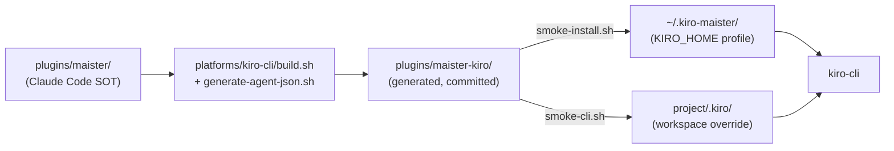

# Codebase Analysis Report

**Date**: 2026-06-07  
**Task**: Implement Kiro CLI platform support for Maister  
**Description**: Multi-platform build pipeline (`plugins/maister` → `platforms/kiro-cli/build.sh` → `plugins/maister-kiro`), Kiro CLI API mapping (skills, agents JSON, hooks, steering, MCP, subagents), Makefile/validate/smoke/CI, tool/name transforms, init workflow integration.  
**Analyzer**: codebase-analyzer skill (4 Explore agents: File Discovery, Code Analysis, Pattern Mining, Context Discovery)  
**Research context**: `.maister/tasks/research/2026-06-07-kiro-cli-support`

---

## Executive Summary

Maister already ships two generated platform variants from a single Claude Code source of truth (`plugins/maister/`): **Copilot CLI** (`platforms/copilot-cli/build.sh`, 74 lines) and **Cursor Agent** (`platforms/cursor/build.sh`, 247 lines). **No Kiro artifacts exist yet** — `platforms/kiro-cli/` and `plugins/maister-kiro/` are absent; the only Kiro mention in the repo is a forward-looking note in `docs/cursor-agent-support.md` (grill decision #15–16).

Kiro CLI support is **feasible and well-scoped** because the Cursor pipeline is a proven template for the semantic transforms Kiro needs (`maister-foo` naming, `AGENTS.md`, hooks, Playwright MCP). Kiro diverges **format-wise**: agents become JSON (not Markdown), commands merge into skills (no `commands/` API), hooks embed in `maister.json` (not `hooks.json`), and distribution is an install tree under `KIRO_HOME=~/.kiro-maister` (no plugin manifest or `--plugin-dir`).

The largest net-new work is **`generate-agent-json.sh`** (24 source agents → JSON + 2 synthetic agents → 26 total), **commands→skills merge** (8 commands + 14 skills → 22 skill directories), and **chat-native phase gates** replacing `AskQuestion`. Estimated effort: **~1.5–2.5 weeks** across 5 implementation phases (0–4), per completed research.

---

## Files Identified

### Primary Files (directly relevant)

| File | Lines | Role |
|------|-------|------|
| `plugins/maister/` | ~99 files | **Source of truth** — 24 agents (`.md`), 14 skills, 8 commands, hooks, `.mcp.json` |
| `platforms/cursor/build.sh` | 247 | **Reference implementation** — 14 transform steps; copy `sedi()`, overrides, hooks, TodoWrite transforms |
| `platforms/cursor/hooks/` | 6 files | Hook scripts + `hooks.json` — adapt for Kiro `preToolUse`/`postToolUse` semantics |
| `platforms/cursor/overrides/` | 2 files | `quick-plan.md`, `quick-bugfix/SKILL.md` — reuse with chat gates |
| `platforms/cursor/templates/` | 1 file | `agents-md-template.md` — init → `AGENTS.md` |
| `platforms/cursor/rules/maister-docs.mdc` | — | Template for project steering after init |
| `platforms/cursor/smoke-install.sh` | 20 | Install pattern → adapt for `KIRO_HOME` |
| `platforms/cursor/smoke-cli.sh` | 57 | Headless smoke → adapt for `kiro-cli chat` |
| `Makefile` | 77 | Extend with `build-kiro`, `validate-kiro`, `clean-kiro`; add to `build`/`validate`/`clean` |
| `docs/cursor-agent-support.md` | 311 | Grill decisions #15–16 mandate Kiro same pattern; target repo layout documented |

### Secondary Files (supporting / integration)

| File | Role |
|------|------|
| `platforms/copilot-cli/build.sh` | Simpler 8-step baseline; strips prefixes (opposite of Kiro/Cursor semantics) |
| `plugins/maister-cursor/` | Generated artifact example — compare output shape after build |
| `plugins/maister-copilot/` | Generated artifact example — Copilot-specific transforms |
| `.github/workflows/release.yml` | Runs `make build && make validate` on tag push — auto-includes Kiro once Makefile updated |
| `.github/workflows/build-copilot.yml` | Path-triggered rebuild — may need Kiro path or rely on unified `make build` |
| `README.md` | User-facing install docs — add Kiro section (parity with Cursor block ~L181+) |
| `CLAUDE.md` | Plugin development conventions — never edit generated `plugins/maister-kiro/` |
| `plugins/maister/agents/gap-analyzer.md` | Representative agent frontmatter (`name`, `description`, `model`, `color`) for MD→JSON parser |
| `plugins/maister/hooks/hooks.json` | Source hook events — map to Kiro hook types |

### Missing (to be created)

```
platforms/kiro-cli/
├── build.sh                      # ~18 steps; orchestrates all transforms
├── generate-agent-json.sh        # MD frontmatter + body → JSON + agents/instructions/*.md
├── agent-tools.json              # Role → Kiro tool whitelist mapping
├── smoke-install.sh              # → KIRO_HOME=~/.kiro-maister
├── smoke-cli.sh                  # Ephemeral workspace + headless tests
├── overrides/                    # From cursor (quick-plan, quick-bugfix)
├── templates/                    # agents-md-template + steering-maister-docs.md
├── hooks/                        # 5 adapted shell scripts
├── transforms/task-to-kiro-todo.md # Phase 1.5: TaskCreate → todo
└── patches/orchestrator-patterns-todo.md

plugins/maister-kiro/             # Generated output (committed, never hand-edited)
├── skills/                       # 22 directories (14 source + 8 from commands/)
├── agents/                       # 26 JSON files + instructions/
├── steering/                     # maister-workflows.md, maister-docs.md
├── hooks/                        # Shell scripts referenced by maister.json
├── settings/mcp.json             # Playwright MCP
└── README.md
```

---

## Current Functionality

### Multi-platform build pattern

All platform variants follow the same contract:

1. `rm -rf` + `cp -r plugins/maister → plugins/maister-{platform}`
2. Apply `sedi()` transforms (cross-platform `sed -i`)
3. Copy platform assets from `platforms/{platform}/`
4. Emit generated artifact; commit after `make build`

```18:19:platforms/cursor/build.sh
rm -rf "$OUT"
cp -r "$CORE" "$OUT"
```

### Source plugin inventory (`plugins/maister/`)

| Asset | Count | Format |
|-------|-------|--------|
| Agents | 24 | Markdown + YAML frontmatter (`name`, `description`, `model`, `color`) |
| Skills | 14 | `skills/*/SKILL.md` with `name: maister:foo` |
| Commands | 8 | `commands/*.md` — thin wrappers invoking skills |
| Hooks | 4 scripts + `hooks.json` | Claude Code lifecycle events |
| MCP | `.mcp.json` | Playwright server config |

### Cursor reference transforms (Kiro inherits most)

| Step | Transform | Kiro adaptation |
|------|-----------|-----------------|
| Naming | `maister:foo` → `maister-foo` | **Same** |
| Project docs | `CLAUDE.md` → `AGENTS.md` | **Same** |
| User questions | `AskUserQuestion` → `AskQuestion` | → **chat-native gates** (no AskQuestion in Kiro) |
| Delegation | `Task` tool + `subagent_type` | → **`subagent` tool** |
| Progress | `TaskCreate`/`TaskUpdate` → `TodoWrite` | → **`todo` tool** (Phase 1.5; experimental) |
| Explore | `Explore` → `explore` | → **synthetic `maister-explore.json`** (no built-in explore) |
| Hooks | Replace with `platforms/cursor/hooks/` | → **embed in `maister.json`** + `$KIRO_HOME/hooks/` |
| Manifest | `.claude-plugin` → `.cursor-plugin` | → **Remove** (install tree only) |
| Commands | Keep `commands/` | → **Merge into `skills/`** |
| Agents | `.md` + frontmatter prefix | → **`.json`** via `generate-agent-json.sh` |
| MCP | `.mcp.json` → `mcp.json` | → `settings/mcp.json` |
| Steering | `rules/maister-workflows.mdc` | → `steering/maister-workflows.md` |

### Data flow (target)



---

## Architecture Patterns

### 1. Source-of-truth / generated-artifact split

- **Never edit** `plugins/maister-copilot/`, `plugins/maister-cursor/`, or future `plugins/maister-kiro/` manually
- All platform-specific logic lives under `platforms/{platform}/`
- Rebuild via `make build-{platform}`; commit generated output (grill decision #4)

### 2. Cursor-over-Copilot as Kiro template

Kiro follows **Cursor semantics** (prefix `maister-foo`, `AGENTS.md`, hooks preserved) rather than Copilot (strip prefix, remove hooks). Evidence: `docs/cursor-agent-support.md` decision #5 analog and research ADR-006 (MD→JSON from Cursor agent bodies).

### 3. Platform asset directories

Cursor establishes the asset layout Kiro should mirror:

```
platforms/{platform}/
├── build.sh           # Orchestrator
├── hooks/             # Platform-specific hook scripts
├── overrides/         # Per-command/skill replacements
├── patches/           # Append-only reference patches
├── templates/         # Init templates
├── transforms/        # Reference docs for sed patterns
├── smoke-install.sh   # User install
└── smoke-cli.sh       # CI headless smoke
```

Kiro adds **`generate-agent-json.sh`** and **`agent-tools.json`** — unique to JSON agent format.

### 4. Synthetic agents

Research specifies two agents not in source:

| Agent | Purpose |
|-------|---------|
| `maister-orchestrator.json` | Entry point; embedded hooks; `subagent` delegation; optional `skill://` references |
| `maister-explore.json` | Replaces Cursor built-in `explore` subagent |

Total output: **24 source + 2 synthetic = 26 JSON agents**.

### 5. Hybrid distribution (ADR-001)

- **Developer install**: `smoke-install.sh` → `KIRO_HOME=~/.kiro-maister` (isolated profile)
- **CI/E2E**: `smoke-cli.sh` copies build to ephemeral `project/.kiro/` (workspace wins over global)
- **Wrapper**: `maister-kiro` shell alias/script for `kiro-cli chat --agent maister`

### 6. Progress tracking dual-layer (ADR-002)

- **Phase 0–1**: `orchestrator-state.yml` only (platform-agnostic SOT for `--from=PHASE` resume)
- **Phase 1.5**: Add `todo` tool mirror (like Cursor's TodoWrite phase 1.5)
- Transform reference: `platforms/cursor/transforms/task-to-todo.md` → adapt as `task-to-kiro-todo.md`

### 7. Init workflow integration

Cursor build patches `init/SKILL.md` to create `.cursor/rules/maister-docs.mdc`. Kiro equivalent:

- Copy `steering/maister-docs.md` template to `project/.kiro/steering/maister-docs.md`
- Ensure `AGENTS.md` integration via `docs-manager` template swap (`claude-md-template` → `agents-md-template`)
- `@prompts` layer in `$KIRO_HOME/prompts/` for chat shortcuts (`@init`, `@dev`, `@research`, etc.)

---

## Dependencies

### Imports (what Kiro build depends on)

| Dependency | Purpose |
|------------|---------|
| `plugins/maister/*` | Full source tree copied at build start |
| `platforms/cursor/overrides/*` | Reuse quick-plan/quick-bugfix overrides |
| `platforms/cursor/templates/*` | AGENTS.md template |
| `platforms/cursor/rules/maister-docs.mdc` | Steering template source |
| `platforms/cursor/hooks/*.sh` | Base hook logic (adapt matchers) |
| `jq` | JSON agent generation |
| `bash`, `sed`, `find`, `grep` | Standard build tooling (same as Cursor) |

### Consumers (what depends on Kiro once added)

| Consumer | Impact |
|----------|--------|
| `Makefile` | `build`, `validate`, `clean` aggregates must include Kiro |
| `.github/workflows/release.yml` | Auto-validates via `make validate` |
| `.github/workflows/build-copilot.yml` | May need path update or unified commit step for `maister-kiro/` |
| `README.md` | Install instructions |
| `docs/cursor-agent-support.md` | Cross-platform doc; may spawn `docs/kiro-cli-support.md` |
| `watch` target | `fswatch` → `make build` rebuilds all platforms |

**Consumer count**: 5+ integration points  
**Impact scope**: **Medium** — additive platform; no changes to source `plugins/maister/` required

---

## Test Coverage

### Existing validation pattern

`validate-cursor` (36 grep-based structural checks) is the template for `validate-kiro`:

```29:65:Makefile
validate-cursor:
	@echo "=== Cursor validation ==="
	@test -d plugins/maister-cursor || (echo "FAIL: plugins/maister-cursor not built — run make build-cursor" && exit 1)
	...
	@echo "Cursor checks passed"
```

### Proposed `validate-kiro` checks (from research)

| Check | Rationale |
|-------|-----------|
| `plugins/maister-kiro/` exists | Build ran |
| No `commands/` directory | Commands merged to skills |
| No `.claude-plugin/` or `.cursor-plugin/` | Install tree only |
| 22 skill directories with `SKILL.md` | 14 + 8 merged |
| 26 `agents/*.json` files | 24 + 2 synthetic |
| No `maister:` prefixes in output | Naming transform |
| No `CLAUDE.md` references in skills | AGENTS.md transform |
| No `AskUserQuestion`/`AskQuestion` | Chat gates transform |
| No `TaskCreate`/`TaskUpdate` (Phase 1.5) | todo transform |
| `settings/mcp.json` exists | MCP relocation |
| `steering/maister-workflows.md` exists | Plugin doc transform |
| Agent JSON schema valid (`jq` parse) | Generator correctness |
| `maister-orchestrator.json` has hooks | Embedded hook contract |

### Smoke tests

| Script | Cursor pattern | Kiro adaptation |
|--------|----------------|-----------------|
| `smoke-install.sh` | `~/.cursor/plugins/local/maister-cursor` | `KIRO_HOME=~/.kiro-maister` |
| `smoke-cli.sh` | 3 tests via `agent` CLI | 3 tests via `kiro-cli chat --no-interactive` |

**Test count**: 0 Kiro-specific today; Cursor has ~36 validate checks + 3 smoke tests  
**Gaps**: No unit tests for `generate-agent-json.sh`; no JSON schema validation in CI yet

---

## Coding Patterns

### Naming conventions

| Context | Pattern | Example |
|---------|---------|---------|
| Source commands/skills | `maister:foo` | `maister:development` |
| Platform output | `maister-foo` | `maister-development` |
| Agent files (source) | `gap-analyzer.md`, `name: gap-analyzer` | Prefixed at build |
| Agent files (Kiro output) | `maister-gap-analyzer.json` | JSON + `agents/instructions/` |
| Plugin IDs | `maister-cursor`, `maister-copilot` | Kiro: no manifest; profile `maister-kiro` |

### Build script conventions

- `set -e` at top
- `SCRIPT_DIR` / `ROOT` / `CORE` / `OUT` / `PLATFORM` variables
- Cross-platform `sedi()` helper (macOS vs Linux)
- Numbered comment steps (`# 1.`, `# 2.`, …)
- Final `echo "Built … variant at $OUT"`

### Architecture style

- **Functional bash pipelines** — copy, sed, copy assets; no OOP
- **Declarative validation** — Makefile grep/test targets
- **Generated artifacts committed** — reproducible builds in CI
- **Platform assets colocated** — hooks/overrides live with build script

---

## Complexity Assessment

| Factor | Value | Level |
|--------|-------|-------|
| New files to create | ~15–20 under `platforms/kiro-cli/` | **High** |
| Build script size (est.) | ~300–400 lines + generator | **High** |
| Source files touched (integration) | Makefile, README, CI, docs (~5 files) | **Low** |
| Dependencies | bash, sed, jq, find, grep | **Low** |
| Consumers affected | Makefile, CI, docs | **Medium** |
| Test coverage (existing) | 0 Kiro; Cursor template exists | **Low** (greenfield) |
| Unique transforms | MD→JSON, commands→skills, hooks embed, chat gates | **High** |

### Overall: **Complex**

Kiro is the most format-divergent platform (JSON agents, no manifest, commands absorbed). Semantic transforms reuse Cursor heavily, but the generator and orchestrator agent are substantial net-new components.

---

## Key Findings

### Strengths

- **Proven multi-platform pattern** — two working platforms provide copy-paste infrastructure (`sedi`, smoke, validate, overrides)
- **Research complete** — HLD, decision log (ADR-001–016), transformation tables, and 5-phase plan at `.maister/tasks/research/2026-06-07-kiro-cli-support/`
- **Cursor is near-semantic match** — naming, AGENTS.md, hooks, MCP, TodoWrite/todo mapping already designed
- **Makefile/CI extensibility** — grill decision #16 already documents `build-kiro`; `release.yml` picks up new targets automatically
- **Isolated profile** — `KIRO_HOME=~/.kiro-maister` avoids polluting user's default Kiro config

### Concerns

- **`todo` tool is experimental** in Kiro — API may change; mitigated by `orchestrator-state.yml` SOT
- **No `AskQuestion` equivalent** — all phase gates need chat-native redesign (3A+3B+3C pattern from research)
- **No built-in `explore` subagent** — requires synthetic agent maintenance
- **No `preCompact`/`subagentStart`/`subagentStop`** — hook gaps documented as stubs (`post-compact-reminder-stub.sh`)
- **MD→JSON generator is highest-risk component** — 24 agents × ~300–450 lines each; frontmatter parsing, tool whitelists, instruction file splitting
- **`build-copilot.yml` only commits `maister-copilot/`** — Kiro artifact may need similar auto-commit workflow or manual discipline

### Opportunities

- Reuse **entire Cursor hook script bodies** with matcher rewrites (`beforeShellExecution` → `preToolUse` shell matcher)
- Reuse **Cursor overrides** for quick-plan/quick-bugfix with minimal edits
- **Commands→skills merge** may simplify Kiro UX (everything discoverable as `/maister-foo` skills)
- Research `@prompts` layer adds Kiro-native shortcuts without changing source plugin

---

## Impact Assessment

### Primary changes (new)

- `platforms/kiro-cli/` — full platform directory (~15–20 files)
- `plugins/maister-kiro/` — generated artifact tree (committed)

### Related changes (modify)

| File | Change |
|------|--------|
| `Makefile` | Add `build-kiro`, `validate-kiro`, `clean-kiro`; extend aggregates |
| `README.md` | Kiro install section |
| `docs/cursor-agent-support.md` or new `docs/kiro-cli-support.md` | Platform comparison table |
| `.github/workflows/build-copilot.yml` | Optionally commit `maister-kiro/` on path trigger |
| `CLAUDE.md` | Document `maister-kiro` in structure section |

### Test updates

- New `validate-kiro` target (~15–20 structural checks)
- New `smoke-install.sh` + `smoke-cli.sh` for Kiro
- Phase 1.5: ban `TaskCreate`/`TaskUpdate` in Kiro output (mirror Cursor validate)

### Risk level: **Medium–High**

Format divergence (JSON agents, embedded hooks) and experimental Kiro APIs (`todo`) elevate risk beyond Cursor's implementation. Mitigated by phased delivery (Phase 0 scaffold → Phase 1 MVP smoke → Phase 1.5 todo → Phases 2–4 polish).

---

## Recommended Approach

Follow the **5-phase plan** from research, using Cursor `build.sh` as the semantic base:

### Phase 0 — Scaffold (~2–3 days)

1. Create `platforms/kiro-cli/build.sh` skeleton: copy, naming, AGENTS.md, remove manifest
2. Stub `generate-agent-json.sh` + `agent-tools.json` (1–2 agents to prove pipeline)
3. Add Makefile targets; `make build-kiro` produces minimal `plugins/maister-kiro/`
4. Add `validate-kiro` with existence checks only

### Phase 1 — MVP (~5–7 days)

1. Complete `generate-agent-json.sh` for all 24 agents + 2 synthetic
2. Implement commands→skills merge (8 commands → `skills/maister-{name}/SKILL.md`)
3. Port Cursor hooks to Kiro matchers; embed in `maister-orchestrator.json`
4. Steering (`maister-workflows.md`, `maister-docs.md`), MCP (`settings/mcp.json`)
5. Chat-native gates: replace `AskQuestion` references in overrides + sed pass
6. `Task` → `subagent` tool references
7. Init skill patch: `.kiro/steering/maister-docs.md` step
8. `smoke-install.sh` + `smoke-cli.sh`; green headless `/maister-init` smoke
9. Full `validate-kiro`; commit `plugins/maister-kiro/`

### Phase 1.5 — Progress parity (~2–3 days)

1. `task-to-kiro-todo.md` transform + `apply_todo_transforms()` (mirror Cursor Phase 1.5)
2. `orchestrator-patterns-todo.md` patch append
3. Validate ban on `TaskCreate`/`TaskUpdate`

### Phase 2 — Hooks & prompts (~2–3 days)

1. `@prompts` layer in `$KIRO_HOME/prompts/`
2. `maister-kiro` wrapper script
3. Remaining hook adaptations (subagent spawn/complete trackers)

### Phase 3–4 — Docs & CI (~1–2 days)

1. README + `docs/kiro-cli-support.md`
2. Verify `release.yml` passes with Kiro in `make build`
3. Optional: extend `build-copilot.yml` to auto-commit `maister-kiro/`

### Implementation strategy

1. **Start by copying `platforms/cursor/build.sh`** — keep steps 1–10, 12–13; replace steps 11 (hooks), agent handling, manifest removal
2. **Build generator incrementally** — test with `gap-analyzer.md` first (representative frontmatter + long body)
3. **Reuse Cursor assets verbatim** where possible — overrides, templates, hook script bodies
4. **Do not modify `plugins/maister/`** — all Kiro-specific logic stays in `platforms/kiro-cli/`

---

## Risks

| Risk | Likelihood | Impact | Mitigation |
|------|------------|--------|------------|
| MD→JSON generator bugs (malformed JSON, lost frontmatter) | High | High | Incremental agent rollout; `jq` validation in `validate-kiro`; golden-file test for 2–3 agents |
| Kiro `todo` API changes | Medium | Medium | `orchestrator-state.yml` SOT; defer todo to Phase 1.5 |
| Chat gates UX regression vs AskQuestion | Medium | Medium | Reuse research 3A+3B+3C patterns; test quick-plan smoke |
| Hook semantic mismatch (Cursor events ≠ Kiro events) | Medium | Medium | Document gaps as stubs; embed only supported hooks in orchestrator |
| Commands→skills merge breaks skill discovery | Low | High | Validate 22 directories; smoke test skill detection |
| Install path confusion (global vs workspace) | Medium | Low | Document `KIRO_HOME` profile; smoke-install sets env explicitly |
| CI doesn't commit `maister-kiro/` | Medium | Medium | Extend `build-copilot.yml` or add `build-kiro.yml` |
| Scope creep into source plugin edits | Low | High | Enforce platforms-only rule; code review checklist |

---

## Next Steps

1. **Gap analysis** — compare research transformation table against current `plugins/maister/` content for drift since research
2. **Specification** — formalize `generate-agent-json.sh` input/output contract and JSON schema
3. **Phase 0 implementation** — scaffold `platforms/kiro-cli/` and Makefile targets
4. **Prototype generator** — `gap-analyzer.md` → `maister-gap-analyzer.json` end-to-end

---

## Appendix: Source vs Output Counts

| Asset | Source (`plugins/maister/`) | Kiro output (`plugins/maister-kiro/`) |
|-------|----------------------------|---------------------------------------|
| Skills | 14 directories | 22 (14 + 8 commands merged) |
| Agents | 24 `.md` files | 26 `.json` (24 converted + 2 synthetic) |
| Commands | 8 `.md` files | 0 (merged into skills) |
| Hooks | 4 scripts + `hooks.json` | 5 adapted scripts + embedded in `maister.json` |
| MCP | `.mcp.json` | `settings/mcp.json` |
| Manifest | `.claude-plugin/plugin.json` | None |
| Plugin doc | `CLAUDE.md` | `steering/maister-workflows.md` |

---

## References

- Research report: `.maister/tasks/research/2026-06-07-kiro-cli-support/outputs/research-report.md`
- High-level design: `.maister/tasks/research/2026-06-07-kiro-cli-support/outputs/high-level-design.md`
- Decision log: `.maister/tasks/research/2026-06-07-kiro-cli-support/outputs/decision-log.md`
- Cursor grill decisions: `docs/cursor-agent-support.md`
- Cursor implementation reference: `platforms/cursor/build.sh`
