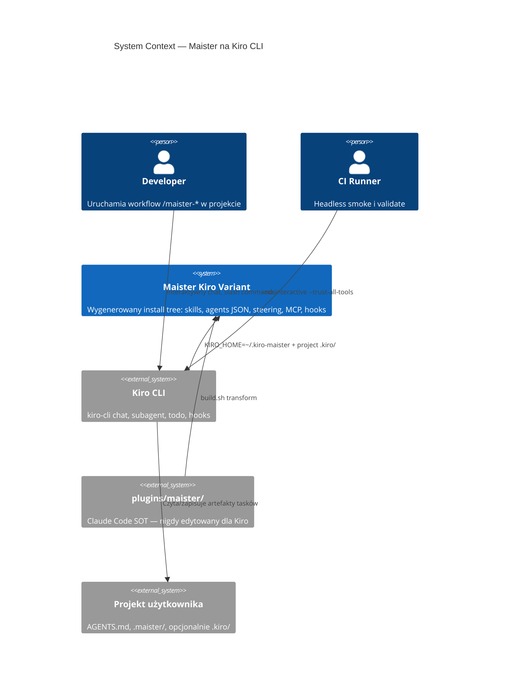
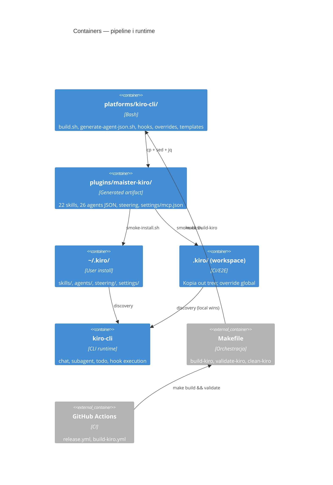
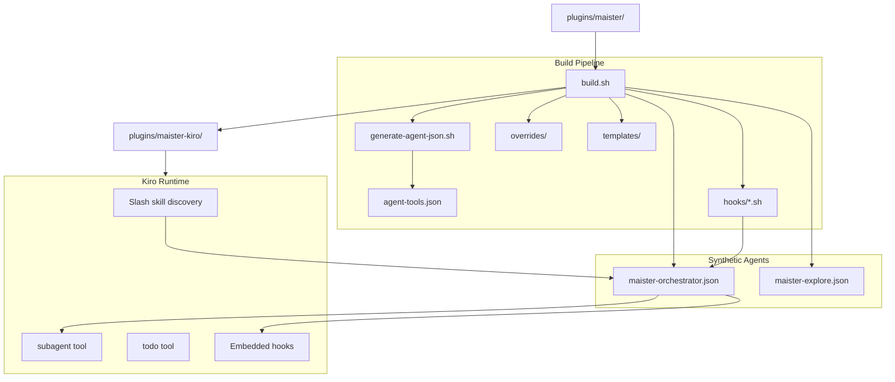
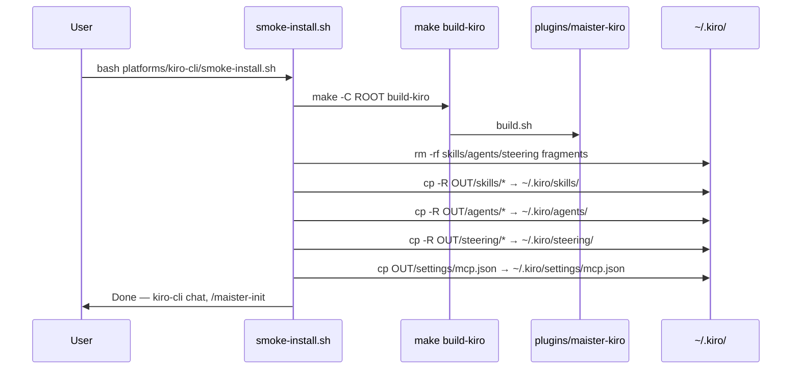
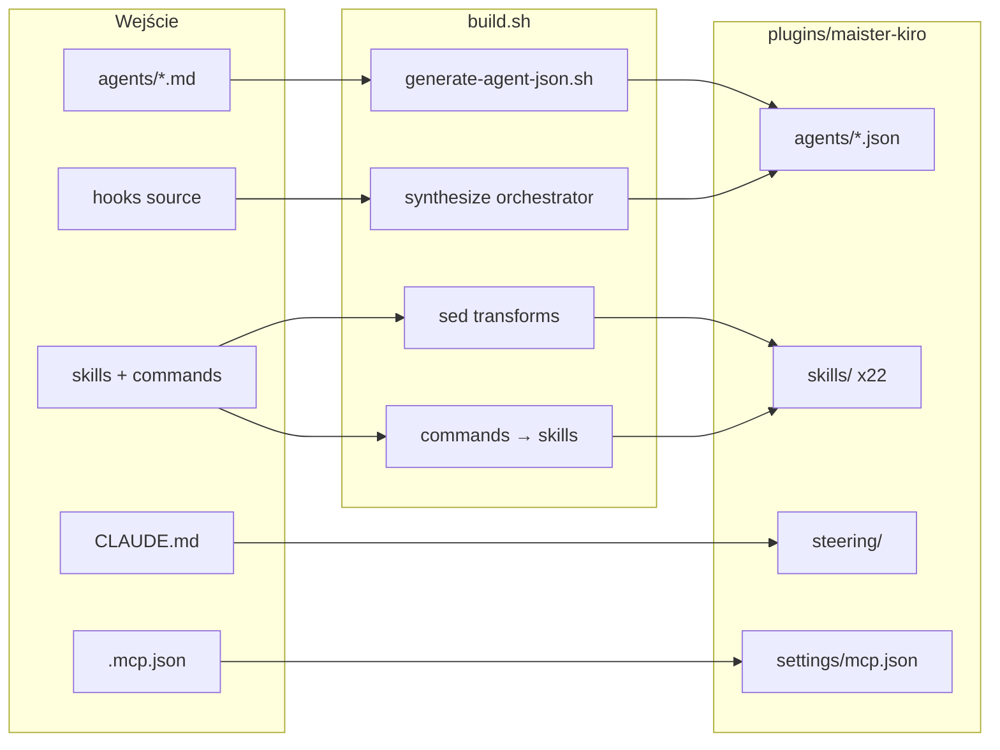
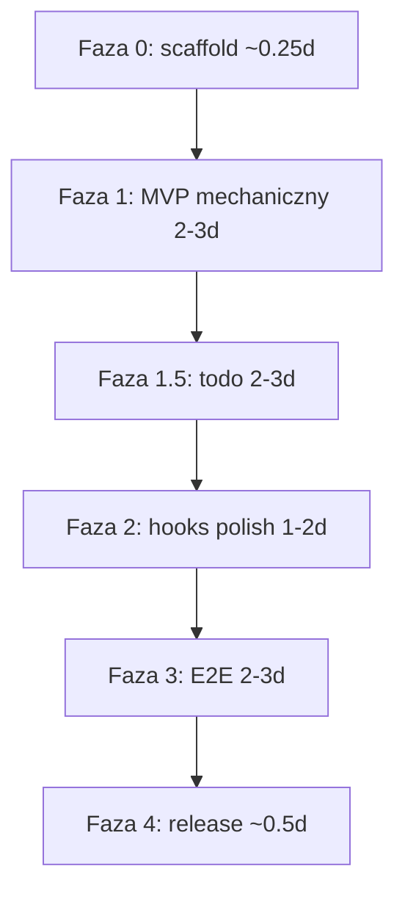

# High-Level Design: Wsparcie Kiro CLI dla Maister

## Design Overview

Maister dostarcza ustrukturyzowane workflow SDLC jako plugin multi-platformy. Claude Code (`plugins/maister/`) jest jedynym source of truth; Copilot i Cursor są już generowane przez `platforms/*/build.sh`. **Kiro CLI** to czwarta platforma — semantycznie najbliższa Cursor (`maister-foo`, `AGENTS.md`, hooks, Playwright MCP), formatowo najbardziej odbiegająca (agenci JSON, hooks osadzone w agencie, brak `commands/` API i plugin manifest).

Wybrany kierunek: **rozszerzenie wzorca Cursor** o generator MD→JSON, agenta **`maister.json`** z osadzonymi hookami, **izolowany profil `KIRO_HOME=~/.kiro-maister`**, wrapper **`maister-kiro`**, warstwę **@prompts**, **chat-native phase gates**, **`orchestrator-state.yml` jako SOT** oraz **`todo` od Fazy 1**.

> **Post-grill (2026-06-07):** Szczegóły w [`planning/grill-decisions.md`](../planning/grill-decisions.md). ADR-010–016 w `decision-log.md`.

**Key decisions (current):**
- **KIRO_HOME profile** — `~/.kiro-maister` ze standardowym layoutem; `plugins/maister-kiro/` mirror 1:1; `maister-kiro` wrapper.
- **Agent `maister`** — `agents/maister.json`; optional default at install (prompt default N); `--agent maister`.
- **@prompts** — `$KIRO_HOME/prompts/`: `@init`, `@dev`, `@research`, `@plan`, `@design`, `@status`, `@next`, `@resume`, `@bye`.
- **Progress** — `orchestrator-state.yml` SOT + **`todo` w Fazie 1** (nie defer).
- **3A+3B+3C Gates** — chat gates, headless defaults, sequential multi-select.
- **5B+5A Skills** — selective `skill://` on `maister`; extra slash commands OK in MVP.
- **6A MD→JSON** — `generate-agent-json.sh` + `agent-tools.json`; bodies in **`agents/instructions/`**.
- **Hooks** — `$KIRO_HOME/hooks/`; `maister.json` uses `../hooks/*.sh`.
- **Init** — `project/.kiro/steering/maister-docs.md` + `AGENTS.md` + `.maister/`.

---

## Architecture

### System Context (C4 Level 1)



**Opis:** Developer instaluje wygenerowany wariant do **`KIRO_HOME=~/.kiro-maister`** via `smoke-install.sh`, uruchamia przez **`maister-kiro chat --agent maister`**. Skills i @prompty ładują się z profilu; `maister-init` dodaje **`project/.kiro/steering/`** (workspace wygrywa nad global). CI: ephemeral `$KIRO_HOME` + workspace copy w `smoke-cli.sh`.

### Container Overview (C4 Level 2)



### Component Diagram (C4 Level 3 — logiczne komponenty build/runtime)



---

## Struktura `platforms/kiro-cli/`

```
platforms/kiro-cli/
├── build.sh                      # Główny pipeline (~18 kroków); wywołuje generate-agent-json.sh
├── generate-agent-json.sh        # MD → JSON + prompts/*.md; jq + agent-tools.json lookup
├── agent-tools.json              # Mapowanie roli agenta → whitelist tools (Kiro)
├── smoke-install.sh              # make build-kiro → cp do ~/.kiro/
├── smoke-cli.sh                  # Ephemeral workspace + headless 3 testy
├── overrides/
│   ├── commands/
│   │   └── quick-plan.md         # Z Cursor; chat gates zamiast AskQuestion
│   └── skills/
│       └── quick-bugfix/
│           └── SKILL.md          # Z Cursor
├── templates/
│   ├── agents-md-template.md     # Z Cursor (init → AGENTS.md)
│   └── steering-maister-docs.md  # Z platforms/cursor/rules/maister-docs.mdc
├── steering/
│   └── maister-workflows.md      # Fragment docelowy (build składa z CLAUDE.md)
├── hooks/
│   ├── block-destructive-commands-kiro.sh   # preToolUse shell; exit 2 + STDERR
│   ├── skill-invocation-reminder.sh       # agentSpawn + userPromptSubmit
│   ├── subagent-spawn-tracker.sh          # preToolUse matcher subagent
│   ├── subagent-complete-cleanup.sh       # postToolUse matcher subagent
│   └── post-compact-reminder-stub.sh      # Dokumentacja gap preCompact
├── transforms/
│   └── task-to-kiro-todo.md      # Faza 1.5: TaskCreate → todo (jak task-to-todo.md)
├── patches/
│   └── orchestrator-patterns-todo.md  # Faza 1.5: przykłady todo w orchestratorach
└── README.md                     # Maintainer notes (opcjonalnie)
```

**Wygenerowany output** (`plugins/maister-kiro/` — commitowany, nigdy ręcznie edytowany):

```
plugins/maister-kiro/
├── skills/                       # 14 source + 8 z commands/ = 22 katalogi maister-*
├── agents/
│   ├── maister-*.json            # 24 skonwertowane + maister-explore + maister-orchestrator
│   └── prompts/
│       └── maister-*.md          # Treść agentów (bez frontmatter)
├── steering/
│   ├── maister-workflows.md
│   └── maister-docs.md           # Template dla init (projekt → .kiro/steering/)
├── hooks/
│   └── *.sh                      # Skopiowane/adaptowane (referencja dla orchestrator JSON)
├── settings/
│   └── mcp.json                  # Z .mcp.json (Playwright MCP)
└── README.md
```

**Uwaga:** Katalog `commands/` **nie istnieje** w output — 8 plików źródłowych staje się `skills/maister-*/SKILL.md`. Brak `.claude-plugin/`, `.cursor-plugin/`, standalone `hooks/hooks.json`.

---

## `build.sh` — projekt krok po kroku (18 kroków)

Bazowany na `platforms/cursor/build.sh` (248 linii, 14 kroków). Kiro dodaje merge commands, MD→JSON, syntezę orchestratora i adaptację hooków.

| Krok | Akcja | Źródło / szczegóły |
|------|-------|-------------------|
| **0** | `set -e`, `sedi()`, `CORE`/`OUT`/`PLATFORM` vars | Wzorzec Cursor/Copilot |
| **1** | `rm -rf OUT && cp -r CORE OUT` | Czysta kopia `plugins/maister` → `plugins/maister-kiro` |
| **2** | Usuń `.claude-plugin/`; usuń `hooks/hooks.json` z layoutu docelowego | Kiro: brak manifestu; hooks tylko embedded |
| **3** | `name: maister:foo` → `name: maister-foo` w skills + commands (przed merge) | Jak Cursor krok 2–3 |
| **4** | `maister:` → `maister-` we wszystkich `.md` | Jak Cursor krok 4 |
| **5** | Explore: `subagent_type="Explore"` → `maister-explore`; wygeneruj `maister-explore.json` | Brak built-in explore w Kiro |
| **6** | `AskUserQuestion` → chat gate pattern (NIE `AskQuestion`) | Patch tekstowy + overrides |
| **7** | Strip `EnterPlanMode`/`ExitPlanMode`; kopiuj overrides quick-plan, quick-bugfix | Jak Cursor krok 7, 12 |
| **8** | `CLAUDE.md` → `AGENTS.md` w skills | Jak Cursor krok 8 |
| **9** | `.mcp.json` → `settings/mcp.json` | Adaptacja ścieżki Kiro |
| **10** | Plugin `CLAUDE.md` → `steering/maister-workflows.md` + sekcja Platform: Kiro CLI; usuń root `CLAUDE.md` | Analog `rules/maister-workflows.mdc` |
| **11** | **MD→JSON:** wywołaj `generate-agent-json.sh` dla 24 `agents/*.md` | Nowy koszt vs Cursor |
| **12** | **Merge commands:** 8× `commands/*.md` → `skills/maister-*/SKILL.md`; usuń `commands/` | Kiro brak commands API |
| **13** | **Synteza `maister-orchestrator.json`** z embedded hooks (Faza 1 minimal; Faza 2 pełny zestaw) | Nowy artefakt |
| **14** | Kopiuj/adaptuj hook scripts do `OUT/hooks/`; `chmod +x`; absolutne ścieżki lub `${KIRO_PLUGIN_ROOT}` test | Exit code 2 dla block |
| **15** | Init/docs-manager patches: `AGENTS.md`, `.kiro/steering/maister-docs.md` template | Z Cursor krok 13 |
| **16** | Rewrite orchestratorów: `Task tool` → `subagent`; `Skill tool` → `/maister-*` slash + `skill://` | Delegation contract |
| **17** | Strip `user-invocable: false` z frontmatter skills (Kiro ignoruje) | Internal via orchestrator resources |
| **18** | **Faza 1.5 (gdy włączona):** `TaskCreate`/`TaskUpdate` → `todo`; append `orchestrator-patterns-todo.md` | Pełna parzystość Cursor TodoWrite |

**Krok 18** jest **warunkowy** — domyślnie Faza 1 pomija go (jak Cursor MVP bez TodoWrite); Faza 1.5 włącza transform przez flagę/env `KIRO_TODO=1` lub osobny merge po smoke green.

**README** w `OUT`: instrukcja `smoke-install.sh`, opcjonalnie `chat.defaultAgent: maister-orchestrator`, `chat.enableTodoList true` (Faza 1.5).

---

## `generate-agent-json.sh` — projekt

**Cel:** Konwersja każdego `agents/*.md` na parę `agents/<name>.json` + `agents/prompts/<name>.md` bez edycji źródła w `plugins/maister/`.

**Wejście:**
- Plik MD z YAML frontmatter (`name`, `description`, `model`, `color`, opcjonalnie `skills:`)
- `platforms/kiro-cli/agent-tools.json` — lookup po `name` (po prefiksie `maister-`)

**Algorytm (bash + jq):**

```
dla każdego agents/*.md w OUT:
  1. Wyciągnij frontmatter (awk/sed między ---)
  2. name ← frontmatter; jeśli brak maister-*, dodaj prefix
  3. body ← reszta pliku → zapisz do agents/prompts/${name}.md
  4. tools ← agent-tools.json["agents"][name] lub default role bucket
  5. resources ← infer z frontmatter skills: → skill://.kiro/skills/maister-*/SKILL.md
  6. toolsSettings.subagent.trustedAgents ← ["maister-*"] dla orchestrator-class
  7. jq -n buduje JSON:
       { name, description, model, tools, resources?, toolsSettings?, promptFile: "prompts/${name}.md" }
  8. Zapis agents/${name}.json
  9. Usuń oryginalny agents/*.md z OUT
```

**`agent-tools.json` — struktura outline:**

```json
{
  "defaults": {
    "read_only": ["read", "grep", "glob", "code"],
    "implementer": ["read", "grep", "glob", "code", "write", "shell"],
    "orchestrator": ["read", "grep", "glob", "code", "write", "shell", "subagent", "todo"]
  },
  "agents": {
    "maister-gap-analyzer": { "tools": ["read", "grep", "glob", "code"], "readOnly": true },
    "maister-task-group-implementer": { "tools": ["read", "grep", "glob", "code", "write", "shell"] },
    "maister-docs-operator": { "tools": ["read", "write", "grep", "glob"] }
  },
  "synthetic": {
    "maister-explore": { "tools": ["read", "grep", "glob", "code"] },
    "maister-orchestrator": { "tools": ["read", "grep", "glob", "code", "write", "shell", "subagent", "todo"] }
  }
}
```

**Eskalacja 6B:** Jeśli parser frontmatter w bash przekroczy ~100 linii lub zwraca błędy na edge cases (`skills:` multi-line), wydzielić `generate-agents.mjs` (gray-matter) wywoływany z `build.sh` — bez zmiany kontraktu output.

**Dodatkowe syntetyczne agenty (poza pętlą MD):**
- `maister-explore.json` — statyczny szablon w `build.sh` lub sekcja `synthetic` w generatorze
- `maister-orchestrator.json` — osobna funkcja `synthesize_orchestrator()` w `build.sh` (hooks + resources)

---

## `maister-orchestrator.json` — schema outline

Jeden agent wejściowy dla workflow Maister. Użytkownik: `kiro-cli chat --agent maister-orchestrator` lub `chat.defaultAgent` w settings.

```json
{
  "name": "maister-orchestrator",
  "description": "Maister workflow orchestrator — invokes /maister-* skills via slash semantics and delegates to maister-* subagents",
  "model": "inherit",
  "tools": [
    "read", "grep", "glob", "code", "write", "shell",
    "subagent", "todo"
  ],
  "toolsSettings": {
    "subagent": {
      "trustedAgents": ["maister-*"]
    }
  },
  "resources": [
    "skill://.kiro/skills/maister-development/SKILL.md",
    "skill://.kiro/skills/maister-init/SKILL.md",
    "skill://.kiro/skills/maister-research/SKILL.md",
    "skill://.kiro/skills/maister-product-design/SKILL.md",
    "skill://.kiro/skills/maister-migration/SKILL.md",
    "skill://.kiro/skills/maister-performance/SKILL.md",
    "skill://.kiro/skills/maister-quick-bugfix/SKILL.md",
    "skill://.kiro/skills/maister-standards-update/SKILL.md",
    "skill://.kiro/skills/maister-standards-discover/SKILL.md",
    "skill://.kiro/skills/maister-quick-plan/SKILL.md",
    "skill://.kiro/skills/maister-quick-dev/SKILL.md",
    "skill://.kiro/skills/maister-work/SKILL.md",
    "skill://.kiro/skills/maister-reviews-code/SKILL.md",
    "skill://.kiro/skills/maister-reviews-pragmatic/SKILL.md",
    "skill://.kiro/skills/maister-reviews-spec-audit/SKILL.md",
    "skill://.kiro/skills/maister-reviews-reality-check/SKILL.md",
    "skill://.kiro/skills/maister-reviews-production-readiness/SKILL.md",
    "skill://.kiro/skills/orchestrator-framework/SKILL.md",
    "skill://.kiro/skills/maister-docs-manager/SKILL.md",
    "skill://.kiro/skills/maister-codebase-analyzer/SKILL.md",
    "skill://.kiro/skills/maister-implementation-plan-executor/SKILL.md",
    "skill://.kiro/skills/maister-implementation-verifier/SKILL.md"
  ],
  "promptFile": "prompts/maister-orchestrator.md",
  "hooks": {
    "preToolUse": [
      {
        "matcher": "shell",
        "command": "${KIRO_PLUGIN_ROOT}/hooks/block-destructive-commands-kiro.sh",
        "timeout": 5
      },
      {
        "matcher": "subagent",
        "command": "${KIRO_PLUGIN_ROOT}/hooks/subagent-spawn-tracker.sh",
        "timeout": 5
      }
    ],
    "postToolUse": [
      {
        "matcher": "subagent",
        "command": "${KIRO_PLUGIN_ROOT}/hooks/subagent-complete-cleanup.sh",
        "timeout": 5
      }
    ],
    "agentSpawn": [
      {
        "command": "${KIRO_PLUGIN_ROOT}/hooks/skill-invocation-reminder.sh",
        "timeout": 10
      }
    ],
    "userPromptSubmit": [
      {
        "command": "${KIRO_PLUGIN_ROOT}/hooks/skill-invocation-reminder.sh",
        "timeout": 10
      }
    ]
  }
}
```

**Uwagi projektowe:**
- **Internal skills** (`docs-manager`, `codebase-analyzer`, `orchestrator-framework`, …) są w `resources` orchestratora, ale nadal widoczne jako slash (5A MVP).
- **`todo`** w `tools` — aktywne od Fazy 1.5; w Fazie 1 orchestrator może mieć `tools` bez `todo`.
- **`preCompact` gap:** brak hooka Kiro — stub `post-compact-reminder-stub.sh` tylko dokumentuje gap; SOT = `orchestrator-state.yml` + instrukcja w `steering/maister-workflows.md`.
- **`${KIRO_PLUGIN_ROOT}`:** build emituje absolutne ścieżki do `OUT/hooks/` jeśli env nie działa (open question #3).

**`prompts/maister-orchestrator.md`:** Skrócona instrukcja delegacji — „używaj `/maister-development` zamiast Skill tool; używaj `subagent` z `agent: maister-gap-analyzer` zamiast Task tool; czytaj `orchestrator-state.yml` przy resume”.

---

## Adaptacja hooks (pełna parzystość Cursor)

| Cursor (`hooks.json`) | Kiro (`maister-orchestrator.json`) | Skrypt |
|----------------------|-------------------------------------|--------|
| `beforeShellExecution` | `preToolUse` matcher `shell` | `block-destructive-commands-kiro.sh` — exit **2** + STDERR (nie JSON deny) |
| `subagentStart` | `preToolUse` matcher `subagent` | `subagent-spawn-tracker.sh` — whitelist tracking |
| `subagentStop` | `postToolUse` matcher `subagent` | `subagent-complete-cleanup.sh` |
| `sessionStart` | `agentSpawn` + `userPromptSubmit` | `skill-invocation-reminder.sh` |
| `preCompact` | **GAP** — brak w Kiro | `post-compact-reminder-stub.sh` + docs |

**Whitelist bash guard** (jak Cursor): `test-suite-runner`, `e2e-test-verifier`, `user-docs-generator`, `docs-operator` — pozostali agenci i orchestrator pod guardem.

---

## Faza 1.5 — `todo` (projekt pełnej parzystości Cursor)

| Element | Działanie |
|---------|-----------|
| Transform | `platforms/kiro-cli/transforms/task-to-kiro-todo.md` — mapowanie semantyczne TaskCreate/TaskUpdate → `todo` |
| Patch | `patches/orchestrator-patterns-todo.md` → append do `orchestrator-framework/references/orchestrator-patterns.md` |
| Build | `apply_todo_transforms()` — ten sam glob co Cursor (orchestratory + agents prompts) |
| Settings | Dokumentacja: `kiro-cli settings chat.enableTodoList true` |
| SOT | **`orchestrator-state.yml` pozostaje autorytatywny**; `todo` to mirror UX (hybrid 2C) |
| Validate | Ban `TaskCreate`/`TaskUpdate` w output (jak `validate-cursor`) |

**Przykład instrukcji w orchestratorze (po transform):**
- Start workflow: `todo` — utwórz listę faz (pending)
- Per faza: `todo` in_progress → completed
- Resume: odczytaj `orchestrator-state.yml`, zsynchronizuj `todo` best-effort

---

## `validate-kiro` — lista reguł

Target Makefile `validate-kiro` (~22 reguły, mirror `validate-cursor` + JSON):

| # | Reguła | Faza |
|---|--------|------|
| 1 | `plugins/maister-kiro/` istnieje | 0 |
| 2 | Brak `maister:` w całym drzewie | 1 |
| 3 | Brak dwukropków w `name:` frontmatter skills | 1 |
| 4 | Brak `EnterPlanMode` / `ExitPlanMode` | 1 |
| 5 | Brak `CLAUDE.md` w skills | 1 |
| 6 | Brak `.claude-plugin/` | 1 |
| 7 | Wszystkie `agents/*.json` — `jq empty` | 1 |
| 8 | Nazwy agentów `maister-*` | 1 |
| 9 | `settings/mcp.json` istnieje | 1 |
| 10 | `steering/maister-workflows.md` istnieje | 1 |
| 11 | Brak `AskQuestion` (Kiro używa chat gates) | 1 |
| 12 | Brak capitalized `Explore` / `subagent_type="Explore"` | 1 |
| 13 | SKILL.md `name:` == nazwa folderu nadrzędnego | 1 |
| 14 | Dokładnie **22** katalogi skills | 1 |
| 15 | Brak standalone `hooks/hooks.json` | 1 |
| 16 | Brak katalogu `commands/` w output | 1 |
| 17 | `maister-orchestrator.json` istnieje z polem `hooks` | 1 |
| 18 | `maister-explore.json` istnieje | 1 |
| 19 | Brak `agents/*.md` (wszystko JSON) | 1 |
| 20 | Brak `TaskCreate`/`TaskUpdate` (gdy Faza 1.5 włączona) | 1.5 |
| 21 | `maister-orchestrator.json` zawiera `trustedAgents` | 2 |
| 22 | Hook scripts executable (`test -x`) | 2 |

Aggregate: `validate: validate-copilot validate-cursor validate-kiro`

---

## `smoke-install.sh` — flow



| Aspekt | Wartość |
|--------|---------|
| Shell | `set -euo pipefail` |
| Pre-build | `make build-kiro` |
| Dest | `~/.kiro/skills/`, `agents/`, `steering/`, `settings/mcp.json` |
| Opcjonalny arg | `DEST` override (dev) |
| Windows | `cp -R` (bez symlink — lekcja Copilot) |

**Nie** kopiować całego `plugins/maister-kiro/` jako jednego folderu — **flatten** do natywnego layoutu Kiro (open Q#1 — walidacja w prototypie Fazy 1).

---

## `smoke-cli.sh` — flow

```mermaid
sequenceDiagram
  participant CI as CI / Developer
  participant SC as smoke-cli.sh
  participant WS as /tmp/maister-kiro-smoke-$$
  participant K as kiro-cli

  CI->>SC: bash smoke-cli.sh
  SC->>SC: make build-kiro
  SC->>WS: mkdir; git init
  SC->>WS: cp -R plugins/maister-kiro → .kiro/
  Note over WS: Workspace .kiro/ override global

  SC->>K: Test 1 — detection maister-init
  K-->>SC: output contains maister-init

  SC->>K: Test 2 — subagent maister-gap-analyzer
  K-->>SC: JSON ok

  SC->>K: Test 3 — /maister-quick-plan artifact
  K-->>SC: .maister/plans/*.md exists
```

**Runner:**

```bash
kiro-cli chat --no-interactive --trust-all-tools \
  --agent maister-orchestrator \
  "prompt"
```

| Test | Asercja |
|------|---------|
| 1 Plugin detection | Output zawiera `maister-init` |
| 2 Custom agent | `maister-gap-analyzer` via `subagent` |
| 3 quick-plan | `.maister/plans/*.md` utworzony |

**Wymagania:** `kiro-cli` w PATH; opcjonalnie `KIRO_API_KEY` w CI. Faza 1.5: przed testami `kiro-cli settings chat.enableTodoList true`.

**Headless gates (3B):** prompty smoke używają ścieżek bez interaktywnych gate'ów lub orchestrator ma „if non-interactive, use defaults”.

---

## Key Components

| Component | Purpose | Responsibilities | Key Interfaces | Dependencies |
|-----------|---------|------------------|----------------|--------------|
| **build.sh** | Transform SOT → Kiro install tree | 18 kroków sed/copy; wywołuje generator i synthesize orchestrator | `make build-kiro` | `plugins/maister/`, platform assets |
| **generate-agent-json.sh** | MD→JSON konwersja | Frontmatter parse, tools lookup, prompts split | Wywołanie z build.sh | `jq`, `agent-tools.json` |
| **agent-tools.json** | Whitelist narzędzi per agent | Mapowanie ról → `tools[]` | Generator, maintainers | — |
| **maister-orchestrator.json** | Entry point + hooks host | Embedded hooks, skill:// resources, subagent trust | `kiro-cli --agent` | hook scripts |
| **maister-explore.json** | Zamiennik built-in explore | Ograniczone read tools | `subagent` z codebase-analyzer | — |
| **smoke-install.sh** | Dystrybucja globalna | Flat copy do `~/.kiro/` | README, developer UX | build output |
| **smoke-cli.sh** | Walidacja headless | Workspace `.kiro/` + 3 testy | CI, local dev | `kiro-cli`, `KIRO_API_KEY` |
| **validate-kiro** | Kontrakt jakości grep/jq | 22 reguły fail-fast | `make validate` | `jq`, `grep` |
| **Hook scripts** | Parzystość Cursor guards | Block destructive, subagent tracking, skill reminder | Kiro hook events | orchestrator JSON |

---

## Data Flow



**Runtime:** Użytkownik wywołuje `/maister-development` → Kiro ładuje SKILL.md → orchestrator (jeśli `--agent maister-orchestrator`) deleguje przez `subagent` do `maister-*.json` → artefakty w `.maister/tasks/` → `orchestrator-state.yml` aktualizowany co fazę; od Fazy 1.5 mirror w `todo`.

---

## Integration Points

### Makefile

```makefile
build: build-copilot build-cursor build-kiro

build-kiro:
	bash platforms/kiro-cli/build.sh

validate: validate-copilot validate-cursor validate-kiro

validate-kiro:
	# 22 reguły (patrz sekcja validate-kiro)

clean: clean-copilot clean-cursor clean-kiro

clean-kiro:
	rm -rf plugins/maister-kiro/
```

`watch` (fswatch → `make build`) — automatycznie obejmuje `build-kiro` po dodaniu do aggregate `build`.

### CI / GitHub Actions

| Workflow | Zmiana |
|----------|--------|
| `release.yml` | `make build && make validate` — automatycznie waliduje Kiro po dodaniu targetów |
| **Nowy** `build-kiro.yml` | `on.push` paths: `plugins/maister/**`, `platforms/**`; `make build-kiro && make validate-kiro`; opcjonalny auto-commit `plugins/maister-kiro/` (parity `build-copilot.yml`) |
| Secrets | `KIRO_API_KEY` dla smoke w CI (Faza 3) |

**Nie dodawać** Kiro do `.claude-plugin/marketplace.json` ani `.cursor-plugin/marketplace.json`.

### Istniejące standardy

- `.maister/docs/standards/global/build-pipeline.md` — rozszerzenie o sekcję Kiro po implementacji
- `docs/cursor-agent-support.md` — grill #15–16 jako mandat architektury

---

## Design Decisions

| ID | Decyzja | ADR |
|----|---------|-----|
| D1 | Hybrid distribution 1C | [ADR-001](decision-log.md#adr-001-hybrid-distribution-1c) |
| D2 | orchestrator-state.yml SOT + todo Faza 1.5 | [ADR-002](decision-log.md#adr-002-orchestrator-stateyml-sot-with-todo-mirror-fase-15) |
| D3 | Chat gates + headless + sequential | [ADR-003](decision-log.md#adr-003-chat-native-phase-gates-3a3b3c) |
| D4 | Single maister-orchestrator.json | [ADR-004](decision-log.md#adr-004-single-maister-orchestrator-agent-4a) |
| D5 | Selective skill:// + accept extra slashes | [ADR-005](decision-log.md#adr-005-internal-skills-5b--5a-mvp) |
| D6 | bash+jq MD→JSON | [ADR-006](decision-log.md#adr-006-bashjq-agent-generation-6a) |
| D7 | Commands merge do skills | [ADR-007](decision-log.md#adr-007-merge-commands-into-skills) |
| D8 | Hooks embedded w orchestrator JSON | [ADR-008](decision-log.md#adr-008-embedded-hooks-in-orchestrator-json) |

---

## Concrete Examples

### Przykład 1: Headless init (CI)

**Given** świeży katalog git, skopiowany `.kiro/` z `plugins/maister-kiro/`, `kiro-cli` z `--no-interactive --trust-all-tools`  
**When** uruchomiono `"/maister-init"` z agentem `maister-orchestrator`  
**Then** powstają `AGENTS.md`, `.maister/docs/INDEX.md`, `.kiro/steering/maister-docs.md`; brak blokady na AskUserQuestion (defaults z briefu)

### Przykład 2: Resume development po przerwaniu

**Given** task `.maister/tasks/development/2026-06-07-feature/` z `orchestrator-state.yml` (`current_phase: 5`)  
**When** użytkownik uruchamia `/maister-development [task-path] [--from=PHASE]`  
**Then** orchestrator czyta YAML (SOT), kontynuuje od fazy 5; od Fazy 1.5 `todo` zsynchronizowany best-effort

### Przykład 3: Delegacja gap-analyzer

**Given** orchestrator w fazie analizy codebase  
**When** instrukcja mówi „delegate to gap-analyzer”  
**Then** model wywołuje `subagent` z `agent: maister-gap-analyzer`; `preToolUse` tracker zapisuje spawn; bash guard aktywny dla implementerów, nie dla `docs-operator`

---

## Fazy implementacji 0–4



### Faza 0 — Setup (~0,25 dnia)

- Utworzyć `platforms/kiro-cli/` + stub `build.sh`, `agent-tools.json`
- Makefile: `build-kiro`, `validate-kiro`, `clean-kiro`; rozszerzyć `build`, `validate`, `clean`
- Stub validate: artifact exists

**Kryterium:** `make build-kiro` tworzy `plugins/maister-kiro/` (kopia lub minimal transform)

### Faza 1 — MVP mechaniczny (2–3 dni)

- Pełny `build.sh` kroki 1–17 (bez todo)
- `generate-agent-json.sh` + 24 agenty + syntetyczne
- Merge commands → skills
- `maister-orchestrator.json` z hooks Faza 1 (shell block + subagent trackers)
- Overrides, templates, steering
- `smoke-install.sh`, `smoke-cli.sh`
- `validate-kiro` reguły 1–19

**Kryterium:** `make build-kiro && make validate-kiro && bash smoke-cli.sh` — test 1 PASS

### Faza 1.5 — Progress tracking (2–3 dni)

- `transforms/task-to-kiro-todo.md`, `patches/orchestrator-patterns-todo.md`
- Build krok 18 / `KIRO_TODO=1`
- `validate-kiro` reguła 20
- Dokumentacja `chat.enableTodoList true`
- Smoke: opcjonalna asercja todo state

**Kryterium:** brak `TaskCreate`/`TaskUpdate` w output; orchestratory referencują `todo`

### Faza 2 — Hooks + polish (1–2 dni)

- Pełny zestaw hooks w orchestrator JSON
- E2E verify `preToolUse` subagent payload
- `trustedAgents` tuning
- Stub `post-compact-reminder` + README Kiro (mirror Cursor lines 179–242)
- `validate-kiro` reguły 21–22

### Faza 3 — E2E (2–3 dni)

Scenariusze z `docs/cursor-e2e-checklist.md` adaptowane:

| # | Scenariusz | Uwagi Kiro |
|---|------------|------------|
| 1 | `/maister-init` full | Interaktywny dla gates Phase 3 |
| 2 | `/maister-development` + progress | Wymaga Fazy 1.5 dla todo |
| 3 | Resume `[task-path] [--from=PHASE]` | `orchestrator-state.yml` |
| 4 | Parallel waves | `subagent` limit |
| 5 | gap-analyzer | subagent |
| 6 | quick-plan, quick-bugfix | overrides |
| 7 | Playwright MCP `--e2e` | P2 optional |
| 8 | Delegation | subagent availability |

### Faza 4 — Release (~0,5 dnia)

- Commit `plugins/maister-kiro/` + `platforms/kiro-cli/`
- Bump version w manifestach Claude/Cursor (Kiro bez manifestu)
- Opcjonalnie `build-kiro.yml`
- README: sekcja instalacji Kiro CLI

**Szacunek łączny:** ~1,5–2,5 tygodnia (vs ~1–2 tyg. Cursor)

---

## Out of Scope

| Element | Kiedy wrócić |
|---------|--------------|
| Public Kiro marketplace | Gdy Kiro udostępni registry |
| Edycja `plugins/maister/` pod Kiro (`tools:` frontmatter) | Gdy 3+ platform wymaga shared manifest |
| `preCompact` hook parity | Gdy Kiro doda event lub state-only wystarczy produkcyjnie |
| `skills-internal/` dual tree (5E) | Gdy slash pollution blokuje UX |
| Playwright MCP E2E w CI | P2, Faza 3+ |
| Unified multi-platform install CLI | Osobny initiative |
| Node generator (6B) | Tylko przy awarii bash parsera |

---

## Success Criteria

1. `make build` generuje `plugins/maister-kiro/` bez ręcznych edycji i przechodzi `make validate-kiro` (22 reguły po Fazie 2).
2. `smoke-install.sh` + interaktywny `kiro-cli chat` uruchamia `/maister-init` z poprawnymi artefaktami projektu.
3. `smoke-cli.sh` przechodzi 3 testy headless z `--no-interactive --trust-all-tools`.
4. `/maister-development [task-path] [--from=PHASE]` wznawia workflow z `orchestrator-state.yml` (SOT).
5. Po Fazie 1.5 orchestratory używają `todo` zamiast `TaskCreate`/`TaskUpdate`; brak tych symboli w validate.
6. Hooks: destructive bash zablokowany dla nie-whitelistowanych agentów (exit 2); subagent spawn tracked.
7. Zero wystąpień `maister:`, `AskQuestion`, `EnterPlanMode` w output.
8. Architektura dokumentowana w README; CI `release.yml` waliduje Kiro przy tag release.

---

*Dokument wejściowy dla specification-creator i `/maister-development` Faza 0–4. Oparty na solution-exploration.md (konwergencja Phase 4) z pełną parzystością Cursor w zakresie hooks i Fazy 1.5 todo.*
