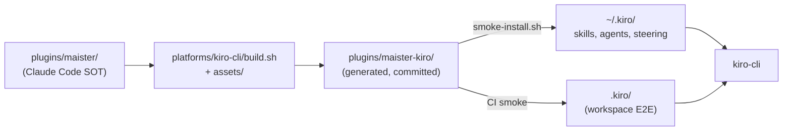
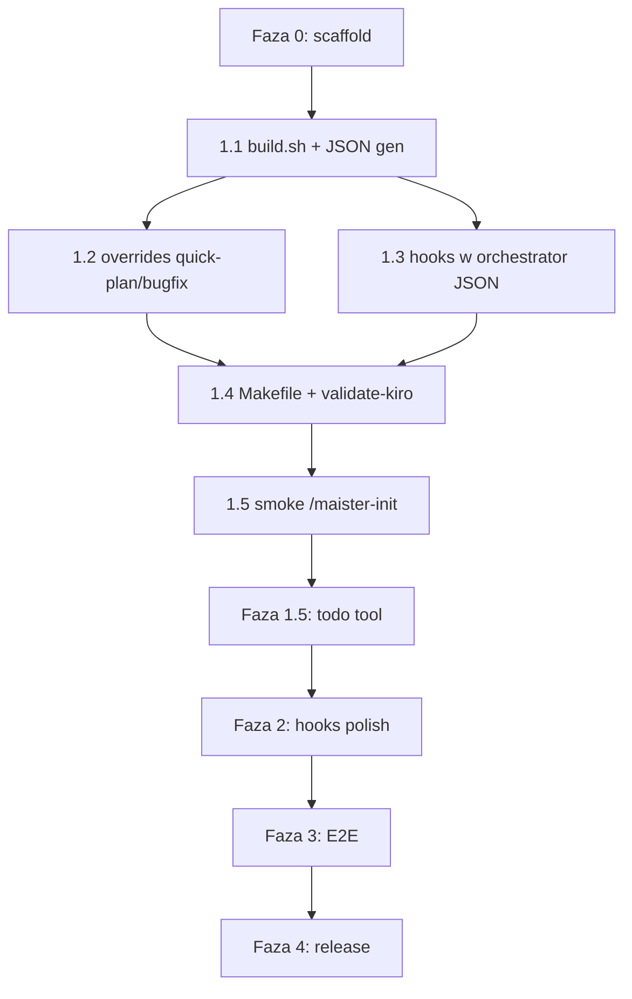

# Raport badawczy: implementacja wsparcia Kiro CLI dla Maister

| Pole | Wartość |
|------|---------|
| **Typ badania** | Mixed (technical + literature) |
| **Data** | 2026-06-07 |
| **Task path** | `.maister/tasks/research/2026-06-07-kiro-cli-support` |
| **Pytanie badawcze** | Jak przygotować implementację wsparcia kiro-cli analogicznie do Cursor, Copilot i Claude Code? |

---

## Spis treści

1. [Executive Summary](#executive-summary)
2. [Rekomendacja architektury](#rekomendacja-architektury)
3. [Tabela transformacji Claude Code → Kiro CLI](#tabela-transformacji-claude-code--kiro-cli)
4. [Luki Kiro i mitigacje](#luki-kiro-i-mitigacje)
5. [Fazy implementacji (0–4) z checklistą plików](#fazy-implementacji-04-z-checklistą-plików)
6. [Makefile, CI i smoke](#makefile-ci-i-smoke)
7. [Dystrybucja](#dystrybucja)
8. [Otwarte pytania](#otwarte-pytania)
9. [Następne kroki](#następne-kroki)
10. [Załączniki](#załączniki)

---

## Executive Summary

### Co zbadano

Przeprowadzono reverse-engineering pipeline build Maister (Copilot CLI, Cursor Agent) oraz mapowanie oficjalnej dokumentacji Kiro CLI (skills, steering, custom agents, hooks, subagents, MCP, headless mode) na istniejący source of truth `plugins/maister/`.

### Jak zbadano

- Analiza `platforms/cursor/build.sh` (248 linii, 14 kroków), `platforms/copilot-cli/build.sh`, `Makefile`, CI workflows, smoke scripts
- Inwentaryzacja `plugins/maister/`: 24 agenci, 14 skills, 8 commands, hooks, MCP
- Dokumentacja Kiro: kiro.dev/docs/cli/*
- Decyzje grill z `docs/cursor-agent-support.md` (#15–16: Kiro ten sam wzorzec)

### Kluczowe ustalenia

1. **Kiro nie istnieje jeszcze w repo** — brak `platforms/kiro-cli/` i `plugins/maister-kiro/`.
2. **Bazowa implementacja: Cursor, nie Copilot** — prefix `maister-foo`, `AGENTS.md`, hooks zachowane, MCP w bundle.
3. **Największa unikalna praca:** konwersja **24 agentów MD → JSON**, synteza **`maister-orchestrator.json`**, merge **8 commands → skills**.
4. **Główne luki API:** brak `AskQuestion`, brak built-in `explore`, brak `preCompact`/`subagentStart`, brak plugin manifest/`--plugin-dir`, `todo` experimental.
5. **Szacunek:** ~1,5–2,5 tygodnia (vs ~1–2 tyg. Cursor) z powodu generatora JSON i redesignu hooks.

### Główny wniosek

Implementacja jest **wykonalna i dobrze zdefiniowana** dzięki szablonowi Cursor. Należy utworzyć `platforms/kiro-cli/build.sh` generujący install tree `plugins/maister-kiro/` z transformacjami semantycznymi (nazwy, AGENTS.md, steering) i formatowymi (agenci JSON, hooks embedded, commands→skills).

---

## Rekomendacja architektury

### Przepływ danych



### Zasady (niezmienne)

| Zasada | Źródło |
|--------|--------|
| `plugins/maister/` = jedyny source of truth | Grill #1, CLAUDE.md |
| Nigdy ręcznie edytować `plugins/maister-kiro/` | Grill #4, build-pipeline.md |
| Wszystkie adaptacje w `platforms/kiro-cli/` | cursor-agent-support.md |
| Commitować wygenerowany artefakt po build | Grill #4 (jak copilot/cursor) |
| `make build` = wszystkie platformy | Grill #16 |

### Docelowy kształt repo (`master` forka)

```
fork/
├── plugins/
│   ├── maister              ← sync upstream (zero platform-specific edits)
│   ├── maister-copilot      ← make build-copilot
│   ├── maister-cursor       ← make build-cursor
│   └── maister-kiro         ← make build-kiro (planowane)
├── platforms/
│   ├── copilot-cli/build.sh
│   ├── cursor/build.sh
│   └── kiro-cli/build.sh    ← planowane
├── .claude-plugin/marketplace.json
└── .cursor-plugin/marketplace.json
```

### Proponowany layout `plugins/maister-kiro/` (output build)

```
plugins/maister-kiro/
├── skills/                    # 14 source skills + 8 z commands/ (22 katalogi)
│   └── maister-development/
│       └── SKILL.md
├── agents/                    # 24 generated JSON + syntetyczne
│   ├── maister-gap-analyzer.json
│   ├── maister-orchestrator.json
│   ├── maister-explore.json
│   └── prompts/
│       └── maister-gap-analyzer.md
├── steering/
│   ├── maister-workflows.md   # z plugin CLAUDE.md
│   └── maister-docs.md        # template dla init (projekt → .kiro/steering/)
├── hooks/
│   └── *.sh                   # adapted z platforms/cursor/hooks/
├── settings/
│   └── mcp.json               # Playwright MCP
└── README.md                  # Platform: Kiro CLI
```

**Instalacja użytkownika** (`smoke-install.sh`): kopiować poddrzewa do `~/.kiro/skills/`, `~/.kiro/agents/`, `~/.kiro/steering/`, `~/.kiro/settings/mcp.json`.

### Porównanie platform

| Aspekt | Copilot | Cursor | **Kiro (rekomendacja)** |
|--------|---------|--------|-------------------------|
| Command/skill naming | strip `foo` | `maister-foo` | **`maister-foo`** |
| Project instructions | `.github/copilot-instructions.md` | `AGENTS.md` + `.cursor/rules/` | **`AGENTS.md` + `.kiro/steering/`** |
| Agenci | `.md` + frontmatter | `.md` + frontmatter | **`.json`** + `prompts/*.md` |
| Hooks | usunięte | `hooks/hooks.json` | **embedded w agent JSON** |
| Commands | `commands/` kept | `commands/` kept | **merge do `skills/`** |
| Manifest | `.claude-plugin` | `.cursor-plugin` | **brak — install tree** |
| MCP | `.mcp.json` | `mcp.json` | **`.kiro/settings/mcp.json`** |
| Progress | `TaskCreate` | `TodoWrite` | **`todo`** (experimental) |
| Delegation | `Task` tool | `Task` tool | **`subagent`** tool |

---

## Tabela transformacji Claude Code → Kiro CLI

Analogiczna do sekcji w `docs/cursor-agent-support.md`, rozszerzona o specyfikę Kiro.

### Pipeline build (`platforms/kiro-cli/build.sh`)

| # | Claude Code (source) | Cursor (`build.sh`) | **Kiro CLI (proponowane)** | Status |
|---|---------------------|---------------------|---------------------------|--------|
| 0 | — | `rm -rf OUT && cp -r CORE` | **To samo** → `plugins/maister-kiro` | 1:1 |
| 1 | `.claude-plugin/plugin.json` | `.cursor-plugin/plugin.json` | **Pomiń** — README + install script | Gap |
| 2 | `name: maister:foo` (commands) | `name: maister-foo` | **To samo** | 1:1 |
| 3 | `name: maister:foo` (skills) | `name: maister-foo` | **To samo**; folder = `name` | 1:1 |
| 4 | `maister:` w referencjach `.md` | `maister-` | **To samo** | 1:1 |
| 5 | `subagent_type="Explore"` | `explore` | **`maister-explore` agent** + rewrite instrukcji | Adapt |
| 6 | `AskUserQuestion` | `AskQuestion` | **Pytania w czacie** (bez sed do AskQuestion) | Gap |
| 7 | `EnterPlanMode`/`ExitPlanMode` | strip + overrides | **To samo** — file-based plan + chat gate | 1:1 |
| 8 | `CLAUDE.md` w skills | `AGENTS.md` | **To samo** — Kiro auto-includes AGENTS.md | 1:1 |
| 9 | `.mcp.json` | `mcp.json` | **`settings/mcp.json`** w output tree | Adapt |
| 10 | `CLAUDE.md` (plugin doc) | `rules/maister-workflows.mdc` | **`steering/maister-workflows.md`** | Adapt |
| 11 | `hooks/hooks.json` + scripts | Cursor `hooks/hooks.json` | **Embed w `maister-orchestrator.json`** | Adapt |
| 11b | `agents/*.md` frontmatter | prefix `maister-*` | **MD → JSON** + `prompts/*.md` | **Nowe** |
| 12 | — | overrides quick-plan, quick-bugfix | **Reuse** (dostosować AskQuestion → chat) | Adapt |
| 13 | init/docs-manager | AGENTS.md template, maister-docs | **`.kiro/steering/maister-docs.md`** template | Adapt |
| 14 | `TaskCreate`/`TaskUpdate` | `TodoWrite` | **`todo` tool** + `chat.enableTodoList` | Adapt |
| 15 | `commands/*.md` (8) | kept in `commands/` | **Emit jako `skills/maister-*/SKILL.md`** | **Nowe** |
| 16 | `Skill tool` w orchestratorach | unchanged | **Rewrite** → `/maister-*` slash lub `skill://` | Adapt |
| 17 | `Task tool` | `Task tool` + `maister-*` | **`subagent`** + `trustedAgents` | Adapt |
| 18 | — | — | **Synteza `maister-orchestrator.json`** | **Nowe** |
| 19 | `user-invocable: false` | kept | **Strip**; internal via `skill://` resources | Adapt |

### Artefakty źródłowe → docelowe

| Artefakt źródłowy | Kiro target | Transform |
|-------------------|-------------|-----------|
| `agents/*.md` (24) | `agents/*.json` + `agents/prompts/*.md` | Generate — infer `tools`, map `skills` → `resources` |
| `skills/**/SKILL.md` (14) | `skills/**/SKILL.md` | Copy + sed |
| `commands/*.md` (8) | `skills/maister-*/SKILL.md` | Generate |
| `hooks/hooks.json` + `hooks/*.sh` | `hooks` w orchestrator JSON + adapted `.sh` | Relocate + Kiro exit code 2 |
| `.mcp.json` | `settings/mcp.json` | Copy |
| `.claude-plugin/plugin.json` | — | Omit |
| `CLAUDE.md` (plugin) | `steering/maister-workflows.md` + README | Adapt |
| docs-manager → project `CLAUDE.md` | `AGENTS.md` + `.kiro/steering/maister-docs.md` | Patch init skill |

### Mapowanie narzędzi agenta

| Claude Code | Cursor | **Kiro CLI** | Jakość mapowania |
|-------------|--------|--------------|------------------|
| `Task` tool (`subagent_type`) | `Task` + `maister-*` | **`subagent`** + agent name | High |
| `TaskCreate` / `TaskUpdate` | `TodoWrite` | **`todo`** (experimental) | Medium |
| `AskUserQuestion` | `AskQuestion` | **Brak narzędzia** — chat gates | Gap |
| `Skill` tool | `Skill` tool | **Auto-discovery + `/skill-name`** | High (default agent) |
| `EnterPlanMode` / `ExitPlanMode` | Własny flow plikowy | **To samo** (opcjonalnie `/plan` w docs) | High |
| `Explore` subagent | `explore` | **`maister-explore`** custom agent | Gap → mitigacja |
| MCP `.mcp.json` | `mcp.json` | **`.kiro/settings/mcp.json`** | High |

### Mapowanie slash commands (po build)

| Źródło Claude | Kiro slash |
|---------------|------------|
| `maister:development` | `/maister-development` |
| `maister:init` | `/maister-init` |
| `maister:quick-plan` (command) | `/maister-quick-plan` |
| `maister:work` (command) | `/maister-work` |
| `maister:reviews-code` (command) | `/maister-reviews-code` |
| … | `/maister-*` |

### Mapowanie hooks

| Maister (Claude/Cursor) | Kiro hook | Matcher | Feasibility |
|-------------------------|-----------|---------|-------------|
| `PreToolUse` / `beforeShellExecution` | `preToolUse` | `shell` / `execute_bash` | Direct |
| `SessionStart` (general) | `agentSpawn` + `userPromptSubmit` | — | Partial |
| `SessionStart` (compact) / `preCompact` | — | — | **GAP** |
| `subagentStart` / `subagentStop` | `preToolUse` / `postToolUse` | `subagent` | Workaround |
| — | `userPromptSubmit` | — | Skill-invocation reminder |

### Inventory źródłowy (do transformacji)

| Typ | Liczba | Uwagi Kiro |
|-----|--------|------------|
| Agents | 24 | +2 syntetyczne (`maister-orchestrator`, `maister-explore`) |
| Skills | 14 | 6 internal (`user-invocable: false`) |
| Commands | 8 | → 8 nowych skill dirs |
| Hook scripts | 3 (Claude) / 5 (Cursor) | Adapt + nowe subagent trackers |
| MCP servers | 1 (playwright) | Bez zmian config |

---

## Luki Kiro i mitigacje

| # | Luka | Wpływ | Pewność | Mitigacja |
|---|------|-------|---------|-----------|
| 1 | **Brak `AskQuestion`/`AskUserQuestion`** | P0 — gates orchestratorów, init Phase 3 | High | Instrukcja „zapytaj użytkownika w czacie z numerowanymi opcjami i czekaj”; smoke headless omija gates; sekwencyjne pytania (lekcja Copilot multi-select) |
| 2 | **Brak built-in `explore`** | P1 — `codebase-analyzer`, `quick-plan` | High | `maister-explore.json`: `tools: ["read","grep","glob","code"]`; sed spawn instructions |
| 3 | **Brak `preCompact`** | P2 — resume po compaction | High | Stub hook; `orchestrator-state.yml` jako SOT; dokumentacja manual recovery |
| 4 | **Brak `subagentStart`/`subagentStop`** | P1 — bash guard whitelist | High | `preToolUse`/`postToolUse` na `subagent`; `toolsSettings.subagent.trustedAgents` |
| 5 | **Brak `user-invocable: false`** | P1 — 6 internal skills jako slash | High | Custom orchestrator + `skill://` selective; lub akceptacja extra commands |
| 6 | **Brak `commands/` API** | P1 — 8 command files | High | Build-time merge do `skills/` |
| 7 | **Brak plugin manifest / `--plugin-dir`** | P1 — smoke/CI | High | `smoke-install.sh` → `~/.kiro/`; E2E workspace `.kiro/` |
| 8 | **`todo` experimental** | P1 — progress UX | High | Faza 1.5 opcjonalna; `chat.enableTodoList true`; defer jak Cursor TodoWrite |
| 9 | **Agenci bez `tools` w source** | P1 — Kiro wymaga whitelist | High | `platforms/kiro-cli/agent-tools.json` lookup table |
| 10 | **`${KIRO_PLUGIN_ROOT}` nieudokumentowany** | P2 — hook paths | Medium | Absolute paths w build lub wrapper script |
| 11 | **Headless bez mid-session input** | P0 — CI gates | High | `--no-interactive --trust-all-tools`; `trustedAgents: ["maister-*"]` |
| 12 | **Blocking hooks: exit 2 + STDERR** | P2 — script rewrite | High | `block-destructive-commands-kiro.sh` (nie JSON permission) |

### Priorytetyzacja luk

```
P0 (blokery MVP headless):  #1 AskUserQuestion, #11 headless gates
P1 (Faza 1 scope):          #2 explore, #4 subagent hooks, #5 internal skills,
                            #6 commands merge, #7 install path, #9 tools inference
P2 (Faza 2–3):              #3 preCompact, #8 todo, #10 KIRO_PLUGIN_ROOT
```

---

## Fazy implementacji (0–4) z checklistą plików

Szablon z Cursor (`docs/cursor-agent-implementation-plan.md`), dostosowany do Kiro.

### Faza 0 — Setup (~0,25 dnia)

**Cel:** Scaffold katalogu platformy i Makefile stubs.

| Checklist | Plik / akcja |
|-----------|--------------|
| [ ] Utworzyć `platforms/kiro-cli/` | katalog |
| [ ] Stub `platforms/kiro-cli/build.sh` | `set -e`, `sedi()`, `CORE`/`OUT` vars |
| [ ] Stub `platforms/kiro-cli/agent-tools.json` | lookup table `tools`/`allowedTools` |
| [ ] Katalogi assets | `overrides/`, `templates/`, `hooks/`, `patches/`, `steering/` |
| [ ] Makefile: `build-kiro`, `validate-kiro`, `clean-kiro` | rozszerzyć `build`, `validate`, `clean` |
| [ ] Stub `validate-kiro` | min. „artifact exists” |

**Kryterium ukończenia:** `make build-kiro` tworzy pusty/kopiowany `plugins/maister-kiro/`.

---

### Faza 1 — MVP mechaniczny (2–3 dni)

**Cel:** `make build-kiro` produkuje installable tree; smoke `/maister-init` headless.

#### `platforms/kiro-cli/build.sh` — kroki

| Krok | Akcja |
|------|-------|
| 1 | `cp -r plugins/maister → plugins/maister-kiro` |
| 2 | Usuń `.claude-plugin/`, standalone `hooks/hooks.json` z output layout |
| 3 | `maister:foo` → `maister-foo` (commands + skills frontmatter) |
| 4 | `maister:` → `maister-` we wszystkich `.md` |
| 5 | Generuj `maister-explore.json` |
| 6 | Replace `AskUserQuestion` → chat gate pattern (NIE `AskQuestion`) |
| 7 | Strip `EnterPlanMode`/`ExitPlanMode`; copy overrides |
| 8 | `CLAUDE.md` → `AGENTS.md` w skills |
| 9 | Copy `.mcp.json` → `settings/mcp.json` |
| 10 | `CLAUDE.md` plugin → `steering/maister-workflows.md`; delete `CLAUDE.md` |
| 11 | Generate agents MD→JSON (24 files) |
| 12 | Merge `commands/*.md` → `skills/maister-*/SKILL.md` (8) |
| 13 | Synthesize `maister-orchestrator.json` z hooks Phase 1 |
| 14 | Copy/adapt hook scripts; init/docs-manager patches |
| 15 | Rewrite `Task tool` → `subagent`; `Skill tool` → slash semantics |

#### Pliki do utworzenia (Faza 1)

| Plik | Źródło / opis |
|------|---------------|
| `platforms/kiro-cli/build.sh` | Bazowany na `platforms/cursor/build.sh` |
| `platforms/kiro-cli/agent-tools.json` | Role-based tools whitelist |
| `platforms/kiro-cli/overrides/commands/quick-plan.md` | Copy z Cursor, dostosować gates |
| `platforms/kiro-cli/overrides/skills/quick-bugfix/SKILL.md` | Copy z Cursor |
| `platforms/kiro-cli/templates/agents-md-template.md` | Copy z Cursor |
| `platforms/kiro-cli/templates/steering-maister-docs.md` | Z `platforms/cursor/rules/maister-docs.mdc` |
| `platforms/kiro-cli/steering/maister-workflows.md` | Template z plugin doc |
| `platforms/kiro-cli/hooks/block-destructive-commands.sh` | Adapt Cursor → exit code 2 |
| `platforms/kiro-cli/hooks/skill-invocation-reminder.sh` | Adapt Cursor |
| `platforms/kiro-cli/hooks/subagent-spawn-tracker.sh` | Nowy — `preToolUse` subagent |
| `platforms/kiro-cli/hooks/subagent-complete-cleanup.sh` | Nowy — `postToolUse` subagent |
| `platforms/kiro-cli/smoke-install.sh` | Wzorzec `platforms/cursor/smoke-install.sh` |
| `platforms/kiro-cli/smoke-cli.sh` | Wzorzec Cursor; `kiro-cli` zamiast `agent` |
| `plugins/maister-kiro/` | Generated artifact (committed) |

#### `validate-kiro` — reguły Fazy 1

| # | Reguła |
|---|--------|
| 1 | `plugins/maister-kiro/` exists |
| 2 | No `maister:` anywhere |
| 3 | No colons in skill `name:` frontmatter |
| 4 | No `EnterPlanMode`/`ExitPlanMode` |
| 5 | No `CLAUDE.md` in skills |
| 6 | No `.claude-plugin/` in output |
| 7 | All `agents/*.json` valid (`jq`) |
| 8 | Agent names `maister-*` |
| 9 | `settings/mcp.json` exists |
| 10 | `steering/maister-workflows.md` exists |
| 11 | No `AskQuestion` (Kiro nie używa) |
| 12 | No capitalized `Explore` |
| 13 | SKILL.md `name` matches parent folder |
| 14 | 22 skill directories (14+8) |
| 15 | No standalone `hooks/hooks.json` |

**Kryterium ukończenia:** `make build-kiro && make validate-kiro && bash platforms/kiro-cli/smoke-cli.sh` — test 1: wykrycie `/maister-init`.

---

### Faza 1.5 — Progress tracking (2–3 dni, opcjonalna defer)

**Cel:** `TaskCreate`/`TaskUpdate` → `todo` tool.

| Checklist | Plik |
|-----------|------|
| [ ] `platforms/kiro-cli/transforms/task-to-kiro-todo.md` | Adapt z `platforms/cursor/transforms/task-to-todo.md` |
| [ ] `platforms/kiro-cli/patches/orchestrator-patterns-todo.md` | Semantic patch orchestratorów |
| [ ] build.sh step: sed `TaskCreate`/`TaskUpdate` → `todo` instructions | |
| [ ] `validate-kiro`: ban `TaskCreate`/`TaskUpdate` | |
| [ ] Smoke: `kiro-cli settings chat.enableTodoList true` | |

**Defer pattern:** Ship Faza 1 bez todo (jak Cursor bez TodoWrite w MVP).

---

### Faza 2 — Hooks + polish (1–2 dni)

| Checklist | Opis |
|-----------|------|
| [ ] `skill-invocation-reminder` → `agentSpawn` + `userPromptSubmit` | |
| [ ] Subagent tracking E2E verify | `preToolUse` payload test |
| [ ] `trustedAgents` tuning per agent category | security review |
| [ ] Stub/document `post-compact-reminder` gap | |
| [ ] README sekcja Kiro CLI | mirror README Cursor (lines 179–242) |

---

### Faza 3 — E2E (2–3 dni)

Scenariusze z `docs/cursor-e2e-checklist.md`:

| # | Scenariusz | Artefakty Kiro |
|---|------------|----------------|
| 1 | `/maister-init` full flow | `AGENTS.md` + `.kiro/steering/maister-docs.md` |
| 2 | `/maister-development` + progress | `todo` (jeśli 1.5) |
| 2a | Mandatory gates | **interaktywny** `kiro-cli chat` (nie headless) |
| 3 | Resume `[task-path] [--from=PHASE]` | `orchestrator-state.yml` |
| 4 | Parallel waves (max 4) | `subagent` parallel limit |
| 5 | `maister-gap-analyzer` | `subagent` invocation |
| 6 | quick-plan + quick-bugfix | overrides |
| 7 | Playwright MCP `--e2e` | optional P2 |
| 8 | Delegation tool | `subagent` availability |

**Setup:**
```bash
make build-kiro
bash platforms/kiro-cli/smoke-install.sh
kiro-cli settings chat.enableTodoList true   # jeśli Faza 1.5
kiro-cli chat --no-interactive --trust-all-tools "/maister-init"
```

---

### Faza 4 — Release (~0,5 dnia)

| Checklist | Akcja |
|-----------|-------|
| [ ] Commit `plugins/maister-kiro/` + `platforms/kiro-cli/` | |
| [ ] Bump version w `.claude-plugin`, `.cursor-plugin` manifests | Kiro bez manifestu |
| [ ] `git push origin master` | |
| [ ] Opcjonalnie: `build-kiro.yml` CI | |
| [ ] README: instalacja Kiro | |

### Graf zależności faz



### Szacunek effort

| Faza | Cursor | Kiro | Delta |
|------|--------|------|-------|
| 0 | 0,5 d | 0,25 d | Mniej setup (na master) |
| 1 | 1–2 d | 2–3 d | +MD→JSON, commands merge |
| 1.5 | 2–3 d | 2–3 d | todo vs TodoWrite |
| 2 | 1 d | 1–2 d | Hook embedding |
| 3 | 2–3 d | 2–3 d | Podobnie |
| 4 | 0,5 d | 0,5 d | To samo |
| **Razem** | **~1–2 tyg.** | **~1,5–2,5 tyg.** | |

---

## Makefile, CI i smoke

### Makefile — targety do dodania

```makefile
build: build-copilot build-cursor build-kiro

build-kiro:
	bash platforms/kiro-cli/build.sh

validate-kiro:
	@test -d plugins/maister-kiro
	@! grep -r 'maister:' plugins/maister-kiro/ ...
	@for f in plugins/maister-kiro/agents/*.json; do jq empty "$$f"; done
	# ... (~15–25 reguł, mirror validate-cursor)

clean-kiro:
	rm -rf plugins/maister-kiro/
```

`watch` (fswatch → `make build`) — **bez zmian** po dodaniu `build-kiro` do aggregate `build`.

### CI — rekomendacje

| Workflow | Obecny stan | Rekomendacja Kiro |
|----------|-------------|-------------------|
| `build-copilot.yml` | Auto-rebuild + commit `maister-copilot` | Rozważyć unified commit wszystkich `plugins/maister-*` |
| `release.yml` | `make build && make validate` | Automatycznie obejmie kiro po dodaniu do Makefile |
| **Nowy** `build-kiro.yml` | Brak | **Rekomendowane** — parity z copilot, jasna ownership |

**Propozycja `build-kiro.yml`:**
```yaml
name: Build Kiro CLI Variant
on:
  push:
    branches: [master, v2]
    paths: ['plugins/maister/**', 'platforms/**']
jobs:
  build:
    runs-on: ubuntu-latest
    steps:
      - uses: actions/checkout@v4
      - run: make build-kiro
      - run: make validate-kiro
      # Opcjonalnie: smoke z KIRO_API_KEY secret
      - run: |
          git add plugins/maister-kiro/
          git diff --cached --quiet || git commit -m "Rebuild Kiro CLI variant"
          git push
```

**Auth CI:** `KIRO_API_KEY` env var (Pro+ tiers) dla headless smoke.

### Smoke scripts

#### `platforms/kiro-cli/smoke-install.sh`

| Aspekt | Wartość |
|--------|---------|
| Shell | `set -euo pipefail` |
| Dest | `~/.kiro/` (skills, agents, steering, settings) |
| Pre-build | `make build-kiro` |
| Install | `rm -rf` + `cp -R` (fallback zamiast symlink na Windows) |

#### `platforms/kiro-cli/smoke-cli.sh`

| Test | Asercja |
|------|---------|
| 1 Plugin detection | Output zawiera `maister-init` |
| 2 Custom agent | `maister-gap-analyzer` via `subagent` |
| 3 quick-plan artifact | `.maister/plans/*.md` created |

**Runner:**
```bash
kiro-cli chat --no-interactive --trust-all-tools \
  --require-mcp-startup \  # opcjonalnie
  "prompt"
```

**Workspace:** `/tmp/maister-kiro-smoke-$$` z skopiowanym `.kiro/` z `plugins/maister-kiro/`.

### Known pitfalls (z Copilot + Cursor)

| Pułapka | Mitigacja Kiro |
|---------|----------------|
| Colons w `name:` | `maister:` → `maister-foo`; validate |
| Multi-select gates | Sekwencyjne pytania (Copilot lesson) |
| Template copy bez generacji | Init verify body, nie tylko template |
| Hooks nie działają w CLI | CLI-first; nie blokować MVP na hook E2E |
| AskQuestion headless defaults | Dokumentacja; test gates interaktywnie |
| Agent name mismatch | JSON `name` = subagent reference exact match |
| `sed -i` macOS/Linux | `sedi()` wrapper |
| Manual edit generated dirs | `validate-kiro` + CI gate |

---

## Dystrybucja

| Kanał | Mechanizm | Pewność |
|-------|-----------|---------|
| Local user | `smoke-install.sh` → `~/.kiro/` | High |
| Workspace | `.kiro/` w projekcie testowym (E2E) | High |
| GitHub | README: clone + smoke-install | High |
| Marketplace | **Brak** — jak Cursor decision #3 | High |
| Headless CI | `kiro-cli chat --no-interactive` | Medium |

**Nie dodawać** Kiro do `.claude-plugin/marketplace.json`.

---

## Otwarte pytania

| # | Pytanie | Pewność | Bloker dla | Następny krok |
|---|---------|---------|------------|---------------|
| 1 | Jaki dokładny layout `plugins/maister-kiro/` vs flat `~/.kiro/` install? | Low | Faza 1 smoke | Prototyp smoke-install |
| 2 | Czy `preToolUse` na `subagent` eksponuje target agent w `tool_input`? | Low | Faza 2 bash guard | Headless smoke test |
| 3 | Czy hooks akceptują `${KIRO_PLUGIN_ROOT}` w `command`? | Medium | Faza 1 hooks | Empirical test |
| 4 | Czy `todo` tool stabilny enough dla orchestratorów? | Medium | Faza 1.5 | Verify na zainstalowanym CLI |
| 5 | Czy Kiro ukrywa skills od slash completion przy `skill://`-only? | Low | Internal skills UX | Docs / experiment |
| 6 | `chat.defaultAgent` = `maister-orchestrator` dla slash commands? | Medium | Faza 1 UX | Settings test |
| 7 | CI: auto-commit wszystkich wariantów vs tylko kiro? | Medium | Faza 4 | Team decision |
| 8 | `useLegacyMcpJson` vs `includeMcpJson` — które aktualne? | Medium | Faza 1 MCP | Docs / test |
| 9 | Headless: czy slash `/maister-init` działa w `--no-interactive`? | Low | Faza 1 smoke | smoke-cli.sh |
| 10 | Per-agent `tools` inference vs dodanie `tools:` do source MD? | Medium | Maintainability | Team decision |
| 11 | `userPromptSubmit` reminder — zbyt noisy? | Medium | Faza 2 UX | Compare vs `agentSpawn` only |
| 12 | `KIRO_API_KEY` availability dla CI? | Medium | Faza 3 CI | Secrets setup |

---

## Następne kroki

### Rekomendowany workflow implementacji

```
/maister-development
```

**Task path:**
```
/Users/mrapacz/Workspace/maister/.maister/tasks/research/2026-06-07-kiro-cli-support
```

### Proponowany scope pierwszego development task

1. **Faza 0** — scaffold `platforms/kiro-cli/` + Makefile stubs
2. **Faza 1 MVP** — `build.sh` z krokami 1–15, `validate-kiro`, smoke scripts
3. **Defer Faza 1.5** (`todo`) do osobnego tasku po przejściu smoke init

### Co NIE zmienia się w `plugins/maister/`

- Zero platform-specific edits w core
- Opcjonalny upstream PR z `platforms/kiro-cli/` po stabilizacji

### Deliverables implementacji (oczekiwane)

| Deliverable | Lokalizacja |
|-------------|-------------|
| Build pipeline | `platforms/kiro-cli/build.sh` |
| Generated artifact | `plugins/maister-kiro/` |
| Makefile targets | `build-kiro`, `validate-kiro`, `clean-kiro` |
| Smoke | `platforms/kiro-cli/smoke-*.sh` |
| Docs | README sekcja Kiro CLI |
| CI | `build-kiro.yml` (opcjonalnie Faza 4) |

---

## Załączniki

### Metodologia

| Źródło | Typ | Pliki / URL |
|--------|-----|-------------|
| Maister codebase | Technical | `platforms/cursor/build.sh`, `Makefile`, CI workflows |
| Maister source plugin | Technical | `plugins/maister/` (agents, skills, commands, hooks) |
| Kiro CLI docs | Literature | kiro.dev/docs/cli/* |
| Decyzje grill | Planning | `docs/cursor-agent-support.md` |
| Cursor implementation | Planning | `docs/cursor-agent-implementation-plan.md` |

### Findings files (synteza)

1. `analysis/findings/codebase-build-pipeline.md`
2. `analysis/findings/codebase-source-plugin.md`
3. `analysis/findings/kiro-skills-steering.md`
4. `analysis/findings/kiro-agents-hooks.md`
5. `analysis/findings/kiro-tools-mcp-subagents.md`
6. `analysis/findings/planning-decisions-cursor-template.md`

### Podsumowanie confidence

| Obszar | Overall confidence |
|--------|-------------------|
| Architektura build pipeline | **High** |
| Mapowanie skills/steering/AGENTS.md | **High** |
| Mapowanie subagent/MCP | **High** |
| Agent MD→JSON approach | **High** (design); **Medium** (tools inference) |
| Hooks redesign | **Medium** |
| AskUserQuestion mitigation | **Medium** (gap confirmed High) |
| Headless smoke path | **Medium** |
| CI auto-commit strategy | **Medium** |

---

*Raport wygenerowany przez research synthesizer. Główna odpowiedź: implementacja Kiro CLI jest wykonalna przez rozszerzenie wzorca Cursor o generator agentów JSON, merge commands→skills i adaptację hooks — z udokumentowanymi lukami API (AskUserQuestion, explore, preCompact) i planem faz 0–4.*
