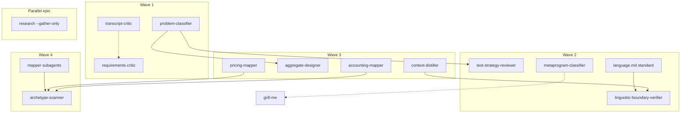

# Solution Exploration: Architekt Jutra Skills Adoption into Maister

**Research question:** How to integrate 11 adoptable AJ skills into Maister (not whether to integrate).  
**Date:** 2026-06-09  
**Task path:** `.maister/tasks/research/2026-06-09-architekt-jutra-skills-analysis/`  
**Inputs:** `analysis/synthesis.md`, `outputs/research-report.md`  
**Confidence:** High for inventory/tiers; Medium for archetype-scanner portability and localization trade-offs

---

## Problem Reframing

### Research Question

Research established that **11 of 14 AJ skills** fill genuine Maister gaps (6 high, 5 medium tier), with bundles A–E and waves 1–4 already ranked. The remaining question is **integration architecture**: how to package, expose, sequence, localize, and wire these skills into Maister's existing orchestrators and on-demand utility patterns (`grill-me`, `thermos`) without violating plugin conventions (`plugin-development.md`).

**Invariant (all alternatives must respect):**
- Edit source only in `plugins/maister/`; rebuild via `make build && make validate`
- On-demand AJ skills → plain kebab `name:` (no `maister:` prefix), directory `plugins/maister/skills/<kebab>/`
- Orchestration logic in `SKILL.md`; commands are optional thin wrappers
- Skill chains use kebab dir cross-references (`problem-classifier`, not `maister:problem-classifier`)

### How Might We Questions

| # | HMW | Decision area |
|---|-----|---------------|
| HMW-1 | How might we ship AJ value without overwhelming users with 11 new invocable surfaces? | Adoption packaging |
| HMW-2 | How might we organize commands so critique, review, and DDD modeling are discoverable? | Command surface |
| HMW-3 | How might we sequence delivery to balance immediate value vs DDD pack cohesion? | Wave sequencing |
| HMW-4 | How might we capture research-gatherer features without duplicating `maister:research`? | research-gatherer disposition |
| HMW-5 | How might we port archetype-scanner without AJ-specific subagent types? | archetype-scanner adaptation |
| HMW-6 | How might we enable linguistic-boundary-verifier without blocking Wave 1–2 delivery? | language.md convention |
| HMW-7 | How might we preserve AJ bilingual value while keeping Maister docs English-primary? | PL/EN localization |
| HMW-8 | How might we connect AJ skills to development/product-design without auto-invocation noise? | Workflow integration |

### Scope Guardrails

| In scope | Out of scope |
|----------|--------------|
| 11 adoptable skills + command/docs integration | `aj-kg-query`, `incident-diagnosis-review` (excluded) |
| Bundles A–D as documentation/sequencing concepts | Neo4j MCP, ATIF trajectory infrastructure |
| Optional hooks into `development`, `product-design`, `research` | Rewriting Maister orchestrators around DDD |
| `language.md` convention in `.maister/docs/standards/` | Party archetype mapper (not in AJ registry; defer) |
| CLAUDE.md backfill for `grill-me`/`thermos` | Editing generated `maister-cursor/` variants |

---

## Decision Area 1: Adoption Packaging Strategy

**Context:** AJ skills range from single-shot critique (`transcript-critic`, 213 lines) to multi-phase wizards (`aggregate-designer`, 540 lines) and parallel orchestration (`archetype-scanner`). Maister precedent: individual skills (`grill-me`, `thermos`) plus orchestrators (`maister:development`). Bundles A–E are already defined in research but not yet as packaging units.

### Alternative 1A: Individual skills only (grill-me pattern)

Each adoptable skill ships as its own `plugins/maister/skills/<name>/SKILL.md`. No meta-skill, no bundle artifact. Bundles documented only in CLAUDE.md as "recommended flows."

| | |
|---|---|
| **Strengths** | Matches existing Maister on-demand pattern; minimal new concepts; each skill independently versionable and testable; build/validate per skill is straightforward; aligns with `plugin-standards-porting.md` adoption checklist |
| **Weaknesses** | 11 new discovery surfaces; users may not know DDD chain order; no single "start DDD" entry point |
| **Best when** | Default adoption path; waves 1–4 incremental ship |
| **Effort** | S per skill (research estimate) |

### Alternative 1B: Bundle manifests (no meta-skill)

Individual skills as in 1A, plus lightweight `references/bundle-*.md` or a single `plugins/maister/skills/ddd-modeling-pack/references/README.md` that is **documentation-only** (not user-invocable). Lists chain topology, recommended order, and cross-refs.

| | |
|---|---|
| **Strengths** | Preserves skill independence; gives users a "pack narrative" without invocation complexity; bundle docs can live in task research artifacts and CLAUDE.md |
| **Weaknesses** | Another doc surface to maintain; users may still invoke skills out of order |
| **Best when** | Bundle B (DDD) needs guided onboarding without a wizard orchestrator |
| **Effort** | +0.5 day for bundle docs across A–D |

### Alternative 1C: Meta-skill orchestrator (`maister:ddd-modeling` or `ddd-modeling-pack`)

One user-invocable orchestrator skill that runs phases: classify → distill → map → aggregate → scan, delegating to child skills via Skill tool.

| | |
|---|---|
| **Strengths** | Single entry point for DDD workflow; mirrors AJ course flow; state file could track phase progress |
| **Weaknesses** | Violates "standalone invocable" research goal for individual skills; duplicates orchestrator pattern already covered by `development`; high maintenance; child skills still needed underneath; conflicts with principle that commands/skills stay thin |
| **Best when** | Product decision to sell "Maister DDD course replacement" as one workflow |
| **Effort** | M–L (new orchestrator + state schema) |

### Alternative 1D: Hybrid — individual skills + optional "guided chain" section in each SKILL.md

Each skill ships standalone. High-traffic skills (`problem-classifier`, `context-distiller`) include a **"Recommended next steps"** section with explicit Skill-tool handoff phrases and sibling skill names. No meta-skill.

| | |
|---|---|
| **Strengths** | Best of 1A + 1B; chain preserved at point of use; no extra orchestrator; matches AJ cross-ref pattern already in source SKILL.md |
| **Weaknesses** | Chain logic scattered across multiple files; updating topology requires touching several skills |
| **Best when** | **Recommended default** — balances discoverability and Maister conventions |
| **Effort** | S (port-time edit, no new artifact type) |

### Recommendation (Area 1)

**Adopt Alternative 1D (hybrid individual skills with chain sections).** Reject meta-skill orchestrator (1C) unless product later demands a packaged DDD course workflow. Optionally add bundle README in CLAUDE.md "Recommended flows" subsection (1B content, not a new skill directory).

---

## Decision Area 2: Command Surface Organization

**Context:** Maister has 8 commands today: `quick-*` (plan, dev, bugfix), `reviews-*` (5). `grill-me` and `thermos` have **no commands** — description-triggered only. Research proposed `quick-*` for critique/classification and `reviews-*` for read-only audits, plus new `modeling-*` for DDD pack.

### Alternative 2A: Skill-only (no new commands)

All AJ ports ship as skills only, like `grill-me`. Users invoke via natural language or Skill tool when triggers match.

| | |
|---|---|
| **Strengths** | Zero command proliferation; fastest port; matches 2 of 3 Maister utility precedents |
| **Weaknesses** | Poor discoverability in `/maister:` command list; critique skills may auto-trigger without `disable-model-invocation` |
| **Best when** | Wave 1 pilot before command naming is finalized |
| **Effort** | Lowest |

### Alternative 2B: Category-aligned commands (research proposal)

| Category | Commands | Skills |
|----------|----------|--------|
| `quick-*` | `quick-requirements-critic`, `quick-transcript-critic`, `quick-problem-classifier`, `quick-metaprogram-classifier` | Critique + classification + stakeholder |
| `reviews-*` | `reviews-test-strategy`, `reviews-linguistic-boundaries` | Read-only audits |
| `modeling-*` | `modeling-context-distiller`, `modeling-aggregate-designer`, `modeling-accounting-mapper`, `modeling-pricing-mapper`, `modeling-archetype-scanner` | DDD transformation pack |

`metaprogram-classifier` could be `quick-metaprogram-classifier` (stakeholder prep) or skill-only paired with `grill-me`.

| | |
|---|---|
| **Strengths** | Clear mental model: quick = interactive/on-demand, reviews = read-only audit, modeling = DDD; flat `commands/` layout compliant; discoverable in plugin command index |
| **Weaknesses** | +10–12 new command files; some redundancy with skill triggers; `modeling-*` is a new prefix to document |
| **Best when** | **Recommended default** for production adoption |
| **Effort** | ~1 hour per thin command |

### Alternative 2C: Consolidated commands (fewer wrappers)

| Command | Delegates to |
|---------|--------------|
| `quick-requirements-quality` | User picks transcript vs requirements critic via AskUserQuestion |
| `reviews-architecture` | User picks linguistic boundaries vs test strategy |
| `modeling-ddd` | User picks classifier / distiller / mapper / designer / scanner |

| | |
|---|---|
| **Strengths** | Only 3 new commands; simpler CLAUDE.md table |
| **Weaknesses** | Extra gate question on every invocation; hides specific rubrics; breaks thin-wrapper clarity; harder to script/CI invoke specific skill |
| **Best when** | Strict command budget (e.g., Kiro merged command model) |
| **Effort** | S for commands, but worse UX |

### Alternative 2D: `reviews-*` only for read-only; everything else skill-only

Commands only for `test-strategy-reviewer` and `linguistic-boundary-verifier` (parity with existing 5 review commands). Critique and modeling skills remain skill-only with `disable-model-invocation`.

| | |
|---|---|
| **Strengths** | Extends existing reviews family without inventing `modeling-*`; critique skills protected by explicit-only |
| **Weaknesses** | DDD pack less visible in command list; uneven discoverability |
| **Best when** | Minimal command surface priority |
| **Effort** | 2 commands |

### Recommendation (Area 2)

**Adopt Alternative 2B (category-aligned commands)** with one nuance: ship **Wave 1 commands immediately** (`quick-requirements-critic`, `quick-transcript-critic`, `quick-problem-classifier`); add `reviews-*` and `modeling-*` per wave. Keep `grill-me`/`thermos` as skill-only precedent — no retroactive commands. Document `modeling-*` as new category in `plugin-development.md` standards update.

**Command naming for mappers:** prefer `modeling-accounting-archetype` and `modeling-pricing-archetype` (shorter than full AJ dir names) with body text referencing full skill paths.

---

## Decision Area 3: Wave Sequencing and Scope

**Context:** Research roadmap: Wave 1 (3 skills, 3×S), Wave 2 (3 skills), Wave 3 (4 skills), Wave 4 (archetype-scanner, M/L). Alternative is big-bang DDD pack (all modeling skills in one epic).

### Alternative 3A: Strict phased waves (research roadmap)

| Wave | Skills | Rationale |
|------|--------|-----------|
| 1 | requirements-critic, transcript-critic, problem-classifier | Immediate value, zero deps |
| 2 | test-strategy-reviewer, linguistic-boundary-verifier, metaprogram-classifier | Reviews + stakeholder; language.md convention |
| 3 | context-distiller, aggregate-designer, 2× mappers | DDD core; depends on classifier |
| 4 | archetype-scanner | Registry + parallel agents |

| | |
|---|---|
| **Strengths** | Risk spread; early user feedback; Wave 1 shippable in ~3 days; aligns with synthesis effort table |
| **Weaknesses** | DDD pack incomplete until Wave 3–4; partial chain may frustrate power users |
| **Best when** | **Recommended default** |
| **Effort** | ~12–15 days total per research |

### Alternative 3B: Wave 1 only + pause for validation

Ship only Bundle A + problem-classifier; gather adoption metrics before Wave 2–4.

| | |
|---|---|
| **Strengths** | Minimal scope; validates port pipeline and PL/EN handling; low merge risk |
| **Weaknesses** | Delays architecture review and full DDD value; may lose momentum |
| **Best when** | Uncertain maintainer bandwidth or need proof before DDD investment |
| **Effort** | 3×S |

### Alternative 3C: Big-bang DDD pack (Waves 1+3+4 batched)

Ship all modeling skills together in one development epic (7 skills), critique/review waves separate.

| | |
|---|---|
| **Strengths** | Complete DDD chain at launch; better demo narrative; one CLAUDE.md "DDD Modeling Pack" announcement |
| **Weaknesses** | Large PR; archetype-scanner blocks on registry work; delayed requirements critique value; higher review burden |
| **Best when** | Dedicated sprint with DDD focus and archetype-scanner design pre-resolved |
| **Effort** | ~8–10 days in one batch + scanner risk |

### Alternative 3D: Parallel tracks

Track A: Requirements quality (Waves 1 critique skills) — immediate. Track B: DDD pack (Waves 1 classifier + 3 + 4) — parallel team. Track C: Reviews (Wave 2) — after language.md standard.

| | |
|---|---|
| **Strengths** | Maximizes parallelism for multiple contributors |
| **Weaknesses** | CLAUDE.md and command table churn; version skew between tracks |
| **Best when** | Multiple maintainers |
| **Effort** | Same total, faster calendar time |

### Recommendation (Area 3)

**Adopt Alternative 3A (strict phased waves)** with **3B gate optional**: after Wave 1 merge, optional 1–2 week validation before Wave 2 commit. Do **not** big-bang DDD (3C) unless archetype-scanner design (Area 5) is resolved first. Bundle A and problem-classifier can ship as **first PR**; Bundle C skills in Wave 2 can ship before Wave 3 if linguistic-boundary-verifier waits on `language.md` standard (Area 6).

---

## Decision Area 4: research-gatherer Disposition

**Context:** `research-gatherer` scored Low (16/30): substantial overlap with `maister:research` Phase 1–2. Unique features: declarative conclusion tagging, actor-map, rejected-info audit trail; stops before synthesis.

### Alternative 4A: Do not port; ignore

No changes to Maister research skill.

| | |
|---|---|
| **Strengths** | Zero effort; avoids orchestrator duplication |
| **Weaknesses** | Loses actor-map and rejected-info audit; gather-only mode still requires manual Phase 1 stop |
| **Best when** | Research orchestrator already sufficient for team |
| **Effort** | None |

### Alternative 4B: Embed `--gather-only` in `maister:research` (research recommendation)

Extend research orchestrator with flag: run Phase 1 parallel gatherers, merge findings, **skip synthesis/brainstorm/design** phases. Optionally port rubric fragments (actor-map, rejected-info) into `information-gatherer` agent or research Phase 1 references.

| | |
|---|---|
| **Strengths** | Single research entry point; preserves orchestrator state model; matches synthesis §5 Defer row; no new top-level skill |
| **Weaknesses** | Touches core orchestrator; needs phase-skip logic and docs; Kiro/Cursor transforms must handle new flag |
| **Best when** | **Recommended default** |
| **Effort** | M (orchestrator + agent reference updates) |

### Alternative 4C: Port as internal engine skill (`user-invocable: false`)

`research-gatherer-lite` engine invoked only by research orchestrator when `--gather-only`; not in CLAUDE.md user tables.

| | |
|---|---|
| **Strengths** | Preserves AJ SKILL.md largely intact; clear separation from `maister:research` user surface |
| **Weaknesses** | Another internal skill; overlap with `information-gatherer` agent; maintenance of two gather patterns |
| **Best when** | AJ gather rubric is large and distinct from information-gatherer |
| **Effort** | M |

### Alternative 4D: Port as standalone on-demand skill

Full `research-gatherer` as user-invocable skill like AJ.

| | |
|---|---|
| **Strengths** | Parity with AJ repo |
| **Weaknesses** | Research report explicitly rejects; confuses users vs `/maister:research`; duplicate discovery |
| **Best when** | Not recommended |
| **Effort** | S port, high product debt |

### Recommendation (Area 4)

**Adopt Alternative 4B (`--gather-only` on `maister:research`)** as a **separate small epic after Wave 1**, cherry-picking actor-map and rejected-info patterns into Phase 1 references. Reject standalone port (4D). If rubric size warrants isolation, fallback to 4C — not 4A.

---

## Decision Area 5: archetype-scanner Adaptation

**Context:** Scanner orchestrates parallel fit assessment per archetype registry entry; AJ uses hard-coded `subagent_type` and merge agent. Maister has `thermos` parallel pattern and Task tool. Confidence **Medium** on portability; party mapper referenced in templates but not in registry (2 mappers: accounting, pricing).

### Alternative 5A: Inline registry in SKILL.md

Registry as markdown table inside `archetype-scanner/SKILL.md`: archetype name → skill path → fit criteria summary. Main agent launches parallel Task calls with instructions to load mapper skill rubric inline (no new subagent files).

| | |
|---|---|
| **Strengths** | No new agents; fastest Wave 4 delivery; registry visible in one file; matches thermos "launch parallel subagents" pattern |
| **Weaknesses** | Large SKILL.md growth if registry expands; merge logic stays in parent skill (complexity) |
| **Best when** | 2-archetype registry stable |
| **Effort** | M |

### Alternative 5B: New Maister subagents per mapper + scanner agent

Create `accounting-archetype-mapper-subagent.md`, `pricing-archetype-mapper-subagent.md`, `archetype-scanner-merge-subagent.md` with skill preload in frontmatter (thermo-nuclear pattern).

| | |
|---|---|
| **Strengths** | Clean delegation; explicit tool whitelists; easier parallel Task calls; aligns with plugin agent size targets |
| **Weaknesses** | +3 agent files; build transform overhead; mapper skills still needed for interactive mode |
| **Best when** | **Recommended default** for production quality |
| **Effort** | M–L |

### Alternative 5C: Defer archetype-scanner entirely

Ship mappers as standalone; users run accounting and pricing mappers manually. Document "future: parallel scan."

| | |
|---|---|
| **Strengths** | Avoids Medium/L uncertainty; Waves 1–3 deliver 10/11 skills |
| **Weaknesses** | Loses AJ orchestration value; parallel fit comparison manual |
| **Best when** | Wave 4 blocked on agent architecture decisions |
| **Effort** | Zero for scanner |

### Alternative 5D: Reuse `thermos` infrastructure

Extend `thermos` or add `thermos-archetype` variant that runs mapper rubrics instead of branch review.

| | |
|---|---|
| **Strengths** | Reuses known parallel pattern |
| **Weaknesses** | Conceptual mismatch (fit assessment ≠ code review); pollutes thermos semantics |
| **Best when** | Not recommended |
| **Effort** | M with confusion debt |

### Recommendation (Area 5)

**Adopt Alternative 5B (new subagents + scanner orchestration in skill)** with registry YAML or table in `references/archetype-registry.md`. **Defer scanner to Wave 4** after mappers proven (5C as fallback if blocked). Do not add party mapper until AJ registry includes it. Fix aggregate-designer cross-ref typo (`problem-class-classifier` → `problem-classifier`) during Wave 3 port.

---

## Decision Area 6: language.md Convention

**Context:** `linguistic-boundary-verifier` requires per-module `language.md` describing bounded-context vocabulary. Maister has no convention today. Wave 2 ships this skill; blocker if convention undefined.

### Alternative 6A: Standard first (publish before Wave 2 skill)

Add `.maister/docs/standards/global/language-md-convention.md` (or section in architecture standards): file location, template, examples, optional vs required. Wave 2 verifier references standard via INDEX.md.

| | |
|---|---|
| **Strengths** | Skill works on real projects; init/standards-discover can detect gaps; positions Maister as DDD-aware |
| **Weaknesses** | Upfront doc work before verifier ships; teams must adopt convention |
| **Best when** | **Recommended default** |
| **Effort** | M (standard + INDEX) |

### Alternative 6B: Ship skill without convention (graceful degradation)

Verifier runs; if no `language.md` found, outputs "convention not adopted" report with instructions to create files manually.

| | |
|---|---|
| **Strengths** | Wave 2 not blocked; skill still educates users |
| **Weaknesses** | Limited value until convention exists; may feel broken on first use |
| **Best when** | Parallel track with 6A — ship skill with degradation while standard is written |
| **Effort** | S for skill; standard still needed for full value |

### Alternative 6C: Generator skill (`language-md-generator`)

New on-demand skill scans module and drafts `language.md` from code/comments/strings.

| | |
|---|---|
| **Strengths** | Reduces adoption friction; pairs with verifier (discovery → verification loop) |
| **Weaknesses** | New skill to build/maintain; quality of auto-generated glossary varies |
| **Best when** | Wave 2.5 or post-Wave 2 enhancement |
| **Effort** | M |

### Alternative 6D: Embed in `maister:init` / standards-discover

Auto-create stub `language.md` per detected module during init or standards-discover.

| | |
|---|---|
| **Strengths** | Convention spread automatically |
| **Weaknesses** | Init scope creep; stubs may be wrong; not all projects want DDD files |
| **Best when** | Optional init flag `--language-md` |
| **Effort** | M |

### Recommendation (Area 6)

**Adopt 6A + 6B in parallel:** publish standard early in Wave 2 prep; ship verifier with graceful degradation. **Plan 6C (generator skill)** as optional Wave 2.5 — do not block Wave 2 on it. Consider 6D as future `init` optional flag, not default.

---

## Decision Area 7: Polish/English Localization Strategy

**Context:** AJ skills mix PL/EN: requirements-critic bilingual; metaprogram-classifier Polish marker examples; transcript-critic EN-native; several PL/EN descriptions. Maister plugin docs are English-primary; build transforms target multi-platform.

### Alternative 7A: Preserve AJ bilingual bodies (minimal edit)

Port SKILL.md bodies as-is; retain Polish examples where pedagogically valuable; frontmatter `description` English-primary for discovery.

| | |
|---|---|
| **Strengths** | Faithful port; low risk of losing nuance; Polish teams keep AJ course parity |
| **Weaknesses** | Inconsistent UX for English-only users; longer tokens; Copilot/Cursor may favor English descriptions only |
| **Best when** | **Recommended default for Wave 1–3** |
| **Effort** | S |

### Alternative 7B: English-primary rewrite

Translate all instructional text to English; Polish examples moved to `references/pl-examples.md`.

| | |
|---|---|
| **Strengths** | Consistent Maister voice; smaller main SKILL.md |
| **Weaknesses** | High port effort; loses inline bilingual probes; maintainer must speak both languages |
| **Best when** | Global English-only product positioning |
| **Effort** | L per skill for quality translation |

### Alternative 7C: Split locale files

`SKILL.md` English + `references/SKILL.pl.md` or platform-specific build transform for Polish Cursor users.

| | |
|---|---|
| **Strengths** | Clean separation; build pipeline could select locale |
| **Weaknesses** | No existing Maister locale transform; double maintenance; not in build.sh today |
| **Best when** | Future if multi-locale plugin builds are prioritized |
| **Effort** | L infrastructure + M per skill |

### Alternative 7D: User language at invocation

Skill asks preferred language via AskUserQuestion first step; outputs in chosen language.

| | |
|---|---|
| **Strengths** | One skill file; runtime flexibility |
| **Weaknesses** | Extra gate; examples still mixed in rubric |
| **Best when** | Supplement to 7A for critique skills |
| **Effort** | S per interactive skill |

### Recommendation (Area 7)

**Adopt 7A (preserve bilingual with English-primary frontmatter)** plus **7D for interactive skills** (requirements-critic, problem-classifier, metaprogram-classifier): optional language preference at start. Do not invest in 7C until build pipeline supports locale. Document localization choice in ported skill PR template.

---

## Decision Area 8: Integration with Existing Maister Workflows

**Context:** Development orchestrator has Phase 1 requirements clarification, Phase 5 spec creation — but no critique pass. Product-design ingests transcripts; no decision-process audit. Risk: auto-invocation of critique skills during requirements writing.

### Alternative 8A: Standalone only (no orchestrator hooks)

AJ skills invocable only via explicit user request, commands, or Skill tool. No changes to `development`, `product-design`, or `research` SKILL.md.

| | |
|---|---|
| **Strengths** | Zero orchestrator risk; `disable-model-invocation` on critique skills prevents accidents; fastest adoption |
| **Weaknesses** | Users may not discover skills during natural workflow; value left on table |
| **Best when** | Wave 1; **baseline default** |
| **Effort** | None |

### Alternative 8B: Soft suggestions in orchestrator phase text

Phase 1/5 of `development` and product-design add optional bullet: "After requirements draft, user may invoke `requirements-critic` or `transcript-critic`" — no auto Skill invocation.

| | |
|---|---|
| **Strengths** | Discovery without behavior change; aligns with Maister "principles not prescriptions" |
| **Weaknesses** | Easy to ignore; slight SKILL.md growth |
| **Best when** | **Recommended after Wave 1** |
| **Effort** | S (doc-only edits) |

### Alternative 8C: Optional phase hooks (`--requirements-critic`, `--ddd-classify`)

Orchestrator flags trigger sub-skill after Phase 5 or before spec audit. State file records optional phase completion.

| | |
|---|---|
| **Strengths** | Integrated SDLC; repeatable quality gates |
| **Weaknesses** | Orchestrator complexity; phase count inflation; resume/state testing burden; violates "standalone invocable" simplicity |
| **Best when** | Mature adoption with proven skill value |
| **Effort** | M–L per orchestrator |

### Alternative 8D: implementation-verifier extension

Add optional verification subagent hooks: `test-strategy-reviewer` after test suite; linguistic verifier in architecture-heavy tasks.

| | |
|---|---|
| **Strengths** | Fits read-only review pattern; parallels existing reviews-code delegation |
| **Weaknesses** | Verifier already heavy; wrong phase for requirements critique |
| **Best when** | Wave 2 for test-strategy-reviewer only |
| **Effort** | M |

### Alternative 8E: product-design hard integration

After transcript ingest, auto-offer transcript-critic gate before brief convergence.

| | |
|---|---|
| **Strengths** | Natural fit for meeting-heavy design workflow |
| **Weaknesses** | Changes product-design UX; may slow design flow |
| **Best when** | Bundle A promoted as product-design companion |
| **Effort** | M |

### Recommendation (Area 8)

**Wave 1: 8A (standalone only)** with `disable-model-invocation: true` on requirements-critic and transcript-critic. **Wave 2+: 8B (soft suggestions)** in development Phase 5 and product-design transcript phases. **8E optional** for product-design only (transcript-critic suggestion). Defer **8C** until user demand. **8D** for `test-strategy-reviewer` only — optional mention in implementation-verifier references, not automatic invocation.

**grill-me pairing:** Document in CLAUDE.md Bundle D flow (metaprogram-classifier → grill-me) without wiring orchestrators.

---

## Cross-Area Dependency Map

---

## Consolidated Recommendations Summary

| Area | Recommendation | Priority |
|------|----------------|----------|
| 1 Packaging | Individual skills + chain sections in SKILL.md (1D); no meta-orchestrator | Wave 1 |
| 2 Commands | Category-aligned: `quick-*`, `reviews-*`, `modeling-*` (2B); per wave | Wave 1 starts with 3 quick commands |
| 3 Waves | Strict phased waves 1–4 (3A); optional pause after Wave 1 (3B) | Ongoing |
| 4 research-gatherer | `--gather-only` on `maister:research` (4B); separate epic | After Wave 1 |
| 5 archetype-scanner | New subagents + registry reference (5B); Wave 4; defer if blocked (5C) | Wave 4 |
| 6 language.md | Standard first + graceful degradation (6A+6B); generator later (6C) | Wave 2 prep |
| 7 Localization | Preserve bilingual bodies, EN frontmatter (7A); language ask on interactive (7D) | Wave 1 port |
| 8 Workflow integration | Standalone + explicit-only Wave 1 (8A); soft suggestions Wave 2+ (8B) | Wave 1 then 2 |

---

## Suggested Implementation Epics (Post-Decision)

| Epic | Scope | Depends on |
|------|-------|------------|
| **E1: Wave 1 — Requirements & Classification** | 3 skills, 3 commands, CLAUDE.md entries, grill-me/thermos backfill | None |
| **E2: language.md standard** | Standard doc + INDEX | None (parallel with E1) |
| **E3: Wave 2 — Review & Stakeholder** | 3 skills, 2–3 commands, development soft suggestions | E2 for full LBV value |
| **E4: Wave 3 — DDD core** | 4 skills, 4 modeling commands, cross-ref fixes | E1 problem-classifier |
| **E5: Wave 4 — archetype-scanner** | Scanner skill, 3 agents, registry | E4 mappers |
| **E6: research gather-only** | `maister:research` flag + Phase 1 rubric fragments | None |

**Estimated calendar:** E1 ~3 days → E2 parallel ~2 days → E3 ~4 days → E4 ~4 days → E5 ~3 days → E6 ~2 days.

---

## Open Decisions for Product/User Confirmation

1. **Pause after Wave 1?** Ship 3 skills and validate before Wave 2 commit.
2. **metaprogram-classifier command?** `quick-metaprogram-classifier` vs skill-only + grill-me pairing doc.
3. **product-design transcript-critic suggestion?** Soft integration (8E) in same release as Wave 1 or Wave 2.
4. **language.md generator priority?** Wave 2.5 vs defer to separate research task.
5. **Party archetype mapper** — wait for AJ registry or omit from scanner registry indefinitely.

---

## Evidence Index

| Recommendation | Primary evidence |
|----------------|----------------|
| 11 adoptable / waves | `outputs/research-report.md` §4, §7; `analysis/synthesis.md` §5 |
| grill-me / thermos pattern | `analysis/findings/maister-skills-baseline.md`; `plugin-standards-porting.md` |
| Command categories | `plugin-standards-porting.md` §3; research-report §6 bundles |
| research-gatherer defer | synthesis §5; research-report Bundle E |
| archetype-scanner medium confidence | synthesis §7 Q4–Q5; research-report §9 |
| disable-model-invocation | synthesis §2.2; plugin-standards-porting.md §2 |
| No edit generated plugins | `.maister/docs/standards/global/plugin-development.md` |

---

*Document generated for solution-brainstorming phase. Next step: user selects alternatives per area → `/maister:development` epic E1 (Wave 1) or solution-designer for ADR-level decisions.*
