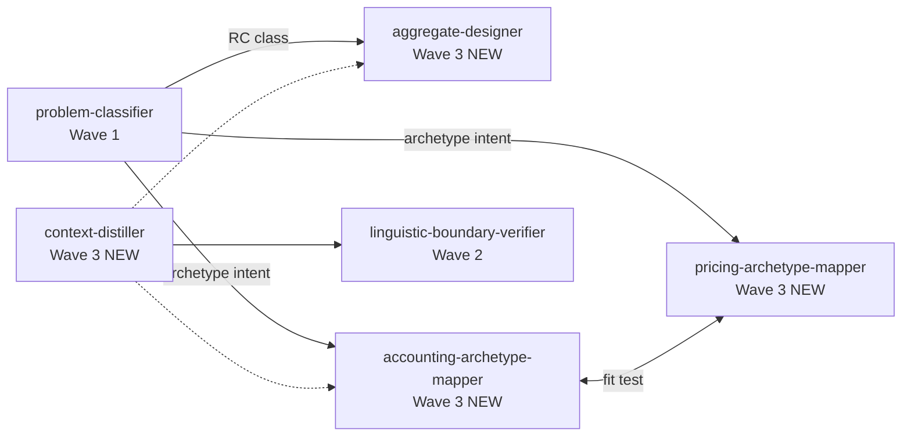

# Codebase Analysis: AJ Skills Wave 3 (Epic E4)

**Task:** `.maister/tasks/development/2026-06-16-aj-skills-wave3`  
**Date:** 2026-06-16  
**Phase:** 1 — Codebase analysis  
**primary_language:** Markdown

---

## Executive Summary

Wave 3 ports four DDD transformation skills from Architekt Jutra (AJ) into `plugins/maister/`. Waves 1–2 already established a repeatable port pattern (plain kebab skill names, invocation guards, language gates, thin commands, chain sections, Kiro build transforms, Makefile count rules). All four AJ source files exist and are self-contained (~483–591 lines each). Wave 3 skills do **not** yet exist under `plugins/maister/skills/`, but downstream stubs already reference them (`problem-classifier`, `linguistic-boundary-verifier`). Implementation is primarily a copy-adapt-build exercise plus cross-ref activation, new `modeling-*` command category, Bundle B documentation, and build-pipeline counter updates (26→30 source skills; Kiro 63→67 total / 38→42 `maister-*`).

---

## Task Scope (Epic E4)

| Deliverable | Count | Notes |
|-------------|-------|-------|
| Skills | 4 | `context-distiller`, `aggregate-designer`, `accounting-archetype-mapper`, `pricing-archetype-mapper` |
| Commands | 4 | `modeling-context-distiller`, `modeling-aggregate-designer`, `modeling-accounting-archetype`, `modeling-pricing-archetype` |
| Docs | CLAUDE.md, README.md, `plugin-development.md` | Bundle B + Modeling Commands section |
| Cross-ref fixes | 2+ skills | Activate Wave 3 stubs; fix AJ typos |
| Build | `make build && make validate` | Kiro counts, merge_one, sedi, tests |

**Out of scope (Wave 4 / E5):** `archetype-scanner`, subagents, `modeling-archetype-scanner`, `references/archetype-registry.md`.

---

## Current State

### Source plugin (`plugins/maister/`)

| Metric | Current | After Wave 3 |
|--------|---------|--------------|
| Skill directories | 26 | 30 |
| Command files | 12 | 16 |
| AJ skills ported (Waves 1–2) | 6 | — |
| AJ skills pending (Wave 3) | 0 of 4 | 4 of 4 |

**Wave 1 skills (E1):** `requirements-critic`, `transcript-critic`, `problem-classifier`  
**Wave 2 skills (E2/E3):** `test-strategy-reviewer`, `linguistic-boundary-verifier`, `metaprogram-classifier`

**Wave 3 skills:** None present under `plugins/maister/skills/`.

### Generated variants

Per `CLAUDE.md` / `plugin-development.md`: never edit `plugins/maister-cursor/`, `maister-copilot/`, `maister-kiro/` directly. Generated copies already contain Wave 3 **stubs** (e.g. "Wave 3 — not yet available") copied from source — they will update on `make build`.

---

## Port Template (Established by Waves 1–2)

Derived from Wave 1 work log (`.maister/tasks/development/2026-06-13-aj-skills-wave1-adoption/implementation/work-log.md`), Wave 2 work log, and existing skill/command files.

### 1. Skill directory + `SKILL.md`

```
plugins/maister/skills/<kebab-name>/SKILL.md
```

**Frontmatter pattern (on-demand AJ skills):**

```yaml
---
name: <kebab-name>                    # NO maister: prefix (Makefile Rule 3 for Kiro validates this on generated output)
description: <English-primary description with trigger phrases>
disable-model-invocation: true        # Optional: explicit-only critique/review skills only
argument-hint: "[domain description or ...]"
---
```

**Wave 3 nuance:** Interactive modeling wizards (`context-distiller`, `aggregate-designer`, mappers) likely **omit** `disable-model-invocation` (same as `metaprogram-classifier`, `problem-classifier`). AJ bodies are bilingual PL/EN; add **Language Preference** gate (`AskUserQuestion`) per Wave 2 convention.

**Body adaptations from AJ source:**

| AJ artifact | Maister adaptation |
|-------------|-------------------|
| `name: maister:context-distiller` | Strip to `name: context-distiller` |
| `name: maister:aggregate-designer` | Strip to `name: aggregate-designer` |
| `maister:problem-class-classifier` | Fix → `problem-classifier` |
| `maister:*` cross-refs in body | Plain kebab skill names |
| Course-specific paths | Remove or generalize |
| Missing invocation guard | Add guard block (Wave 1–2 pattern) |
| Missing chain section | Add `## Recommended next steps` |

**Invocation guard template** (from `problem-classifier`, `metaprogram-classifier`):

```markdown
**Invocation guard**: This skill activates ONLY when the user explicitly asks for ...
Trigger phrases: "...", "...", ...

Do NOT invoke when ...
```

**Chain section template** (from `problem-classifier`, `metaprogram-classifier`, `linguistic-boundary-verifier`):

```markdown
## Recommended next steps

| Condition | Next skill | Notes |
|-----------|-----------|-------|
| RC class detected | `aggregate-designer` | ... |

When `<skill>` completes, invoke `<next-skill>` with ... as context.
```

### 2. Thin command wrapper

```
plugins/maister/commands/modeling-<stem>.md
```

**Pattern** (from `quick-problem-classifier.md`, `reviews-test-strategy.md`):

```markdown
---
name: maister:modeling-context-distiller
description: <one-line purpose>
---

**ACTION REQUIRED**: This command delegates to a skill. Invoke the `context-distiller` skill via the Skill tool NOW with the user's command arguments. Do not execute the modeling yourself.

Invoke Skill tool:
  skill: "context-distiller"
  args: "[user arguments from command]"
```

**ADR-002 naming (decision-log):**

| Command file | Skill |
|--------------|-------|
| `modeling-context-distiller.md` | `context-distiller` |
| `modeling-aggregate-designer.md` | `aggregate-designer` |
| `modeling-accounting-archetype.md` | `accounting-archetype-mapper` |
| `modeling-pricing-archetype.md` | `pricing-archetype-mapper` |

### 3. CLAUDE.md updates

- Add 4 rows to **Available Skills** (new subsection or extend "Requirements & Modeling Skills").
- Add **Bundle B — DDD modeling flow** (currently missing; Bundles A, C, D exist).
- Add **Modeling Commands** table (new section between Review and Quick, or under Requirements & Modeling).
- Document chain topology per high-level design:

```
problem-classifier → context-distiller → mappers / aggregate-designer → linguistic-boundary-verifier
```

### 4. README.md

- Add 4 command rows to command table.
- Add **Bundle B** paragraph (mirror CLAUDE.md).

### 5. Standards

Update `.maister/docs/standards/global/plugin-development.md`:

- Extend command category list: `reviews-*`, `quick-*`, **`modeling-*`**
- Note DDD transformation skills use `modeling-*` prefix

*(Optional: update `.maister/docs/INDEX.md` if standards change is substantive — Wave 2 added `language-md-convention` similarly.)*

### 6. Build pipeline (Kiro-specific)

From Wave 1–2 work logs and `platforms/kiro-cli/build.sh`:

| Change | Location | Details |
|--------|----------|---------|
| `merge_one` | `build.sh` ~L45–67 | 4 new entries: `modeling-*` → `maister-modeling-*` |
| `skills_needing_args` | `build.sh` ~L183–216 | Add 8 entries (4 skills + 4 merged commands) |
| `apply_delegation_transforms` sedi | `build.sh` ~L293–320 | Wave 3 skill names + `run \`...\`` patterns |
| Makefile rules 14/28 | `Makefile` | 63→**67**, 38→**42** |
| Kiro tests | `build-core.test.sh`, `validation.test.sh` | Update expected counts |
| Merged command assertions | `build-core.test.sh` | Add 4 `maister-modeling-*` SKILL.md checks |

**Pre-existing partial prep:** Kiro `build.sh` already has:

```bash
sedi 's|run `context-distiller`|run `maister-context-distiller`|g' "$f"
```

Missing analogous transforms for `aggregate-designer`, `accounting-archetype-mapper`, `pricing-archetype-mapper`, plus full Wave 3 delegation block (skill/backtick/skill: JSON patterns).

**Cursor / Copilot:** No skill-count validation rules; `make build` copies source with platform transforms only. Lower risk than Kiro.

### 7. Verification gate

```bash
make build && make validate
```

Wave 2 baseline: exit 0; Kiro 63 skill dirs, 25 shortcuts, 38 `maister-*` dirs.

---

## AJ Source Availability

**Repository:** `/Users/mrapacz/Projects/architekt-jutra-code` (read-only reference, not distributed)

| Skill | AJ path | Lines | Frontmatter | Port notes |
|-------|---------|-------|-------------|------------|
| `context-distiller` | `week7/4-uogolnienie-demo/context-distiller/SKILL.md` | 483 | `maister:context-distiller` | Strip prefix; fix `problem-class-classifier` ref; add invocation guard + language gate |
| `aggregate-designer` | `week7/6-jednostkispojnosci-demo/aggregate-designer/SKILL.md` | 540 | `maister:aggregate-designer` | Strip prefix; fix `maister:problem-class-classifier` → `problem-classifier`; multi-phase wizard |
| `accounting-archetype-mapper` | `week7/5-znanewzorce-demo/accounting-archetype-mapper/SKILL.md` | 547 | plain name | Cross-ref to `pricing-archetype-mapper`; fit test hard stop |
| `pricing-archetype-mapper` | `week7/5-znanewzorce-demo/pricing-archetype-mapper/SKILL.md` | 591 | plain name | Cross-ref to `accounting-archetype-mapper`; fit test hard stop |

**Supporting AJ artifacts (reference only, not ported in Wave 3):**

- `week7/5-znanewzorce-demo/archetype-scanner/SKILL.md` — Wave 4
- `week9/AJ-dotnet/noesis/archetype/pricing.md` — domain example, not skill source

**AJ cross-skill relationships to preserve:**

```
context-distiller ──► linguistic-boundary-verifier (verify boundaries after discovery)
context-distiller ──► accounting-archetype-mapper / aggregate-designer (notes section)
problem-classifier ──(RC)──► aggregate-designer
accounting-archetype-mapper ◄──► pricing-archetype-mapper (mutual fit-test redirects)
```

---

## Key Files

### Files to create (8)

| File | Purpose |
|------|---------|
| `plugins/maister/skills/context-distiller/SKILL.md` | Strategic design / bounded context distillation |
| `plugins/maister/skills/aggregate-designer/SKILL.md` | RC consistency unit wizard |
| `plugins/maister/skills/accounting-archetype-mapper/SKILL.md` | Value-tracking ledger mapping |
| `plugins/maister/skills/pricing-archetype-mapper/SKILL.md` | Computed price archetype mapping |
| `plugins/maister/commands/modeling-context-distiller.md` | Thin command |
| `plugins/maister/commands/modeling-aggregate-designer.md` | Thin command |
| `plugins/maister/commands/modeling-accounting-archetype.md` | Thin command |
| `plugins/maister/commands/modeling-pricing-archetype.md` | Thin command |

### Files to modify (integration + build)

| File | Change |
|------|--------|
| `plugins/maister/skills/problem-classifier/SKILL.md` | Activate `aggregate-designer` chain; update archetype mapper refs from "Wave 4 — not yet ported" → live skills |
| `plugins/maister/skills/linguistic-boundary-verifier/SKILL.md` | Remove "Wave 3 — not yet available" from `context-distiller` refs (2 locations) |
| `plugins/maister/CLAUDE.md` | Skills table, Bundle B, Modeling Commands section |
| `README.md` | Command rows + Bundle B |
| `.maister/docs/standards/global/plugin-development.md` | Document `modeling-*` category |
| `platforms/kiro-cli/build.sh` | merge_one, skills_needing_args, Wave 3 sedi transforms |
| `Makefile` | Rules 14/28 count thresholds |
| `platforms/kiro-cli/tests/build-core.test.sh` | Skill dir counts + merged command file checks |
| `platforms/kiro-cli/tests/validation.test.sh` | Rule 14/28 count test |

### Reference files (read-only during port)

| File | Why |
|------|-----|
| `plugins/maister/skills/problem-classifier/SKILL.md` | Chain section + routing table pattern |
| `plugins/maister/skills/metaprogram-classifier/SKILL.md` | Language gate + Recommended next steps |
| `plugins/maister/skills/linguistic-boundary-verifier/SKILL.md` | Paired skill stub pattern to reverse |
| `plugins/maister/commands/quick-problem-classifier.md` | Command delegation template |
| `.maister/tasks/development/2026-06-14-aj-skills-wave2-adoption/implementation/work-log.md` | Wave 2 port checklist |
| `.maister/tasks/development/2026-06-13-aj-skills-wave1-adoption/implementation/work-log.md` | Wave 1 port checklist + verification fixes |
| `.maister/tasks/development/2026-06-16-aj-skills-wave3/analysis/research-context/high-level-design.md` | ADR-002 command names, Bundle B topology |
| `.maister/tasks/development/2026-06-16-aj-skills-wave3/analysis/research-context/decision-log.md` | Wave scope, modeling-* ADR |

---

## Integration Points

### 1. `problem-classifier` — upstream chain hub

**File:** `plugins/maister/skills/problem-classifier/SKILL.md`

Current stubs to activate:

| Location | Current text | Wave 3 action |
|----------|--------------|---------------|
| Routing table L19–20 | `accounting-archetype-mapper` (Wave 4 — not yet ported) | Remove deferral; point to live skill |
| Routing table L20 | `pricing-archetype-mapper` (Wave 4 — not yet ported) | Remove deferral |
| Recommended next steps L507–509 | `aggregate-designer` Wave 3 — not yet ported | Activate handoff instructions |

**Inconsistency to resolve:** Task E4 / research Wave 3 includes **both** mappers and designer, but `problem-classifier` labels mappers as Wave 4. Align all refs to Wave 3 (live) per orchestrator-state and high-level design.

### 2. `linguistic-boundary-verifier` — downstream of distiller

**File:** `plugins/maister/skills/linguistic-boundary-verifier/SKILL.md`

| Line area | Current | Wave 3 action |
|-----------|---------|---------------|
| L42 | `context-distiller` (Wave 3 — not yet available) | Active cross-ref |
| L355 | Same stub in Recommended next steps | Active cross-ref |

Distiller body should chain **to** verifier after context map is produced.

### 3. New Wave 3 skills — chain sections to add

| Skill | Suggested downstream chains |
|-------|----------------------------|
| `context-distiller` | `linguistic-boundary-verifier`; optional `accounting-archetype-mapper`, `aggregate-designer` (AJ notes section already models this) |
| `aggregate-designer` | `problem-classifier` (reclassify if fit check fails); `test-strategy-reviewer` (optional) |
| `accounting-archetype-mapper` | `pricing-archetype-mapper` (misfit redirect); `linguistic-boundary-verifier` |
| `pricing-archetype-mapper` | `accounting-archetype-mapper` (misfit redirect) |

### 4. CLAUDE.md — Bundle B (missing)

**Current bundles documented:** A (requirements), C (architecture review), D (stakeholder comms).  
**Bundle B (to add):** DDD modeling flow from high-level design:

> Run `problem-classifier` on requirements → `context-distiller` for strategic boundaries → archetype mappers or `aggregate-designer` based on class/fit → `linguistic-boundary-verifier` when `language.md` exists.

Commands: `/maister:quick-problem-classifier`, `/maister:modeling-*`.

### 5. `plugin-development.md` — modeling category

Currently documents only `reviews-*`, `quick-*`. Task explicitly requires adding `modeling-*` per ADR-002.

### 6. No orchestrator wire-up

Per ADR-001 / high-level design: chains are **documentation + Recommended next steps only** — no changes to `development/SKILL.md` orchestrator phases for Wave 3 (Wave 2 added soft suggestions only for requirements-critic / transcript-critic).

---

## Build Pipeline Impacts

### Counter deltas (Kiro)

| Rule | Current | After Wave 3 | Delta |
|------|---------|--------------|-------|
| Rule 14 — total skill dirs | 63 | 67 | +4 skills |
| Rule 28 — `maister-*` dirs | 38 | 42 | +4 merged modeling commands |
| Rule 23 — shortcut dirs | 25 | 25 | unchanged |
| Source `plugins/maister/skills/` | 26 | 30 | +4 |

### `platforms/kiro-cli/build.sh` checklist

- [ ] `merge_one modeling-context-distiller maister-modeling-context-distiller` (×4)
- [ ] Add to `skills_needing_args`: 4 skills + 4 merged commands
- [ ] Wave 3 block in `apply_delegation_transforms`:
  - `skill \`context-distiller\`` → `maister-context-distiller`
  - `skill \`aggregate-designer\``
  - `skill \`accounting-archetype-mapper\``
  - `skill \`pricing-archetype-mapper\``
  - `run \`...\`` variants
  - `skill: "..."` JSON variants in commands
- [ ] Update header comment skill count (`38 slash skills` → 42)

### Test files

- `platforms/kiro-cli/tests/build-core.test.sh` — hardcoded 63/25 counts
- `platforms/kiro-cli/tests/validation.test.sh` — `test_exactly_63_skill_dirs`
- Wave 2 added merged command file existence checks — extend for 4 modeling commands (18 total merged checks → 22)

### Cursor / Copilot / Kilo

- Auto-regenerated via `make build`; no Makefile count rules
- Kilo may inherit updated skills via build — verify if Kilo has separate count tests (grep shows subagent_type rules only)

---

## Risks and Mitigations

| Risk | Severity | Mitigation |
|------|----------|------------|
| **Wave numbering inconsistency** (`problem-classifier` says mappers are Wave 4) | Medium | Unify all stubs to Wave 3 live refs in same PR |
| **AJ typo `problem-class-classifier`** in aggregate-designer | Low | Fix during port (called out in Wave 1 verification + HLD) |
| **Large SKILL.md files** (540–591 lines) | Low | Within plugin guidance (<1k lines); no split needed |
| **Kiro AskUserQuestion ban** (rules 11/25) | Medium | Build transforms inject `$ARGUMENTS`; language gates use AskUserQuestion — existing Wave 1–2 skills already pass validate; same pattern |
| **Incomplete Kiro sedi** (only context-distiller pre-wired) | Medium | Add full Wave 3 delegation block before validate |
| **Plugin-dev standard says `maister:*` skill names** | Low | AJ on-demand skills intentionally use plain kebab names (Rule 3 validates generated Kiro output); follow Wave 1–2 precedent, not outdated standard line |
| **No Bundle B in README/CLAUDE yet** | Low | User discoverability gap — add in Wave 3 docs task |
| **Cross-skill misfit loops** (accounting ↔ pricing) | Low | Preserve AJ fit-test hard stops verbatim |
| **Manual smoke testing** | Low | Wave 1 deferred SC-1–SC-3 to user; recommend smoke for one modeling command per skill |

---

## Recommended Approach

### Task groups (suggested implementation plan)

1. **Port skills (4 parallel-friendly groups)** — Copy AJ → adapt frontmatter, guards, language gates, fix cross-refs, add Recommended next steps
2. **Commands** — 4 thin `modeling-*` wrappers
3. **Cross-ref activation** — `problem-classifier`, `linguistic-boundary-verifier`
4. **Documentation** — CLAUDE.md (Bundle B + tables), README.md, `plugin-development.md`
5. **Build pipeline** — `build.sh`, Makefile, Kiro tests
6. **Gate** — `make build && make validate`

### Per-skill port order (dependency-aware)

```
1. context-distiller          (enables linguistic-boundary-verifier chain)
2. aggregate-designer         (enables problem-classifier RC handoff)
3. accounting-archetype-mapper + pricing-archetype-mapper  (parallel; mutual fit tests)
```

### Adaptation checklist (each skill)

1. Create `plugins/maister/skills/<name>/SKILL.md`
2. Strip `maister:` from frontmatter `name`
3. Add invocation guard + trigger phrases
4. Add Language Preference gate (interactive skills)
5. Fix AJ cross-ref typos (`problem-class-classifier`)
6. Normalize all skill refs to plain kebab names
7. Add/update `## Recommended next steps`
8. Verify no `CLAUDE.md` references in skill body (Makefile Rule 5/28)

### Acceptance criteria

- [ ] 4 skill dirs exist with valid frontmatter
- [ ] 4 `modeling-*` commands delegate correctly
- [ ] No "not yet ported" / "not yet available" stubs for Wave 3 skills in source
- [ ] Bundle B documented in CLAUDE.md + README
- [ ] `modeling-*` documented in `plugin-development.md`
- [ ] `make build && make validate` passes
- [ ] Kiro counts: 67 total, 42 `maister-*`, 25 shortcuts

---

## Dependency Graph



---

## Evidence Index

| Claim | Source |
|-------|--------|
| 26 current source skills | `find plugins/maister/skills -type d` |
| Wave 1–2 port conventions | `.maister/tasks/development/2026-06-13-aj-skills-wave1-adoption/implementation/work-log.md`, `.maister/tasks/development/2026-06-14-aj-skills-wave2-adoption/implementation/work-log.md` |
| AJ source paths + line counts | `/Users/mrapacz/Projects/architekt-jutra-code/week7/**/SKILL.md` |
| Integration stubs | `plugins/maister/skills/problem-classifier/SKILL.md`, `linguistic-boundary-verifier/SKILL.md` |
| Command naming ADR | `.maister/tasks/development/2026-06-16-aj-skills-wave3/analysis/research-context/decision-log.md` |
| Kiro count rules | `Makefile` L116–150, `platforms/kiro-cli/tests/*.sh` |
| Partial Kiro prep | `platforms/kiro-cli/build.sh` L319 |

---

*Analysis complete. Ready for specification / implementation planning (Phase 2+).*
