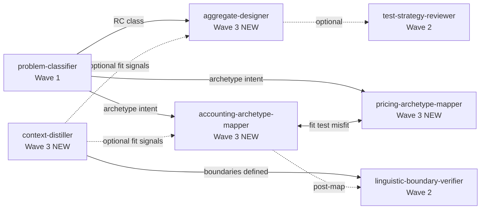

# Specification: AJ Skills Wave 3 — DDD Core (Epic E4)

**Task:** `.maister/tasks/development/2026-06-16-aj-skills-wave3`  
**Date:** 2026-06-16  
**Status:** Ready for implementation  
**Risk level:** Medium

## Summary

Port four Architekt Jutra (AJ) DDD transformation skills into `plugins/maister/` as standalone on-demand skills with category-aligned `modeling-*` commands. Activate deferred cross-references in Wave 1–2 skills, document Bundle B (DDD modeling flow), update `modeling-*` standards, and extend the Kiro build pipeline. Chains are documentation-only (`## Recommended next steps`); no orchestrator changes.

**User decisions (Phase 2 gate):**

| Decision | Choice |
|----------|--------|
| Language preference gates | Yes — all 4 Wave 3 skills |
| Mapper wave numbering | Wave 3 live in `problem-classifier` (not Wave 4 deferral) |
| Port pattern | Mirror Wave 1–2 exactly |
| Discovery | `/maister:modeling-*` commands + Skill tool; chain from `problem-classifier` |

**Applied ADRs:** ADR-001 (individual skills + chain sections), ADR-002 (`modeling-*` commands), ADR-003 (strict Wave 3 scope), ADR-007 (bilingual bodies + language gates), ADR-008 (no orchestrator wire-up).

---

## Scope

### In Scope

| Category | Deliverable |
|----------|-------------|
| Skills | 4 new `plugins/maister/skills/<kebab>/SKILL.md` |
| Commands | 4 new `plugins/maister/commands/modeling-*.md` thin wrappers |
| Cross-refs | Activate stubs in `problem-classifier`, `linguistic-boundary-verifier` |
| Documentation | `CLAUDE.md` (Bundle B, skills table, Modeling Commands), `README.md`, `plugin-development.md` |
| Build | `platforms/kiro-cli/build.sh`, `Makefile` rules 14/28, Kiro test scripts |
| Validation | `make build && make validate` must pass on all three platform variants |

### Inventory Delta

| Metric | Current (post Wave 2) | Target (post Wave 3) |
|--------|----------------------|----------------------|
| Source skills | 26 | 30 |
| Source commands | 12 | 16 |
| Kiro skill directories | 63 | 67 |
| Kiro `maister-*` directories | 38 | 42 |
| Kiro shortcut directories | 25 | 25 (unchanged) |
| Documented bundles | A, C, D | A, **B**, C, D |

---

## Functional Requirements

### FR-1: Port `context-distiller` Skill

**Source:** `/Users/mrapacz/Projects/architekt-jutra-code/week7/4-uogolnienie-demo/context-distiller/SKILL.md` (~483 lines)

**Target:** `plugins/maister/skills/context-distiller/SKILL.md`

| ID | Requirement |
|----|-------------|
| FR-1.1 | Frontmatter `name: context-distiller` — strip `maister:` prefix from AJ source |
| FR-1.2 | English-primary `description` with trigger phrases for strategic design / bounded-context distillation |
| FR-1.3 | `argument-hint` for domain description input |
| FR-1.4 | **Omit** `disable-model-invocation` — interactive modeling wizard (same as `problem-classifier`, `metaprogram-classifier`) |
| FR-1.5 | Add **Invocation guard** block with explicit trigger phrases and anti-triggers |
| FR-1.6 | Add **Language Preference** gate (`AskUserQuestion`) at skill start — English / Polish / Match input (Wave 2 pattern from `metaprogram-classifier`) |
| FR-1.7 | Fix AJ typo `problem-class-classifier` → `problem-classifier` in body cross-refs |
| FR-1.8 | Normalize all `maister:*` cross-refs to plain kebab skill names |
| FR-1.9 | Remove or generalize course-specific paths from AJ source |
| FR-1.10 | Add `## Recommended next steps` chain section: primary → `linguistic-boundary-verifier`; optional → `accounting-archetype-mapper`, `aggregate-designer` |
| FR-1.11 | Preserve bilingual PL/EN rubric body (ADR-007) |

### FR-2: Port `aggregate-designer` Skill

**Source:** `/Users/mrapacz/Projects/architekt-jutra-code/week7/6-jednostkispojnosci-demo/aggregate-designer/SKILL.md` (~540 lines)

**Target:** `plugins/maister/skills/aggregate-designer/SKILL.md`

| ID | Requirement |
|----|-------------|
| FR-2.1 | Frontmatter `name: aggregate-designer` — strip `maister:` prefix |
| FR-2.2 | English-primary `description` with RC / consistency-unit / aggregate design trigger phrases |
| FR-2.3 | Omit `disable-model-invocation` — multi-phase interactive wizard |
| FR-2.4 | Invocation guard + Language Preference gate (same pattern as FR-1.5–1.6) |
| FR-2.5 | Fix `maister:problem-class-classifier` → `problem-classifier` |
| FR-2.6 | Normalize all skill cross-refs to plain kebab names |
| FR-2.7 | Add `## Recommended next steps`: misfit → `problem-classifier` (reclassify); optional → `test-strategy-reviewer` |
| FR-2.8 | Preserve AJ multi-phase wizard structure and fit-check logic verbatim |

### FR-3: Port `accounting-archetype-mapper` Skill

**Source:** `/Users/mrapacz/Projects/architekt-jutra-code/week7/5-znanewzorce-demo/accounting-archetype-mapper/SKILL.md` (~547 lines)

**Target:** `plugins/maister/skills/accounting-archetype-mapper/SKILL.md`

| ID | Requirement |
|----|-------------|
| FR-3.1 | Frontmatter `name: accounting-archetype-mapper` (AJ already uses plain name) |
| FR-3.2 | English-primary `description` with accounting archetype / value-tracking / ledger trigger phrases |
| FR-3.3 | Omit `disable-model-invocation` — interactive mapper wizard |
| FR-3.4 | Invocation guard + Language Preference gate |
| FR-3.5 | Preserve fit-test hard stop and mutual redirect to `pricing-archetype-mapper` verbatim |
| FR-3.6 | Add `## Recommended next steps`: misfit → `pricing-archetype-mapper`; post-map → `linguistic-boundary-verifier` |
| FR-3.7 | Normalize cross-refs to plain kebab names |

### FR-4: Port `pricing-archetype-mapper` Skill

**Source:** `/Users/mrapacz/Projects/architekt-jutra-code/week7/5-znanewzorce-demo/pricing-archetype-mapper/SKILL.md` (~591 lines)

**Target:** `plugins/maister/skills/pricing-archetype-mapper/SKILL.md`

| ID | Requirement |
|----|-------------|
| FR-4.1 | Frontmatter `name: pricing-archetype-mapper` |
| FR-4.2 | English-primary `description` with pricing archetype / computed price trigger phrases |
| FR-4.3 | Omit `disable-model-invocation` — interactive mapper wizard |
| FR-4.4 | Invocation guard + Language Preference gate |
| FR-4.5 | Preserve fit-test hard stop and mutual redirect to `accounting-archetype-mapper` verbatim |
| FR-4.6 | Add `## Recommended next steps`: misfit → `accounting-archetype-mapper` |
| FR-4.7 | Normalize cross-refs to plain kebab names |

### FR-5: Create Four `modeling-*` Commands

Thin wrappers delegating via Skill tool (ADR-002). Pattern reference: `plugins/maister/commands/quick-problem-classifier.md`.

| ID | Command file | Frontmatter `name:` | Delegates to skill |
|----|--------------|---------------------|-------------------|
| FR-5.1 | `modeling-context-distiller.md` | `maister:modeling-context-distiller` | `context-distiller` |
| FR-5.2 | `modeling-aggregate-designer.md` | `maister:modeling-aggregate-designer` | `aggregate-designer` |
| FR-5.3 | `modeling-accounting-archetype.md` | `maister:modeling-accounting-archetype` | `accounting-archetype-mapper` |
| FR-5.4 | `modeling-pricing-archetype.md` | `maister:modeling-pricing-archetype` | `pricing-archetype-mapper` |

Each command MUST include:

- `**ACTION REQUIRED**` delegation block
- Explicit Skill tool invocation: `skill: "<kebab-name>"`, `args: "[user arguments from command]"`
- One-line `description` for command discovery
- No orchestration logic in command body

**Naming nuance (ADR-002):** Mapper commands use shortened stems (`modeling-accounting-archetype`, `modeling-pricing-archetype`) while delegating to full skill directory names.

### FR-6: Activate Cross-Reference Stubs

#### FR-6.1: `problem-classifier` (`plugins/maister/skills/problem-classifier/SKILL.md`)

| Location | Current | Required change |
|----------|---------|-----------------|
| Routing table ~L19 | `accounting-archetype-mapper` (Wave 4 — not yet ported) | Live skill ref; remove deferral |
| Routing table ~L20 | `pricing-archetype-mapper` (Wave 4 — not yet ported) | Live skill ref; remove deferral |
| Body ~L409 | Wave 3 deferral note for `aggregate-designer` | Remove deferral; point to live skill |
| Recommended next steps ~L507–509 | `aggregate-designer` Wave 3 — not yet ported | Active handoff: invoke with domain description + classification output as context |

When RC class detected → hand off to `aggregate-designer`. When archetype intent detected → hand off to appropriate mapper.

#### FR-6.2: `linguistic-boundary-verifier` (`plugins/maister/skills/linguistic-boundary-verifier/SKILL.md`)

| Location | Current | Required change |
|----------|---------|-----------------|
| ~L42 | `context-distiller` (Wave 3 — not yet available) | Active upstream cross-ref |
| Recommended next steps ~L355 | Same deferral stub | Active cross-ref: use distiller when boundaries unclear |

Distinction preserved: distiller answers "where should boundaries be?"; verifier answers "are boundaries respected?"

### FR-7: Documentation Updates

#### FR-7.1: `plugins/maister/CLAUDE.md`

| ID | Requirement |
|----|-------------|
| FR-7.1.1 | Add 4 skill rows to **Requirements & Modeling Skills** table |
| FR-7.1.2 | Add **Bundle B — DDD modeling flow** paragraph between Bundle A and Bundle C |
| FR-7.1.3 | Add **Modeling Commands** subsection under Requirements & Modeling Commands with 4 new rows |
| FR-7.1.4 | Document chain topology (see Chain Topology section below) |

**Bundle B text (minimum):**

> Run `/maister:quick-problem-classifier` on requirements → `/maister:modeling-context-distiller` for strategic boundaries → archetype mappers or `/maister:modeling-aggregate-designer` based on class/fit → `/maister:reviews-linguistic-boundaries` when `language.md` exists. Chain via each skill's Recommended next steps, not an orchestrator.

#### FR-7.2: `README.md`

| ID | Requirement |
|----|-------------|
| FR-7.2.1 | Add 4 command rows to Quick Commands table |
| FR-7.2.2 | Add **Bundle B (DDD modeling)** paragraph mirroring CLAUDE.md |

#### FR-7.3: `.maister/docs/standards/global/plugin-development.md`

| ID | Requirement |
|----|-------------|
| FR-7.3.1 | Extend command category list: `reviews-*`, `quick-*`, **`modeling-*`** |
| FR-7.3.2 | Document that DDD transformation skills use `modeling-*` prefix; commands are thin wrappers |

### FR-8: Build Pipeline Updates

Edit only `plugins/maister/` and `platforms/kiro-cli/` — never generated variants directly.

#### FR-8.1: `platforms/kiro-cli/build.sh`

| ID | Change | Details |
|----|--------|---------|
| FR-8.1.1 | `merge_one` (×4) | `modeling-context-distiller` → `maister-modeling-context-distiller`, etc. |
| FR-8.1.2 | `skills_needing_args` (+8) | 4 skills + 4 merged modeling commands |
| FR-8.1.3 | Wave 3 `apply_delegation_transforms` sedi block | Transform plain kebab refs to `maister-*` for all 4 skills: `skill \`...\``, `Invoke the \`...\` skill`, `skill: "..."`, `run \`...\`` patterns |
| FR-8.1.4 | Header comment | Update skill count references if present |

**Wave 3 sedi targets (minimum):**

```
context-distiller, aggregate-designer, accounting-archetype-mapper, pricing-archetype-mapper
```

Note: `run \`context-distiller\`` sedi already exists (~L319); extend with full Wave 3 block for remaining three skills plus `skill`, `Invoke`, and `skill:` JSON variants for all four.

#### FR-8.2: `Makefile`

| Rule | Current | Target |
|------|---------|--------|
| Rule 14 | 63 total skill dirs | 67 |
| Rule 28 | 38 `maister-*` dirs | 42 |

#### FR-8.3: Kiro test scripts

| File | Change |
|------|--------|
| `platforms/kiro-cli/tests/build-core.test.sh` | 63→67 skill dir count; 14→18 merged command assertions; add 4 `maister-modeling-*` file checks |
| `platforms/kiro-cli/tests/validation.test.sh` | `test_exactly_63_skill_dirs` → 67 total / 42 `maister-*` |

#### FR-8.4: Platform variants

Cursor and Copilot variants regenerate via `make build` with existing transforms — no Makefile count rules. Verify build succeeds; no direct edits to `plugins/maister-cursor/`, `maister-copilot/`, `maister-kiro/`.

### FR-9: Port Pattern Compliance (All Skills)

Each ported skill MUST follow the Wave 1–2 checklist:

1. Create `plugins/maister/skills/<name>/SKILL.md`
2. Strip `maister:` from frontmatter `name` (where present in AJ)
3. Add invocation guard + trigger phrases
4. Add Language Preference gate (interactive skills — all 4 Wave 3)
5. Fix AJ cross-ref typos
6. Normalize skill refs to plain kebab names (no `maister:` prefix in body)
7. Add/update `## Recommended next steps`
8. No `CLAUDE.md` references in skill body (Makefile Rule 5/28)
9. SKILL.md remains single source of truth; no new `references/` dirs for Wave 3

---

## Chain Topology

Chains are **documentation + explicit handoff only** (ADR-001, ADR-008). No orchestrator state, no auto Skill invocation.



### Per-Skill Chain Sections

| Skill | Downstream chains |
|-------|-------------------|
| `context-distiller` | Primary: `linguistic-boundary-verifier`. Optional: `accounting-archetype-mapper`, `aggregate-designer` |
| `aggregate-designer` | Misfit: `problem-classifier`. Optional: `test-strategy-reviewer` |
| `accounting-archetype-mapper` | Misfit: `pricing-archetype-mapper`. Post-map: `linguistic-boundary-verifier` |
| `pricing-archetype-mapper` | Misfit: `accounting-archetype-mapper` |

### User Discovery Flow

```
User explicit request
  → /maister:modeling-* (thin command)
  → Skill tool invokes modeling SKILL.md
  → Language Preference gate (AskUserQuestion)
  → Multi-phase wizard (probes, fit tests)
  → Structured modeling output (no orchestrator state)
  → Recommended next steps → sibling skill via explicit handoff
```

**Entry points:**

| User intent | Command | Upstream chain |
|-------------|---------|----------------|
| Classify problem class first | `/maister:quick-problem-classifier` | Bundle B start |
| Distill bounded contexts | `/maister:modeling-context-distiller` | After classifier or standalone |
| Design RC aggregate | `/maister:modeling-aggregate-designer` | After classifier RC result |
| Map accounting archetype | `/maister:modeling-accounting-archetype` | After classifier or distiller |
| Map pricing archetype | `/maister:modeling-pricing-archetype` | After classifier or distiller |

---

## File Manifest

### Create (8 files)

| File | Type | Lines (est.) |
|------|------|--------------|
| `plugins/maister/skills/context-distiller/SKILL.md` | Skill | ~500 |
| `plugins/maister/skills/aggregate-designer/SKILL.md` | Skill | ~560 |
| `plugins/maister/skills/accounting-archetype-mapper/SKILL.md` | Skill | ~570 |
| `plugins/maister/skills/pricing-archetype-mapper/SKILL.md` | Skill | ~610 |
| `plugins/maister/commands/modeling-context-distiller.md` | Command | ~12 |
| `plugins/maister/commands/modeling-aggregate-designer.md` | Command | ~12 |
| `plugins/maister/commands/modeling-accounting-archetype.md` | Command | ~12 |
| `plugins/maister/commands/modeling-pricing-archetype.md` | Command | ~12 |

### Modify (10 files)

| File | Change summary |
|------|----------------|
| `plugins/maister/skills/problem-classifier/SKILL.md` | Activate 3 stub locations; fix Wave 4→Wave 3 mapper labels |
| `plugins/maister/skills/linguistic-boundary-verifier/SKILL.md` | Remove 2 context-distiller deferral stubs |
| `plugins/maister/CLAUDE.md` | +4 skills, Bundle B, +4 modeling commands |
| `README.md` | +4 command rows, Bundle B paragraph |
| `.maister/docs/standards/global/plugin-development.md` | Document `modeling-*` category |
| `platforms/kiro-cli/build.sh` | merge_one ×4, skills_needing_args +8, Wave 3 sedi block |
| `Makefile` | Rules 14/28: 63→67, 38→42 |
| `platforms/kiro-cli/tests/build-core.test.sh` | Count + merged command assertions |
| `platforms/kiro-cli/tests/validation.test.sh` | Rule 14/28 count test |

### Read-only Reference (port sources)

| File | Purpose |
|------|---------|
| AJ `week7/4-uogolnienie-demo/context-distiller/SKILL.md` | Source rubric |
| AJ `week7/6-jednostkispojnosci-demo/aggregate-designer/SKILL.md` | Source rubric |
| AJ `week7/5-znanewzorce-demo/accounting-archetype-mapper/SKILL.md` | Source rubric |
| AJ `week7/5-znanewzorce-demo/pricing-archetype-mapper/SKILL.md` | Source rubric |
| `plugins/maister/skills/metaprogram-classifier/SKILL.md` | Language gate + Recommended next steps template |
| `plugins/maister/commands/quick-problem-classifier.md` | Thin command delegation template |

### Generated (via `make build` — do not edit)

- `plugins/maister-cursor/**`
- `plugins/maister-copilot/**`
- `plugins/maister-kiro/**`

---

## Acceptance Criteria

### AC-1: Skill Artifacts

- [ ] **AC-1.1** Four skill directories exist under `plugins/maister/skills/` with valid frontmatter
- [ ] **AC-1.2** All four use plain kebab `name:` (no `maister:` prefix)
- [ ] **AC-1.3** None of the four have `disable-model-invocation: true`
- [ ] **AC-1.4** All four have Invocation guard blocks
- [ ] **AC-1.5** All four have Language Preference gates (AskUserQuestion)
- [ ] **AC-1.6** All four have `## Recommended next steps` sections with kebab sibling names
- [ ] **AC-1.7** No `problem-class-classifier` typo remains in any Wave 3 skill
- [ ] **AC-1.8** No `maister:*` prefixes in skill body cross-refs

### AC-2: Command Artifacts

- [ ] **AC-2.1** Four `modeling-*` command files exist in `plugins/maister/commands/`
- [ ] **AC-2.2** Each command frontmatter uses `name: maister:modeling-*`
- [ ] **AC-2.3** Each command delegates via Skill tool with correct kebab skill name
- [ ] **AC-2.4** Mapper commands use shortened stems per ADR-002

### AC-3: Cross-Reference Activation

- [ ] **AC-3.1** Zero matches in source plugin for "not yet ported", "not yet available", or "Wave 3 — not yet" referring to Wave 3 skill names
- [ ] **AC-3.2** `problem-classifier` routing table lists live `accounting-archetype-mapper` and `pricing-archetype-mapper` (not Wave 4 deferral)
- [ ] **AC-3.3** `problem-classifier` Recommended next steps has active `aggregate-designer` handoff
- [ ] **AC-3.4** `linguistic-boundary-verifier` references live `context-distiller` in both locations

### AC-4: Documentation

- [ ] **AC-4.1** CLAUDE.md documents Bundle B between Bundles A and C
- [ ] **AC-4.2** CLAUDE.md Requirements & Modeling Skills table includes all 4 Wave 3 skills
- [ ] **AC-4.3** CLAUDE.md Modeling Commands section includes all 4 commands
- [ ] **AC-4.4** README.md includes 4 command rows and Bundle B paragraph
- [ ] **AC-4.5** `plugin-development.md` documents `modeling-*` command category

### AC-5: Build Pipeline

- [ ] **AC-5.1** `make build && make validate` exits 0
- [ ] **AC-5.2** Kiro: exactly 67 total skill directories (Rule 14)
- [ ] **AC-5.3** Kiro: exactly 42 `maister-*` skill directories (Rule 28)
- [ ] **AC-5.4** Kiro: exactly 25 unprefixed shortcut directories (unchanged)
- [ ] **AC-5.5** Kiro build-core tests assert 4 new `maister-modeling-*` merged command dirs exist
- [ ] **AC-5.6** Generated variants contain no manual edits; all updated via build

### AC-6: Manual Smoke (Recommended)

- [ ] **AC-6.1** Maintainer runs at least one `/maister:modeling-*` invocation per skill with sample domain input
- [ ] **AC-6.2** Accounting ↔ pricing fit-test redirect loops behave per AJ rubric

---

## Out of Scope

| Item | Reason | Future wave |
|------|--------|-------------|
| `archetype-scanner` skill | Wave 4 / E5 — requires subagents + registry | E5 |
| `modeling-archetype-scanner` command | Depends on scanner skill | E5 |
| 3 mapper subagents + merge agent | Wave 4 parallel execution | E5 |
| `references/archetype-registry.md` | Wave 4 artifact | E5 |
| Orchestrator changes (`development`, `product-design`, `research`) | ADR-008 — chains are docs-only | N/A |
| `maister:research --gather-only` | Separate epic E6 | E6 |
| `language-md-generator` skill | Deferred per ADR-006 | TBD |
| Party archetype mapper | Not in AJ registry | Indefinite deferral |
| Editing generated plugin variants | Overwritten by `make build` | N/A |
| Visual assets / UI mockups | Rubric-only DDD wizard skills | N/A |
| New `references/` directories for Wave 3 skills | AJ sources are self-contained | N/A |

---

## Test and Validation Strategy

### Structural Gate (Mandatory)

```bash
make build && make validate
```

Must pass before merge. Covers all three platform variants (Cursor, Copilot, Kiro).

### Grep Verification

Run after source edits, before build:

```bash
# Zero deferral stubs for Wave 3 skills
rg -i "not yet (ported|available)|Wave 3 — not yet|Wave 4 — not yet ported" \
  plugins/maister/skills/problem-classifier/SKILL.md \
  plugins/maister/skills/linguistic-boundary-verifier/SKILL.md

# Should return no matches after implementation

# Verify Wave 3 skills exist
test -f plugins/maister/skills/context-distiller/SKILL.md
test -f plugins/maister/skills/aggregate-designer/SKILL.md
test -f plugins/maister/skills/accounting-archetype-mapper/SKILL.md
test -f plugins/maister/skills/pricing-archetype-mapper/SKILL.md

# Verify commands exist
ls plugins/maister/commands/modeling-*.md | wc -l  # expect 4
```

Post-build Kiro checks:

```bash
# Count verification
find plugins/maister-kiro/skills -mindepth 1 -maxdepth 1 -type d | wc -l          # 67
find plugins/maister-kiro/skills -mindepth 1 -maxdepth 1 -type d -name 'maister-*' | wc -l  # 42

# Merged modeling commands
test -f plugins/maister-kiro/skills/maister-modeling-context-distiller/SKILL.md
test -f plugins/maister-kiro/skills/maister-modeling-aggregate-designer/SKILL.md
test -f plugins/maister-kiro/skills/maister-modeling-accounting-archetype/SKILL.md
test -f plugins/maister-kiro/skills/maister-modeling-pricing-archetype/SKILL.md
```

### Kiro Test Suite

| Test file | Assertions to update |
|-----------|---------------------|
| `build-core.test.sh` | Skill dir count 63→67; merged commands 14→18; add 4 modeling file existence checks |
| `validation.test.sh` | `test_exactly_63_skill_dirs` → 67/42 |

### Manual Smoke (Recommended — AC-6)

One invocation per skill with representative domain input:

| Skill | Sample trigger | Verify |
|-------|----------------|--------|
| `context-distiller` | `/maister:modeling-context-distiller billing module boundaries` | Language gate fires; multi-phase wizard runs |
| `aggregate-designer` | `/maister:modeling-aggregate-designer room reservation RC unit` | RC wizard phases execute |
| `accounting-archetype-mapper` | `/maister:modeling-accounting-archetype loyalty points ledger` | Fit test runs; pricing redirect on misfit |
| `pricing-archetype-mapper` | `/maister:modeling-pricing-archetype subscription pricing tree` | Fit test runs; accounting redirect on misfit |

Chain spot-check: run `/maister:quick-problem-classifier` on RC domain → verify Recommended next steps suggests `aggregate-designer` with context-passing instructions.

### Regression Scope

- Wave 1–2 skills: stub removal only — no behavioral rubric changes
- No orchestrator SKILL.md edits — zero regression risk to development workflow
- Additive build pipeline changes — existing Wave 1–2 sedi blocks unchanged

### Implementation Order

```
1. context-distiller          (enables linguistic-boundary-verifier chain)
2. aggregate-designer         (enables problem-classifier RC handoff)
3. accounting-archetype-mapper + pricing-archetype-mapper  (parallel)
4. Four modeling-* commands
5. Cross-ref activation (problem-classifier, linguistic-boundary-verifier)
6. Documentation (CLAUDE.md, README.md, plugin-development.md)
7. Build pipeline (build.sh, Makefile, Kiro tests)
8. make build && make validate
```

---

## Risks and Mitigations

| Risk | Severity | Mitigation |
|------|----------|------------|
| Wave numbering inconsistency (mappers labeled Wave 4 in classifier) | Medium | Unify all stubs in same PR; grep gate AC-3.1 |
| Incomplete Kiro sedi (only context-distiller pre-wired) | Medium | Full Wave 3 delegation block before validate |
| Large SKILL.md files (~2,160 lines total) | Low | Within plugin guidance (<1k each); no split |
| Cross-skill misfit loops (accounting ↔ pricing) | Low | Preserve AJ fit-test hard stops verbatim |
| Kiro AskUserQuestion ban | Medium | Existing Wave 1–2 pattern passes validate; CHAT GATE transforms apply |
| AJ source unavailable on CI | Low | Port content committed to repo; AJ is dev-machine reference only |

---

## Standards Compliance

| Standard | Applicable rule |
|----------|-----------------|
| `plugin-development.md` | Source-only edits; kebab-case dirs; thin commands; SKILL.md SOT |
| `build-pipeline.md` | Flat commands; platform transforms; `make build && make validate` gate |
| `conventions.md` | Spec before implementation; read INDEX.md |
| ADR-007 | EN frontmatter; bilingual bodies; language gates on interactive skills |

**Note:** On-demand AJ skills intentionally use plain kebab `name:` in frontmatter (not `maister:*`) per Wave 1–2 precedent. Kiro Rule 3 validates generated output names match directory names.

---

## Requirement Index

| Group | IDs | Count |
|-------|-----|-------|
| Skill ports | FR-1 – FR-4, FR-9 | 4 skills + shared checklist |
| Commands | FR-5 | 4 |
| Cross-refs | FR-6 | 2 skills, 5 locations |
| Documentation | FR-7 | 3 files |
| Build pipeline | FR-8 | 4 surfaces |
| Acceptance criteria | AC-1 – AC-6 | 28 checkboxes |
| Functional requirements (granular) | FR-1.1 – FR-8.4 | **47** |

**Total functional requirements:** 47 (FR-1.1 through FR-8.4)  
**Total acceptance criteria:** 28 (AC-1.1 through AC-6.2)

---

*Next step: Implementation plan (`implementation/implementation-plan.md`) with task groups aligned to implementation order above.*
