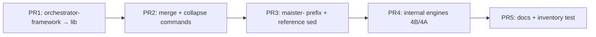

# Implementation Plan: Cursor Skill Prefix & Slash Palette Consolidation

**Task**: `.maister/tasks/development/2026-07-08-cursor-skill-prefix-and-palette`  
**Spec**: `implementation/spec.md`  
**Authoritative plan**: `.maister/plans/2026-07-08-cursor-skill-prefix-and-palette.md`  
**Date**: 2026-07-08  
**Status**: Ready for execution

---

## Overview

**Total task groups:** 5 (PR1–PR5, one PR per group)  
**Source edits:** `platforms/cursor/build.sh`, `Makefile`, smoke/tests, docs — **never** hand-edit `plugins/maister-cursor/`  
**Reference implementation:** `platforms/kiro-cli/build.sh` (`merge_commands_to_skills` L41–72, `rename_skill_directories` L74–90, `apply_delegation_transforms` L260–335)  
**Baseline inventory:** 28 skill dirs + 16 command files (~44 palette entries) → **~29 public** `maister-*` skills under `skills/` after PR4 (4 internals → `lib/skills/`; `orchestrator-framework` already in `lib/` from PR1)

**Per-PR gate (every group):**

```bash
make build-cursor && make validate-cursor
platforms/cursor/smoke-cli.sh
git diff --exit-code plugins/maister-cursor
```

**Dependency chain:**



| Group | PR | Depends on | Risk | Estimate |
|-------|-----|------------|------|----------|
| 1 | PR1 | — | Low | 2–4 h |
| 2 | PR2 | Group 1 | Medium | 0.5–1 d |
| 3 | PR3 | Group 2 | Low | 0.5 d |
| 4 | PR4 | Group 3 | Medium | 1 d |
| 5 | PR5 | Group 4 | Low | 2–4 h |

**Spec-audit amendments baked into this plan:**
- **C1** — `quick-dev` body from copied `skills/quick-dev/SKILL.md`, not `overrides/commands/quick-dev.md`
- **W1** — explicit `merge_commands_to_skills()` skip list (do not port Kiro L62–69 collapse merges)
- **W2–W3** — `Makefile validate-cursor` changes split per PR with interim plain-kebab paths in PR2
- **W4** — `apply_skill_reference_transforms()` includes agent `skills:` frontmatter + Kiro parity sed patterns
- **W5** — sentinel fixture copied in smoke script only, never committed under `plugins/maister-cursor/`
- **W6** — PR1 path updates include `implementation-verifier` (L188 relative ref)
- **W9** — PR5 updates generated `README.md` heredoc in `build.sh` L104–128

---

## Task Group 1 — PR1: `orchestrator-framework` → `lib/`

**Goal:** Move reference-only `orchestrator-framework` out of `skills/` before any directory renames (D5). Update all path references and `TODO_GLOB` so `apply_todo_transforms` and patch append still work.

**Depends on:** None

**Files to modify:**
| File | Change |
|------|--------|
| `platforms/cursor/build.sh` | Add `relocate_orchestrator_framework()`, `update_orchestrator_framework_paths()`; update `TODO_GLOB` L272–284; sed targets L296–300 |
| `Makefile` | Add PR1 block to `validate-cursor` (after L39 existence check) |
| `plugins/maister-cursor/**` | Regenerated only via `make build-cursor` |

**Insert point in `build.sh`:** After step 11 (hooks/readonly agents, ~L230), **before** step 12 overrides (L232). Call order at end of build: `relocate_orchestrator_framework` → `update_orchestrator_framework_paths` → existing overrides → … → `apply_todo_transforms` (unchanged position, last).

### Steps

- [ ] 1.1 Add `relocate_orchestrator_framework()` to `platforms/cursor/build.sh` (before `apply_todo_transforms`, ~insert after L230)

```bash
relocate_orchestrator_framework() {
  mkdir -p "$OUT/lib"
  mv "$OUT/skills/orchestrator-framework" "$OUT/lib/orchestrator-framework"
}
```

- [ ] 1.2 Add `update_orchestrator_framework_paths()` — sed across all `$OUT/**/*.md` and `$OUT/**/*.sh`:

| Pattern | Replacement |
|---------|-------------|
| `../orchestrator-framework/` | `../lib/orchestrator-framework/` |
| `skills/orchestrator-framework/` | `lib/orchestrator-framework/` |
| `[plugin]/skills/orchestrator-framework/` | `[plugin]/lib/orchestrator-framework/` |

  Scope must include (not orchestrator-only):
  - `skills/development/SKILL.md`, `migration`, `performance`, `research`, `product-design`, `init`, `standards-discover` (orchestrators)
  - `skills/implementation-verifier/SKILL.md` L188 (`../orchestrator-framework/references/html-report-style.md`)
  - `lib/orchestrator-framework/references/orchestrator-patterns.md` L438 self-reference

  Implementation sketch:

```bash
update_orchestrator_framework_paths() {
  find "$OUT" \( -name "*.md" -o -name "*.sh" \) -print0 | while IFS= read -r -d '' f; do
    sedi 's|\.\./orchestrator-framework/|../lib/orchestrator-framework/|g' "$f"
    sedi 's|skills/orchestrator-framework/|lib/orchestrator-framework/|g' "$f"
    sedi 's|\[plugin\]/skills/orchestrator-framework/|[plugin]/lib/orchestrator-framework/|g' "$f"
  done
}
```

- [ ] 1.3 Update `TODO_GLOB` array (current L272–284): replace first entry

```bash
# Before:
"$OUT/skills/orchestrator-framework"
# After:
"$OUT/lib/orchestrator-framework"
```

- [ ] 1.4 Update `apply_todo_transforms` sed + patch append (L296–300):

```bash
# L296:
sedi 's/metadata: {restored: true}/(restored from state — mark completed)/g' \
  "$OUT/lib/orchestrator-framework/references/orchestrator-patterns.md"

# L299–300:
cat "$PLATFORM/patches/orchestrator-patterns-todowrite.md" >> \
  "$OUT/lib/orchestrator-framework/references/orchestrator-patterns.md"
```

- [ ] 1.5 Wire calls after step 11, before step 12 overrides:

```bash
relocate_orchestrator_framework
update_orchestrator_framework_paths
```

- [ ] 1.6 Run `make build-cursor` and commit regenerated `plugins/maister-cursor/lib/orchestrator-framework/**`

- [ ] 1.7 Add **PR1-only** checks to `Makefile` `validate-cursor` (insert after L39 `test -d plugins/maister-cursor`):

```makefile
	@echo "PR1: orchestrator-framework in lib/..."
	@test ! -d plugins/maister-cursor/skills/orchestrator-framework || (echo "FAIL: orchestrator-framework still under skills/" && exit 1)
	@test -f plugins/maister-cursor/lib/orchestrator-framework/references/orchestrator-patterns.md || (echo "FAIL: lib orchestrator-patterns missing" && exit 1)
	@! grep -rq 'skills/orchestrator-framework' plugins/maister-cursor/ --include="*.md" || (echo "FAIL: stale skills/orchestrator-framework path" && exit 1)
```

### Validation (Group 1)

```bash
make build-cursor && make validate-cursor
platforms/cursor/smoke-cli.sh
git diff --exit-code plugins/maister-cursor
# Spot-check orchestrator relative paths:
grep -r 'lib/orchestrator-framework' plugins/maister-cursor/skills/development/SKILL.md
test ! -d plugins/maister-cursor/skills/orchestrator-framework
```

**Acceptance:** `/orchestrator-framework` absent from palette; `maister-development` dashboard copy path `../lib/orchestrator-framework/assets/dashboard.html` valid; CI drift clean.

---

## Task Group 2 — PR2: Merge `commands/` → `skills/` (collapse + dedup)

**Goal:** Eliminate `commands/` directory and duplicate palette entries. One source dir per capability using D1 shorter names (rich skill retained; thin command wrappers skipped). Fix **C1** quick-dev sourcing.

**Depends on:** Group 1

**Files to modify:**
| File | Change |
|------|--------|
| `platforms/cursor/build.sh` | `merge_commands_to_skills()`, `apply_cursor_overrides()`; manifest L30–48; remove/replace step 12 L232–236; remove step 2 command sed L51–54 (optional — dir deleted after merge) |
| `Makefile` | **Remove** L40–49 command checks + L91 `"commands"` requirement; **add** PR2 skills-only checks (plain-kebab interim paths) |
| `plugins/maister-cursor/**` | Regenerated |

### Steps

- [ ] 2.1 Refactor step 12 (L232–236) into `apply_cursor_overrides()` — merge into **skill dirs only**:

```bash
apply_cursor_overrides() {
  # quick-plan: Cursor-specific rich skill (NOT commands/quick-plan.md)
  cp "$PLATFORM/overrides/skills/quick-plan/SKILL.md" "$OUT/skills/quick-plan/SKILL.md"
  # quick-bugfix
  cp "$PLATFORM/overrides/skills/quick-bugfix/SKILL.md" "$OUT/skills/quick-bugfix/SKILL.md"
  # quick-dev (C1): rich source already copied by build — global transforms (AskUserQuestion→AskQuestion) apply.
  # Do NOT cp overrides/commands/quick-dev.md
  # Do NOT cp overrides/commands/quick-plan.md
}
```

  Delete these lines:

```bash
cp "$PLATFORM/overrides/commands/quick-plan.md" "$OUT/commands/quick-plan.md"
cp "$PLATFORM/overrides/commands/quick-dev.md" "$OUT/commands/quick-dev.md"
```

- [ ] 2.2 Add `merge_commands_to_skills()` (port structure from `kiro-cli/build.sh` L41–72, **different targets + skip list**):

```bash
merge_commands_to_skills() {
  local commands_dir="$OUT/commands"
  [ -d "$commands_dir" ] || return 0

  merge_one() {
    local stem="$1" target="$2"
    local src="$commands_dir/${stem}.md"
    local dest_dir="$OUT/skills/${target}"
    [ -f "$src" ] || return 0
    mkdir -p "$dest_dir"
    cp "$src" "$dest_dir/SKILL.md"
  }

  # Command-only (no rich skill in source) — target dirs use maister-* names
  merge_one reviews-code maister-reviews-code
  merge_one reviews-pragmatic maister-reviews-pragmatic
  merge_one reviews-production-readiness maister-reviews-production-readiness
  merge_one reviews-reality-check maister-reviews-reality-check
  merge_one reviews-spec-audit maister-reviews-spec-audit
  merge_one work maister-work

  # W1 / D1: SKIP collapse stems — rich skill dirs already exist at plain kebab.
  # Do NOT call merge_one for these (Kiro L62–69 must NOT be copied verbatim):
  local skip_stems=(
    quick-problem-classifier
    quick-transcript-critic
    quick-requirements-critic
    quick-metaprogram-classifier
    modeling-context-distiller
    modeling-aggregate-designer
    reviews-test-strategy
    reviews-linguistic-boundaries
    quick-plan    # override skill at skills/quick-plan/
    quick-dev     # rich skill at skills/quick-dev/
    quick-bugfix  # override skill at skills/quick-bugfix/ (no source command)
  )
  # (skip_stems documented for maintainers; no merge_one calls for them)

  rm -rf "$commands_dir"
}
```

- [ ] 2.3 Update manifest generation (L30–48) — remove `"commands"` field:

```json
{
  "skills": "./skills/",
  "agents": "./agents/",
  "hooks": "./hooks/hooks.json"
}
```

- [ ] 2.4 Set build call order (after `apply_cursor_overrides`, before `rename_skill_directories` in PR3):

```bash
apply_cursor_overrides      # step 12
merge_commands_to_skills    # new step 13 — deletes $OUT/commands
# apply_todo_transforms remains last (PR1 TODO_GLOB already points at lib/)
```

- [ ] 2.5 **Makefile PR2 inversion** — in `validate-cursor`:

  **Remove** (current L40–49, L91):
  - Colon/prefix checks on `commands/`
  - Thin wrapper line counts for `commands/quick-*.md`
  - `grep -q '"commands":' ... plugin.json` (invert to absence)

  **Add** (interim plain-kebab paths — pre-PR3):

```makefile
	@echo "PR2: skills-only manifest (no commands/)..."
	@test ! -d plugins/maister-cursor/commands || (echo "FAIL: commands/ still exists" && exit 1)
	@! grep -q '"commands":' plugins/maister-cursor/.cursor-plugin/plugin.json || (echo "FAIL: plugin.json still has commands field" && exit 1)
	@test -f plugins/maister-cursor/skills/maister-work/SKILL.md || (echo "FAIL: maister-work skill missing" && exit 1)
	@test -f plugins/maister-cursor/skills/maister-reviews-code/SKILL.md || (echo "FAIL: maister-reviews-code skill missing" && exit 1)
	@test -f plugins/maister-cursor/skills/quick-plan/SKILL.md || (echo "FAIL: quick-plan skill missing" && exit 1)
	@test -f plugins/maister-cursor/skills/quick-dev/SKILL.md || (echo "FAIL: quick-dev skill missing" && exit 1)
	@test -f plugins/maister-cursor/skills/quick-bugfix/SKILL.md || (echo "FAIL: quick-bugfix skill missing" && exit 1)
	@test -d plugins/maister-cursor/skills/problem-classifier || (echo "FAIL: problem-classifier rich skill missing" && exit 1)
	@test ! -d plugins/maister-cursor/skills/maister-quick-problem-classifier || (echo "FAIL: duplicate collapse dir maister-quick-problem-classifier" && exit 1)
	@echo "PR2: quick-plan skill integrity..."
	@! grep -q 'plan approval gate' plugins/maister-cursor/skills/quick-plan/SKILL.md 2>/dev/null || (echo "FAIL: corrupted quick-plan skill" && exit 1)
	@echo "PR2: quick-dev is rich workflow (not thin wrapper)..."
	@lines=$$(wc -l < plugins/maister-cursor/skills/quick-dev/SKILL.md | tr -d ' '); \
		test $$lines -gt 25 || (echo "FAIL: quick-dev must be rich skill (>25 lines), got $$lines" && exit 1)
```

  **Retain** unchanged: hooks.json L56–65, agents L66–87, mcp.json L69–71, explore L72–78, readonly agents L79–87, rules L95–100, TaskCreate L101–102.

- [ ] 2.6 Run build, commit `plugins/maister-cursor/` (no `commands/`, merged review skills present)

### Validation (Group 2)

```bash
make build-cursor && make validate-cursor
platforms/cursor/smoke-cli.sh   # Test 3: /maister-quick-plan still writes plan
git diff --exit-code plugins/maister-cursor
test ! -d plugins/maister-cursor/commands
! grep -q '"commands":' plugins/maister-cursor/.cursor-plugin/plugin.json
test ! -d plugins/maister-cursor/skills/maister-quick-problem-classifier
test -d plugins/maister-cursor/skills/problem-classifier
wc -l plugins/maister-cursor/skills/quick-dev/SKILL.md   # expect >> 25
```

**Acceptance:** No duplicate collapse pairs; quick-dev retains full workflow; smoke Test 3 passes.

---

## Task Group 3 — PR3: `maister-*` prefix + reference transforms

**Goal:** Rename all public skill directories and frontmatter to `maister-*`. Rewrite `skill: "…"` delegations, backtick prose, and agent `skills:` preload lists (W4).

**Depends on:** Group 2

**Files to modify:**
| File | Change |
|------|--------|
| `platforms/cursor/build.sh` | `rename_skill_directories()`, `apply_skill_reference_transforms()`; call after `merge_commands_to_skills`, before `apply_todo_transforms` |
| `Makefile` | Replace PR2 plain-kebab path checks with PR3 `maister-*` checks; add prefix/delegation greps |
| `platforms/cursor/hooks/skill-invocation-reminder.sh` | Verify only — already `/maister-*` (I3: no change expected) |
| `plugins/maister-cursor/**` | Regenerated |

### Steps

- [ ] 3.1 Add `rename_skill_directories()` — copy from `kiro-cli/build.sh` L74–90 verbatim (operates on `$OUT/skills` top-level only; skips `$OUT/lib/`):

```bash
rename_skill_directories() {
  local dir skill_file name target_name target_dir
  while IFS= read -r dir; do
    skill_file="$dir/SKILL.md"
    [ -f "$skill_file" ] || continue
    name=$(grep -m1 '^name: ' "$skill_file" | sed 's/^name: //')
    target_name="$name"
    if [[ "$target_name" != maister-* ]]; then
      target_name="maister-${target_name}"
      sedi "s/^name: ${name}/name: ${target_name}/" "$skill_file"
    fi
    target_dir="$OUT/skills/$target_name"
    if [ "$dir" != "$target_dir" ]; then
      mv "$dir" "$target_dir"
    fi
  done < <(find "$OUT/skills" -mindepth 1 -maxdepth 1 -type d)
}
```

  Note: `maister-work`, `maister-reviews-*` from PR2 merge already prefixed — loop is idempotent.

- [ ] 3.2 Add `apply_skill_reference_transforms()` — foreach `$OUT/skills`, `$OUT/agents`, `$OUT/rules`, `$OUT/hooks/*.sh`, `$OUT/lib` (orchestrator refs if any remain). Port minimum sed set from Kiro `apply_delegation_transforms` L299–335:

```bash
# skill: "plain" → skill: "maister-plain" (all utility + internal engines)
sedi 's|skill: "problem-classifier"|skill: "maister-problem-classifier"|g'
sedi 's|skill: "transcript-critic"|skill: "maister-transcript-critic"|g'
sedi 's|skill: "requirements-critic"|skill: "maister-requirements-critic"|g'
sedi 's|skill: "metaprogram-classifier"|skill: "maister-metaprogram-classifier"|g'
sedi 's|skill: "context-distiller"|skill: "maister-context-distiller"|g'
sedi 's|skill: "aggregate-designer"|skill: "maister-aggregate-designer"|g'
sedi 's|skill: "test-strategy-reviewer"|skill: "maister-test-strategy-reviewer"|g'
sedi 's|skill: "linguistic-boundary-verifier"|skill: "maister-linguistic-boundary-verifier"|g'
sedi 's|skill: "codebase-analyzer"|skill: "maister-codebase-analyzer"|g'
sedi 's|skill: "implementation-plan-executor"|skill: "maister-implementation-plan-executor"|g'
sedi 's|skill: "implementation-verifier"|skill: "maister-implementation-verifier"|g'
sedi 's|skill: "docs-manager"|skill: "maister-docs-manager"|g'
sedi 's|skill: "quick-dev"|skill: "maister-quick-dev"|g'
sedi 's|skill: "quick-plan"|skill: "maister-quick-plan"|g'
sedi 's|skill: "quick-bugfix"|skill: "maister-quick-bugfix"|g'
# Backtick / prose (Kiro L301–334 parity)
sedi 's|skill `problem-classifier`|skill `maister-problem-classifier`|g'
sedi 's|Invoke the `problem-classifier` skill|Invoke the `maister-problem-classifier` skill|g'
sedi 's|run `grill-me`|run `maister-grill-me`|g'
sedi 's|run `thermos`|run `maister-thermos`|g'
sedi 's|run `problem-classifier`|run `maister-problem-classifier`|g'
sedi 's|run `context-distiller`|run `maister-context-distiller`|g'
sedi 's|run `aggregate-designer`|run `maister-aggregate-designer`|g'
# ... replicate remaining Kiro L301–334 patterns for all collapsed utilities
```

- [ ] 3.3 **Agent `skills:` frontmatter** (W4) — after directory renames, transform `agents/*.md`:

```bash
# Example: docs-operator.md L4-5
sedi 's|^  - docs-manager$|  - maister-docs-manager|' "$OUT/agents/docs-operator.md"
# thermo-nuclear-*-subagent.md L4-5
sedi 's|^  - thermo-nuclear-review$|  - maister-thermo-nuclear-review|' ...
sedi 's|^  - thermo-nuclear-code-quality-review$|  - maister-thermo-nuclear-code-quality-review|' ...
```

  Grep source agents for all `skills:` lists:

```bash
grep -l '^skills:' plugins/maister/agents/*.md
# docs-operator, thermo-nuclear-review-subagent, thermo-nuclear-code-quality-review-subagent
```

- [ ] 3.4 Wire call order in `build.sh`:

```bash
merge_commands_to_skills
rename_skill_directories
apply_skill_reference_transforms
# then existing init/docs-manager patches (L238+) — paths now maister-docs-manager, maister-init
# apply_todo_transforms last
```

- [ ] 3.5 Update post-rename sed paths in step 13+ (L238–251): `skills/docs-manager` → `skills/maister-docs-manager`, `skills/init` → `skills/maister-init`, `skills/standards-discover` → `skills/maister-standards-discover`

- [ ] 3.6 **Makefile PR3 extensions** — replace PR2 plain-kebab file paths (L50–51 quick-plan path, quick-dev/quick-plan dirs):

```makefile
	@echo "PR3: all public skills use maister- prefix..."
	@! grep -h '^name: ' plugins/maister-cursor/skills/*/SKILL.md | grep -v '^name: maister-' || (echo "FAIL: skill without maister- prefix" && exit 1)
	@! grep -h '^name: maister:' plugins/maister-cursor/skills/*/SKILL.md 2>/dev/null || (echo "FAIL: colon in skill name" && exit 1)
	@! find plugins/maister-cursor/skills -mindepth 1 -maxdepth 1 -type d ! -name 'maister-*' | grep -q . || true
	@test -f plugins/maister-cursor/skills/maister-quick-plan/SKILL.md || (echo "FAIL: maister-quick-plan missing" && exit 1)
	@test -f plugins/maister-cursor/skills/maister-quick-dev/SKILL.md || (echo "FAIL: maister-quick-dev missing" && exit 1)
	@test -d plugins/maister-cursor/skills/maister-problem-classifier || (echo "FAIL: maister-problem-classifier missing" && exit 1)
	@test ! -d plugins/maister-cursor/skills/problem-classifier || (echo "FAIL: plain-kebab dir problem-classifier remains" && exit 1)
	@echo "PR3: no plain skill: delegations..."
	@plain=$$(grep -rE 'skill: "[^m]' plugins/maister-cursor/skills/ --include="*.md" 2>/dev/null | grep -v 'maister-' || true); \
		test -z "$$plain" || (echo "FAIL: plain skill: reference: $$plain" && exit 1)
	@echo "PR3: agent skills preload uses maister- prefix..."
	@grep -A2 '^skills:' plugins/maister-cursor/agents/docs-operator.md | grep -q 'maister-docs-manager' || (echo "FAIL: docs-operator skills preload" && exit 1)
```

### Validation (Group 3)

```bash
make build-cursor && make validate-cursor
platforms/cursor/smoke-cli.sh
git diff --exit-code plugins/maister-cursor
grep -h '^name: ' plugins/maister-cursor/skills/*/SKILL.md | grep -v '^name: maister-' | wc -l   # expect 0
find plugins/maister-cursor/skills -mindepth 1 -maxdepth 1 -type d ! -name 'maister-*' | wc -l   # expect 0
```

**Acceptance:** D1 shorter names (`maister-problem-classifier` not `maister-quick-problem-classifier`); `/maister-init` smoke path intact.

---

## Task Group 4 — PR4: Internal engines → `lib/skills/` (4B + sentinel gate)

**Goal:** Remove 4 internal Skill-tool engines from slash palette. Prove `lib/skills/` resolution via sentinel smoke test (W5). Fallback 4A if sentinel fails.

**Depends on:** Group 3

**Files to modify:**
| File | Change |
|------|--------|
| `platforms/cursor/build.sh` | `relocate_internal_skills()`; optional `relocate_internal_skills_fallback()` |
| `platforms/cursor/smoke-cli.sh` | Sentinel test block; optional `/maister-init` flow check |
| `platforms/cursor/tests/fixtures/maister-sentinel-lib-skill/SKILL.md` | **New** — not copied by production `build.sh` |
| `platforms/cursor/tests/lib-skill-resolution.sh` | **New** (optional) — fixture copy + agent invoke |
| `Makefile` | PR4 `validate-cursor` rules |
| `plugins/maister-cursor/**` | Regenerated (no sentinel in committed tree) |

### Steps

- [ ] 4.1 Add `relocate_internal_skills()` — call after `apply_skill_reference_transforms`, before `apply_todo_transforms`:

```bash
relocate_internal_skills() {
  mkdir -p "$OUT/lib/skills"
  for name in docs-manager codebase-analyzer implementation-plan-executor implementation-verifier; do
    local src="$OUT/skills/maister-${name}"
    local dest="$OUT/lib/skills/maister-${name}"
    [ -d "$src" ] && mv "$src" "$dest"
  done
}
```

  Keep frontmatter `name: maister-<name>` unchanged unless sentinel proves otherwise.

- [ ] 4.2 Create sentinel fixture `platforms/cursor/tests/fixtures/maister-sentinel-lib-skill/SKILL.md`:

```yaml
---
name: maister-sentinel-lib-skill
description: "[TEST ONLY] Sentinel for lib/skills Skill tool resolution"
---
Reply only with: SENTINEL_LIB_SKILL_7f3a9c
```

- [ ] 4.3 Add sentinel gate to `platforms/cursor/smoke-cli.sh` (**after** `make build-cursor`, **before** agent tests) — W5: copy fixture into ephemeral plugin dir, never commit:

```bash
echo "==> Test 4: lib/skills Skill tool resolution (sentinel)"
SENTINEL_DIR="$PLUGIN/lib/skills/maister-sentinel-lib-skill"
mkdir -p "$SENTINEL_DIR"
cp "$ROOT/platforms/cursor/tests/fixtures/maister-sentinel-lib-skill/SKILL.md" "$SENTINEL_DIR/"
OUT=$(run_agent "Invoke the Skill tool for maister-sentinel-lib-skill. Reply ONLY with the sentinel string from the loaded SKILL.md.")
echo "$OUT" | grep -q 'SENTINEL_LIB_SKILL_7f3a9c' || { echo "FAIL: lib/skills sentinel"; exit 1; }
rm -rf "$SENTINEL_DIR"
```

  Do **not** add sentinel copy to `build.sh` production path.

- [ ] 4.4 Run sentinel **before** merging 4B to main. If **fail**, implement `relocate_internal_skills_fallback()` in same PR:

```bash
relocate_internal_skills_fallback() {
  for name in docs-manager codebase-analyzer implementation-plan-executor implementation-verifier; do
    local src="$OUT/lib/skills/maister-${name}"
    local dest="$OUT/skills/maister-internal-${name}"
    [ -d "$src" ] || continue
    mv "$src" "$dest"
    sedi "s/^name: maister-${name}/name: maister-internal-${name}/" "$dest/SKILL.md"
    # inject disable-model-invocation + [INTERNAL] description prefix
  done
}
```

  Update `apply_skill_reference_transforms` to map `skill: "maister-docs-manager"` → `skill: "maister-internal-docs-manager"` (4A only).

- [ ] 4.5 Add optional smoke Test 5: `/maister-init` reaches docs flow (weaker than sentinel — agent preload path via `docs-operator`).

- [ ] 4.6 **Makefile PR4 checks** (append to `validate-cursor`):

```makefile
	@echo "PR4: internal engines relocated..."
	@test ! -d plugins/maister-cursor/skills/maister-docs-manager || (echo "FAIL: docs-manager still in skills/" && exit 1)
	@test ! -d plugins/maister-cursor/skills/maister-codebase-analyzer || (echo "FAIL: codebase-analyzer still in skills/" && exit 1)
	@test ! -d plugins/maister-cursor/skills/maister-implementation-plan-executor || (echo "FAIL: implementation-plan-executor still in skills/" && exit 1)
	@test ! -d plugins/maister-cursor/skills/maister-implementation-verifier || (echo "FAIL: implementation-verifier still in skills/" && exit 1)
	@test -d plugins/maister-cursor/lib/skills/maister-docs-manager || (echo "FAIL: lib/skills/maister-docs-manager missing (4B)" && exit 1)
	@test ! -d plugins/maister-cursor/lib/skills/maister-sentinel-lib-skill || (echo "FAIL: sentinel committed to generated tree" && exit 1)
```

  If 4A fallback: invert checks — expect `skills/maister-internal-*`, not `lib/skills/maister-*` (document branch outcome in PR description).

- [ ] 4.7 Commit regenerated tree (~25 public skills under `skills/maister-*`)

### Validation (Group 4)

```bash
make build-cursor && make validate-cursor
platforms/cursor/smoke-cli.sh          # includes sentinel Test 4
git diff --exit-code plugins/maister-cursor
find plugins/maister-cursor/skills -mindepth 1 -maxdepth 1 -type d | wc -l   # expect ~29
test -d plugins/maister-cursor/lib/skills/maister-docs-manager
test ! -d plugins/maister-cursor/skills/maister-docs-manager
```

**Acceptance:** Sentinel passes; orchestrator smokes pass; internals absent from palette (4B).

---

## Task Group 5 — PR5: Docs, README template, inventory test

**Goal:** Align user-facing docs with skills-only palette. Wire structural inventory test. Fix generated README (W9).

**Depends on:** Group 4

**Files to modify:**
| File | Change |
|------|--------|
| `platforms/cursor/templates/maister-workflows-template.mdc` | Slash palette policy section |
| `platforms/cursor/build.sh` | README heredoc L104–128: `## Commands` → `## Skills` |
| `docs/cursor-agent-support.md` | Skill visibility & naming; remove `commands/` references |
| `plugins/maister/CLAUDE.md` | Optional Cursor platform paragraph |
| `.maister/docs/standards/global/plugin-development.md` | Cursor variant bullet |
| `platforms/cursor/tests/skill-inventory.test.sh` | **New** |
| `Makefile` | Wire inventory test; finalize `validate-cursor` |

### Steps

- [ ] 5.1 Update `platforms/cursor/build.sh` README heredoc (L118–120):

```markdown
## Skills

Use `/maister-*` slash skills (e.g. `/maister-init`, `/maister-development`). Internal orchestrator engines live under `lib/skills/` and are not user-facing.
```

  Remove `## Commands` section and `/maister-*` commands wording.

- [ ] 5.2 Add **Slash palette policy** to `platforms/cursor/templates/maister-workflows-template.mdc`:
  - Public: `/maister-*` only (work, orchestrators, reviews, modeling, quick utilities)
  - Internal: `lib/skills/maister-*` (4B) or `maister-internal-*` (4A fallback)
  - Never invoke internal skills from user chat unless debugging

- [ ] 5.3 Update `docs/cursor-agent-support.md` — new subsection **Skill visibility & naming**:
  - `user-invocable` / `disable-model-invocation` platform limits
  - Collapse map migration (`/problem-classifier` → `/maister-problem-classifier`)
  - Remove `commands/` path documentation

- [ ] 5.4 (Optional) `plugins/maister/CLAUDE.md` — one paragraph: Cursor build renames to `maister-*`; source plain-kebab unchanged for Claude Code.

- [ ] 5.5 `.maister/docs/standards/global/plugin-development.md` — Cursor variant bullet referencing `platforms/cursor/build.sh` transforms.

- [ ] 5.6 Create `platforms/cursor/tests/skill-inventory.test.sh`:

```bash
#!/bin/bash
set -euo pipefail
ROOT="$(cd "$(dirname "$0")/../../.." && pwd)"
PLUGIN="${PLUGIN_DIR:-$ROOT/plugins/maister-cursor}"
cd "$PLUGIN"

count=$(find skills -mindepth 1 -maxdepth 1 -type d | wc -l | tr -d ' ')
# 4B baseline: 29 public skills under skills/ (33 after PR3 rename minus 4 relocated internals)
test "$count" -ge 27 && test "$count" -le 31 || { echo "FAIL: skill count $count outside 27-31"; exit 1; }

! grep -h '^name: ' skills/*/SKILL.md | grep -vE '^name: maister(-internal)?-' && true
test ! -d commands
! find skills -mindepth 1 -maxdepth 1 -type d ! -name 'maister-*' | grep -q .
test -d lib/orchestrator-framework/references
test -f lib/orchestrator-framework/references/orchestrator-patterns.md
echo "PASS: skill inventory"
```

- [ ] 5.7 Wire into `Makefile` `validate-cursor` (final line before "Cursor checks passed"):

```makefile
	@echo "PR5: skill inventory test..."
	@bash platforms/cursor/tests/skill-inventory.test.sh
```

- [ ] 5.8 Rebuild and commit full `plugins/maister-cursor/` including updated `rules/maister-workflows.mdc` and `README.md`.

### Validation (Group 5)

```bash
make build-cursor && make validate-cursor
platforms/cursor/tests/skill-inventory.test.sh
platforms/cursor/smoke-cli.sh
git diff --exit-code plugins/maister-cursor
# Manual IDE checklist (§7.3 spec):
# / autocomplete → maister-* only (+ optional maister-internal-* if 4A)
# /maister-work "test", /maister-init, /maister-problem-classifier
```

**Acceptance:** Docs match built behavior; inventory test in CI path via `make validate`; full regression checklist passes.

---

## Target Skill Inventory (post-PR4, 4B)

| Class | Count | Location | Examples |
|-------|-------|----------|----------|
| Public slash skills | **29** | `skills/maister-*/` | 8 orchestrators + work + 3 quick + 5 review commands + 2 collapsed review skills + 6 modeling + 4 utilities |
| Internal Skill-tool | **4** | `lib/skills/maister-*/` | docs-manager, codebase-analyzer, implementation-plan-executor, implementation-verifier |
| Reference-only | **1** | `lib/orchestrator-framework/` | patterns, assets, html style |

**Public list (29):** `maister-init`, `maister-development`, `maister-research`, `maister-migration`, `maister-performance`, `maister-product-design`, `maister-standards-discover`, `maister-standards-update`, `maister-work`, `maister-quick-plan`, `maister-quick-dev`, `maister-quick-bugfix`, `maister-reviews-code`, `maister-reviews-pragmatic`, `maister-reviews-spec-audit`, `maister-reviews-reality-check`, `maister-reviews-production-readiness`, `maister-test-strategy-reviewer`, `maister-linguistic-boundary-verifier`, `maister-problem-classifier`, `maister-transcript-critic`, `maister-requirements-critic`, `maister-metaprogram-classifier`, `maister-context-distiller`, `maister-aggregate-designer`, `maister-grill-me`, `maister-thermos`, `maister-thermo-nuclear-review`, `maister-thermo-nuclear-code-quality-review`

*(Adjust inventory test range if 4A fallback leaves 4× `maister-internal-*` under `skills/`.)*

---

## Full Regression Checklist (post-PR5)

- [ ] `make build-cursor && make validate-cursor`
- [ ] `platforms/cursor/smoke-cli.sh`
- [ ] `platforms/cursor/tests/skill-inventory.test.sh`
- [ ] `git status --porcelain plugins/maister-cursor` clean after build
- [ ] CI `.github/workflows/validate-generated-variants.yml` passes (`make build` + drift)
- [ ] Manual IDE: `/` autocomplete shows only `maister-*`
- [ ] `/maister-work "test"` classifies and routes
- [ ] `/maister-init` scaffolds `.maister/docs/`
- [ ] `/maister-problem-classifier "…"` runs

---

## Risks & Mitigations

| Risk | Mitigation |
|------|------------|
| Kiro `merge_one` L62–69 copied verbatim | Explicit `skip_stems` in Group 2 — no collapse command merges |
| quick-dev thin wrapper (C1) | `apply_cursor_overrides` skips `overrides/commands/quick-dev.md`; validate `wc -l > 25` |
| PR2 validate uses post-PR3 paths | Makefile phased blocks: plain-kebab PR2, `maister-*` PR3 |
| Skill tool cannot load `lib/skills/` | Sentinel in `smoke-cli.sh` only; 4A fallback same PR |
| Stale `skills/orchestrator-framework` refs | PR1 grep gate + `update_orchestrator_framework_paths` |
| Agent preload breaks after rename | PR3 `skills:` sed on `docs-operator`, thermo subagents |
| `build.sh` conflict with platform-review-fixes | Rebase sequentially; single integration branch if needed |

---

## Related Artifacts

- `implementation/spec.md` — primary requirements
- `verification/spec-audit.md` — concerns addressed in this plan
- `.maister/plans/2026-07-08-cursor-skill-prefix-and-palette.md` — authoritative plan
- `platforms/kiro-cli/build.sh` — reference functions and sed patterns
- `.maister/docs/standards/global/build-pipeline.md` — never edit generated variants
