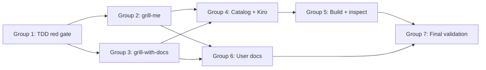

# Implementation Plan: Improve Grill Skills

**Task**: `.maister/tasks/development/2026-07-09-improve-grill-skills`  
**Spec**: `implementation/spec.md`  
**Date**: 2026-07-10  
**Status**: Ready for execution

---

## TL;DR

Seven task groups deliver two explicit-only grilling skills (`grill-me` read-only, `grill-with-docs` docs-maintaining), Kiro inventory bump (67→69), and user-doc parity. **TDD red gate first**: update six synchronized count sites + shortcut mapping + FR-5.4 prohibition grep contract before writing skills. Then rewrite/create `SKILL.md` files, update catalog (both skills get "Explicit request only." per audit H2), extend Kiro `build.sh`, `make build && make validate`, and update four user-doc files.

## Key Decisions

- **D1 — TDD order** — Group 1 updates all structural assertions to 69/43/26 and adds failing prohibition tests; `make validate` must fail (red) before Group 2–3 skill work.
- **D2 — FR-5.4 grep contract (audit H1)** — Five concrete assertion patterns (see Group 1 step 1.5); test source `plugins/maister/skills/*/SKILL.md` and generated `maister-kiro` copies after build.
- **D3 — Explicit-only catalog parity (audit H2)** — Both `grill-me` and `grill-with-docs` catalog entries end with "Explicit request only." in `CLAUDE.md` and `docs/on-demand-skills.md`.
- **D4 — Line-count targets** — `grill-me` target 60–100 lines (FR-1.10); `grill-with-docs` ceiling 60–150 (NFR-1); no shared grilling engine (D2).
- **D5 — Per-term edit gate (audit M4)** — `grill-with-docs`: one confirmed term → one inline `language.md` edit; matches one-question discipline.
- **D6 — Protocol parity note** — Both skills include one-line cross-reference: update both when changing core grilling discipline (audit M5).
- **D7 — Skip FR-5.6** — Cursor skill count 29→30 stays within 27–31 band; no Cursor/Kilo inventory test extension unless count exits band.

## Open Questions / Risks

- **Kiro count drift** — All six sites (Makefile rules 14/23/28 + three Kiro test files) must change atomically in Group 1.
- **FR-5.4 false positives** — Grep contract uses negative lookahead on `proceed to implement`; avoid permissive wording in skill prose.
- **ADR tree missing** — `.maister/docs/decisions/` may not exist; `grill-with-docs` must embed minimal MADR skeleton inline (audit M2).
- **User doc overlap** — Prior task `2026-07-09-on-demand-skills-user-documentation` already documents `grill-me`; this task extends with `grill-with-docs` and convergence/docs-mode distinction without duplicating skill bodies.
- **Behavioral criteria** — FR-1.3–1.8 and FR-2.4–2.6 verified via SKILL.md review + manual session checklist in Group 7 (audit L4).

---

## Overview

**Total task groups:** 7  
**Total steps:** 52  
**Files to create:** 1 (`plugins/maister/skills/grill-with-docs/SKILL.md`)  
**Files to modify:** 14 (see per-group file lists)  
**Expected tests:** 6 Kiro structural assertions + 5 FR-5.4 grep patterns + `make validate` gate

**Dependency chain:**



| Group | Focus | Depends on | Parallel with | Est. steps |
|-------|-------|------------|---------------|------------|
| 1 | TDD red gate | — | — | 8 |
| 2 | Rewrite `grill-me` | 1 | 3 | 8 |
| 3 | Create `grill-with-docs` | 1 | 2 | 10 |
| 4 | Catalog + Kiro generation | 2, 3 | — | 7 |
| 5 | Build + generated inspection | 4 | 6 | 6 |
| 6 | User-facing documentation | 2, 3 | 5 | 9 |
| 7 | Final validation + manual checklist | 5, 6 | — | 4 |

**Complexity estimate:** Medium — no UI or data layer; primary risk is synchronized Kiro inventory and grep-contract discipline across source + four generated platforms.

---

## Task Group 1 — TDD Red Gate: Structural Tests

**Goal:** Update all Kiro inventory assertions and add FR-5.4 prohibition content test. Confirm `make validate` fails (red) before skill implementation.

**Depends on:** None (execute first)

**Files to modify:**

| File | Change |
|------|--------|
| `Makefile` | Rules 14/23/28: 67→69, 25→26, 42→43 |
| `platforms/kiro-cli/tests/build-core.test.sh` | Count assertions 67→69, 25→26 |
| `platforms/kiro-cli/tests/validation.test.sh` | `test_exactly_67_skill_dirs` → 69/43 |
| `platforms/kiro-cli/tests/phase2.test.sh` | Add `/grill-with-docs` shortcut test; add FR-5.4 prohibition test |

### Steps

- [x] **1.1** Read current baseline: `Makefile` L170–204, `build-core.test.sh` L45–56, `validation.test.sh` L78–84, `phase2.test.sh` L96–101

- [x] **1.2** Update **Makefile** rule messages and expected counts (FR-4.4):
  - Rule 14: `67` → `69` total skill directories
  - Rule 23: `25` → `26` unprefixed shortcut directories
  - Rule 28: `42` → `43` `maister-*` directories

- [x] **1.3** Update **`build-core.test.sh`** (FR-5.2): `test_skill_dir_count` expects 69; `test_no_unprefixed_skill_dirs` expects 26; update comments L45–56

- [x] **1.4** Update **`validation.test.sh`** (FR-5.3): rename/update `test_exactly_67_skill_dirs` to expect `total=69` and `prefixed=43`; update assert message L171

- [x] **1.5** Add **`test_grill_with_docs_shortcut`** to `phase2.test.sh` (FR-5.1): after `run_build`, assert `grep -q '/maister-grill-with-docs' "$OUT/skills/grill-with-docs/SKILL.md"` and directory exists

- [x] **1.6** Add **`test_grill_prohibit_implementation`** to `phase2.test.sh` (FR-5.4, audit H1). **Concrete grep contract:**

  | # | Target file(s) | Assertion | Pattern / command |
  |---|----------------|-----------|-------------------|
  | A | `plugins/maister/skills/grill-me/SKILL.md` | Must prohibit plan implementation | `grep -Eiq '(never\|do not\|prohibit).*(implement\|implementation)'` |
  | B | `plugins/maister/skills/grill-with-docs/SKILL.md` | Must prohibit plan implementation | Same as A |
  | C | Both source skills | No permissive implementation language | `! grep -Eiq 'proceed to implement'` |
  | D | `grill-me` source only | Must prohibit doc/code mutation | `grep -Eiq '(never\|do not\|prohibit).*(edit\|mutat).*(documentation\|code\|files?)'` OR `grep -Eiq 'read-only\|no (documentation\|code) edits'` |
  | E | `grill-with-docs` source only | Must prohibit CONTEXT.md convention | `grep -Eiq '(prohibit\|do not\|never).*(CONTEXT\.md\|CONTEXT-MAP\.md)'` |
  | F | Generated `maister-kiro/skills/maister-grill-me/SKILL.md` + `maister-grill-with-docs/SKILL.md` | Prohibition survives build | Repeat pattern A on generated paths (skip if file missing during red gate) |

  Extend `test_grill_thermos_prompts` assert line or add separate assert for `test_grill_prohibit_implementation`.

- [x] **1.7** Run targeted Kiro tests to confirm **RED** (FR-5.5):
  ```bash
  platforms/kiro-cli/tests/build-core.test.sh   # expect fail: 67 ≠ 69
  platforms/kiro-cli/tests/phase2.test.sh       # expect fail: no grill-with-docs + no prohibition text
  ```
  Do **not** proceed to Group 2 until red is confirmed.

- [x] **1.8** **Group 1 gate** — Document red-state evidence in `implementation/work-log.md` (test output snippets).

### Tests for this group (2–8 per group)

1. `build-core.test.sh` — 69 total directories (fails until skill + shortcut exist)
2. `build-core.test.sh` — 26 unprefixed shortcuts (fails until shortcut generated)
3. `validation.test.sh` — 69 total / 43 prefixed (fails until build)
4. `phase2.test.sh` — `/grill-with-docs` maps to `maister-grill-with-docs` (fails until Group 4)
5. `phase2.test.sh` — prohibition grep pattern A on `grill-me` (fails until Group 2)
6. `phase2.test.sh` — prohibition grep pattern B on `grill-with-docs` (fails until Group 3)
7. `phase2.test.sh` — pattern C negative check (fails until Groups 2–3)
8. `phase2.test.sh` — patterns D/E skill-specific (fails until Groups 2–3)

---

## Task Group 2 — Rewrite `grill-me`

**Goal:** Strengthen read-only grilling protocol per FR-1.1–1.11.

**Depends on:** Group 1 (red gate in place)

**Files to modify:**

| File | Change |
|------|--------|
| `plugins/maister/skills/grill-me/SKILL.md` | Full rewrite (~60–100 lines) |

**Template references:** `plugins/maister/skills/thermos/SKILL.md` (frontmatter), `plugins/maister/skills/requirements-critic/SKILL.md` (invocation guard)

### Steps

- [x] **2.1** Read templates: `thermos/SKILL.md` (`disable-model-invocation: true`), `requirements-critic/SKILL.md` (invocation guard block L8–12), upstream inspiration `~/.agents/skills/grilling/SKILL.md` if available

- [x] **2.2** Write frontmatter (FR-1.1, FR-1.11): add `disable-model-invocation: true`; keep `argument-hint`; update description with explicit-only wording

- [x] **2.3** Write **invocation guard** (FR-1.2): trigger phrases ("grill me", "stress-test this plan", "get grilled on"); anti-triggers (writing/describing plans, unrelated tasks, implementation requests)

- [x] **2.4** Write **grilling protocol** (FR-1.3–1.8):
  - One decision question at a time; wait for user feedback
  - Investigate discoverable facts in codebase/docs/config independently
  - Present user-owned decisions with recommended answer + concise rationale
  - Track decision dependencies; walk tree branch by branch
  - Before closing: summarize decisions, assumptions, deferrals, contradictions
  - Require explicit shared-understanding confirmation before ending

- [x] **2.5** Write **prohibitions** (FR-1.9, FR-5.4 patterns): explicit "never implement the plan"; prohibit documentation edits, code edits; include grep-friendly phrases from Group 1 contract (patterns A, C, D)

- [x] **2.6** Add **protocol parity note** (audit M5): one line referencing `grill-with-docs` for docs-aware variant

- [x] **2.7** Verify line count 60–100 (FR-1.10); no session state files or orchestration framework imports

- [x] **2.8** **Group 2 gate** — Run FR-5.4 patterns A, C, D against source file; `grill-me` prohibition tests should pass; `grill-with-docs` tests still fail

### Tests for this group

1. Pattern A on `grill-me/SKILL.md` — pass
2. Pattern C negative — pass
3. Pattern D read-only — pass
4. `grep 'disable-model-invocation: true'` — pass
5. Line count ≤ 100 — pass

---

## Task Group 3 — Create `grill-with-docs`

**Goal:** New explicit-only docs-aware grilling skill per FR-2.1–2.14.

**Depends on:** Group 1 (red gate in place); protocol aligned with Group 2

**Files to create:**

| File | Change |
|------|--------|
| `plugins/maister/skills/grill-with-docs/SKILL.md` | New skill (~60–150 lines) |

**Template references:** Group 2 protocol (duplicated per D2), `linguistic-boundary-verifier/SKILL.md` (boundary contrast), `.maister/docs/standards/global/language-md-convention.md`

### Steps

- [x] **3.1** Create directory `plugins/maister/skills/grill-with-docs/`

- [x] **3.2** Write frontmatter (FR-2.1): `name: grill-with-docs`, `disable-model-invocation: true`, `argument-hint: "[plan or domain topic]"`, description with explicit-only + docs-maintaining intent

- [x] **3.3** Write invocation guard: same trigger/anti-trigger structure as `grill-me`; add anti-trigger for strategic modeling requests (route to `context-distiller` / `aggregate-designer`)

- [x] **3.4** Duplicate **core grilling protocol** from Group 2 (FR-2.2, D2): one question, wait, fact/decision split, convergence gate, no implementation; include protocol parity note

- [x] **3.5** Write **session discovery** (FR-2.3): at start, read `.maister/docs/INDEX.md`, applicable `language.md` files, existing ADRs, relevant code

- [x] **3.6** Write **vocabulary + boundary testing** (FR-2.4–2.6): detect overloaded terms; propose canonical terms; edge-case scenarios; contradiction checks (claims vs code vs docs)

- [x] **3.7** Write **`language.md` maintenance** (FR-2.7–2.8, M4): one confirmed term → one inline edit; if no `language.md`, explain optional adoption per `language-md-convention.md` and ask before creating first file

- [x] **3.8** Write **sparse ADR policy** (FR-2.9–2.10, M2): three significance criteria; detect existing ADR format/location; if none, propose `.maister/docs/decisions/` with inline minimal MADR skeleton (title, status, context, decision, consequences); confirm before first write

- [x] **3.9** Write **boundaries** (FR-2.11–2.13): allow documentation edits; prohibit code implementation (pattern A); prohibit `CONTEXT.md` / `CONTEXT-MAP.md` (pattern E); "Not this skill" section vs `context-distiller`, `aggregate-designer`, `linguistic-boundary-verifier`

- [x] **3.10** Add **cross-links** (FR-2.14): `grill-me` as read-only alternative; `linguistic-boundary-verifier` for read-only audits

### Tests for this group

1. Pattern A on `grill-with-docs/SKILL.md` — pass
2. Pattern C negative — pass
3. Pattern E CONTEXT prohibition — pass
4. `grep 'disable-model-invocation: true'` — pass
5. `grep -i 'language\.md'` — pass (docs integration present)
6. Line count ≤ 150 — pass

---

## Task Group 4 — Plugin Catalog + Kiro Generation

**Goal:** Register both skills in catalog and extend Kiro build pipeline per FR-3, FR-4.

**Depends on:** Groups 2, 3 (skill content exists)

**Files to modify:**

| File | Change |
|------|--------|
| `plugins/maister/CLAUDE.md` | Add `grill-with-docs`; update `grill-me` description (FR-3.1–3.5, H2) |
| `platforms/kiro-cli/build.sh` | `skills_needing_args`, shortcut, reference sed (FR-4.1–4.5) |
| `platforms/cursor/build.sh` | Optional reference sed for `grill-with-docs` (FR-4.5) |

### Steps

- [x] **4.1** Update **`plugins/maister/CLAUDE.md`** Review & Utility Skills table (FR-3.1–3.5):
  - `grill-me`: non-mutating stress-testing; suffix **"Explicit request only."** (FR-3.2)
  - `grill-with-docs`: documentation-maintaining mode with `language.md`/ADR integration; suffix **"Explicit request only."** (FR-3.3, audit H2)
  - Boundaries vs modeling/review skills; standalone cross-links (not Bundle D extension) (FR-3.4)
  - Keep entries short (FR-3.5)

- [x] **4.2** Add `maister-grill-with-docs` to `skills_needing_args` array in `platforms/kiro-cli/build.sh` (FR-4.1) — adjacent to `maister-grill-me` L195

- [x] **4.3** Add shortcut generation (FR-4.2):
  ```bash
  generate_shortcut_skill "grill-with-docs" "Shortcut for /maister-grill-with-docs. Stress-test a plan while maintaining language.md and sparse ADRs." "maister-grill-with-docs"
  ```
  Place after `grill-me` shortcut L729

- [x] **4.4** Add reference sed transforms (FR-4.5): in `build.sh` and optionally `platforms/cursor/build.sh`:
  - `s|run \`grill-with-docs\`|run \`maister-grill-with-docs\`|g`
  - `s|\`grill-with-docs\`|\`maister-grill-with-docs\`|g` (if cross-skill mentions added in SKILL.md)

- [x] **4.5** Verify no `AskUserQuestion` references introduced (FR-4.6); use CHAT GATE pattern if interactive gates needed

- [x] **4.6** **Group 4 gate** — Grep `build.sh` for `grill-with-docs` in `skills_needing_args` and `generate_shortcut_skill`; grep `CLAUDE.md` for both skills with "Explicit request only."

- [x] **4.7** Skim Bundle D paragraph (L564): add optional mention that `grill-with-docs` is standalone alternative for docs-aware grilling — do not extend Bundle D as third step (FR-3.4, D6)

### Tests for this group

1. `grep 'maister-grill-with-docs' platforms/kiro-cli/build.sh` — in `skills_needing_args`
2. `grep 'generate_shortcut_skill "grill-with-docs"' build.sh` — pass
3. `grep 'Explicit request only' plugins/maister/CLAUDE.md` — matches both grill entries
4. `grep 'grill-with-docs' plugins/maister/CLAUDE.md` — catalog entry exists

---

## Task Group 5 — Build + Generated Output Inspection

**Goal:** Regenerate all platform variants and verify naming transforms per FR-6.

**Depends on:** Group 4

**Files affected (generated only via `make build`):**

- `plugins/maister-copilot/skills/grill-with-docs/`
- `plugins/maister-cursor/skills/maister-grill-with-docs/`
- `plugins/maister-kiro/skills/maister-grill-with-docs/` + `grill-with-docs/` shortcut
- `plugins/maister-kilo/skills/` (transformed name)

### Steps

- [x] **5.1** Run `make build` (FR-6.2) — never edit generated trees directly (FR-6.1)

- [x] **5.2** Verify **four-platform presence** (FR-6.3):
  - Copilot: `plugins/maister-copilot/skills/grill-with-docs/SKILL.md`
  - Cursor: `plugins/maister-cursor/skills/maister-grill-with-docs/SKILL.md`
  - Kiro: `maister-grill-with-docs/` + shortcut `grill-with-docs/`
  - Kilo: transformed skill directory exists

- [x] **5.3** Verify **read-only vs docs distinction** in generated content (FR-6.4):
  - `maister-grill-me`: contains pattern D (no doc edits)
  - `maister-grill-with-docs`: contains `language.md` + allows doc edits language; still pattern A (no implementation)

- [x] **5.4** Run FR-5.4 pattern F on generated Kiro skills

- [x] **5.5** Run targeted Kiro tests — should flip to **GREEN** for count + shortcut + prohibition:
  ```bash
  platforms/kiro-cli/tests/build-core.test.sh
  platforms/kiro-cli/tests/validation.test.sh
  platforms/kiro-cli/tests/phase2.test.sh
  ```

- [x] **5.6** Scan generated output for banned APIs (FR-4.6): `grep -r 'AskUserQuestion\|AskQuestion' plugins/maister-kiro/` — expect zero matches

### Tests for this group

1. `build-core.test.sh` — 69/26 — pass
2. `validation.test.sh` — 69/43 — pass
3. `phase2.test.sh` — shortcut + prohibition — pass
4. Four-platform skill directory exists — pass
5. Generated read-only vs docs distinction grep — pass
6. Zero banned interactive APIs — pass

---

## Task Group 6 — User-Facing Documentation

**Goal:** Update four user-doc files with `grill-with-docs` parity per FR-7.

**Depends on:** Groups 2, 3 (skill behavior finalized); can run parallel with Group 5 after skills written

**Files to modify:**

| File | FR | Change |
|------|-----|--------|
| `docs/on-demand-skills.md` | FR-7.1–7.2, 7.6–7.7 | Add `grill-with-docs` catalog entry; when-to-use table; update `grill-me` convergence/docs distinction |
| `docs/commands.md` | FR-7.3 | Add `/maister:grill-with-docs` pseudo-command section mirroring `grill-me` |
| `README.md` | FR-7.4 | Add `/grill-with-docs` to Kiro shortcut list |
| `docs/kiro-cli-support.md` | FR-7.5 | Add shortcut row `/grill-with-docs` → `/maister-grill-with-docs` |

### Steps

- [x] **6.1** Read existing patterns: `docs/on-demand-skills.md` L248–262 (`grill-me` section), `docs/commands.md` L289–297 (`grill-me` pseudo-command), `docs/kiro-cli-support.md` shortcut table L111

- [x] **6.2** Update **`docs/on-demand-skills.md`** §5 catalog (FR-7.1):
  - Add `grill-with-docs` subsection (template: what / when / when-not / invocation / output / suggested next / `SKILL.md` link)
  - Both skills: **"Explicit request only."** (H2)
  - Update `grill-me` with convergence gate + docs-mode distinction (read-only vs `grill-with-docs`)

- [x] **6.3** Add **when-to-use table** (FR-7.2): `grill-me` vs `grill-with-docs` vs `context-distiller` vs `aggregate-designer` vs `linguistic-boundary-verifier`

- [x] **6.4** Update trigger-phrases table (§2) with `grill-with-docs` triggers

- [x] **6.5** Add **`docs/commands.md`** section (FR-7.3):
  ```markdown
  ### `/maister:grill-with-docs`
  **Primary invocation:** Ask explicitly in natural language (e.g., "grill this plan and update language.md"). Cursor users: `/maister-grill-with-docs`.
  ```

- [x] **6.6** Update **`README.md`** Kiro shortcut list (FR-7.4): add `/grill-with-docs`

- [x] **6.7** Update **`docs/kiro-cli-support.md`** shortcut table (FR-7.5): row for `/grill-with-docs` → `/maister-grill-with-docs`

- [x] **6.8** Add cross-links (FR-7.6): `grill-with-docs` → `grill-me`, `linguistic-boundary-verifier`; do not extend Bundle D as third step

- [x] **6.9** Verify no skill algorithm bodies copied (FR-7.7); all depth links to `plugins/maister/skills/*/SKILL.md`

### Tests for this group

1. `grep -c 'grill-with-docs' docs/on-demand-skills.md` — ≥ 3 mentions
2. `grep 'Explicit request only' docs/on-demand-skills.md` — both grill skills
3. `grep '/maister:grill-with-docs' docs/commands.md` — section exists
4. `grep '/grill-with-docs' README.md` — Kiro shortcut listed
5. `grep 'grill-with-docs' docs/kiro-cli-support.md` — shortcut row present
6. When-to-use table includes modeling skill distinctions — manual check

---

## Task Group 7 — Final Validation + Manual Checklist

**Goal:** Full repository quality gate and behavioral acceptance verification per spec acceptance criteria.

**Depends on:** Groups 5, 6

### Steps

- [x] **7.1** Run `make validate` (FR-6.5) — full suite must pass

- [x] **7.2** Optional smoke test (plan L246–249, audit L2): if Cursor CLI available, confirm `/maister-grill-me` and `/maister-grill-with-docs` discoverable in palette

- [x] **7.3** **Manual behavioral checklist** (acceptance #1–2, audit L4):
  - [x] `grill-me` separates facts from decisions in prose
  - [x] One-question-at-a-time discipline documented
  - [x] Convergence confirmation gate present
  - [x] `grill-with-docs` per-term edit gate documented
  - [x] Three ADR significance criteria present
  - [x] "Not this skill" boundaries for three modeling skills

- [x] **7.4** Review **Standards Compliance Checklist** from spec — mark each item pass/fail in `implementation/work-log.md`

### Tests for this group

1. `make validate` — exit 0
2. All 10 spec acceptance criteria — manual review against artifacts
3. No generated drift: `git status plugins/maister-*/` — only expected build outputs

---

## Requirements Traceability

| Spec FR | Task Group(s) |
|---------|---------------|
| FR-1.1–1.11 | 2 |
| FR-2.1–2.14 | 3 |
| FR-3.1–3.5 | 4, 6 |
| FR-4.1–4.6 | 4, 5 |
| FR-5.1–5.5 | 1, 5, 7 |
| FR-5.6 | Skipped (D7) |
| FR-6.1–6.5 | 5, 7 |
| FR-7.1–7.7 | 6 |

## Acceptance Criteria Mapping

| # | Criterion | Verified in |
|---|-----------|-------------|
| 1 | `grill-me` read-only + convergence | Group 2, 7.3 |
| 2 | `grill-with-docs` docs + no implementation | Group 3, 7.3 |
| 3 | Explicit-only + catalog suffix both skills | Groups 4, 6 |
| 4 | No CONTEXT.md / shared engine | Groups 3, 4 |
| 5 | Catalog documents both modes | Group 4 |
| 6 | Kiro 69/43/26 + shortcut | Groups 1, 4, 5 |
| 7 | Four-platform generated skills | Group 5 |
| 8 | User docs updated | Group 6 |
| 9 | `make validate` passes | Group 7 |
| 10 | Prohibition structural test | Groups 1, 5 |
