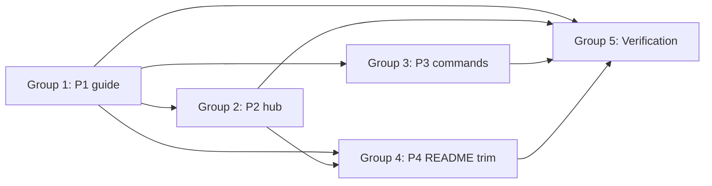

# Implementation Plan: On-Demand Skills User Documentation

**Task**: `.maister/tasks/development/2026-07-09-on-demand-skills-user-documentation`  
**Spec**: `implementation/spec.md`  
**Authoritative plan**: `.maister/plans/2026-07-09-on-demand-skills-user-documentation.md`  
**Date**: 2026-07-09  
**Status**: Ready for execution

---

## TL;DR

Documentation-only deliverable across five task groups (P1–P4 + verification): create `docs/on-demand-skills.md` (primary guide), `docs/README.md` (hub), extend `docs/commands.md` with 10 Wave 1–3 slash entries, and atomically trim `README.md` Quick Commands. Single-source hierarchy — `SKILL.md` for behavior, guide for when/why/bundles, `commands.md` for slash syntax. No plugin or `CLAUDE.md` changes; no `make build` required.

## Key Decisions

- **D1 — Primary guide** — `docs/on-demand-skills.md` is the human-oriented entry (10 catalog subsections covering 12 skills).
- **D2 — Documentation hub** — `docs/README.md` indexes user docs; root `README.md` Learn More links here first.
- **D3 — Single-source hierarchy** — Link to `SKILL.md`; never copy-paste skill bodies or algorithms.
- **D4 — Command naming** — Claude Code `/maister:…` primary; Cursor `/maister-…` hyphen callout in guide §2.
- **D5 — grill-me / thermos** — Explicit natural-language request primary; Cursor `/maister-grill-me` and `/maister-thermos` callout; do **not** assert Claude Code slash commands for these two (spec-audit M2).
- **D6 — thermo-nuclear consolidation** — Document `thermo-nuclear-review` and `thermo-nuclear-code-quality-review` only under the `thermos` catalog entry.
- **D7 — No CLAUDE.md cross-link** — Keep `plugins/maister/CLAUDE.md` unchanged.
- **D8 — Catalog template exception (spec-audit H1)** — `grill-me` and `thermos` lack Recommended Next Steps in `SKILL.md`; derive "Suggested next" from Bundle D context or "see Bundles A–D".
- **D9 — language-md-convention path (spec-audit M1)** — Use full relative path `../.maister/docs/standards/global/language-md-convention.md` from `docs/`.

## Open Questions & Risks

- **P4 atomic trim** — Replace entire README L103–127 (table + four bundle paragraphs) in one edit; partial edits leave stale bundle prose.
- **Hub exclusions** — `docs/README.md` must not index `cursor-agent-implementation-plan.md` or `cursor-e2e-checklist.md`.
- **ADR-008 precision** — `requirements-critic` soft-suggested only in `development`; `transcript-critic` only in `product-design`; never auto-invoked.
- **commands.md grill-me/thermos headings** — Use `/maister:grill-me` and `/maister:thermos` as section headings for grep coverage, but lead paragraph must state explicit-request primary (M2).

---

## Overview

**Total task groups:** 5  
**Total steps:** 32  
**Files to create:** 2 (`docs/on-demand-skills.md`, `docs/README.md`)  
**Files to modify:** 2 (`docs/commands.md`, `README.md`)  
**Out of scope:** `plugins/maister/skills/*/SKILL.md`, `plugins/maister/CLAUDE.md`, generated platform plugins

**Dependency chain:**



| Group | Phase | Depends on | Deliverable | Est. checks |
|-------|-------|------------|-------------|-------------|
| 1 | P1 | — | `docs/on-demand-skills.md` | 8 |
| 2 | P2 | Group 1 | `docs/README.md` | 5 |
| 3 | P3 | Group 1 | `docs/commands.md` +10 entries | 6 |
| 4 | P4 | Groups 1, 2 | `README.md` navigation trim | 4 |
| 5 | Verification | Groups 1–4 | Grep + link audit | 6 |

**Key source files for implementers:**

| Priority | Path | Use |
|----------|------|-----|
| 1 | `plugins/maister/CLAUDE.md` | Bundle A–D names, skill one-liners |
| 2 | `docs/commands.md` | Entry format template (`###`, **When to use**) |
| 3 | `docs/workflows.md` L247+ | Inverse pattern (auto-invoked internal skills) |
| 4 | `docs/kiro-cli-support.md` L5–9 | Hub Related docs block pattern |
| 5 | `plugins/maister/skills/{development,product-design}/SKILL.md` | ADR-008 line refs (~L266–267) |
| 6 | `README.md` L103–127, L356+ | P4 trim targets |

---

## Task Group 1 — P1: `docs/on-demand-skills.md` (highest value)

**Goal:** Create the primary user guide covering all 10 catalog entries (12 skills via `thermos` consolidation), bundles A–D with mermaid, decision tree, and common scenarios.

**Depends on:** None (do first)

**File to create:** `docs/on-demand-skills.md`

### Steps

- [x] **1.1** Read source materials: `plugins/maister/CLAUDE.md` (bundles, skill descriptions), `docs/workflows.md` § Internal Skills (contrast auto vs on-demand), ADR-008 refs in `development/SKILL.md` and `product-design/SKILL.md`

- [x] **1.2** Write **§1 Introduction** (FR-1): on-demand vs orchestrator workflows; manual invocation (slash or explicit request); `disable-model-invocation` / "Explicit request only" in plain language; ADR-008 block with per-skill mapping (`requirements-critic` → `development` only; `transcript-critic` → `product-design` only; soft-suggest, never auto-invoked)

- [x] **1.3** Write **§2 How to invoke** (FR-2): Claude Code `/maister:command` primary; Cursor `/maister-command` hyphen callout; minimal Kiro pointer → `docs/kiro-cli-support.md`; trigger-phrases summary table (not full guard lists)

- [x] **1.4** Write **§3 Decision tree** (FR-3): mermaid diagram "Which skill should I use?" branching by intent (requirements quality, DDD modeling, architecture review, stakeholder communication, branch/PR audit)

- [x] **1.5** Write **§4 Bundles A–D** (FR-4): four subsections each with mermaid flow + manual-chaining note (via Recommended Next Steps, not orchestrator wiring):
  - **A** — transcript-critic → requirements-critic → problem-classifier
  - **B** — problem-classifier → context-distiller → aggregate-designer → linguistic-boundary-verifier
  - **C** — linguistic-boundary-verifier → test-strategy-reviewer → optional thermos (link `../.maister/docs/standards/global/language-md-convention.md` per M1)
  - **D** — metaprogram-classifier → grill-me

- [x] **1.6** Write **§5 Skill catalog — Wave 1** (FR-5): subsections for `transcript-critic`, `requirements-critic`, `problem-classifier` using consistent template (what / when / when-not / command / output type / suggested next / `SKILL.md` link); 2–4 sentences max per skill

- [x] **1.7** Write **§5 Skill catalog — grill-me & thermos** (FR-5, FR-6, H1): explicit natural-language request as primary invocation; Cursor `/maister-grill-me` and `/maister-thermos` callout; do **not** assert `/maister:grill-me` or `/maister:thermos` for Claude Code; `thermos` entry notes it wraps thermo-nuclear-review + thermo-nuclear-code-quality-review; "Suggested next" derived from Bundle D (grill-me) or Bundle C optional step (thermos) — not from `SKILL.md`

- [x] **1.8** Write **§5 Skill catalog — Wave 2** (FR-5): `linguistic-boundary-verifier`, `test-strategy-reviewer`, `metaprogram-classifier`

- [x] **1.9** Write **§5 Skill catalog — Wave 3** (FR-5): `context-distiller`, `aggregate-designer`

- [x] **1.10** Write **§6 Common scenarios** (FR-7): four worked examples — post-meeting notes → implementation; Jira ticket before spec; new domain with resource contention; PR review before merge

- [x] **1.11** Write **§7 Related docs** (FR-8): link `../.maister/docs/standards/global/language-md-convention.md`, `workflows.md`, `commands.md` (M1 full relative paths)

- [x] **1.12** **P1 verification** — run these checks before proceeding to Group 2:
  1. All 10 catalog subsections present (thermo-nuclear consolidated under `thermos`)
  2. Five mermaid diagrams render (decision tree + bundles A–D)
  3. ADR-008 mapping correct per orchestrator
  4. grill-me/thermos use explicit-request primary wording
  5. No large sections copied from any `SKILL.md`
  6. All `SKILL.md` links use `../plugins/maister/skills/<name>/SKILL.md`
  7. Bundle C links to `language-md-convention.md` with correct relative path
  8. Manual-chaining note present in §4

---

## Task Group 2 — P2: `docs/README.md` (documentation hub)

**Goal:** Create the documentation hub as the single navigation entry for all user-facing docs.

**Depends on:** Group 1 (guide must exist to link)

**File to create:** `docs/README.md`

### Steps

- [x] **2.1** Write hub intro (FR-9): "Start here for Maister user documentation."

- [x] **2.2** Write link table (FR-10) modeled on `docs/kiro-cli-support.md` Related docs block:

  | Doc | Purpose |
  |-----|---------|
  | `README.md` (repo root) | Install, first workflow |
  | `on-demand-skills.md` | Wave 1–3 skills, bundles, when to use |
  | `workflows.md` | Orchestrator phases |
  | `commands.md` | Command reference |
  | `cursor-agent-support.md` | Cursor platform guide |
  | `kiro-cli-support.md` | Kiro platform guide |
  | `kilo-cli-support.md` | Kilo platform guide |

- [x] **2.3** Write reading order (FR-11): separate paths for new users (README → hub → guide → commands) vs contributors (`CLAUDE.md` for agent catalog)

- [x] **2.4** **P2 verification** — run these checks:
  1. Hub table includes all required rows (FR-10)
  2. `cursor-agent-implementation-plan.md` **not** indexed (FR-12)
  3. `cursor-e2e-checklist.md` **not** indexed (FR-12)
  4. Link to `on-demand-skills.md` resolves
  5. Reading order section present for both personas

---

## Task Group 3 — P3: `docs/commands.md` extension

**Goal:** Add 10 on-demand skill command entries after the `quick-bugfix` section, each linking back to the guide.

**Depends on:** Group 1 (guide cross-link target must exist)

**File to modify:** `docs/commands.md` (insert after L217 / end of Quick Commands section)

### Entry template

**Standard wrapper skills** (8 entries):

```markdown
### `/maister:<command-name>`

<2–4 sentence lead paragraph describing what the command does.>

**When to use**: <short when-to-use bullets or sentence.>

See [On-Demand Skills Guide](on-demand-skills.md) for when to use.
```

**Explicit-request skills** (grill-me, thermos — per M2):

```markdown
### `/maister:grill-me`

**Primary invocation:** Ask explicitly in natural language (e.g., "grill me on this plan"). Cursor users: `/maister-grill-me`.

<1–2 sentences on what it does.>

**When to use**: <short when-to-use.>

See [On-Demand Skills Guide](on-demand-skills.md) for when to use.
```

### Steps

- [x] **3.1** Insert new H2 **On-Demand Skills** section after `quick-bugfix` block (~L217)

- [x] **3.2** Add entries for requirements/quick skills (FR-13):
  - `/maister:quick-transcript-critic`
  - `/maister:quick-requirements-critic`
  - `/maister:quick-problem-classifier`
  - `/maister:quick-metaprogram-classifier`

- [x] **3.3** Add entries for modeling skills:
  - `/maister:modeling-context-distiller`
  - `/maister:modeling-aggregate-designer`

- [x] **3.4** Add entries for review skills:
  - `/maister:reviews-linguistic-boundaries`
  - `/maister:reviews-test-strategy`

- [x] **3.5** Add `/maister:grill-me` entry using explicit-request lead paragraph (M2); Cursor `/maister-grill-me` callout; closing guide link

- [x] **3.6** Add `/maister:thermos` entry using explicit-request lead paragraph (M2); note wraps thermo-nuclear-review + thermo-nuclear-code-quality-review; Cursor `/maister-thermos` callout; closing guide link

- [x] **3.7** **P3 verification** — run these checks:
  1. Grep script returns zero `MISSING` lines for all 10 commands
  2. Each entry has `See [On-Demand Skills Guide](on-demand-skills.md)` closing line (FR-14)
  3. grill-me/thermos entries lead with explicit-request wording
  4. thermos entry mentions both thermo-nuclear sub-skills
  5. Entry format mirrors existing `### /maister:…` pattern
  6. Section placed after Quick Commands, not before orchestrator entries

---

## Task Group 4 — P4: `README.md` navigation trim

**Goal:** Point root README to the hub and guide; remove duplicate bundle prose atomically.

**Depends on:** Groups 1, 2 (hub and guide URLs must be stable)

**File to modify:** `README.md`

### Steps

- [x] **4.1** Update **§ Learn More** (FR-15, ~L356): add `[Documentation Hub](docs/README.md)` as the **first** link, before `workflows.md`

- [x] **4.2** **Atomic replace** § Quick Commands (FR-16, L103–127): remove entire 10-row table + four bundle paragraphs; replace with:
  - One-line summary of on-demand skills (manual invocation, not orchestrator phases)
  - Link to `docs/on-demand-skills.md` (full guide with bundles A–D)
  - Link to `docs/commands.md` (slash command reference)
  - **Do not** retain any bundle prose or partial table rows

- [x] **4.3** **P4 verification** — run these checks:
  1. `docs/README.md` is first link in Learn More
  2. Quick Commands section has no bundle A–D paragraphs
  3. Quick Commands section has no 10-row command table
  4. Links to `docs/on-demand-skills.md` and `docs/commands.md` present

---

## Task Group 5 — Verification (grep script, link check)

**Goal:** Confirm link coverage, command completeness, and navigation integrity across all deliverables.

**Depends on:** Groups 1–4 complete

### Steps

- [x] **5.1** Run link sanity grep:

```bash
grep -r 'on-demand-skills' README.md docs/
```

Expected: hits in `README.md`, `docs/README.md`, `docs/on-demand-skills.md`, `docs/commands.md` (10 guide links)

- [x] **5.2** Run command coverage grep:

```bash
for cmd in quick-transcript-critic quick-requirements-critic quick-problem-classifier \
  quick-metaprogram-classifier modeling-context-distiller modeling-aggregate-designer \
  reviews-linguistic-boundaries reviews-test-strategy grill-me thermos; do
  grep -q "maister:${cmd}" docs/commands.md || echo "MISSING: $cmd"
done
```

Expected: zero `MISSING` output

- [x] **5.3** Manual relative-link click-through within `docs/`:
  - Hub → guide, workflows, commands, platform guides
  - Guide → each `SKILL.md` link (spot-check 3+)
  - Guide → `language-md-convention.md`
  - Commands → guide (spot-check 3+ entries)

- [x] **5.4** Confirm no plugin changes: `git diff --name-only` shows only `docs/on-demand-skills.md`, `docs/README.md`, `docs/commands.md`, `README.md`

- [x] **5.5** Confirm `CLAUDE.md` unchanged (D7)

- [x] **5.6** Final acceptance criteria checklist (FR success criteria):
  1. New user finds all user docs starting from `docs/README.md`
  2. All 12 Wave 1–3 skills covered (10 catalog entries; thermo-nuclear via `thermos`)
  3. Bundles A–D with mermaid flows and manual-chaining note
  4. Manual vs orchestrator invocation clearly stated; ADR-008 correct
  5. `docs/commands.md` has all 10 entries with guide links
  6. `README.md` links to hub and guide; no stale bundle prose
  7. Internal links resolve
  8. No large `SKILL.md` copy-paste
  9. Grep script passes
  10. grill-me/thermos explicit-request + Cursor callout; no false Claude slash assertions

---

## Files Summary

| Action | Path | Group |
|--------|------|-------|
| **Create** | `docs/on-demand-skills.md` | 1 |
| **Create** | `docs/README.md` | 2 |
| **Modify** | `docs/commands.md` | 3 |
| **Modify** | `README.md` | 4 |

**Do not modify:** `plugins/maister/skills/*/SKILL.md`, `plugins/maister/CLAUDE.md`, `plugins/maister-cursor/`, `plugins/maister-copilot/`, `plugins/maister-kiro/`

---

## Standards Compliance

- **Plugin development** (`.maister/docs/standards/global/plugin-development.md`) — `SKILL.md` as source of truth; commands as thin wrappers; user docs navigational only
- **Conventions** (`.maister/docs/standards/global/conventions.md`) — English; relative links; H1/H2/H3 consistent with existing `docs/`
- **Never edit generated files** — documentation lives in repo `docs/` only
