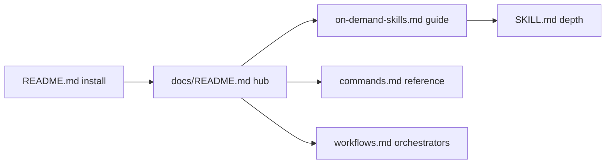

# Specification: On-Demand Skills User Documentation

**Task**: `.maister/tasks/development/2026-07-09-on-demand-skills-user-documentation`  
**Authoritative plan**: `.maister/plans/2026-07-09-on-demand-skills-user-documentation.md`  
**Date**: 2026-07-09  
**Status**: Implementation-ready

## TL;DR

Documentation-only deliverable: create `docs/on-demand-skills.md` (user guide) and `docs/README.md` (hub), extend `docs/commands.md` with 10 Wave 1–3 entries, and trim `README.md` navigation. Single-source hierarchy — `SKILL.md` for behavior, guide for when/why, `commands.md` for slash syntax. `grill-me` and `thermos` document explicit natural-language invocation plus Cursor `/maister-grill-me` and `/maister-thermos` callouts; thermo-nuclear sub-skills appear only under `thermos`. No plugin or `CLAUDE.md` changes.

## Key Decisions

- **D1 — Primary guide** — `docs/on-demand-skills.md` is the human-oriented entry for Wave 1–3 on-demand skills.
- **D2 — Documentation hub** — `docs/README.md` indexes all user-facing docs; root `README.md` Learn More links here first.
- **D3 — Single-source hierarchy** — `SKILL.md` = behavior; guide = when/why/bundles; `commands.md` = slash reference; no copy-paste of skill bodies.
- **D4 — Command naming** — Claude Code `/maister:…` primary; short Cursor `/maister-…` hyphen callout in guide §2.
- **D5 — grill-me / thermos invocation** — Explicit natural-language request primary; Cursor `/maister-grill-me` and `/maister-thermos` callout; do not assert Claude Code slash commands for these two skills.
- **D6 — thermo-nuclear consolidation** — Document `thermo-nuclear-review` and `thermo-nuclear-code-quality-review` only via the combined `thermos` catalog entry (10 catalog subsections, not 12).
- **D7 — No CLAUDE.md cross-link** — Keep `plugins/maister/CLAUDE.md` unchanged (agent-only catalog).
- **D8 — Kiro detail** — Minimal callout in guide; defer shortcut detail to `docs/kiro-cli-support.md`.
- **D9 — Visuals** — Mermaid only for Bundle A–D flows and the skill-selection decision tree; no mockups.

## Open Questions / Risks

- **README ↔ guide drift** — P4 must replace the entire Quick Commands block (table + bundle paragraphs) atomically; partial edits leave stale bundle prose.
- **Internal docs in hub** — `docs/README.md` must exclude `cursor-agent-implementation-plan.md` and `cursor-e2e-checklist.md`.
- **ADR-008 precision** — `requirements-critic` soft-suggested only in `development`; `transcript-critic` only in `product-design`; never auto-invoked.

---

## Goal

Give Maister users a single navigable path — `README.md` → `docs/README.md` → `docs/on-demand-skills.md` — to discover all 12 Wave 1–3 on-demand skills, understand when to invoke them manually (vs orchestrator phases), chain them via Bundles A–D, and find slash-command syntax in `docs/commands.md`, without duplicating `SKILL.md` behavioral specs.

## User Stories

- As a **new Maister user**, I want a documentation hub and on-demand skills guide so I can answer "which skill do I need?" without reading agent-oriented `CLAUDE.md` or individual `SKILL.md` files.
- As a **practitioner chaining skills**, I want Bundle A–D flows with mermaid diagrams and common scenarios so I know how to manually chain transcript-critic → requirements-critic → problem-classifier (and similar) outside `/maister:development`.
- As a **Cursor Agent user**, I want a clear platform callout for `/maister-…` hyphen commands and explicit-request wording for `grill-me` and `thermos` so I invoke skills correctly on my platform.
- As a **contributor**, I want `SKILL.md` to remain the behavioral source of truth with the user guide linking to it, so documentation updates do not fork skill behavior.
- As a **maintainer**, I want README Quick Commands trimmed to one-liner + links so bundle descriptions live in one place and do not drift.

## Core Requirements

### P1 — `docs/on-demand-skills.md` (primary guide)

1. **FR-1 Introduction** — Explain on-demand vs orchestrator workflows; manual invocation (slash command or explicit request); `disable-model-invocation` / "Explicit request only" in plain language; ADR-008 block mapping `requirements-critic` → `development` only, `transcript-critic` → `product-design` only (soft-suggest, never auto-invoked).
2. **FR-2 How to invoke** — Claude Code `/maister:command` as primary; Cursor `/maister-command` hyphen callout; minimal Kiro pointer linking to `docs/kiro-cli-support.md`; trigger-phrases summary table (not full guard lists).
3. **FR-3 Decision tree** — Mermaid diagram: "Which skill should I use?" branching by user intent (requirements quality, DDD modeling, architecture review, stakeholder communication, branch/PR audit).
4. **FR-4 Bundles A–D** — Four subsections with mermaid flow diagrams:
   - **A** — transcript-critic → requirements-critic → problem-classifier
   - **B** — problem-classifier → context-distiller → aggregate-designer → linguistic-boundary-verifier
   - **C** — linguistic-boundary-verifier → test-strategy-reviewer → optional thermos
   - **D** — metaprogram-classifier → grill-me  
   State chains are manual via each skill's Recommended Next Steps, not orchestrator wiring.
5. **FR-5 Skill catalog** — Ten subsections using consistent template (what / when / when-not / command or explicit-request / output type / suggested next / link to `../plugins/maister/skills/<name>/SKILL.md`):
   - Wave 1: transcript-critic, requirements-critic, problem-classifier, grill-me, thermos (covers thermo-nuclear-review + thermo-nuclear-code-quality-review)
   - Wave 2: linguistic-boundary-verifier, test-strategy-reviewer, metaprogram-classifier
   - Wave 3: context-distiller, aggregate-designer  
   Each subsection: 2–4 sentences max; link to `SKILL.md` for depth; no algorithm copy-paste.
6. **FR-6 grill-me / thermos wording** — Document primary invocation as explicit natural-language request; add Cursor `/maister-grill-me` and `/maister-thermos` callout; do not assert `/maister:grill-me` or `/maister:thermos` for Claude Code.
7. **FR-7 Common scenarios** — Four worked examples: post-meeting notes → implementation; Jira ticket before spec; new domain with resource contention; PR review before merge.
8. **FR-8 Related docs** — Link `language-md-convention.md` (Bundle C), `docs/workflows.md`, `docs/commands.md`.

### P2 — `docs/README.md` (documentation hub)

9. **FR-9 Hub intro** — "Start here for Maister user documentation."
10. **FR-10 Link table** — Rows: root `README.md` (install/first workflow), `on-demand-skills.md`, `workflows.md`, `commands.md`, platform guides (`cursor-agent-support.md`, `kiro-cli-support.md`, `kilo-cli-support.md`); model Related docs block from `docs/kiro-cli-support.md`.
11. **FR-11 Reading order** — Separate paths for new users vs contributors (`CLAUDE.md` for agent catalog).
12. **FR-12 Hub exclusions** — Do not index `cursor-agent-implementation-plan.md` or `cursor-e2e-checklist.md`.

### P3 — `docs/commands.md` extension

13. **FR-13 Ten new entries** — Insert after `quick-bugfix` section (~line 217), new H2 **On-Demand Skills** (or split mirroring `CLAUDE.md` groupings):
    - `/maister:quick-transcript-critic`
    - `/maister:quick-requirements-critic`
    - `/maister:quick-problem-classifier`
    - `/maister:quick-metaprogram-classifier`
    - `/maister:modeling-context-distiller`
    - `/maister:modeling-aggregate-designer`
    - `/maister:reviews-linguistic-boundaries`
    - `/maister:reviews-test-strategy`
    - `/maister:grill-me` — explicit-request primary + Cursor callout (per FR-6)
    - `/maister:thermos` — explicit-request primary + Cursor callout; note wraps thermo-nuclear-review + thermo-nuclear-code-quality-review
14. **FR-14 Entry format** — Mirror existing `### /maister:…` pattern: lead paragraph, optional flags, **When to use**, closing line: `See [On-Demand Skills Guide](on-demand-skills.md) for when to use.`

### P4 — `README.md` navigation trim

15. **FR-15 Learn More** — Add `docs/README.md` as **first** link in § Learn More (before `workflows.md`).
16. **FR-16 Quick Commands trim** — Replace L103–127 table + four bundle paragraphs with: one-line summary of on-demand skills, link to `docs/on-demand-skills.md`, link to `docs/commands.md`; atomic single edit (no partial retention of bundle prose).

### Cross-cutting

17. **FR-17 Language** — English throughout; relative links within `docs/`.
18. **FR-18 No plugin changes** — Do not modify `plugins/maister/skills/*/SKILL.md`, `plugins/maister/CLAUDE.md`, or generated platform plugins; no `make build` required.
19. **FR-19 Verification** — Run plan grep script for link sanity and command coverage; manual click-through of relative links.

## Reusable Components

### Existing Code to Leverage

| Component | Path | Reuse |
|-----------|------|-------|
| Authoritative plan | `.maister/plans/2026-07-09-on-demand-skills-user-documentation.md` | Section outlines, acceptance criteria, verification script |
| Command entry format | `docs/commands.md` | `###` heading, **When to use**, flag tables |
| Hub Related docs pattern | `docs/kiro-cli-support.md` L5–9 | Top-of-doc cross-link block |
| Orchestrator inverse pattern | `docs/workflows.md` § Internal Skills (~L247+) | Contrast: auto-invoked vs user-called on-demand skills |
| Bundle naming & one-liners | `plugins/maister/CLAUDE.md` | Bundle A–D names, skill descriptions (link, don't copy) |
| Quick Commands content source | `README.md` L103–127 | One-liners for command entries |
| Skill behavioral depth | `plugins/maister/skills/*/SKILL.md` | Link targets; ADR-008 line refs (~L266–267 in development/product-design) |
| Command wrapper names | `plugins/maister/commands/*.md` | Confirmed slash names for 8 wrapped skills |
| Language convention | `.maister/docs/standards/global/language-md-convention.md` | Bundle C reference |

### New Components Required

| Component | Why new |
|-----------|---------|
| `docs/on-demand-skills.md` | No human-oriented on-demand skills guide exists |
| `docs/README.md` | No `docs/` hub; root README § Learn More is de facto index |

### Files to Modify (not new)

| Path | Change |
|------|--------|
| `docs/commands.md` | +10 on-demand command entries after quick-bugfix |
| `README.md` | Learn More hub link; Quick Commands trim |

## Technical Approach

### Documentation Architecture

```
SKILL.md (plugins/maister/skills/<name>/)
    ↑ link for depth
docs/on-demand-skills.md  ← when/why, bundles, decision tree, 10 catalog entries
    ↑ cross-link
docs/commands.md          ← slash syntax, short when-to-use
    ↑ indexed by
docs/README.md            ← hub, reading order
    ↑ first link from
README.md                 ← onboarding, trimmed Quick Commands
```

### User Journey



### Per-Skill Catalog Template (`on-demand-skills.md` §5)

Each of the 10 catalog subsections MUST include:

| Field | Content |
|-------|---------|
| What it does | 2–4 sentences |
| When to use / when not | Bullet pairs |
| Command | Slash command OR explicit-request + platform callout (grill-me, thermos) |
| Output type | Report vs interactive session |
| Suggested next | Skill name from Recommended Next Steps |
| Deep dive | `[SKILL.md](../plugins/maister/skills/<name>/SKILL.md)` |

### Implementation Phases (execution order)

| Phase | Deliverable | Depends on |
|-------|-------------|------------|
| P1 | `docs/on-demand-skills.md` | — |
| P2 | `docs/README.md` | P1 (links to guide) |
| P3 | `docs/commands.md` extension | P1 (guide cross-links) |
| P4 | `README.md` trim | P1, P2 (hub + guide URLs stable) |

### Link Conventions

- Within `docs/`: `[On-Demand Skills Guide](on-demand-skills.md)`
- To skills: `../plugins/maister/skills/<name>/SKILL.md` (relative from `docs/`)
- To standards: `../.maister/docs/standards/global/language-md-convention.md`
- Root README: `docs/on-demand-skills.md`, `docs/README.md`

## Implementation Guidance

### Testing Approach

Documentation-only — no automated test suite. Per phase, run 2–8 manual verification checks:

| Phase | Checks (examples) |
|-------|-------------------|
| P1 | All 10 catalog entries present; mermaid renders; ADR-008 correct; grill-me/thermos explicit-request wording; no SKILL.md body copy-paste |
| P2 | Hub table complete; internal WIP docs excluded; reading order present |
| P3 | All 10 commands in grep script pass; each entry links to guide |
| P4 | README has hub first in Learn More; Quick Commands block fully replaced; no duplicate bundle prose |

**Verification script** (from plan):

```bash
grep -r 'on-demand-skills' README.md docs/

for cmd in quick-transcript-critic quick-requirements-critic quick-problem-classifier \
  quick-metaprogram-classifier modeling-context-distiller modeling-aggregate-designer \
  reviews-linguistic-boundaries reviews-test-strategy grill-me thermos; do
  grep -q "maister:${cmd}" docs/commands.md || echo "MISSING: $cmd"
done
```

### Standards Compliance

- **Plugin development** (`.maister/docs/standards/global/plugin-development.md`) — `SKILL.md` as source of truth; commands as thin wrappers; user docs navigational, not behavioral duplicates.
- **Conventions** (`.maister/docs/standards/global/conventions.md`) — English docs; relative links; H1/H2/H3 structure consistent with existing `docs/`.
- **Never edit generated files** (`plugins/maister-cursor/`, etc.) — documentation lives in repo `docs/` only.

## Out of Scope

- Changes to `plugins/maister/skills/*/SKILL.md`
- `plugins/maister/CLAUDE.md` cross-link (per D7)
- Platform build / generated plugin changes
- Polish translation
- Copy-pasting wizard steps or algorithms from `SKILL.md`
- Creating command wrappers for `grill-me`, `thermos`, or thermo-nuclear skills
- Mockups or screenshots (mermaid only per D9)

## Success Criteria

- [ ] New user finds all user docs starting from `docs/README.md`
- [ ] All 12 Wave 1–3 skills covered in guide (10 catalog entries; thermo-nuclear via `thermos`)
- [ ] Bundles A–D explained with mermaid flows and manual-chaining note
- [ ] Manual vs orchestrator invocation clearly stated; ADR-008 per-skill mapping correct
- [ ] `docs/commands.md` contains all 10 Wave 1–3 command entries with guide links
- [ ] `README.md` links to hub and guide; no stale duplicate bundle prose
- [ ] Internal links resolve (relative paths within `docs/`)
- [ ] No large sections copied from `SKILL.md`
- [ ] Plan verification grep script passes with zero MISSING lines
- [ ] `grill-me` and `thermos` document explicit-request + Cursor callout; no false Claude slash assertions
