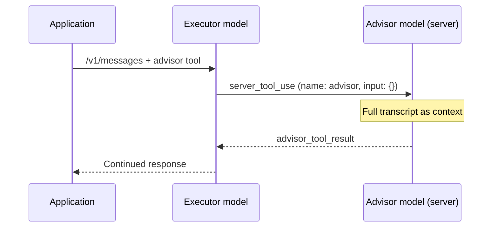

# External Findings: Anthropic Advisor Tool & AskUserQuestion Subagent Constraints

## TL;DR

Anthropic’s **Advisor Tool** (`advisor_20260301`, beta header `advisor-tool-2026-03-01`) is a **Claude Messages API server-side tool** that pairs a faster executor model with a higher-tier advisor model for **mid-generation strategic guidance** — not for answering structured phase-gate questions. It runs inside a single `/v1/messages` request, is available only on Claude API / Claude Platform on AWS (not Bedrock/Vertex/Foundry), and is **not exposable via Maister markdown plugin instructions**. Separately, **`AskUserQuestion` is unavailable in all subagent contexts** (confirmed in current Claude Code docs and multiple GitHub issues); escalation to the parent orchestrator via structured return values or resume is the documented community pattern. **Maister advisor mode for gates must live at orchestrator (parent) level**, likely as a Task-tool advisor subagent fallback rather than native Advisor Tool API.

## Open Questions / Risks

- **Semantic mismatch**: Anthropic Advisor Tool optimizes executor/advisor *during generation*; Maister needs advisor *at gate boundaries* — analogous but not identical; synthesis must not conflate them.
- **Platform portability**: Native Advisor Tool is API-only (beta); Cursor/Copilot/Kiro/Codex cannot use it without a custom API proxy (explicitly out of scope per research brief).
- **Docs drift**: GitHub issues (#34592, #40263) reported foreground pass-through docs that contradicted behavior; current [sub-agents docs](https://code.claude.com/docs/en/sub-agents) now explicitly ban `AskUserQuestion` in subagents — verify platform-transform gatherer reflects latest wording.
- **Skill context regressions**: Issues report `AskUserQuestion` missing even in main-session skills (#34592 comment on v2.1.83) — may affect orchestrator skills, not just subagents.
- **Encrypted advisor results**: Fable/Mythos advisors return `advisor_redacted_result`; only Opus 4.8+ returns plaintext — relevant if Maister ever wraps the API directly.

---

## Research Scope

**Sub-question SQ5** (research plan): What does Anthropic Advisor Tool specify (executor/advisor split, consultation flow, constraints)?

**Additional focus** (task brief): GitHub issues on `AskUserQuestion` subagent limitations and escalation patterns — directly constrains where Maister advisor mode can attach (orchestrator parent only).

**Confidence**: **High** for Advisor Tool API shape and platform availability (primary Anthropic doc). **High** for subagent `AskUserQuestion` unavailability (current Claude Code docs + convergent GitHub reports). **Medium** for escalation patterns (community/issue-sourced, not official Anthropic “best practice” box).

---

## 1. Anthropic Advisor Tool — Overview

### 1.1 Purpose and executor/advisor split

**Source**: [Advisor tool — Anthropic Platform Docs](https://platform.claude.com/docs/en/agents-and-tools/tool-use/advisor-tool)

The advisor tool pairs a **faster, lower-cost executor model** with a **higher-intelligence advisor model** that provides strategic guidance **mid-generation**. The advisor reads the full conversation, produces a plan or course correction, and the executor continues.

> *"This pattern fits long-horizon agentic workloads (coding agents, computer use, multi-step research pipelines) where most turns are mechanical but having an excellent plan is crucial. You get close to advisor-solo quality while the bulk of token generation happens at executor-model rates."*

**Confidence**: High — direct documentation quote.

### 1.2 When to use (and when not to)

**Source**: [Advisor tool — When to use it](https://platform.claude.com/docs/en/agents-and-tools/tool-use/advisor-tool#when-to-use-it)

| Configuration | Guidance |
|---------------|----------|
| Sonnet on complex tasks | Add higher-tier advisor; Opus keeps cost similar or lower; Fable 5 maximizes quality lift |
| Haiku wanting step up | Add Opus or Fable advisor; higher cost than Haiku alone, lower than switching executor |
| **Weaker fit** | Single-turn Q&A, pure pass-through model pickers, workloads where every turn needs full advisor capability |

**Maister implication**: Phase-gate Q&A is closer to **single-turn structured decisions** at boundaries than continuous mid-generation planning — Advisor Tool is a partial inspiration, not a drop-in.

**Confidence**: High.

### 1.3 Platform availability

**Source**: [Advisor tool — Platform availability](https://platform.claude.com/docs/en/agents-and-tools/tool-use/advisor-tool#platform-availability)

> *"The advisor tool is available in beta on the Claude API and on Claude Platform on AWS. It is not currently available on Amazon Bedrock, Google Cloud, or Microsoft Foundry."*

Also eligible for **Zero Data Retention (ZDR)** when org has ZDR arrangement.

**Confidence**: High.

---

## 2. API Shape (`advisor_20260301`)

### 2.1 Beta header and tool definition

**Source**: [Advisor tool — Quick start](https://platform.claude.com/docs/en/agents-and-tools/tool-use/advisor-tool#quick-start)

- **Beta header**: `advisor-tool-2026-03-01` (via `anthropic-beta` header or SDK `betas` array)
- **Tool type**: `"advisor_20260301"`
- **Tool name**: must be `"advisor"`
- **Advisor model**: specified in tool definition `model` field (e.g. `claude-fable-5`, `claude-opus-4-8`)

```json
{
  "model": "claude-sonnet-5",
  "max_tokens": 4096,
  "tools": [
    {
      "type": "advisor_20260301",
      "name": "advisor",
      "model": "claude-fable-5"
    }
  ],
  "messages": [{ "role": "user", "content": "..." }]
}
```

**Confidence**: High.

### 2.2 Tool parameters

**Source**: [Advisor tool — Tool parameters](https://platform.claude.com/docs/en/agents-and-tools/tool-use/advisor-tool#tool-parameters)

| Parameter | Type | Default | Description |
|-----------|------|---------|-------------|
| `type` | string | required | Must be `"advisor_20260301"` |
| `name` | string | required | Must be `"advisor"` |
| `model` | string | required | Advisor model ID; billed at advisor model rates |
| `max_uses` | integer | unlimited | Per-**request** cap; further calls return `max_uses_exceeded` |
| `max_tokens` | integer | advisor output cap | Min 1024; caps advisor thinking + text per call |
| `caching` | object | null | `{"type": "ephemeral", "ttl": "5m" \| "1h"}` for advisor-side prompt caching |

Also accepts generic tool properties: `cache_control`, `allowed_callers`, `defer_loading`, `strict`.

**Confidence**: High.

### 2.3 Model compatibility matrix (summary)

**Source**: [Advisor tool — Model compatibility](https://platform.claude.com/docs/en/agents-and-tools/tool-use/advisor-tool#model-compatibility)

Rules:
- Advisor must be **Claude Sonnet 4.6 or more capable**
- Advisor must be **≥ executor capability**
- Invalid pairs → `400 invalid_request_error`

| Executor examples | Valid advisor examples |
|-------------------|------------------------|
| Haiku 4.5 | Fable 5, Mythos 5, Opus 4.6–4.8, Sonnet 4.6 |
| Sonnet 4.6 / Sonnet 5 | Fable 5, Mythos 5, Opus 4.6–4.8 (Sonnet 4.6 for Sonnet 4.6 executor) |
| Opus 4.6–4.8 | Fable 5, Mythos 5, Opus 4.6–4.8 |
| Fable 5 | Fable 5 only |
| Mythos 5 | Mythos 5 only |

**Confidence**: High.

---

## 3. Consultation Flow

### 3.1 Single-request server-side loop

**Source**: [Advisor tool — How it works](https://platform.claude.com/docs/en/agents-and-tools/tool-use/advisor-tool#how-it-works)



Steps:
1. Executor emits `server_tool_use` with `name: "advisor"` and **empty `input`** — server supplies context.
2. Anthropic runs separate inference on advisor model server-side (Anthropic system prompt + full transcript).
3. Advisor response returns as `advisor_tool_result`.
4. Executor continues generating.

> *"All of this happens inside a single `/v1/messages` request, with no extra round trips on your side."*

Exception: turn may pause with `stop_reason: "pause_turn"` — resume with follow-up request.

**Advisor constraints**: runs **without tools**, **without context management**; thinking blocks dropped; only advice text reaches executor.

**Confidence**: High.

### 3.2 Response structure

**Source**: [Advisor tool — Response structure](https://platform.claude.com/docs/en/agents-and-tools/tool-use/advisor-tool#response-structure)

Successful call sequence in assistant `content`:
1. Optional executor text
2. `server_tool_use` (`input: {}` always)
3. `advisor_tool_result`
4. Executor continuation text

**Result variants** (`advisor_tool_result.content`):

| Variant | Fields | When |
|---------|--------|------|
| `advisor_result` | `text`, `stop_reason` | Plaintext advisors (e.g. Opus 4.8) |
| `advisor_redacted_result` | `encrypted_content`, `stop_reason` | Fable 5, Mythos 5 — client cannot read; server decrypts for executor on next turn |

**Error results** (`advisor_tool_result_error`): `max_uses_exceeded`, `too_many_requests`, `overloaded`, `prompt_too_long`, `execution_time_exceeded`, `unavailable` — executor continues; request does not fail.

**Confidence**: High.

### 3.3 Multi-turn and pause/resume

**Source**: [Advisor tool — Multi-turn conversations](https://platform.claude.com/docs/en/agents-and-tools/tool-use/advisor-tool#multi-turn-conversations), [Resuming a paused turn](https://platform.claude.com/docs/en/agents-and-tools/tool-use/advisor-tool#resuming-a-paused-turn)

- Must pass full assistant content including `advisor_tool_result` blocks on subsequent turns.
- Omitting advisor tool from `tools` while history contains `advisor_tool_result` → `400 invalid_request_error`.
- No built-in **conversation-level** cap — client must count calls and strip history when removing tool.
- `pause_turn`: append assistant message unchanged, re-send with same advisor tool + beta header (no user message or tool_result needed).
- Mixing client tools + pending advisor: send `tool_result` blocks; pending advisor runs at start of next request.

**Confidence**: High.

### 3.4 Executor-initiated vs forced consultation

- **Default**: Executor decides when to call advisor (like any tool).
- **Force**: `tool_choice: {"type": "tool", "name": "advisor"}` — cannot combine with extended thinking (`400`).
- **Nudge pattern** (Haiku under-calling): inject user message before turn 2 if no advisor call yet (~7pp pass-rate lift on Haiku in Anthropic testing); harmful on Opus.

**Source**: [Mid-conversation nudge](https://platform.claude.com/docs/en/agents-and-tools/tool-use/advisor-tool#mid-conversation-nudge-for-under-calling-executors), [Forcing tool use](https://platform.claude.com/docs/en/agents-and-tools/tool-use/advisor-tool#mid-conversation-nudge-for-under-calling-executors)

**Confidence**: High.

---

## 4. Limitations and Operational Constraints

### 4.1 Billing and usage

**Source**: [Advisor tool — Usage and billing](https://platform.claude.com/docs/en/agents-and-tools/tool-use/advisor-tool#usage-and-billing)

- Advisor billed separately at advisor model rates in `usage.iterations[]` (`type: "advisor_message"`).
- Top-level `usage` reflects executor tokens only.
- Typical advisor output: 400–700 text tokens (1,400–1,800 with thinking); savings from executor doing bulk generation.
- Top-level `max_tokens` bounds **executor only**, not advisor sub-inference.
- Priority Tier applies per model independently.

**Confidence**: High.

### 4.2 Streaming

**Source**: [Advisor tool — Streaming](https://platform.claude.com/docs/en/agents-and-tools/tool-use/advisor-tool#streaming)

Advisor sub-inference does **not** stream; executor stream pauses until full `advisor_tool_result` arrives in one `content_block_start`.

**Confidence**: High.

### 4.3 Combining with other tools

**Source**: [Advisor tool — Combining with other tools](https://platform.claude.com/docs/en/agents-and-tools/tool-use/advisor-tool#combining-with-other-tools)

- Composes with web search, bash, custom tools in same `tools` array.
- Batch processing supported.
- `clear_tool_uses` not fully compatible with advisor blocks.
- `pause_turn` behavior documented for mixed server/client tools.

**Confidence**: High.

### 4.4 Cost control and caching

**Source**: [Cost control](https://platform.claude.com/docs/en/agents-and-tools/tool-use/advisor-tool#cost-control), [Advisor prompt caching](https://platform.claude.com/docs/en/agents-and-tools/tool-use/advisor-tool#advisor-prompt-caching)

- Per-request: `max_uses` on tool definition.
- Per-conversation: client-side counting; remove tool + strip `advisor_tool_result` from history when cap hit.
- Advisor-side `caching`: breaks even at ~3+ advisor calls per conversation.
- `clear_thinking` with `keep` other than `"all"` causes advisor cache misses.

**Confidence**: High.

---

## 5. Distinction from Maister “Advisor Mode” (Gate Answering)

| Dimension | Anthropic Advisor Tool | Maister advisor mode (research intent) |
|-----------|------------------------|----------------------------------------|
| **Trigger** | Executor model decides during generation | Orchestrator hits `MANDATORY GATE` / `AskUserQuestion` |
| **Question source** | Implicit (executor uncertainty) | Explicit structured gate (options, phase context) |
| **Mechanism** | Server-side `advisor_20260301` in Messages API | Plugin markdown instructions + platform tools |
| **Who answers** | Advice to executor; executor still generates | Advisor recommends a gate option; user replacement requires a separate host mechanism |
| **Subagent access** | N/A (API feature) | Subagents cannot use `AskUserQuestion` — parent only |
| **Multi-platform** | Claude API / AWS only | Must work across Cursor, Copilot, Kiro, Codex via transforms |

**Conclusion**: Maister should treat Anthropic Advisor Tool as a **literature reference for executor/advisor model separation and cost/quality tradeoffs**, not as an implementable gate mechanism in `plugins/maister/`. Portable pattern per research plan fallback: **Task-tool advisor subagent at orchestrator level** with separate `model:` frontmatter.

**Confidence**: High (inferred from doc semantics + research brief constraints).

---

## 6. AskUserQuestion in Subagents — Official Position

### 6.1 Current Claude Code documentation

**Source**: [Subagents — Control subagent capabilities — Available tools](https://code.claude.com/docs/en/sub-agents#control-subagent-capabilities)

> *"The following tools depend on the main conversation's UI or session state and aren't available to subagents, even when listed in the `tools` field:*
> - *`AskUserQuestion`*
> - *`EnterPlanMode`*
> - *`ExitPlanMode`, unless the subagent's `permissionMode` is `plan`*
> - *`ScheduleWakeup`*
> - *`WaitForMcpServers`"*

Foreground/background section ([Run subagents in foreground or background](https://code.claude.com/docs/en/sub-agents#run-subagents-in-foreground-or-background)) states foreground subagents pass **permission prompts** through — **not** `AskUserQuestion` pass-through (older issue text referenced clarifying questions; current doc no longer claims AUQ pass-through).

**Confidence**: High — fetched 2026-07-11.

### 6.2 Agent SDK position (historical / cross-doc)

**Source**: [GitHub #18721](https://github.com/anthropics/claude-code/issues/18721) citing Agent SDK `user-input.md`:

> *"Subagents: `AskUserQuestion` is not currently available in subagents spawned via the Task tool."*

Issue author noted docs painted subagents as autonomous without prominent escalation guidance. Partial fixes added foreground/background and resume sections; **escalation workflow pattern still requested** before duplicate-close to [#20275](https://github.com/anthropics/claude-code/issues/20275).

**Confidence**: High for limitation; Medium for whether SDK user-input page still uses exact wording (URL redirects to overview in fetch attempt).

---

## 7. GitHub Issues — Limitations and Escalation Patterns

### 7.1 Issue summary table

| Issue | State | Core finding | URL |
|-------|-------|--------------|-----|
| #18721 | Closed (duplicate → #20275) | Docs lack escalation pattern; subagents strictly non-interactive for AUQ | https://github.com/anthropics/claude-code/issues/18721 |
| #20275 | Open/referenced | SDK vs Claude Code doc conflict on foreground AUQ; proposes unified "unavailable in ALL subagents" wording | https://github.com/anthropics/claude-code/issues/20275 |
| #34592 | Closed (stale) | AUQ absent from subagent tool pools despite older docs claiming foreground pass-through | https://github.com/anthropics/claude-code/issues/34592 |
| #40263 | Closed (duplicate → #34592) | Repro: ToolSearch cannot find AUQ in foreground subagent; `tools:` frontmatter ineffective | https://github.com/anthropics/claude-code/issues/40263 |

### 7.2 Reported behavior (#34592, #40263)

Reproduction consensus:
- `AskUserQuestion` not in direct tools, deferred tools, or `ToolSearch` results in subagent context.
- Listing `AskUserQuestion` in agent `tools:` frontmatter has **no effect**.
- Also missing: `EnterPlanMode`, `ExitPlanMode` in subagents vs main session.
- Affects: adaptive Q&A, design decisions, plugin agents declaring AUQ in frontmatter.

**Versions cited**: Claude Code 2.1.76–2.1.86; models Opus 4.6.

**Confidence**: High for reported behavior at time of filing; current official doc now aligns with reports.

### 7.3 Recommended escalation patterns (from issues / community)

#### Pattern A: Structured return to parent (official request, not yet in docs)

**Source**: [#18721 — Suggested Improvement](https://github.com/anthropics/claude-code/issues/18721)

Subagent returns structured result when ambiguity blocks progress:

```json
{
  "status": "requires_clarification",
  "question": "...",
  "options": ["A", "B", "C"],
  "context": "why clarification is needed"
}
```

Parent orchestrator detects signal → calls `AskUserQuestion` → resumes or continues workflow.

**Maister mapping**: Aligns with an orchestrator-level consultation — parent can route gate context to an advisor and show its recommendation. Routing the question instead of the user requires a separate, verified host mechanism.

**Confidence**: Medium — proposed pattern, not Anthropic-shipped spec.

#### Pattern B: Resume with answer (#34592 workaround)

**Source**: [#34592 comment by @yurukusa](https://github.com/anthropics/claude-code/issues/34592#issuecomment-4052345678)

1. Subagent hits decision point → returns with question embedded in result.
2. Parent reads question → `AskUserQuestion` to user (or advisor in Maister variant).
3. Parent resumes subagent: `"Answer to your question: [answer]. Continue."` using Agent `resume` parameter.

**Confidence**: Medium — community workaround.

#### Pattern C: File-based relay (#34592 workaround)

**Source**: [#34592 comment by @yurukusa](https://github.com/anthropics/claude-code/issues/34592#issuecomment-4052345678)

Subagent writes `/tmp/agent-question.json`; parent detects via hook or return message; parent asks user; optional `/tmp/agent-answer.json` + resume.

**Maister mapping**: Poor fit for multi-platform markdown plugins — file paths and hooks are platform-specific.

**Confidence**: Medium.

#### Pattern D: Managed Agents cross-thread escalation (API-level)

**Source**: [Multi-agent sessions — Escalation](https://platform.claude.com/docs/en/managed-agents/multi-agent)

> *"Escalation: Consult a more capable agent or model for a subset of complex subtasks."*

Subagent permission/custom-tool needs cross-post to **primary thread** with `session_thread_id`; client posts `user.tool_confirmation` or `user.custom_tool_result`.

**Maister mapping**: Relevant for hosted Managed Agents path only, not markdown plugin orchestrators.

**Confidence**: High for API behavior; Low applicability to Maister plugin SOT.

### 7.4 Broader non-main-session AUQ failures

**Source**: [#34592 — @jescoti comment](https://github.com/anthropics/claude-code/issues/34592#issuecomment-4052345678)

Reports `AskUserQuestion` unavailable in **skills in main session** when listed in `allowed-tools` (v2.1.83) — suggests AUQ breakage beyond subagents.

Related issues cited: #30563, #29393, #30983, #30523, #50728 (headless empty answers).

**Confidence**: Medium — single reporter; may be version-specific regression.

---

## 8. Implications for Maister Advisor Mode Design

### 8.1 Architectural constraints (confirmed)

1. **Orchestrator-level only**: Subagents (information-gatherer, implementer, etc.) cannot call `AskUserQuestion`; advisor answering gates must be implemented in parent orchestrator instructions or hooks — matches research brief constraint.
2. **No native Advisor Tool in plugin markdown**: `advisor_20260301` requires Messages API beta integration; not available on Bedrock/Vertex/Foundry; incompatible with “no custom API proxy” constraint for non-Claude platforms.
3. **Gates still fire**: Advisor replaces *answer path*, not gate presence — consistent with Anthropic pattern where executor still invokes advisor tool; Maister orchestrator still pauses at gate, then advisor selects option.

### 8.2 Portable implementation paths (for synthesis)

| Path | Platform scope | Mechanism |
|------|----------------|-----------|
| **A. Task-tool advisor subagent** | All platforms with Task/Agent tool + `model:` | Parent spawns `advisor` agent with higher model; prompt includes gate question + options; structured JSON answer |
| **B. Native Advisor Tool API** | Claude API / AWS only | Custom host app wrapping orchestrator — **out of scope** for markdown plugin |
| **C. Structured escalation from subagents** | All | Subagents return `requires_clarification`; only parent applies advisor — for `decisions_needed` inside subagents, not phase gates |

### 8.3 Audit fields (inspired by Advisor Tool transparency)

Anthropic exposes `usage.iterations[]` with `advisor_message` entries. Maister should mirror in `dashboard-data.js` / state:
- `gate.advisor_answer`
- `gate.advisor_model`
- `gate.user_override`

(Aligns with research plan Phase 3; not from Anthropic doc directly.)

**Confidence**: Medium — design recommendation for synthesis.

### 8.4 Safety exclusions (analogous to Anthropic prompting)

Anthropic docs emphasize advisor before substantive writes and on completion review. Maister should **denylist advisor auto-answer** for gates involving rollback, scope expansion, production deploy — analogous to "hard rule" checkpoints in [Suggested system prompt for coding tasks](https://platform.claude.com/docs/en/agents-and-tools/tool-use/advisor-tool#prompting-for-coding-and-agent-tasks).

**Confidence**: Medium — analogy, not explicit Anthropic gate spec.

---

## 9. Source Index

| # | Source | URL |
|---|--------|-----|
| 1 | Anthropic Advisor Tool (primary) | https://platform.claude.com/docs/en/agents-and-tools/tool-use/advisor-tool |
| 2 | Claude Code Subagents | https://code.claude.com/docs/en/sub-agents |
| 3 | GitHub #18721 — AUQ escalation docs gap | https://github.com/anthropics/claude-code/issues/18721 |
| 4 | GitHub #20275 — AUQ doc conflicts | https://github.com/anthropics/claude-code/issues/20275 |
| 5 | GitHub #34592 — AUQ unavailable in subagents | https://github.com/anthropics/claude-code/issues/34592 |
| 6 | GitHub #40263 — Foreground AUQ repro | https://github.com/anthropics/claude-code/issues/40263 |
| 7 | Multi-agent sessions (Managed Agents escalation) | https://platform.claude.com/docs/en/managed-agents/multi-agent |
| 8 | Community user-input-protocol skill | https://skills.rest/skill/user-input-protocol |

---

## 10. Gaps for Downstream Synthesis

- **Cursor/Copilot/Kiro/Codex**: This gatherer covers Anthropic only; platform feasibility belongs to `external-platform-constraints` gatherer.
- **Agent SDK `user-input.md`**: Direct fetch returned overview page; limitation quote sourced via #18721 citation — verify live SDK page if implementation targets SDK hosts.
- **Advisor Tool ↔ gate timing**: No Anthropic doc maps Advisor Tool to human-approval gates; Maister design is analogical.
- **Regression status**: #34592 closed stale Apr 2026 — AUQ in skills may still be flaky; track if Maister gates fail in specific Claude Code versions.
