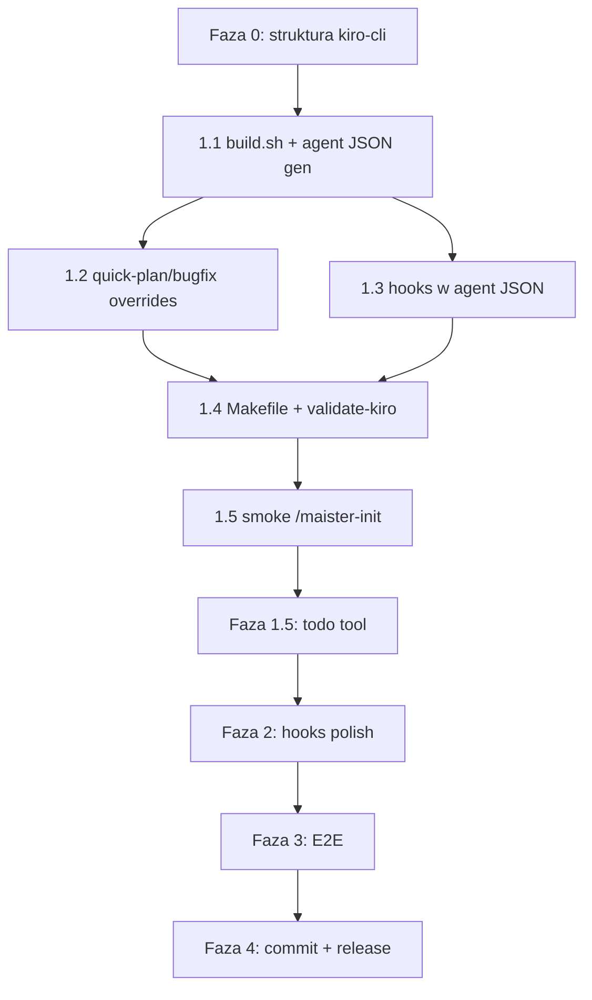

# Planning Decisions: Reusable Cursor Template for Kiro CLI

**Category:** `planning-decisions`  
**Created:** 2026-06-07  
**Research question:** Kiro CLI support implementation plan for Maister

**Sources synthesized:**
- `docs/cursor-agent-support.md` — grill decisions table, fork/repo shape, kiro future plans
- `docs/cursor-agent-implementation-plan.md` — phases 0–4, completion status, lessons learned
- `docs/cursor-e2e-checklist.md` — E2E scenarios and smoke gates
- `copilot-cli-issues.md` — first platform port pitfalls
- `.maister/docs/standards/global/build-pipeline.md` — naming, validate, CI standards
- `.maister/docs/project/tech-stack.md` — multi-platform architecture, CI gaps

---

## Executive Summary

Cursor Agent port established a **phased template (0 → 1 → 1.5 → 2 → 3 → 4)** that Kiro CLI should reuse with platform-specific adaptations. Grill decisions **#15–16** explicitly commit Kiro to the same fork architecture: `platforms/kiro-cli/build.sh` → `plugins/maister-kiro`, separate Makefile targets, `make build` = all platforms, all on fork `master`.

**Semantic alignment:** Kiro is closer to **Cursor** than Copilot — keep `maister-foo` prefix, `AGENTS.md`, hooks (not strip/remove), Playwright MCP in bundle. **Format divergence:** Kiro agents are JSON (not MD), hooks embed in agent JSON (not standalone `hooks.json`), steering replaces `.cursor/rules/`, commands likely merge into skills only.

**Estimated effort:** ~1–2 weeks (Cursor actuals) **plus** MD→JSON agent conversion overhead.

---

## 1. Grill Decisions Applicable to Kiro

From `docs/cursor-agent-support.md` decisions table (lines 9–30):

| # | Topic | Cursor Decision | Kiro Applicability | Notes |
|---|-------|-----------------|-------------------|-------|
| 1 | Architecture | `plugins/maister` SOT; `platforms/*/build.sh` generates variant | **Direct** | Same pattern: `platforms/kiro-cli/build.sh` → `plugins/maister-kiro` |
| 2 | Repo | Fork GitHub SkillPanel/maister | **Direct** | Kiro work on same fork `master` (Cursor Fase 4 done) |
| 3 | Distribution | Local + GitHub; **no** public marketplace | **Adapt** | Local install to `~/.kiro/` (skills, agents, steering); no Kiro marketplace identified |
| 4 | Artifacts | **Commit** generated variant | **Direct** | Commit `plugins/maister-kiro/` after each build |
| 5 | Naming | Prefix **`maister-foo`** (not Copilot strip) | **Direct** | Kiro skill `name` max 64 chars, kebab-case — `maister-development` fits |
| 6 | Project instructions | `AGENTS.md` + short rule at `init` | **Adapt** | `AGENTS.md` native in Kiro; rule → `.kiro/steering/*.md` not `.cursor/rules/` |
| 7 | Progress tracking | Fase 1 build → **Fase 1.5** progress → E2E | **Adapt** | `TaskCreate`/`TaskUpdate` → Kiro experimental **`todo`** tool (not TodoWrite); requires `chat.enableTodoList` |
| 8 | Quick commands | Rewrite `quick-plan` + `quick-bugfix` immediately | **Direct** | Reuse Cursor overrides pattern; own plan flow, no built-in plan mode |
| 9 | Planning | Own flow (plan file + questions); no `EnterPlanMode` | **Direct** | Kiro has built-in Plan agent — still use Maister overrides per Cursor decision |
| 10 | Hooks Phase 1 | `block-destructive` + `post-compact`; skill-reminder → Phase 2 | **Adapt** | Hooks in **orchestrator agent JSON**, not `hooks/hooks.json`; matcher mapping TBD |
| 11 | Branding | `maister` / `maister-cursor` for now | **Direct** | `maister-kiro` variant name |
| 12 | Explore | `"Explore"` → `explore` | **Gap** | Kiro has **no** built-in explore — custom `maister-explore` agent or codebase tools |
| 13 | Custom agents | `maister-*` prefix in Task references | **Adapt** | Agents as `.kiro/agents/*.json`; `subagent` tool + `trustedAgents` |
| 14 | Branches | `cursor` branch → merge `master` | **N/A** | Cursor merged to `master` v2.1.8; Kiro starts on `master` |
| 15 | Future | **kiro-cli same pattern**; all platforms on fork `master` | **Direct** | Explicit mandate for this research |
| 16 | Makefile | `build-cursor`, `build-kiro`, …; **`make build` = all** | **Direct** | Add `build-kiro`, `validate-kiro`, `clean-kiro` |
| 17 | MCP | Playwright in bundle | **Adapt** | `.mcp.json` → `.kiro/settings/mcp.json` or `includeMcpJson` in agent JSON |

**Source:** `docs/cursor-agent-support.md:9-30`, `docs/cursor-agent-support.md:70-87`

---

## 2. Target Repo Shape (Fork `master`)

From `docs/cursor-agent-support.md:70-87`:

```
fork/
├── plugins/
│   ├── maister              ← sync upstream (never edit platform-specific)
│   ├── maister-copilot      ← make build-copilot
│   ├── maister-cursor       ← make build-cursor
│   └── maister-kiro         ← make build-kiro (planned)
├── platforms/
│   ├── copilot-cli/build.sh
│   ├── cursor/build.sh
│   └── kiro-cli/build.sh    ← planned
├── .claude-plugin/marketplace.json
└── .cursor-plugin/marketplace.json
```

**Invariant (all platforms):** Never manually edit `plugins/maister-copilot/`, `plugins/maister-cursor/`, `plugins/maister-kiro/`.

**Source:** `docs/cursor-agent-support.md:87`, `CLAUDE.md` (repo root), `.maister/docs/project/tech-stack.md:133-141`

---

## 3. Reusable Phase Template for Kiro CLI

Adapted from `docs/cursor-agent-support.md:244-283` and `docs/cursor-agent-implementation-plan.md:104-357`, with Kiro-specific notes.

### Phase 0 — Setup (0.5 day)

| Task | Cursor (done) | Kiro |
|------|---------------|------|
| Repo | Fork + branch `cursor` (partial; worked on `master`) | Start on `master` (Cursor Fase 4 complete) |
| Directory scaffold | `platforms/cursor/` with build, hooks, overrides, patches, rules, templates, smoke | `platforms/kiro-cli/` — same scaffold **minus** `.cursor-plugin`; **plus** agent JSON generator templates |
| Marketplace manifest | `.cursor-plugin/marketplace.json` | **None** — install tree only |

**Completion criteria:**
- [ ] `platforms/kiro-cli/` directory created
- [ ] `Makefile` stubs for `build-kiro`, `validate-kiro`, `clean-kiro`

**Source:** `docs/cursor-agent-implementation-plan.md:104-137`

---

### Phase 1 — MVP Mechanical (1–2 days)

**Goal:** `make build-kiro` produces installable tree; smoke `/maister-init` works headless.

| Step | Cursor build.sh (12 steps) | Kiro adaptation |
|------|--------------------------|-----------------|
| 1 | `cp -r maister → maister-cursor` | `cp -r maister → maister-kiro` |
| 2 | Manifest `.cursor-plugin/` | **Skip or README-only** — no Kiro plugin manifest |
| 3 | `maister:foo` → `maister-foo` | Same |
| 4 | `maister:` → `maister-` references | Same |
| 5 | Explore → `explore` | **Custom agent** `maister-explore` or rewrite explore refs |
| 6 | `AskUserQuestion` → `AskQuestion` | **Gap** — map to Kiro interactive/permissions API |
| 7 | Plan mode overrides (quick-plan, quick-bugfix) | Reuse `platforms/cursor/overrides/` content |
| 8 | `CLAUDE.md` → `AGENTS.md` in skills | Same — Kiro auto-includes AGENTS.md |
| 9 | `.mcp.json` → `mcp.json` | → `.kiro/settings/mcp.json` layout in output tree |
| 10 | Plugin doc → rules | → `.kiro/steering/maister-workflows.md` |
| 11 | Hooks format transform | **Embed** in orchestrator agent JSON |
| 12 | Multi-select unchanged | **Sequential questions** if Kiro lacks multi-select (Copilot lesson) |

**Additional Kiro-only steps:**
- Convert `agents/*.md` → `.kiro/agents/*.json` (24 files)
- Merge or map `commands/*.md` → skills slash commands
- Remove `.claude-plugin/`, hooks standalone dir from output layout

**Phase 1 deliverables:**
1. `platforms/kiro-cli/build.sh`
2. Overrides: quick-plan, quick-bugfix (copy/adapt from Cursor)
3. Hooks Phase 1: destructive + compact (in agent JSON)
4. `make build-kiro`, `validate-kiro`
5. `smoke-install.sh` → `~/.kiro/` + `smoke-cli.sh` → `kiro-cli chat --no-interactive`

**Source:** `docs/cursor-agent-support.md:252-258`, `docs/cursor-agent-implementation-plan.md:140-182`, `planning/research-plan.md:105-114`

---

### Phase 1.5 — Progress Tracking (2–3 days)

**Cursor:** `TaskCreate`/`TaskUpdate` → `TodoWrite` + semantic patches.

**Kiro:** `TaskCreate`/`TaskUpdate` → experimental **`todo`** tool:
- Enable: `kiro-cli settings chat.enableTodoList true`
- Adapt `platforms/cursor/transforms/task-to-todo.md` → `task-to-kiro-todo.md`
- Adapt `patches/orchestrator-patterns-todowrite.md` for Kiro todo JSON shape

**Defer if unstable:** Ship Phase 1 without progress tracking; add 1.5 when todo API stable (Cursor decision #7 pattern).

**Source:** `docs/cursor-agent-support.md:19`, `docs/cursor-agent-implementation-plan.md:185-207`, `planning/research-plan.md:81-83`

---

### Phase 2 — Hooks + Polish (1 day)

| Cursor | Kiro |
|--------|------|
| `skill-invocation-reminder` → `sessionStart` | Map to Kiro `UserPromptSubmit` or `AgentSpawn` |
| E2E resume after compaction | Test with `orchestrator-state.yml` path in hook/reminder |
| Custom agent validation | JSON schema + `subagent` + `trustedAgents: ["maister-*"]` |

**Lesson from Cursor:** Hooks are **IDE-oriented**; CLI relies on `--force` / `--trust-all-tools` and skill rules. Same expected for Kiro headless.

**Source:** `docs/cursor-agent-implementation-plan.md:210-224`, `docs/cursor-agent-implementation-plan.md:60-61`

---

### Phase 3 — E2E (2–3 days)

Adapt `docs/cursor-e2e-checklist.md` scenarios:

| # | Scenario | Cursor status | Kiro notes |
|---|----------|---------------|------------|
| 1 | `/maister-init` full flow | ✅ CLI | Headless: `kiro-cli chat --no-interactive` |
| 1a | Init artifacts | AGENTS.md + `.cursor/rules/maister-docs.mdc` | AGENTS.md + `.kiro/steering/maister-docs.md` |
| 2 | `/maister-development` + progress | ✅ TodoWrite | `todo` tool if Phase 1.5 done |
| 2a | Mandatory gates | AskQuestion (headless defaults) | Interactive gates need non-headless session |
| 3 | Resume `[task-path] [--from=PHASE]` | ✅ | Verify `orchestrator-state.yml` compatibility |
| 4 | Parallel waves | ✅ 2× Task parallel | Kiro subagents max 4 parallel |
| 5 | Custom agent `maister-gap-analyzer` | ✅ | `subagent` tool invocation |
| 6 | quick-plan + quick-bugfix | ✅ | Reuse overrides |
| 7 | `--e2e` Playwright MCP | ☐ optional | `--trust-all-tools` + MCP approve |
| 8 | Delegation tool in CLI | ✅ Task tool | **`subagent`** tool availability |

**Setup pattern:**
```bash
make build-kiro
bash platforms/kiro-cli/smoke-install.sh   # → ~/.kiro/
kiro-cli chat --no-interactive --trust-all-tools "/maister-init"
```

**Source:** `docs/cursor-e2e-checklist.md:1-64`, `planning/sources.md:237-238`

---

### Phase 4 — Release (0.5 day)

1. Commit `plugins/maister-kiro/` + `platforms/kiro-cli/`
2. Bump version in manifests (Claude + Cursor; Kiro if manifest added later)
3. `git push origin master`
4. Optional: CI auto-rebuild (`build-kiro.yml` parity with Copilot)

**Source:** `docs/cursor-agent-implementation-plan.md:262-268`, `docs/cursor-e2e-checklist.md:60-64`

---

### Dependency Graph (reuse Cursor)



**Source:** `docs/cursor-agent-implementation-plan.md:271-290`

---

### Effort Estimate (from Cursor actuals)

| Phase | Cursor estimate | Kiro estimate | Delta |
|-------|-----------------|---------------|-------|
| 0 | 0.5 day | 0.25 day | Less repo setup (on master) |
| 1 | 1–2 days | 2–3 days | +agent MD→JSON generator |
| 1.5 | 2–3 days | 2–3 days | todo API mapping vs TodoWrite |
| 2 | 1 day | 1–2 days | Hook embedding in JSON |
| 3 | 2–3 days | 2–3 days | Similar |
| 4 | 0.5 day | 0.5 day | Same |
| **Total** | **~1–2 weeks** | **~1.5–2.5 weeks** | +JSON conversion |

**Source:** `docs/cursor-agent-support.md:281`, `docs/cursor-agent-implementation-plan.md:347-357`, `planning/research-plan.md:259`

---

## 4. Naming Decisions

From grill #5 and `build-pipeline.md`:

| Artifact | Source | Copilot | Cursor | **Kiro (recommended)** |
|----------|--------|---------|--------|------------------------|
| Skill/command name | `maister:foo` | `foo` (strip) | `maister-foo` | **`maister-foo`** |
| Slash invocation | `/maister:development` | `/development` | `/maister-development` | **`/maister-development`** |
| Agent references | `maister:gap-analyzer` | `maister-gap-analyzer` | `maister-gap-analyzer` | **`maister-gap-analyzer`** |
| Agent file/name | `name: gap-analyzer` | — | `name: maister-gap-analyzer` | JSON `name` field: **`maister-gap-analyzer`** |
| Variant dir | `maister` | `maister-copilot` | `maister-cursor` | **`maister-kiro`** |
| Project instructions | `CLAUDE.md` | `.github/copilot-instructions.md` | `AGENTS.md` | **`AGENTS.md`** |
| Plugin doc | `CLAUDE.md` | copilot-instructions | `rules/maister-workflows.mdc` | **`.kiro/steering/maister-workflows.md`** |

**Banned in Kiro variant (mirror Cursor):**
- `maister:` namespace
- `EnterPlanMode` / `ExitPlanMode`
- `TaskCreate` / `TaskUpdate` (after Phase 1.5 transform)
- Capitalized `Explore` (replace with custom agent)

**Source:** `.maister/docs/standards/global/build-pipeline.md:3-47`, `docs/cursor-agent-support.md:167-172`

---

## 5. Distribution Strategy

### Cursor (established)

| Channel | Mechanism |
|---------|-----------|
| Local | `bash platforms/cursor/smoke-install.sh` → `~/.cursor/plugins/local/` |
| GitHub | Clone fork + local install |
| Marketplace | **Explicitly excluded** — no public Cursor Marketplace submit |

**Source:** `docs/cursor-agent-support.md:3,56-64`

### Kiro (recommended)

| Channel | Mechanism | Confidence |
|---------|-----------|------------|
| Local user | Copy/symlink `plugins/maister-kiro/` tree to `~/.kiro/skills/`, `~/.kiro/agents/`, `~/.kiro/steering/` | **High** |
| Workspace | Project `.kiro/` for smoke/E2E in disposable test repos | **High** |
| GitHub | README install instructions (clone + smoke-install) | **High** |
| Marketplace | **None identified** — same as Cursor decision #3 | **High** |
| Headless CI | `kiro-cli chat --no-interactive --trust-all-tools` (no `--plugin-dir` equivalent) | **Medium** |

**Install tree mapping** (from `planning/sources.md:201-210`):

| Artifact | User path | Workspace path |
|----------|-----------|----------------|
| Skills | `~/.kiro/skills/` | `.kiro/skills/` |
| Agents | `~/.kiro/agents/*.json` | `.kiro/agents/` |
| Steering | `~/.kiro/steering/` | `.kiro/steering/` |
| MCP | `~/.kiro/settings/mcp.json` | `.kiro/settings/mcp.json` |

**Gap vs Cursor:** No `agent --plugin-dir` — smoke must use global/workspace `.kiro/` paths.

**Source:** `docs/cursor-agent-support.md:15-16,27-28`, `planning/sources.md:213-225`, `planning/research-plan.md:80-83`

---

## 6. Known Pitfalls (Copilot + Cursor Lessons)

### From `copilot-cli-issues.md`

| Pitfall | Detail | Kiro mitigation |
|---------|--------|-----------------|
| Invalid command names | Colons in `name:` break Copilot (`init-sdlc` errors) | Build must strip `maister:` → `maister-foo`; validate no colons |
| No multi-select | `ask_user` single-selection only | Sequential questions or freeform comma-separated (init Phase 3) |
| Template copy without generation | Unchecked docs copied empty templates | Init skill must verify generated body, not just template copy |
| CLAUDE.md detection | Platforms expect different instruction files | Transform to `AGENTS.md`; remove `CLAUDE.md` from variant |

**Source:** `copilot-cli-issues.md:1-42`

### From Cursor implementation (`docs/cursor-agent-implementation-plan.md`)

| Pitfall | Detail | Kiro mitigation |
|---------|--------|-----------------|
| Hooks don't run in CLI | 5 hooks implemented; CLI uses `--force` + skill rules | Don't block MVP on hook E2E in headless; test hooks separately |
| AskQuestion headless | `-p` uses defaults, not interactive gates | Document; test gates in interactive `kiro-cli chat` |
| Custom agent name mismatch | Frontmatter `name` must match Task `subagent_type` | JSON agent `name` must match `subagent` calls exactly |
| TodoWrite ≠ TaskCreate semantics | Sed alone insufficient; needed runtime verify | Same for `todo` — semantic mapping doc + E2E on development orchestrator |
| Symlink on Windows | Local install may need `cp -r` | Offer copy fallback in `smoke-install.sh` |
| IDE vs CLI primary | Plan assumed IDE; actual path was CLI-first | Kiro: **CLI-first** (`kiro-cli chat`) from day one |
| CI gap | No auto-rebuild for cursor on master (copilot has it) | Add `build-kiro.yml` early or accept manual rebuild |

**Source:** `docs/cursor-agent-implementation-plan.md:60-61,294-303`, `.maister/docs/project/tech-stack.md:91`

### From build standards

| Pitfall | Mitigation |
|---------|------------|
| macOS vs Linux `sed -i` | Use portable `sedi()` wrapper |
| Destructive commands from subagents | `block-destructive-commands` hook/script — whitelist pattern |
| Manual edit of generated dirs | `make validate-kiro` + CI `make build && make validate` gate |

**Source:** `.maister/docs/standards/global/build-pipeline.md:40-63`

---

## 7. Infrastructure Checklist (from Cursor + standards)

### Makefile targets to add

```
build-kiro, validate-kiro, clean-kiro
make build = build-copilot + build-cursor + build-kiro
```

**Source:** `docs/cursor-agent-support.md:28`, `docs/cursor-agent-support.md:154`, `.maister/docs/project/tech-stack.md:68`

### Validate-kiro (estimate 15–25 grep rules)

Mirror `validate-cursor`:
- No `maister:` references
- No `TaskCreate`/`TaskUpdate` (post Phase 1.5)
- No `EnterPlanMode`/`ExitPlanMode`
- No capitalized `Explore`
- Agent JSON valid
- Skills frontmatter `name`/`description` present
- No `.claude-plugin/` in output

**Source:** `planning/research-plan.md:145-146`, `.maister/docs/standards/global/build-pipeline.md:46-47`

### CI

| Workflow | Cursor | Kiro recommendation |
|----------|--------|---------------------|
| `build-copilot.yml` | Auto-rebuild on master | **Add `build-kiro.yml`** (parity) |
| `release.yml` | `make build && make validate` | Include kiro in gate |

**Source:** `.maister/docs/project/tech-stack.md:86-91`, `.maister/docs/standards/global/build-pipeline.md:59-63`

### Smoke scripts

| Script | Purpose |
|--------|---------|
| `platforms/kiro-cli/smoke-install.sh` | Install to `~/.kiro/` (`set -euo pipefail`) |
| `platforms/kiro-cli/smoke-cli.sh` | 3-test pattern from Cursor |

**Source:** `docs/cursor-agent-implementation-plan.md:36-37`, `.maister/docs/standards/global/build-pipeline.md:49-54`

---

## 8. Open Items from Cursor Work → Kiro Backlog

Items still open after Cursor Fase 4 that affect or inform Kiro:

| Open item (Cursor) | Applies to Kiro? | Priority |
|--------------------|------------------|----------|
| `--e2e` + Playwright MCP | Yes — same MCP bundle decision #17 | P2 (optional) |
| AskQuestion multi-select interactive (init Phase 3) | Yes — if Kiro lacks multi-select | P1 for init UX |
| E2E resume after compaction | Yes — `orchestrator-state.yml` in compact hook | P2 |
| Hook `beforeShellExecution` in IDE | Lower — Kiro CLI-first | P3 |
| Branch `cursor` + upstream remote | No — Kiro on `master` | N/A |
| PR upstream SkillPanel | Optional for whole `platforms/` dir | P3 |
| Cursor auto-rebuild CI | **Yes** — add for kiro too | P1 |
| README fork/branch git workflow | Adapt for kiro install section | P1 |

**Source:** `docs/cursor-agent-implementation-plan.md:75-88,306-311`, `docs/cursor-e2e-checklist.md:30-36`

---

## 9. Gaps (Kiro-specific vs Cursor template)

| Area | Cursor | Kiro gap | Confidence |
|------|--------|----------|------------|
| Plugin manifest | `.cursor-plugin/plugin.json` | No equivalent | **High** |
| Plugin dir API | `--plugin-dir` | Workspace/global `.kiro/` only | **High** |
| Agents format | `agents/*.md` | `agents/*.json` — generator required | **High** |
| Hooks location | `hooks/hooks.json` | `hooks` field in agent JSON | **High** |
| Rules | `.cursor/rules/*.mdc` | `.kiro/steering/*.md` | **High** |
| Progress | TodoWrite | `todo` experimental + feature flag | **Medium** |
| Explore | Built-in `explore` | Custom agent or rewrite | **High** |
| AskUserQuestion | AskQuestion | Unknown equivalent | **Medium** |
| Commands dir | `commands/` kept | Likely merge to skills only | **Medium** |
| Delegation | Task tool | `subagent` tool + `trustedAgents` | **High** |

**Source:** `planning/sources.md:213-225`, `planning/research-plan.md:239-246`

---

## 10. Recommendations for `platforms/kiro-cli/build.sh`

1. **Base on Cursor, not Copilot** — keep prefix, AGENTS.md, hooks, MCP; Cursor solved ~40% unique work beyond Copilot (`docs/cursor-agent-support.md:308-310`).

2. **Reuse Cursor assets directly:**
   - `overrides/commands/quick-plan.md`
   - `overrides/skills/quick-bugfix/SKILL.md`
   - `templates/agents-md-template.md`
   - `transforms/task-to-todo.md` (adapt → kiro todo)
   - Hook scripts (adapt env vars + JSON matchers)

3. **Add agent JSON generator** — largest unique work; parse YAML frontmatter + markdown body → Kiro agent schema (`tools`, `resources`, `prompt`, `hooks`, `trustedAgents`).

4. **Output layout** — flat install tree under `plugins/maister-kiro/`:
   ```
   plugins/maister-kiro/
   ├── skills/           # from skills/ + commands/
   ├── agents/           # *.json (generated)
   ├── steering/       # from rules templates
   ├── settings/mcp.json
   └── README.md
   ```

5. **Orchestrator agent** — dedicated `maister-orchestrator.json` with `subagent`, `trustedAgents: ["maister-*"]`, embedded Phase 1 hooks.

6. **Phase 1 without todo** — ship mechanical build + init smoke first (Cursor decision #7 pattern).

7. **CLI-first testing** — mirror `smoke-cli.sh`; don't block on IDE hook verification.

---

## 11. Open Questions

| # | Question | Confidence | Blocker for |
|---|----------|------------|-------------|
| 1 | What is Kiro equivalent of `AskUserQuestion` / `AskQuestion`? | **Low** | Phase 1 gates, init |
| 2 | Is `todo` tool stable enough for orchestrators? | **Medium** | Phase 1.5 |
| 3 | Exact hook event mapping (PreToolUse → ?) | **Medium** | Phase 1 hooks |
| 4 | Can commands/ merge entirely into skills? | **Medium** | Build layout |
| 5 | `subagent` parallel limit (4) — enough for development waves? | **High** (likely yes) | Phase 3 E2E |
| 6 | Headless auth: `KIRO_API_KEY` for CI? | **Medium** | CI smoke |
| 7 | Reuse Cursor overrides verbatim or Kiro-specific wording? | **High** (reuse) | Phase 1 |

---

## 12. What Does NOT Change in `plugins/maister`

Per Cursor completion — same for Kiro:

- Zero platform-specific edits in core
- All adaptations in `platforms/kiro-cli/` only
- Optional upstream PR with `platforms/kiro-cli/` after stabilization

**Source:** `docs/cursor-agent-support.md:298-304`, `docs/cursor-agent-implementation-plan.md:94-96`

---

## Source Index

| File | Lines / sections cited |
|------|------------------------|
| `docs/cursor-agent-support.md` | Grill table 9–30; repo shape 70–87; phases 244–283; risks 287–295 |
| `docs/cursor-agent-implementation-plan.md` | Status 10–88; phases 104–357; risks 294–303; open items 306–311 |
| `docs/cursor-e2e-checklist.md` | Scenarios 16–28; smoke 38–44; hooks 30–36 |
| `copilot-cli-issues.md` | Full file (naming, multi-select, templates) |
| `.maister/docs/standards/global/build-pipeline.md` | Naming 3–47; validate/CI 59–63; hooks 37–41 |
| `.maister/docs/project/tech-stack.md` | Architecture 43–48; Makefile 66–69; CI gap 91; generated rule 133–141 |
| `planning/research-plan.md` | Scope 21–51; hypotheses 239–246; effort 259 |
| `planning/sources.md` | Kiro paths 201–210; gaps table 213–225 |
