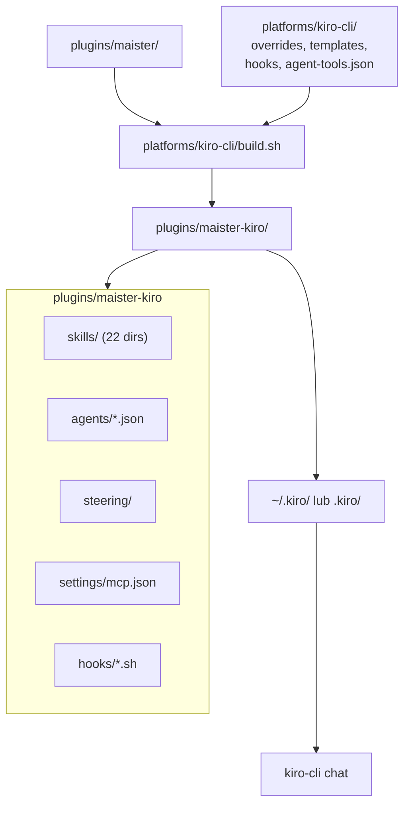

# Synteza badań: wsparcie Kiro CLI dla Maister

**Pytanie badawcze:** Jak przygotować implementację wsparcia kiro-cli analogicznie do Cursor, Copilot i Claude Code?  
**Typ:** mixed (codebase reverse-engineering + dokumentacja Kiro CLI)  
**Data:** 2026-06-07  
**Źródła:** 6 plików findings + `docs/cursor-agent-support.md`

---

## Executive Summary

Maister posiada sprawdzony wzorzec multi-platformy: **`plugins/maister/`** jako source of truth (Claude Code), generowane warianty przez **`platforms/*/build.sh`**. Copilot i Cursor są zaimplementowane; **Kiro CLI nie istnieje jeszcze** w repozytorium (`platforms/kiro-cli/`, `plugins/maister-kiro/` — brak).

**Kiro jest semantycznie bliżej Cursor niż Copilot:** prefix `maister-foo`, `AGENTS.md`, zachowanie hooks (nie usuwanie), Playwright MCP w bundle. **Formatowo odbiega najbardziej:** agenci jako **JSON** (nie MD), hooks **osadzone w agent JSON** (brak `hooks.json`), brak katalogu `commands/` (merge do skills), brak plugin manifest / `--plugin-dir`.

Największa unikalna praca vs Cursor: **generator MD→JSON** dla 24 agentów + synteza **`maister-orchestrator.json`** z hookami i `subagent`/`trustedAgents`. Szacunek: **~1,5–2,5 tygodnia** (Cursor: ~1–2 tyg. + overhead JSON).

Decyzje grill **#15–16** (`docs/cursor-agent-support.md`) mandatują ten sam fork: `platforms/kiro-cli/build.sh` → `plugins/maister-kiro`, osobne targety Makefile, `make build` = wszystkie platformy.

---

## Cross-Source Analysis

### Zwalidowane ustalenia (wiele źródeł)

| Ustalenie | Źródła | Pewność |
|-----------|--------|---------|
| Wzorzec build: `cp -r` + sed/transformy, nigdy ręczna edycja `plugins/maister-*` | codebase-build-pipeline, planning-decisions, cursor-agent-support | **High** |
| Baza implementacji: **`platforms/cursor/build.sh`** (14 kroków), nie Copilot | codebase-build-pipeline, planning-decisions, kiro-skills-steering | **High** |
| Naming: `maister:foo` → `maister-foo` (jak Cursor, nie strip Copilot) | wszystkie findings, grill #5 | **High** |
| `AGENTS.md` + steering zamiast `CLAUDE.md` / `.cursor/rules/` | kiro-skills-steering, planning-decisions, grill #6 | **High** |
| 8 plików `commands/` → nowe katalogi `skills/maister-*/SKILL.md` | codebase-source-plugin, kiro-skills-steering | **High** |
| 24 agenci MD → `.kiro/agents/*.json` + `prompts/*.md` | codebase-source-plugin, kiro-agents-hooks | **High** |
| `Task` → `subagent`; `TaskCreate` → `todo` (experimental) | kiro-tools-mcp, planning-decisions | **High** |
| Brak `AskQuestion` / `AskUserQuestion` w Kiro | kiro-tools-mcp, kiro-agents-hooks | **High** |
| Brak built-in `explore` — custom `maister-explore` | kiro-tools-mcp, kiro-agents-hooks, grill #12 | **High** |
| MCP: `.mcp.json` → `.kiro/settings/mcp.json` | kiro-tools-mcp, codebase-source-plugin | **High** |
| Dystrybucja: install tree do `~/.kiro/`, brak marketplace | planning-decisions, kiro-skills-steering | **High** |

### Rozwiązane sprzeczności

| Temat | Cursor findings | Kiro docs | Rozstrzygnięcie |
|-------|-----------------|-----------|-----------------|
| Progress tracking | TodoWrite (Faza 1.5) | `todo` tool + `chat.enableTodoList` | Kiro używa **`todo`**, nie TodoWrite — osobny patch `task-to-kiro-todo.md` |
| AskUserQuestion | sed → `AskQuestion` | Brak narzędzia | Kiro: **pytania w czacie** (wzorzec Plan agent), bez sed do `AskQuestion` |
| Explore | `explore` lowercase | Brak built-in | **`maister-explore.json`** z ograniczonymi `tools` |
| Hooks compaction | `preCompact` | Brak odpowiednika | **Gap** — mitigacja: `userPromptSubmit` heurystyka lub dokumentacja manual recovery |
| Internal skills (`user-invocable: false`) | Zachowane w manifeście | Wszystkie skills → slash commands | Custom orchestrator agent + selektywne `skill://` w `resources` |

### Ocena jakości dowodów

| Kategoria | Jakość | Uwagi |
|-----------|--------|-------|
| Repo Maister (build.sh, Makefile, CI) | **High** | Bezpośredni odczyt plików |
| Dokumentacja Kiro CLI (skills, agents, hooks) | **High** | Oficjalne docs kiro.dev |
| Mapowanie hooków subagent tracking | **Medium** | Wymaga smoke test `preToolUse` na `subagent` |
| Headless gates / multi-select | **Low–Medium** | Brak dedykowanego API |
| `KIRO_PLUGIN_ROOT` env var | **Medium** | Proponowany analog Cursor — nieudokumentowany w Kiro |

---

## Wzorce i tematy

### Wzorzec 1: Platform build pipeline (established)

**Opis:** `set -e`, `sedi()` cross-platform, `rm -rf OUT && cp -r CORE OUT`, numerowane kroki transformacji, platform assets w `platforms/<name>/`.

**Prevalencja:** Copilot (8 kroków), Cursor (14 kroków), Kiro (planowane ~16+ z JSON gen).

**Jakość:** Dojrzały, udokumentowany w `.maister/docs/standards/global/build-pipeline.md`.

### Wzorzec 2: Validate jako grep-gate

**Opis:** `validate-<platform>` w Makefile — zakazy (`maister:`, `EnterPlanMode`, `TaskCreate`), wymagane artefakty, kontrakt hooks.

**Kiro rozszerzenie:** `jq` parse agent JSON, brak `.claude-plugin/`, `name` SKILL.md = nazwa folderu.

### Wzorzec 3: Smoke dwuwarstwowy

**Opis:** `smoke-install.sh` (kopia do user dir) + `smoke-cli.sh` (3 testy headless).

**Kiro adaptacja:** `kiro-cli chat --no-interactive --trust-all-tools`, workspace `.kiro/` zamiast `--plugin-dir`.

### Wzorzec 4: Fazy 0→1→1.5→2→3→4 (Cursor template)

**Opis:** MVP mechaniczny → progress tracking → hooks polish → E2E → release.

**Kiro delta:** Faza 1 +2–3 dni (MD→JSON); Faza 1.5 z `todo` zamiast TodoWrite.

### Wzorzec 5: Orchestrator delegation contract

**Opis:** Skill tool (main context) vs Task tool (isolated subagents) — `orchestrator-patterns.md`.

**Kiro:** Brak Skill tool — slash `/maister-*` + custom agent z `skill://` resources; Task → `subagent` + `trustedAgents`.

---

## Kluczowe insighty

### 1. Cursor to ~60% gotowej pracy dla Kiro

**Dowód:** Cursor build.sh, overrides (quick-plan, quick-bugfix), templates (agents-md), hook scripts, transforms (task-to-todo).

**Implikacja:** Kopiować i adaptować `platforms/cursor/`, nie pisać od zera z Copilot.

**Pewność:** High

### 2. Agent MD→JSON to największy unikalny koszt

**Dowód:** 24 agenci bez pola `tools` w źródle; Kiro wymaga explicit whitelist.

**Implikacja:** `platforms/kiro-cli/agent-tools.json` (lookup table) + generator w build.sh; opcjonalnie `maister-explore.json` i `maister-orchestrator.json` syntetyczne.

**Pewność:** High

### 3. AskUserQuestion to P0 gap bez twardego API

**Dowód:** 200+ wystąpień w `plugins/maister/`; Kiro built-in tools nie zawierają AskQuestion.

**Implikacja:** Chat-native gates w tekście orchestratorów; headless smoke musi omijać gates; inicjalizacja Phase 3 (multi-select) wymaga sekwencyjnych pytań (lekcja Copilot).

**Pewność:** High (gap); Medium (skuteczność mitigacji)

### 4. Brak `user-invocable` w Kiro wymaga architektury agenta

**Dowód:** 6 internal skills (`docs-manager`, `codebase-analyzer`, …) nie powinny być user-facing slash commands.

**Implikacja:** `maister-orchestrator.json` z `skill://` globs; internal skills tylko przez resources, nie global discovery — lub akceptacja dodatkowych slash commands (P2).

**Pewność:** High

### 5. Hooks w Kiro = redesign, nie kopia 1:1

**Dowód:** Brak `preCompact`, `subagentStart`/`subagentStop`; blocking via exit code 2 + STDERR.

**Implikacja:** `block-destructive-commands-kiro.sh`; subagent tracking przez `preToolUse`/`postToolUse` na matcher `subagent`; stub `post-compact-reminder`.

**Pewność:** High (architektura); Medium (payload `tool_input`)

---

## Relacje i zależności

**Przepływ danych transformacji:**
1. `skills/` (14) + `commands/` (8) → `skills/` (22) z `maister-` names
2. `agents/*.md` (24) → `agents/*.json` + `agents/prompts/*.md`
3. `hooks/hooks.json` → embedded w `maister-orchestrator.json`
4. `CLAUDE.md` → `steering/maister-workflows.md`
5. `.mcp.json` → `settings/mcp.json`
6. Tekst orchestratorów: `Task`→`subagent`, `TaskCreate`→`todo`, `AskUserQuestion`→chat gates

---

## Luki i niepewności

| Luka | Pewność | Wpływ | Status |
|------|---------|-------|--------|
| Brak `AskQuestion` | High | P0 — gates orchestratorów | Mitigacja zaproponowana, wymaga E2E interaktywnego |
| Brak `preCompact` | High | P2 — resume po compaction | Dokumentacja + `orchestrator-state.yml` jako SOT |
| Brak `subagentStart`/`subagentStop` | High | P1 — bash guard whitelist | `preToolUse` na `subagent` — do zweryfikowania |
| `todo` experimental | High | P1 — progress UX | Faza 1.5 opcjonalna; defer jak Cursor TodoWrite |
| Brak `--plugin-dir` | High | P1 — smoke/CI | Workspace `.kiro/` copy |
| `${KIRO_PLUGIN_ROOT}` | Medium | P2 — hook paths | Absolute paths lub wrapper |
| Układ output tree `plugins/maister-kiro/` | Low | P1 — install script | Propozycja w raporcie |
| CI auto-commit wszystkich wariantów | Medium | P2 — maintenance | Obecnie tylko copilot auto-commit |

---

## Wnioski syntezy

### Główne

1. **Implementacja Kiro CLI jest wykonalna** na istniejącym szablonie Cursor z dodatkiem generatora agentów JSON i merge commands→skills.
2. **Nie edytować `plugins/maister/`** — cała adaptacja w `platforms/kiro-cli/`.
3. **CLI-first** od Fazy 1 — Kiro nie ma `--plugin-dir`; smoke przez install tree.
4. **Faza 1 bez `todo`** — MVP build + `/maister-init` headless; Faza 1.5 gdy `todo` stabilny.

### Drugorzędne

- Reuse Cursor overrides verbatim (AskQuestion refs → chat gates w Kiro build).
- `validate-kiro` projektować równolegle z `build.sh` (~18–25 reguł).
- CI: rozszerzyć `release.yml`; rozważyć `build-kiro.yml` lub unified auto-commit.

### Rekomendacja następnego kroku

Uruchomić **`/maister-development`** z task path:
`/Users/mrapacz/Workspace/maister/.maister/tasks/research/2026-06-07-kiro-cli-support`

Faza 0 + Faza 1 MVP jako pierwszy scope implementacji.
