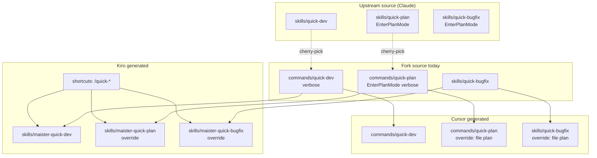

# Quick Workflows Consistency Report

**Category:** quick-workflows  
**Task:** `.maister/tasks/research/2026-06-14-upstream-sync-consistency`  
**Compared:** `upstream/master` @ v2.1.8 (`fb5a8f3`) vs fork `HEAD` @ v2.2.0  
**Date:** 2026-06-14

---

## Executive Summary

**Verdict: Partially consistent — upstream command→skill refactor is architecturally compatible with the fork’s Kiro shortcut pattern and Cursor command model, but cherry-picking upstream as-is requires deliberate build-script and override maintenance.**

| Workflow | Upstream change | Fork platform model | Consistent? |
|----------|-----------------|---------------------|-------------|
| `quick-dev` | Command → thin skill (~24 lines) | Cursor: **command**; Kiro: command→skill merge + `/quick-dev` shortcut | **Needs adaptation** (Cursor command emission; content choice) |
| `quick-plan` | Command → thin skill using `EnterPlanMode` | Cursor/Kiro: **override** to file-based `.maister/plans/` + gates | **Intentionally divergent** (platform override supersedes upstream) |
| `quick-bugfix` | Skill simplified; still uses `EnterPlanMode` in source | Cursor/Kiro: **override** to file-based fix plan + gates | **Intentionally divergent** in generated variants; source skill aligns with upstream |

**Bottom line:** Adopt upstream’s skills-only source layout and thin “standards layer over default behavior” philosophy for Claude/Copilot. **Preserve** fork platform overrides for Cursor/Kiro (no `EnterPlanMode`). **Extend** Cursor build to emit slash commands from quick skills. **Keep** Kiro shortcut skills unchanged — they delegate to `maister-quick-*` regardless of whether the canonical artifact lives in `commands/` or `skills/`.

---

## Upstream Refactor (`fb5a8f3`)

Commit message: *“Convert quick-plan and quick-dev from commands to thin skills and refine quick-bugfix.”*

### Structural changes

| Path | Upstream (`679958b`) | Fork (`HEAD`) |
|------|----------------------|---------------|
| `plugins/maister/commands/quick-dev.md` | **Deleted** | **Exists** (134 lines, verbose) |
| `plugins/maister/commands/quick-plan.md` | **Deleted** | **Exists** (130 lines, verbose) |
| `plugins/maister/skills/quick-dev/SKILL.md` | **Added** (24 lines) | **Missing** |
| `plugins/maister/skills/quick-plan/SKILL.md` | **Added** (26 lines) | **Missing** |
| `plugins/maister/skills/quick-bugfix/SKILL.md` | Simplified (~51 lines removed) | Modified (fork + upstream overlap) |

### Philosophical shift

Upstream reframes all three workflows as **thin skills that extend platform-default behavior**:

- **`quick-dev`**: “Works exactly as if you asked the main agent to implement directly” + standards discover/enforce/verify checklist.
- **`quick-plan`**: “Works exactly like Claude Code’s built-in plan mode” + standards folded into plan + compliance checklist.
- **`quick-bugfix`**: TDD red/green + plan-mode fix approval + complexity escalation (unchanged shape, trimmed prose).

Fork source (pre-cherry-pick) uses **prescriptive multi-step commands** (~130 lines each) with explicit “When to Use”, examples, and numbered gates — closer to a manual than upstream’s principle-based thin skills.

### Naming (unchanged across both)

| Layer | Claude source | After platform transform |
|-------|---------------|--------------------------|
| Frontmatter | `name: maister:quick-dev` | `maister-quick-dev` (Cursor/Kiro/Copilot) |
| Invocation | `/maister:quick-dev` | `/maister-quick-dev` |
| Copilot skill name | N/A (skill) | `quick-dev` (prefix stripped) |

---

## Fork Platform Models

### Cursor (`platforms/cursor/build.sh`)

```
Source copy (commands/quick-dev.md, commands/quick-plan.md, skills/quick-bugfix/)
    │
    ├─► commands/quick-dev.md        ← passthrough (no override)
    ├─► commands/quick-plan.md       ← REPLACED by platforms/cursor/overrides/commands/quick-plan.md
    └─► skills/quick-bugfix/SKILL.md ← REPLACED by platforms/cursor/overrides/skills/quick-bugfix/SKILL.md
```

**Generated today (`plugins/maister-cursor/`):**

| Artifact | Type | Plan mode |
|----------|------|-----------|
| `commands/quick-dev.md` | Command | N/A (direct implement) |
| `commands/quick-plan.md` | Command | **File-based** `.maister/plans/` + `AskQuestion` |
| `skills/quick-bugfix/SKILL.md` | Skill | **File-based** fix plan + `AskQuestion` |

Build step 7 strips `EnterPlanMode`/`ExitPlanMode` references globally, but quick-plan/bugfix **content** comes from overrides that never referenced plan mode.

**Makefile validation** expects `plugins/maister-cursor/commands/quick-plan.md` with `name: maister-` prefix.

### Kiro (`platforms/kiro-cli/build.sh`)

Two-tier invocation model:

```
/quick-dev  ──shortcut──►  /maister-quick-dev  ──canonical skill──►  workflow body
/quick-plan ──shortcut──►  /maister-quick-plan
/quick-bugfix ─shortcut──► /maister-quick-bugfix
```

**Build pipeline relevant steps:**

1. **`merge_commands_to_skills`** — copies `commands/quick-dev.md` → `skills/maister-quick-dev/SKILL.md`, same for `quick-plan`.
2. **`rename_skill_directories`** — renames dirs to match `name:` frontmatter.
3. **`apply_kiro_overrides`** — replaces `maister-quick-plan` and `maister-quick-bugfix` with Kiro overrides (CHAT GATE, file-based plans).
4. **`generate_shortcut_skill`** (step 20) — creates `skills/quick-dev/SKILL.md`, `quick-plan`, `quick-bugfix` delegating stubs.

**Generated shortcut pattern** (`plugins/maister-kiro/skills/quick-dev/SKILL.md`):

```markdown
Invoke `/maister-quick-dev` with the above user input. Pass `$ARGUMENTS` verbatim.
```

**Kiro override for quick-plan** (`platforms/kiro-cli/overrides/commands/quick-plan.md`):
- File-based plan in `.maister/plans/`
- **CHAT GATE** instead of `AskQuestion` / `EnterPlanMode`
- Headless defaults documented in `askuser-to-chat-gate.md`

**No Kiro override for `quick-dev`** — canonical body comes from merged source command (today: verbose fork version).

### Copilot (`platforms/copilot-cli/build.sh`)

No quick-specific logic. Upstream Copilot output is **skills-only** (`quick-dev`, `quick-plan`, `quick-bugfix`). Fork Copilot still has **commands** for dev/plan because source still has commands — stale relative to upstream.

---

## Deep Comparison by Workflow

### `quick-dev`

| Aspect | Upstream skill | Fork command (source) | Cursor generated | Kiro generated |
|--------|----------------|----------------------|------------------|----------------|
| Lines | ~24 | ~134 | ~134 (command) | ~134 + `$ARGUMENTS` (skill) |
| Structure | 4 numbered steps | 5 steps + “When to Use” + examples | Same as fork command | Same + chat-gate transforms |
| Standards | Discover during work; verify checklist in summary | Explicit “READ each file” enforcement blocks | Same as fork | CHAT GATE replaces AskQuestion |
| Plan mode | Explicitly none | Explicitly none | Same | Same |
| Override | None | None | None | None |

**Gap:** Fork verbose command vs upstream thin skill. Adopting upstream changes agent behavior on Kiro/Cursor for `quick-dev` (no override layer to preserve fork verbosity).

### `quick-plan`

| Aspect | Upstream skill | Fork command (source) | Cursor/Kiro override |
|--------|----------------|----------------------|----------------------|
| Planning mechanism | `EnterPlanMode` / `ExitPlanMode` | `EnterPlanMode` + detailed phase injection | **File-based** `.maister/plans/` |
| Approval gate | Plan mode exit | Plan mode exit | `AskQuestion` (Cursor) / CHAT GATE (Kiro) |
| Standards timing | During plan mode | Before `EnterPlanMode` | Before writing plan file |
| Lines | ~26 | ~130 | ~79 |

**This is the largest semantic fork:** Upstream assumes Claude Code plan mode; fork platforms **cannot** use `EnterPlanMode` and already replaced it. Overrides are correct platform adaptations, not bugs.

### `quick-bugfix`

| Aspect | Upstream skill | Fork source skill | Cursor/Kiro override |
|--------|----------------|-------------------|----------------------|
| Planning | `EnterPlanMode` for fix plan | `EnterPlanMode` (fork ≈ upstream after overlap) | File-based `.maister/plans/YYYY-MM-DD-bugfix-*.md` |
| TDD gates | Red → Green | Same | Same |
| Escalation | `AskUserQuestion` | Same | `AskQuestion` / CHAT GATE |
| Standards prose | Condensed inline | Verbose enforcement section (fork-only delta) | Condensed override body |

Fork source `quick-bugfix` and upstream are **largely aligned** on Claude; platform overrides intentionally diverge for Cursor/Kiro.

---

## Consistency Analysis

### Q1: Is upstream command→skill refactor consistent with fork Kiro shortcuts?

**Yes, structurally. No, content-wise without decisions.**

| Concern | Assessment |
|---------|------------|
| Shortcut `/quick-dev` → `/maister-quick-dev` | **Compatible.** Shortcuts delegate by name; canonical skill dir is `skills/maister-quick-dev/` regardless of merge source. |
| `merge_commands_to_skills` after upstream | **Still works but becomes partially redundant.** If commands deleted, `rename_skill_directories` picks up `skills/quick-dev/` → `skills/maister-quick-dev/`. Recommend adding explicit skills merge or documenting reliance on rename step. |
| Override precedence | **Unchanged.** Overrides still win for `maister-quick-plan` and `maister-quick-bugfix`. |
| `quick-dev` body on Kiro | **Will change** to upstream thin skill if cherry-picked without fork override — behavioral regression vs current verbose fork command. |
| Tests | `platforms/kiro-cli/tests/build-core.test.sh` asserts `skills/maister-quick-plan/SKILL.md` exists — passes with either merge path. `phase2.test.sh` asserts `/quick-plan` maps to `/maister-quick-plan`. |

### Q2: Is upstream refactor consistent with Cursor command model?

**No — build gap exists if source moves to skills-only.**

| Concern | Assessment |
|---------|------------|
| Cursor slash commands | Plugin manifest lists both `commands/` and `skills/`. Today `/maister-quick-dev` and `/maister-quick-plan` are **commands**. Upstream skills-only source would **drop** these commands after `cp -r` unless build emits them. |
| `quick-plan` override | **Already adapted.** Override replaces command content — independent of upstream EnterPlanMode skill. |
| `quick-bugfix` | Correctly a **skill** with override — aligns with upstream skill model. |
| `quick-dev` | **No override.** Must either (a) add build step `skills/quick-dev → commands/quick-dev.md`, or (b) accept skill-only invocation on Cursor. |
| Global EnterPlanMode strip | Step 7 mangles remaining references; overrides avoid the issue for plan/bugfix. |

### Q3: Copilot consistency

Upstream Copilot is skills-only. Fork Copilot still ships commands for dev/plan from stale source. Cherry-picking upstream fixes Copilot alignment automatically once source commands are deleted.

---

## Compatibility Matrix

| Area | Status | Notes |
|------|--------|-------|
| Source layout (commands → skills for dev/plan) | **Needs adaptation** | Delete fork commands; add upstream skills |
| Kiro shortcut skills | **Compatible** | No change to shortcut generator |
| Kiro overrides (plan, bugfix) | **Keep as-is** | Required platform adaptation |
| Cursor overrides (plan, bugfix) | **Keep as-is** | Required platform adaptation |
| Cursor command emission for quick-dev | **Needs new build step** | Unless skill-only invocation is acceptable |
| Cursor command emission for quick-plan | **Already handled** | Override copies to `commands/quick-plan.md` |
| Copilot build | **Compatible** | No changes needed after source adopt |
| `quick-bugfix` source merge | **Low conflict** | Minor prose delta; adopt upstream simplification |
| CLAUDE.md / docs catalog | **Needs update** | Fork missing quick-dev/plan in skills table; upstream has them |
| Makefile validate | **Compatible** | Still validates `commands/quick-plan.md` |

---

## Required Adaptations (Cherry-Pick Integration)

### 1. Source layer (`plugins/maister/`)

```bash
# Adopt from upstream
git show upstream/master:plugins/maister/skills/quick-dev/SKILL.md   → skills/quick-dev/SKILL.md
git show upstream/master:plugins/maister/skills/quick-plan/SKILL.md  → skills/quick-plan/SKILL.md
# Merge quick-bugfix (upstream simplification + verify no fork-only loss)
# Delete
plugins/maister/commands/quick-dev.md
plugins/maister/commands/quick-plan.md
```

Update `plugins/maister/CLAUDE.md` skills table to list `quick-dev` and `quick-plan` as skills (upstream already does).

### 2. Cursor build (`platforms/cursor/build.sh`)

Add after core copy, before overrides:

```bash
# Emit slash commands from quick skills (Cursor has no Skill-tool invocation for user slash)
for stem in quick-dev; do
  src="$OUT/skills/${stem}/SKILL.md"
  [ -f "$src" ] || continue
  mkdir -p "$OUT/commands"
  cp "$src" "$OUT/commands/${stem}.md"
done
# quick-plan: override step 12 already copies to commands/quick-plan.md
# quick-bugfix: remains skill-only (override copies to skills/)
```

**Decision point:** Whether `quick-dev` command body should remain fork-verbose or adopt upstream thin skill. Recommendation: **adopt upstream thin skill** for consistency with refactor philosophy; fork verbosity fought upstream’s explicit “trust Claude to reason” direction.

### 3. Kiro build (`platforms/kiro-cli/build.sh`)

**Option A (minimal):** Rely on `rename_skill_directories` after upstream skills land — remove or keep `merge_one quick-dev/quick-plan` as no-op.

**Option B (explicit):** Extend `merge_commands_to_skills` to also copy from `skills/quick-*` if command missing:

```bash
merge_one_from_skill() {
  local stem="$1" target="$2"
  local cmd="$commands_dir/${stem}.md"
  local skill="$OUT/skills/${stem}/SKILL.md"
  if [ -f "$cmd" ]; then cp "$cmd" "$OUT/skills/${target}/SKILL.md"
  elif [ -f "$skill" ]; then mkdir -p "$OUT/skills/${target}" && cp "$skill" "$OUT/skills/${target}/SKILL.md"
  fi
}
```

Overrides and shortcut generation: **no changes.**

### 4. Platform overrides — **do not delete**

| Override | Reason |
|----------|--------|
| `platforms/cursor/overrides/commands/quick-plan.md` | Cursor lacks `EnterPlanMode`; file-based plan is the correct adaptation |
| `platforms/cursor/overrides/skills/quick-bugfix/SKILL.md` | Same |
| `platforms/kiro-cli/overrides/commands/quick-plan.md` | CHAT GATE + file-based plan |
| `platforms/kiro-cli/overrides/skills/quick-bugfix/SKILL.md` | CHAT GATE + file-based fix plan |

These overrides implement the fork’s **platform-native planning model**, which upstream’s Claude-centric `EnterPlanMode` skills cannot provide on Cursor/Kiro.

### 5. Regenerate and validate

```bash
make build
make validate   # cursor quick-plan prefix check
platforms/kiro-cli/tests/build-core.test.sh
platforms/kiro-cli/tests/phase2.test.sh
platforms/cursor/smoke-cli.sh   # quick-plan artifact test
```

---

## Architecture Diagram



---

## Recommendations

1. **Cherry-pick upstream skills** for `quick-dev` and `quick-plan`; delete fork commands — aligns with upstream architecture and Copilot output.
2. **Treat Cursor/Kiro overrides as permanent platform forks** of plan/bugfix semantics — not temporary divergence.
3. **Add Cursor build step** to materialize `quick-dev` (and any future quick skill) as a slash command.
4. **Optionally add Kiro explicit skills merge** for clarity; shortcuts unchanged.
5. **Do not port fork verbose command bodies** unless product decision explicitly rejects upstream’s thin-skill philosophy.
6. **Merge `quick-bugfix` source** toward upstream simplified prose; platform overrides remain the Cursor/Kiro execution layer.

**Confidence:** High on structural compatibility; medium on behavioral acceptance of upstream thin `quick-dev` on fork platforms (no override buffer).

---

## Evidence References

| Resource | Location |
|----------|----------|
| Upstream refactor commit | `fb5a8f3` |
| Upstream skills | `git show upstream/master:plugins/maister/skills/quick-{dev,plan,bugfix}/SKILL.md` |
| Fork commands (committed) | `git show HEAD:plugins/maister/commands/quick-{dev,plan}.md` |
| Cursor override plan | `platforms/cursor/overrides/commands/quick-plan.md` |
| Cursor override bugfix | `platforms/cursor/overrides/skills/quick-bugfix/SKILL.md` |
| Kiro override plan | `platforms/kiro-cli/overrides/commands/quick-plan.md` |
| Kiro override bugfix | `platforms/kiro-cli/overrides/skills/quick-bugfix/SKILL.md` |
| Kiro shortcuts | `plugins/maister-kiro/skills/quick-{dev,plan,bugfix}/SKILL.md` |
| Cursor generated plan | `plugins/maister-cursor/commands/quick-plan.md` |
| Build scripts | `platforms/cursor/build.sh` (steps 7, 12), `platforms/kiro-cli/build.sh` (merge, overrides, step 20) |
| Transform docs | `platforms/kiro-cli/transforms/askuser-to-chat-gate.md` |
