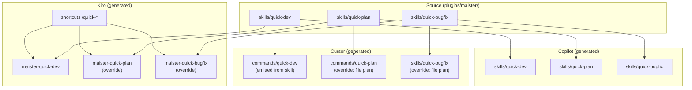

# Research Report: Upstream Sync Consistency

**Task:** 2026-06-14-upstream-sync-consistency  
**Research question:** Are upstream v2.1.8 changes consistent with fork changes? What is a safe cherry-pick strategy?  
**Date:** 2026-06-14  
**Refs:** merge-base `1fc5d3c` · upstream `679958b` · fork `d3e8298`

---

## Executive Summary

Upstream SkillPanel/maister advanced **2 commits** since the common ancestor (`fb5a8f3` — quick-workflow refactor + Maister rebrand; `679958b` — version bump to 2.1.8). The fork advanced **34 commits** with multi-platform support (Cursor, Kiro, Kilo), Wave 1 AJ skills, grill-me/thermos, and build pipeline extensions.

**Verdict:** Upstream changes are **consistent with fork architecture** and **safe to integrate via cherry-pick of `fb5a8f3`**. A dry-run on fork HEAD produced **zero git conflicts**. Integration is not "apply and ship" — it requires **manual review of 3 overlapping files**, **Cursor build pipeline updates** for the command→skill migration, **skipping upstream version commit `679958b`**, and a **unified manifest bump to `2.1.8-10`**.

Fork-only features (AJ skills, grill-me, thermos, platform variants, init Phase 3 gate) do **not** conflict with upstream structurally. Platform overrides for quick-plan and quick-bugfix on Cursor/Kiro are **intentional permanent adaptations**, not temporary divergence — they must be preserved.

**Recommendation:** **CONDITIONAL GO** for development phase.  
**Confidence:** **High** on cherry-pick safety and preserve-list integrity; **Medium-High** on passing validate/smoke without iteration on Cursor build changes.

---

## Per-Area Compatibility Matrix

| Area | Status | Rationale | Post-cherry-pick action |
|------|--------|-----------|-------------------------|
| **Cherry-pick `fb5a8f3`** | Compatible | Dry-run: 23 files, +147/−687, EXIT_CODE=0 | Cherry-pick; review auto-merges |
| **Cherry-pick `679958b`** | Conflict (skip) | Sets 2.1.8; fork at 2.2.0; target is 2.1.8-10 | Skip; manual version on 6 manifests |
| **quick-dev** | Needs adaptation | Upstream: thin skill; fork: 134-line command; Cursor emits commands | Adopt upstream skill; add Cursor skill→command step |
| **quick-plan** | Needs adaptation | Upstream: thin skill + EnterPlanMode; fork platforms: file-based plan overrides | Adopt upstream skill; keep Cursor/Kiro overrides |
| **quick-bugfix** | Needs adaptation | Upstream simplifies source; fork has platform overrides | Merge upstream source simplification; keep overrides |
| **Rebrand (AI SDLC → Maister)** | Compatible | Text-only; no fork logic conflict | Accept via cherry-pick; spot-check user docs |
| **docs-manager templates** | Compatible | Fork did not modify templates | Accept upstream 3-step INDEX.md discipline |
| **init skill** | Needs adaptation | Fork: Phase 3 smart-defaults gate; upstream: title/description rebrand | Keep fork gate logic + upstream Maister text |
| **CLAUDE.md catalog** | Needs adaptation | Both sides added skills/commands table rows | Merge: upstream quick-* skills + fork AJ/thermos sections |
| **hooks.json** | Compatible | Fork did not touch | Accept upstream description change |
| **research-methodologies.md** | Compatible | Fork did not touch | Accept upstream rename |
| **docs/commands.md** | Compatible | Fork did not touch | Accept upstream thin-skill descriptions |
| **copilot-cli-issues.md** | Compatible | Upstream deletes scratch file | Safe to delete on fork |
| **AJ skills (Wave 1)** | N/A — preserve | Fork-only; no upstream equivalent | No action; rebuild after merge |
| **grill-me / thermos** | N/A — preserve | Fork-only | No action; rebuild |
| **Platform dirs (cursor/kiro/kilo)** | N/A — preserve | Fork-only | No action; verify overrides still apply |
| **Cursor build pipeline** | Needs adaptation | Override + validate assume command-based quick-plan | Update build.sh and/or Makefile validate |
| **Kiro build pipeline** | Compatible | Skill-native; merge becomes no-op | Optional dead-code cleanup |
| **Copilot build** | Compatible | No quick-* overrides | Rebuild only |
| **Version manifests** | Needs adaptation | 6 files; fork drift 2.1.8 vs 2.2.0 | Set all to 2.1.8-10; rebuild Kilo separately |
| **Generated variants** | Needs adaptation | Never edit directly | `make build` + kilo build.sh |

---

## Cherry-Pick File List

### Commit 1: `fb5a8f3` — Cherry-pick ✅

**23 files** — apply as single cherry-pick.

#### Deleted (accept)

| Path | Notes |
|------|-------|
| `copilot-cli-issues.md` | Upstream scratch file removal |
| `plugins/maister/commands/quick-dev.md` | Migrated to skill |
| `plugins/maister/commands/quick-plan.md` | Migrated to skill |
| `plugins/maister-copilot/commands/quick-dev.md` | Copilot mirror |
| `plugins/maister-copilot/commands/quick-plan.md` | Copilot mirror |

#### Added (accept)

| Path | Notes |
|------|-------|
| `plugins/maister/skills/quick-dev/SKILL.md` | ~24 lines, thin skill |
| `plugins/maister/skills/quick-plan/SKILL.md` | ~26 lines, EnterPlanMode in Claude source |
| `plugins/maister-copilot/skills/quick-dev/SKILL.md` | Copilot mirror |
| `plugins/maister-copilot/skills/quick-plan/SKILL.md` | Copilot mirror |

#### Modified (accept; 3 require manual review)

| Path | Auto-merge? | Review needed |
|------|-------------|---------------|
| `plugins/maister/CLAUDE.md` | Yes | **Yes** — merge skill tables |
| `plugins/maister/skills/init/SKILL.md` | Yes | **Yes** — preserve Phase 3 gate |
| `plugins/maister/.claude-plugin/plugin.json` | No (not in fb5a8f3) | Set version separately |
| `plugins/maister/hooks/hooks.json` | Clean | Accept |
| `plugins/maister/skills/quick-bugfix/SKILL.md` | Clean | Accept upstream simplification |
| `plugins/maister/skills/docs-manager/references/claude-md-template.md` | Clean | Accept |
| `plugins/maister/skills/docs-manager/references/index-md-template.md` | Clean | Accept |
| `plugins/maister/skills/research/references/research-methodologies.md` | Clean | Accept |
| `docs/commands.md` | Clean | Accept |
| `plugins/maister-copilot/CLAUDE.md` | Yes | Mirror maister CLAUDE.md review |
| `plugins/maister-copilot/skills/init/SKILL.md` | Yes | Mirror init review |
| `plugins/maister-copilot/skills/quick-bugfix/SKILL.md` | Clean | Accept |
| `plugins/maister-copilot/skills/docs-manager/references/*.md` | Clean | Accept |
| `plugins/maister-copilot/skills/research/references/research-methodologies.md` | Clean | Accept |

**Note:** After cherry-pick, regenerate `maister-cursor`, `maister-kiro`, `maister-kilo` via `make build` — do not hand-edit generated trees.

### Commit 2: `679958b` — Skip ❌

| Path | Upstream change | Fork action |
|------|-----------------|-------------|
| `.claude-plugin/marketplace.json` | 2.1.7 → 2.1.8 | Set to **2.1.8-10** manually |
| `plugins/maister/.claude-plugin/plugin.json` | 2.1.7 → 2.1.8 | Set to **2.1.8-10** manually |
| `plugins/maister-copilot/.claude-plugin/plugin.json` | 2.1.7 → 2.1.8 | Regenerate via build after source bump |

---

## Manual Merge Requirements

### 1. `plugins/maister/CLAUDE.md` (and copilot mirror)

**Conflict type:** Content merge (no git markers expected)

| Preserve from fork | Take from upstream |
|--------------------|-------------------|
| Requirements & Modeling skills/commands sections | Maister Plugin title (rebrand) |
| grill-me, thermos, thermo-nuclear entries | quick-plan, quick-dev in **skills** table |
| task-classifier clarification | Remove command refs for quick-dev/plan |
| Review skill sections | |

**Verification:** Skills table lists both upstream quick-* skills and fork AJ/thermos skills. No duplicate entries for quick-dev/plan as commands.

### 2. `plugins/maister/skills/init/SKILL.md` (and copilot mirror)

**Conflict type:** Text + logic coexistence

| Preserve from fork | Take from upstream |
|--------------------|-------------------|
| Phase 3 smart-defaults single AskUserQuestion gate | "Initialize Maister Framework" title/description |
| Numbered list format for context gate (Steps 3–4) | Rebrand strings in frontmatter |

**Verification:** Phase 3 gate behavior unchanged; Maister naming applied.

### 3. Version manifests (6 files)

Not part of `fb5a8f3`. Manual edit after integration:

| File | Current (HEAD) | Target |
|------|----------------|--------|
| `plugins/maister/.claude-plugin/plugin.json` | 2.2.0 | 2.1.8-10 |
| `.claude-plugin/marketplace.json` | 2.2.0 | 2.1.8-10 |
| `.cursor-plugin/marketplace.json` | 2.1.8 ⚠️ | 2.1.8-10 |
| `plugins/maister-copilot/.claude-plugin/plugin.json` | 2.2.0 | regenerate |
| `plugins/maister-cursor/.cursor-plugin/plugin.json` | 2.2.0 | regenerate |
| `plugins/maister-kilo/.claude-plugin/plugin.json` | 2.1.8 ⚠️ | `bash platforms/kilo-cli/build.sh` |

### 4. Cursor build pipeline (source, not generated)

| File | Change |
|------|--------|
| `platforms/cursor/build.sh` | Emit `commands/quick-dev.md` from skill; ensure quick-plan override path consistent |
| `Makefile` | Update `validate-cursor` if quick-plan moves to skill-only output |

**Do not modify** (preserve as-is):

- `platforms/cursor/overrides/commands/quick-plan.md`
- `platforms/cursor/overrides/skills/quick-bugfix/SKILL.md`
- `platforms/kiro-cli/overrides/commands/quick-plan.md`
- `platforms/kiro-cli/overrides/skills/quick-bugfix/SKILL.md`

### 5. Optional Kiro cleanup

| File | Change |
|------|--------|
| `platforms/kiro-cli/build.sh` | Remove dead `merge_one quick-dev/plan` after commands deleted from source |

---

## Version Plan: `2.1.8-10`

### User decision

Upstream base **2.1.8** + fork postfix **-10** → **`2.1.8-10`**

### SemVer caveat

Per SemVer 2.0, **`2.1.8-10` is a pre-release identifier** and sorts **below** stable **`2.1.8`**:

```
2.1.8-10  <  2.1.8  <  2.2.0 (current fork)
```

| Implication | Detail |
|-------------|--------|
| Comparator behavior | Package managers / semver tools treat fork as **older than upstream**, despite fork having **more features** |
| vs `2.1.8-fork.10` | Explicit fork tag; same pre-release ordering but clearer intent |
| vs `2.1.8+fork.10` | Build metadata; **equal precedence** to 2.1.8; `+` may be stripped by some tools |
| vs current 2.2.0 | Adopting 2.1.8-10 is a **manifest downgrade** from fork's independent semver line |

**Recommendation:** Proceed with **`2.1.8-10`** per user approval. Document in release notes:

> `-10` = fork integration release ID for upstream 2.1.8 sync (not git commit count). Subsequent fork releases: `2.1.8-11`, `2.1.8-12`. On next upstream sync (e.g. 2.1.9): reset to `2.1.9-1`.

If semver comparator accuracy matters for tooling, consider **`2.1.8-fork.10`** as a drop-in alternative with identical workflow.

### Update sequence

```bash
# 1. Manual Tier-1 edits
#    plugins/maister/.claude-plugin/plugin.json → "2.1.8-10"
#    .claude-plugin/marketplace.json           → "2.1.8-10"
#    .cursor-plugin/marketplace.json           → "2.1.8-10"

# 2. Regenerate platform variants
make build

# 3. Kilo (NOT in default make build)
bash platforms/kilo-cli/build.sh

# 4. Verify uniformity
grep -r '"version": "2.1.8-10"' \
  .claude-plugin/marketplace.json \
  .cursor-plugin/marketplace.json \
  plugins/maister/.claude-plugin/plugin.json \
  plugins/maister-copilot/.claude-plugin/plugin.json \
  plugins/maister-cursor/.cursor-plugin/plugin.json \
  plugins/maister-kilo/.claude-plugin/plugin.json

# 5. Validate
make validate
```

### What NOT to do

- Do not cherry-pick `679958b` verbatim (sets 2.1.8, not 2.1.8-10)
- Do not hand-edit generated `plugins/maister-{copilot,cursor,kiro,kilo}/` except via rebuild
- Do not revert fork to upstream 2.1.8 without postfix

---

## GO / NO-GO Recommendation

### **CONDITIONAL GO**

Development phase may proceed when the following prerequisites are satisfied.

| Condition | Blocking? | Owner |
|-----------|-----------|-------|
| Cherry-pick `fb5a8f3` + review 3 manual merge files | Yes | Development |
| Skip `679958b`; apply 2.1.8-10 to 6 manifests | Yes | Development |
| Update Cursor build for quick-dev/plan skill migration | Yes | Development |
| `make build && make validate` pass | Yes | Development |
| Kiro build tests pass (`build-core.test.sh`, `phase2.test.sh`) | Yes | Development |
| Cursor smoke test (`platforms/cursor/smoke-cli.sh`) | Recommended | Development |
| Kilo rebuild (`platforms/kilo-cli/build.sh`) | Yes | Development |

### Why not unconditional GO?

Cursor build pipeline **will fail validate** or produce **duplicate quick-plan artifacts** if source adopts skills-only layout without build changes. This is predicted, not speculative — documented in platform-build and quick-workflows reports.

### Why not NO-GO?

- Git cherry-pick dry-run succeeded
- No structural conflict with fork-only features
- Kiro/Copilot paths are compatible or self-healing via rebuild
- Manual merge scope is bounded (3 files + build scripts)

### Confidence

| Dimension | Level | Score |
|-----------|-------|-------|
| Cherry-pick applies cleanly | High | 95% |
| Fork-only features preserved | High | 95% |
| Version plan executable | High | 90% |
| First-pass validate/smoke | Medium-High | 75% |
| **Overall** | **Medium-High** | **85%** |

---

## Prerequisites for Development Phase

### Phase 0 — Pre-flight

- [ ] Confirm upstream remote has `fb5a8f3` and `679958b` at expected refs
- [ ] Branch from fork HEAD `d3e8298` (or current master)
- [ ] Ensure clean working tree

### Phase 1 — Cherry-pick

```bash
git cherry-pick fb5a8f3
# Do NOT: git cherry-pick 679958b
```

- [ ] Review `plugins/maister/CLAUDE.md` — merged skill/command tables
- [ ] Review `plugins/maister/skills/init/SKILL.md` — Phase 3 gate intact
- [ ] Confirm `commands/quick-{dev,plan}.md` deleted; `skills/quick-{dev,plan}/` exist
- [ ] Confirm fork-only files untouched: AJ skills, grill-me, thermos, platform dirs

### Phase 2 — Build pipeline

- [ ] Update `platforms/cursor/build.sh` — quick-dev skill→command emission; quick-plan override consistency
- [ ] Update `Makefile` `validate-cursor` if needed
- [ ] Optional: clean Kiro `merge_one` dead code

### Phase 3 — Version

- [ ] Set `2.1.8-10` on 3 manual manifest files
- [ ] `make build`
- [ ] `bash platforms/kilo-cli/build.sh`
- [ ] Verify 6 manifests uniform

### Phase 4 — Verification

- [ ] `make validate`
- [ ] `platforms/kiro-cli/tests/build-core.test.sh`
- [ ] `platforms/kiro-cli/tests/phase2.test.sh`
- [ ] `platforms/cursor/smoke-cli.sh`
- [ ] Spot-check generated: no duplicate `skills/quick-plan/` + `commands/quick-plan.md` with divergent content

### Phase 5 — Commit

- [ ] Single integration commit with message documenting upstream sync + 2.1.8-10
- [ ] Optional: git tag `v2.1.8-10`

---

## Preserve List (Non-Negotiable)

These fork assets must survive integration unchanged in **source**:

| Category | Assets |
|----------|--------|
| **AJ Wave 1** | `problem-classifier`, `requirements-critic`, `transcript-critic` skills + quick-* commands |
| **Review suite** | `grill-me`, `thermos`, `thermo-nuclear-review`, `thermo-nuclear-code-quality-review` + subagents |
| **Platforms** | `platforms/cursor/`, `platforms/kiro-cli/`, `platforms/kilo-cli/` entire trees |
| **Overrides** | Cursor/Kiro quick-plan and quick-bugfix overrides |
| **Init UX** | Phase 3 smart-defaults gate |
| **Orchestrators** | MANDATORY GATE markdown fix in 5 orchestrator skills |

---

## Architecture: Post-Integration Quick Workflow Flow



---

## Sources

| Report | Path |
|--------|------|
| Upstream diff | `analysis/findings/upstream-diff-report.md` |
| Fork divergence | `analysis/findings/fork-divergence-report.md` |
| Platform build | `analysis/findings/platform-build-report.md` |
| Quick workflows | `analysis/findings/quick-workflows-report.md` |
| Versioning manifests | `analysis/findings/versioning-manifests-report.md` |
| Synthesis | `analysis/synthesis.md` |
| Research brief | `planning/research-brief.md` |
