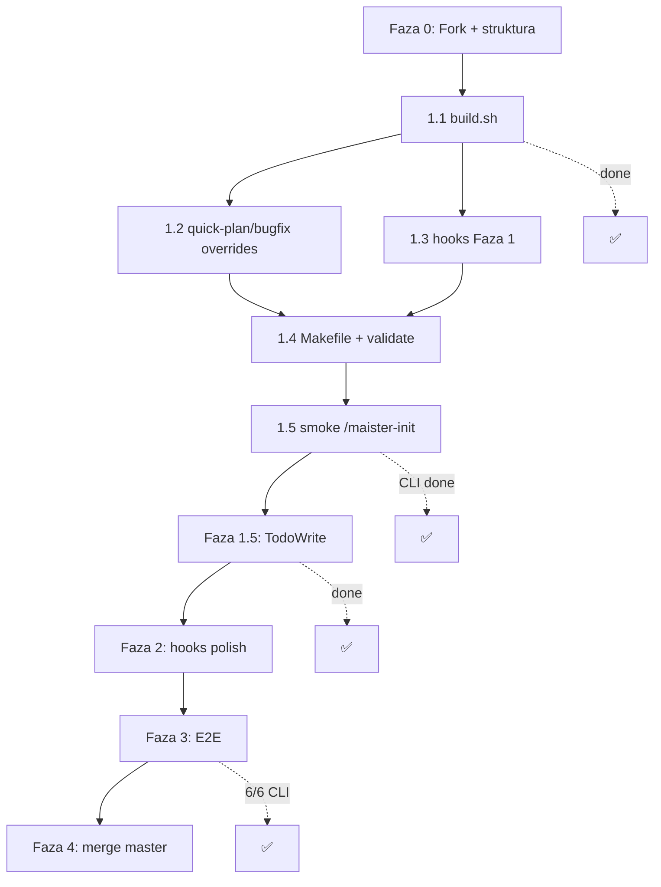

# Plan implementacji: wsparcie Cursor Agent dla Maister

Plan oparty na [`docs/cursor-agent-support.md`](./cursor-agent-support.md).

**Ostatnia aktualizacja:** 2026-06-06  
**Commit referencyjny:** `c726313` — *Add Cursor Agent variant (maister-cursor) with CLI-first build pipeline.*

---

## Status ogólny

| Faza | Status | Uwagi |
|------|--------|-------|
| **0** Setup repo | 🟡 Częściowo | Struktura + marketplace OK; brak brancha `cursor` i `upstream` |
| **1** MVP mechaniczny | ✅ Ukończone | build, validate, commit, smoke CLI |
| **1.5** TodoWrite | ✅ Ukończone | Zweryfikowane runtime na `/maister-development` (CLI 2026-06-06) |
| **2** Hooks + polish | 🟡 Częściowo | 5 hooków + agenci OK; brak E2E compaction |
| **3** E2E | 🟡 Częściowo | 5/6 scenariuszy CLI OK; brak opcjonalnego `--e2e` MCP |
| **4** Merge / release | ✅ Ukończone | v2.1.8, push na origin (2026-06-06) |

**Ścieżka docelowa:** Cursor **Agent CLI** (`agent --plugin-dir`), nie IDE.  
**Smoke:** `bash platforms/cursor/smoke-cli.sh`  
**Checklist E2E:** [`docs/cursor-e2e-checklist.md`](./cursor-e2e-checklist.md)

---

## Co zrobione (podsumowanie)

### Infrastruktura

- [x] `platforms/cursor/build.sh` — pełny pipeline transformacji (12 kroków z planu)
- [x] `platforms/cursor/` — hooks, rules, templates, overrides, patches, transforms
- [x] `plugins/maister-cursor/` — artefakt buildu **commitowany** (`c726313`)
- [x] `.cursor-plugin/marketplace.json`
- [x] `Makefile` — `build-cursor`, `validate-cursor`, `clean-cursor`; `make build` = copilot + cursor
- [x] `platforms/cursor/smoke-cli.sh`, `smoke-install.sh`
- [x] README — sekcja **Cursor Agent (CLI)**
- [x] `docs/cursor-e2e-checklist.md`, `docs/cursor-agent-support.md`

### Transformacje build

- [x] Manifest `.cursor-plugin/`, `name: maister-cursor`
- [x] Prefiks `maister-foo` (commands/skills/referencje)
- [x] `AskUserQuestion` → `AskQuestion`
- [x] `Explore` → `explore`
- [x] `CLAUDE.md` → `AGENTS.md` (skills); plugin doc → `rules/maister-workflows.mdc`
- [x] `.mcp.json` → `mcp.json` (Playwright)
- [x] Overrides: `quick-plan`, `quick-bugfix` (plan w pliku + gate, bez plan mode)
- [x] TodoWrite: sed w orchestratorach + `transforms/task-to-todo.md` + patch `orchestrator-patterns-todowrite.md`
- [x] Init: `agents-md-template.md`, `.cursor/rules/maister-docs.mdc`, `docs-extractor-prompt.md`
- [x] Agenci: frontmatter `name: maister-*` (zgodne z Task references)

### Hooki (wykraczają poza MVP Fazy 1)

- [x] `beforeShellExecution` — `block-destructive-commands.sh` (+ subagent tracking)
- [x] `preCompact` — `post-compact-reminder.sh` (ścieżka do `orchestrator-state.yml`)
- [x] `sessionStart` — `skill-invocation-reminder.sh` (planowane na Fazę 2 — zrobione wcześniej)
- [x] `subagentStart` / `subagentStop` — tracker do hooków destructive

> Hooki są **IDE-oriented**. W CLI nie są używane; orchestratory polegają na `--force` i regułach w skills.

### Weryfikacja CLI (`agent` 2026.06.04)

- [x] `make build-cursor && make validate-cursor`
- [x] Plugin wykrywany przez `--plugin-dir`
- [x] `/maister-init` — pełny flow do Phase 7 (AGENTS.md, maister-docs.mdc, `.maister/docs/`)
- [x] `/maister-quick-plan` — artefakt w `.maister/plans/`
- [x] `/maister-quick-bugfix` — TDD red/green
- [x] Task tool + `maister-gap-analyzer`
- [x] TodoWrite, AskQuestion, Task — dostępne w CLI
- [x] `/maister-development` — Phases 1–2, TodoWrite, `orchestrator-state.yml`
- [x] Resume z task-path + `--from=phase_10`
- [x] Parallel waves (bez `--sequential`) — Wave 1: 2× Task równolegle

### Nie zrobione / do domknięcia

- [ ] Branch `cursor` + remote `upstream` (SkillPanel/maister)
- [x] `git push` — origin/master (2026-06-06)
- [x] Bump wersji w manifestach → 2.1.8 (Faza 4)
- [x] `/maister-development` E2E (TodoWrite, gates, fazy) — CLI 2026-06-06
- [x] Resume `[task-path] [--from=PHASE]` — CLI 2026-06-06
- [x] Parallel Task waves — CLI 2026-06-06 (Wave 1: 2× Task równolegle)
- [ ] `--e2e` + Playwright MCP (`--approve-mcps`)
- [ ] AskQuestion multi-select interaktywny (init Phase 3) — wymaga `agent` **bez** `-p`
- [ ] E2E resume po compaction (IDE lub długi workflow CLI)
- [ ] Hook `beforeShellExecution` w IDE (subagent + `git reset --hard`)
- [x] Głębsza semantyka TodoWrite (ponad sed) — zweryfikowane na development orchestratorze (CLI 2026-06-06)
- [ ] Opcjonalny PR upstream z `platforms/cursor/`

---

## Cel i zasady

| Zasada | Implikacja | Status |
|--------|------------|--------|
| `plugins/maister` = source of truth | Zero zmian platform-specific w core | ✅ |
| Generacja przez build | Adaptacje w `platforms/cursor/` | ✅ |
| Commit artefaktów | `plugins/maister-cursor/` po build | ✅ `c726313` |
| Prefix `maister-foo` | `/maister-development` | ✅ |
| MVP bez TodoWrite → 1.5 | TodoWrite po smoke buildu | ✅ build; 🟡 runtime verify |

---

## Faza 0 — Setup repo (0.5 dnia)

**Cel:** środowisko pracy gotowe do implementacji.

### Zadania

1. **Fork + branch `cursor`**
   - [ ] `git remote add upstream https://github.com/SkillPanel/maister.git`
   - [ ] Branch roboczy: `cursor`  
   - **Stan:** praca bezpośrednio na `master` forka (`mateuszrapacz/maister`)

2. **Struktura katalogów** — ✅

   ```
   platforms/cursor/
   ├── build.sh
   ├── hooks/          (+ subagent-start/stop tracker)
   ├── overrides/
   ├── patches/
   ├── rules/
   ├── templates/
   ├── transforms/
   ├── smoke-cli.sh
   └── smoke-install.sh
   ```

3. **`.cursor-plugin/marketplace.json`** — ✅

### Kryterium ukończenia

- [x] Katalog `platforms/cursor/` utworzony
- [ ] Branch `cursor` istnieje
- [ ] Upstream skonfigurowany

---

## Faza 1 — MVP mechaniczny (1–2 dni) ✅

**Cel:** `make build-cursor` produkuje instalowalny plugin; smoke `/maister-init` działa.

### 1.1 `platforms/cursor/build.sh` — ✅ (wszystkie 12 kroków)

### 1.2 Quick-plan i quick-bugfix — ✅ (`platforms/cursor/overrides/`)

### 1.3 Hooks Faza 1 — ✅

| Claude | Cursor | Plik | Status |
|--------|--------|------|--------|
| `PreToolUse` (Bash) | `beforeShellExecution` | `block-destructive-commands.sh` | ✅ |
| `SessionStart` (compact) | `preCompact` | `post-compact-reminder.sh` | ✅ |

### 1.4 Makefile — ✅

### 1.5 Smoke test

**CLI (primary):**

```bash
make build-cursor
bash platforms/cursor/smoke-cli.sh
# lub:
agent --plugin-dir plugins/maister-cursor --workspace . -p --trust --force "/maister-init"
```

**Checklist smoke:**

- [ ] Plugin widoczny w Cursor IDE (opcjonalne)
- [x] `/maister-init` startuje bez błędów (CLI)
- [ ] `AskQuestion` multi-select interaktywny (init Phase 3) — headless używa domyślnych
- [x] `mcp.json` — Playwright w bundle
- [x] Hook `beforeShellExecution` blokuje `git reset --hard` od subagenta (test skryptu + mock JSON)
- [ ] Ten sam hook w IDE — niezweryfikowany

### Kryterium ukończenia Fazy 1

- [x] `make build-cursor && make validate-cursor` przechodzi
- [x] `plugins/maister-cursor/` commitowany
- [x] Smoke `/maister-init` na projekcie testowym OK (CLI, 2026-06-06)

---

## Faza 1.5 — Progress tracking (2–3 dni) 🟡

**Cel:** orchestratory pokazują postęp przez `TodoWrite` zamiast `TaskCreate`/`TaskUpdate`.

### Zakres plików — ✅ (transformacja w build)

Wszystkie pliki z planu + `agents/*.md` — sed `TaskCreate`/`TaskUpdate` → `TodoWrite`.

### Mapowanie semantyczne — 🟡

- [x] `platforms/cursor/transforms/task-to-todo.md`
- [x] `platforms/cursor/patches/orchestrator-patterns-todowrite.md` (przykłady JSON)
- [x] Weryfikacja ręczna na `development` orchestratorze (runtime) — CLI 2026-06-06

### Plugin documentation → rules — ✅

- [x] `rules/maister-workflows.mdc` — Progress Tracking + linki Cursor docs

### Kryterium ukończenia

- [x] `/maister-development` pokazuje fazy w TodoWrite
- [x] Resume po przerwaniu — todos odtwarzane z `orchestrator-state.yml`

---

## Faza 2 — Hooks + polish (1 dzień) 🟡

### Zadania

1. **`skill-invocation-reminder`** → `sessionStart` — ✅
2. **Test resume po compaction** — [ ] brak E2E w workflow
3. **Walidacja custom agents** — ✅
   - build: `name: maister-gap-analyzer` w `agents/gap-analyzer.md`
   - CLI: Task tool wywołuje agenta poprawnie

### Kryterium ukończenia

- [x] Hooki zaimplementowane (5 eventów; plan miał 3 w Fazie 2)
- [ ] Resume po compaction nie gubi fazy — **niezweryfikowane E2E**

---

## Faza 3 — E2E (2–3 dni) 🟡

### Scenariusze testowe

| # | Scenariusz | Status CLI 2026-06-06 |
|---|------------|------------------------|
| 1 | `/maister-init` → pełny flow | ✅ |
| 2 | `/maister-development "mała feature"` | ✅ |
| 3 | Resume: `[task-path] [--from=PHASE]` | ✅ |
| 4 | Parallel Task waves | ✅ |
| 5 | Custom agent `maister-gap-analyzer` | ✅ |
| 6 | `/maister-quick-plan` + `/maister-quick-bugfix` | ✅ |
| 7 | `--e2e` z Playwright MCP | ☐ opcjonalny |
| 8 | Task tool w CLI | ✅ `agent` 2026.06.04 |

### Init — artefakty projektu — ✅ (build + E2E CLI)

- [x] `AGENTS.md` z `agents-md-template.md`
- [x] `.cursor/rules/maister-docs.mdc`
- [x] `standards-discover/references/docs-extractor-prompt.md`

### Dokumentacja użytkownika — ✅ (dostosowana do CLI)

- [x] README — `agent --plugin-dir`, `-p --trust --force`, `--approve-mcps`
- [x] `smoke-cli.sh`
- [ ] README: fork + branch `cursor` (git workflow — opcjonalne)

### Kryterium ukończenia

- [x] Scenariusze 1–6 — **6/6** (CLI 2026-06-06)
- [ ] Scenariusz 7 opcjonalny
- [x] Scenariusz 8 — Task tool dostępny w CLI

---

## Faza 4 — Merge do master forka (0.5 dnia) 🟡

1. [x] Kod na `master` (bez osobnego brancha `cursor`)
2. [x] Wersjonowanie w manifestach po pełnym E2E → 2.1.8
3. [x] `git push origin master`
4. [ ] Opcjonalny PR do upstream SkillPanel

---

## Kolejność zależności



---

## Ryzyka i mitigacje (aktualizacja)

| Ryzyko | Status |
|--------|--------|
| Task tool niedostępny w CLI | ✅ **Rozwiązane** — działa w `agent` 2026.06.04 |
| Custom agents mismatch | ✅ **Rozwiązane** — prefiks `maister-*` w frontmatter |
| Hooki w CLI | ⚠️ Hooki nie działają w CLI; `--force` + reguły orchestratora |
| TodoWrite ≠ TaskCreate semantyka | ✅ Zweryfikowane runtime (development orchestrator) |
| AskQuestion headless | ⚠️ `-p` używa domyślnych zamiast interaktywnych gate'ów |

---

## Następne kroki (priorytet)

1. Opcjonalnie: `--e2e` + Playwright MCP (`--approve-mcps`)
2. Opcjonalnie: E2E resume po compaction (IDE lub długi workflow CLI)
3. Opcjonalnie: branch `cursor`, `upstream`, PR do SkillPanel
4. Opcjonalnie: hooki w IDE (sessionStart, preCompact, beforeShellExecution)

---

## Archiwum: pierwotny plan (referencja)

Poniżej oryginalna treść planu sprzed implementacji — szczegóły kroków build, mapowania TodoWrite i struktury hooków pozostają aktualne jako specyfikacja.

### 1.1 `platforms/cursor/build.sh` — szczegóły kroków

| # | Krok | Implementacja |
|---|------|---------------|
| 1 | Kopia | `cp -r maister → maister-cursor` |
| 2 | Manifest | `.claude-plugin/` → `.cursor-plugin/`, `name: maister-cursor` |
| 3 | Nazwy command/skill | `name: maister:foo` → `name: maister-foo` (nie strip) |
| 4 | Referencje | `maister:` → `maister-` we wszystkich `.md` (po kroku 3) |
| 5 | Explore | `subagent_type="Explore"` → `subagent_type="explore"` |
| 6 | Pytania | `AskUserQuestion` → `AskQuestion` |
| 7 | Plan mode | Overrides quick-plan/bugfix (bez EnterPlanMode) |
| 8 | Projekt | `CLAUDE.md` → `AGENTS.md` w skills |
| 9 | MCP | `.mcp.json` → `mcp.json` (Playwright zostaje) |
| 10 | Plugin doc | `CLAUDE.md` → `rules/maister-workflows.mdc` + skrócony README |
| 11 | Hooks | Format Cursor (patrz 1.3) |
| 12 | Multi-select | **Bez zmian** |

### Mapowanie TodoWrite (Faza 1.5)

| Claude Code | Cursor TodoWrite |
|-------------|------------------|
| `TaskCreate` (pending) | `TodoWrite` z `status: "pending"` |
| `TaskUpdate` → `in_progress` | `TodoWrite` z `status: "in_progress"` |
| `TaskUpdate` → `completed` | `TodoWrite` z `status: "completed"` |
| `TaskUpdate addBlockedBy` | Kolejność w tablicy todos + `merge: true` |
| `activeForm` | `content` z opisem aktywności |
| `metadata: {skipped: true}` | `status: "cancelled"` |

### Szacunek effort (oryginalny)

| Faza | Czas | Blokery |
|------|------|---------|
| 0 | 0.5 dnia | — |
| 1 | 1–2 dni | — |
| 1.5 | 2–3 dni | Faza 1 smoke OK |
| 2 | 1 dzień | Faza 1.5 |
| 3 | 2–3 dni | Faza 2 |
| 4 | 0.5 dnia | E2E pass |
| **Razem** | **~1–2 tygodnie** | |
