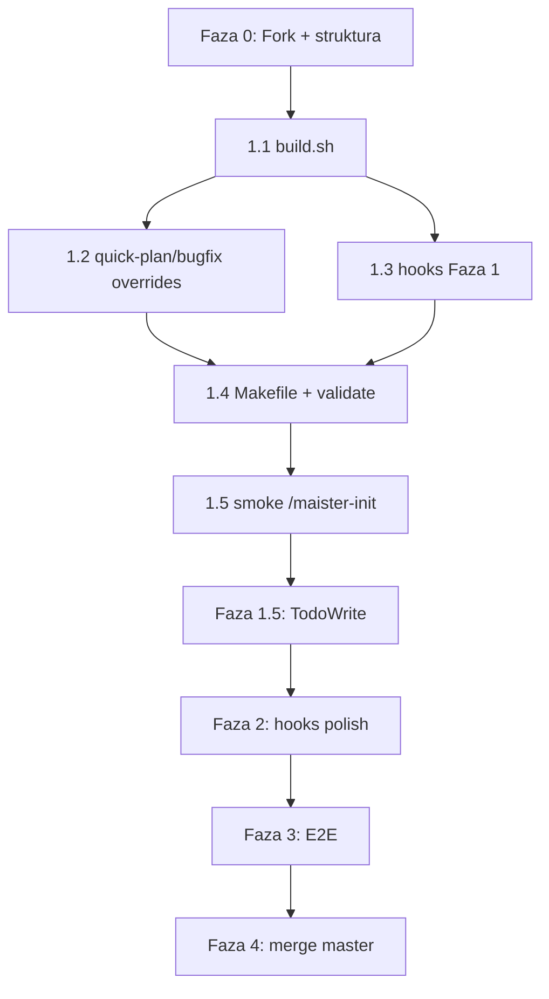

# Plan implementacji: wsparcie Cursor Agent dla Maister

Plan oparty na [`docs/cursor-agent-support.md`](./cursor-agent-support.md) i aktualnym stanie repozytorium.

**Stan wyjściowy:** istnieje tylko `platforms/copilot-cli/build.sh`; brak `platforms/cursor/`, `plugins/maister-cursor/`, `.cursor-plugin/marketplace.json`.

---

## Cel i zasady

| Zasada | Implikacja |
|--------|------------|
| `plugins/maister` = source of truth | Zero zmian platform-specific w core (poza ewentualnym PR do upstream) |
| Generacja przez build | Wszystkie adaptacje w `platforms/cursor/` + transformacje w `build.sh` |
| Commit artefaktów | `plugins/maister-cursor/` commitowany po każdym build (jak copilot) |
| Prefix `maister-foo` | `/maister-development`, nie strip jak Copilot |
| MVP bez TodoWrite | Faza 1.5 dopiero po smoke teście mechanicznego buildu |

---

## Faza 0 — Setup repo (0.5 dnia)

**Cel:** środowisko pracy gotowe do implementacji.

### Zadania

1. **Fork + branch `cursor`** (jeśli jeszcze nie zrobione)
   - `git remote add upstream https://github.com/SkillPanel/maister.git`
   - Branch roboczy: `cursor`

2. **Struktura katalogów**

   ```
   platforms/cursor/
   ├── build.sh
   ├── hooks/
   │   └── hooks.json          # szablon Cursor (camelCase events)
   ├── rules/
   │   ├── maister-workflows.mdc
   │   └── maister-docs.mdc    # dla init w projekcie
   └── templates/
       └── agents-md-template.md
   ```

3. **`.cursor-plugin/marketplace.json`**
   - Wzorować na `.claude-plugin/marketplace.json`
   - Dodać plugin `maister-cursor` → `./plugins/maister-cursor`

### Kryterium ukończenia

- Branch `cursor` istnieje, upstream skonfigurowany, katalog `platforms/cursor/` utworzony.

---

## Faza 1 — MVP mechaniczny (1–2 dni)

**Cel:** `make build-cursor` produkuje instalowalny plugin; smoke `/maister-init` działa.

### 1.1 `platforms/cursor/build.sh`

Bazować na `platforms/copilot-cli/build.sh` (~60% gotowe), z innymi transformacjami:

| # | Krok | Implementacja |
|---|------|---------------|
| 1 | Kopia | `cp -r maister → maister-cursor` |
| 2 | Manifest | `.claude-plugin/` → `.cursor-plugin/`, `name: maister-cursor` |
| 3 | Nazwy command/skill | `name: maister:foo` → `name: maister-foo` (nie strip) |
| 4 | Referencje | `maister:` → `maister-` we wszystkich `.md` (po kroku 3) |
| 5 | Explore | `subagent_type="Explore"` → `subagent_type="explore"` |
| 6 | Pytania | `AskUserQuestion` → `AskQuestion` |
| 7 | Plan mode | Usunąć/zastąpić `EnterPlanMode`/`ExitPlanMode` w quick-plan i quick-bugfix (patrz 1.2) |
| 8 | Projekt | `CLAUDE.md` → `AGENTS.md` w skills (jak copilot → copilot-instructions) |
| 9 | MCP | `.mcp.json` → `mcp.json` (Playwright zostaje) |
| 10 | Plugin doc | `CLAUDE.md` → `rules/maister-workflows.mdc` + skrócony README |
| 11 | Hooks | Nie usuwać — przepisać format (patrz 1.3) |
| 12 | Multi-select | **Bez zmian** (Cursor `AskQuestion` wspiera `allow_multiple`) |

**Pliki do utworzenia w `platforms/cursor/` (szablony kopiowane przez build):**

- `rules/maister-workflows.mdc` — kluczowe zasady z `CLAUDE.md` + sekcja „Platform: Cursor”
- `templates/agents-md-template.md` — adaptacja `docs-manager/references/claude-md-template.md` (AGENTS.md, `/maister-*`)

### 1.2 Quick-plan i quick-bugfix — własny flow planowania

**Decyzja:** nie używać `EnterPlanMode` / `SwitchMode('plan')`.

Utworzyć warianty w `platforms/cursor/overrides/` (kopiowane przez build zamiast sed na plan mode):

**`commands/quick-plan.md` (Cursor):**

1. Parse input → `AskQuestion` jeśli brak opisu
2. Discover + READ standards z `.maister/docs/` (przed planem)
3. Explore codebase (`Task` + `explore` lub bezpośrednio explore)
4. Zapis planu do pliku (np. `.maister/plans/YYYY-MM-DD-plan-name.md`) — **obowiązkowy artefakt**
5. Gate: `AskQuestion` — approve / revise / cancel
6. Po approve → implementacja w trybie agent

**`skills/quick-bugfix/SKILL.md` (Cursor):**

- Analogicznie: plan fixu w pliku + `AskQuestion` gate zamiast `EnterPlanMode`/`ExitPlanMode`
- Zachować sekcje mandatory: Applicable Standards, Fix Plan, TDD steps

### 1.3 Hooks Faza 1

| Claude | Cursor | Plik |
|--------|--------|------|
| `PreToolUse` (Bash) | `beforeShellExecution` | `block-destructive-commands.sh` |
| `SessionStart` (compact) | `preCompact` | `post-compact-reminder.sh` |

**Zmiany w skryptach:**

- `${CLAUDE_PLUGIN_ROOT}` → `${CURSOR_PLUGIN_ROOT}`
- `$CLAUDE_PROJECT_DIR` → `$CURSOR_PROJECT_DIR`
- Output JSON: `permissionDecision` → `permission: "allow"|"deny"|"ask"`
- `AskUserQuestion` → `AskQuestion` w treści reminderów

**`hooks/hooks.json` (Cursor format):**

```json
{
  "version": 1,
  "hooks": {
    "beforeShellExecution": [{ "command": "${CURSOR_PLUGIN_ROOT}/hooks/block-destructive-commands.sh" }],
    "preCompact": [{ "command": "${CURSOR_PLUGIN_ROOT}/hooks/post-compact-reminder.sh" }]
  }
}
```

`skill-invocation-reminder` → **Faza 2** (nie blokować MVP).

### 1.4 Makefile

```makefile
.PHONY: build build-copilot build-cursor validate validate-copilot validate-cursor clean clean-cursor

build: build-copilot build-cursor

build-copilot:
	bash platforms/copilot-cli/build.sh

build-cursor:
	bash platforms/cursor/build.sh

validate-cursor:
	# brak dwukropków w name: (maister-foo, nie maister:foo)
	# brak EnterPlanMode/ExitPlanMode
	# brak CLAUDE.md w skills (tylko AGENTS.md)
	# hooks.json version: 1, camelCase events
	# mcp.json istnieje, .mcp.json nie
	# subagent_type="explore" (nie Explore)

clean-cursor:
	rm -rf plugins/maister-cursor/
```

### 1.5 Smoke test lokalny

```bash
make build-cursor
cp -r plugins/maister-cursor ~/.cursor/plugins/local/maister-cursor
# Developer: Reload Window
```

**Checklist smoke:**

- [ ] Plugin widoczny w Cursor
- [ ] `/maister-init` startuje bez błędów
- [ ] `AskQuestion` działa (multi-select w init Phase 3)
- [ ] `mcp.json` — Playwright w bundle
- [ ] Hook `beforeShellExecution` blokuje `git reset --hard` od subagenta

### Kryterium ukończenia Fazy 1

- `make build-cursor && make validate-cursor` przechodzi
- `plugins/maister-cursor/` commitowany
- Smoke `/maister-init` na projekcie testowym OK

---

## Faza 1.5 — Progress tracking (2–3 dni)

**Cel:** orchestratory pokazują postęp przez `TodoWrite` zamiast `TaskCreate`/`TaskUpdate`.

### Zakres plików

**Priorytet 1 — framework:**

- `skills/orchestrator-framework/references/orchestrator-patterns.md`
- `skills/orchestrator-framework/references/orchestrator-creation-checklist.md`
- `skills/orchestrator-framework/SKILL.md`

**Priorytet 2 — orchestratory:**

- `skills/development/SKILL.md`
- `skills/product-design/SKILL.md`
- `skills/performance/SKILL.md`, `migration/SKILL.md`, `research/SKILL.md`
- `skills/init/SKILL.md`, `standards-discover/SKILL.md`
- `skills/implementation-verifier/SKILL.md`, `skills/implementation-plan-executor/SKILL.md`

### Mapowanie semantyczne (nie tylko sed)

| Claude Code | Cursor TodoWrite |
|-------------|------------------|
| `TaskCreate` (pending) | `TodoWrite` z `status: "pending"` |
| `TaskUpdate` → `in_progress` | `TodoWrite` z `status: "in_progress"` |
| `TaskUpdate` → `completed` | `TodoWrite` z `status: "completed"` |
| `TaskUpdate addBlockedBy` | Kolejność w tablicy todos + `merge: true` |
| `activeForm` | `content` z opisem aktywności |
| `metadata: {skipped: true}` | `status: "cancelled"` lub osobne pole w content |

**Implementacja:** transformacja w `build.sh` + osobny plik `platforms/cursor/transforms/task-to-todo.md` z regułami dla edge cases. Weryfikacja ręczna na `development` orchestratorze.

### Plugin documentation → rules

- `rules/maister-workflows.mdc` — pełna adaptacja sekcji Progress Tracking z `CLAUDE.md`
- Usunąć linki do dokumentacji Claude Code; dodać linki Cursor docs

### Kryterium ukończenia

- `/maister-development` pokazuje fazy w TodoWrite
- Resume po przerwaniu — todos odtwarzane z `orchestrator-state.yml`

---

## Faza 2 — Hooks + polish (1 dzień)

### Zadania

1. **`skill-invocation-reminder`** → event `sessionStart`
   - Przypomnienie: przy `/maister-*` używaj Skill tool

2. **Test resume po compaction**
   - Uruchomić workflow → skompaktować kontekst → `preCompact` hook → sprawdzić czy agent czyta `orchestrator-state.yml`

3. **Walidacja custom agents**
   - `subagent_type: "maister-gap-analyzer"` vs `name: gap-analyzer` w frontmatter
   - Test: Task tool wywołuje właściwego agenta z `agents/gap-analyzer.md`

### Kryterium ukończenia

- Wszystkie 3 hooki działają
- Resume po compaction nie gubi fazy

---

## Faza 3 — E2E (2–3 dni)

### Scenariusze testowe

| # | Scenariusz | Ryzyko |
|---|------------|--------|
| 1 | `/maister-init` → pełny flow | AGENTS.md + `.cursor/rules/maister-docs.mdc` |
| 2 | `/maister-development "mała feature"` | TodoWrite, fazy, gates |
| 3 | Resume: `[task-path] [--from=PHASE]` | orchestrator-state.yml |
| 4 | Parallel Task waves | implementer równolegle |
| 5 | Custom agent `maister-gap-analyzer` | match frontmatter |
| 6 | `/maister-quick-plan` + `/maister-quick-bugfix` | własny plan flow |
| 7 | `--e2e` z Playwright MCP | mcp.json w bundle |
| 8 | Task tool w CLI | **krytyczne** — zweryfikować wersję Cursor |

### Init — artefakty projektu

Przy `init` (transformacja w build lub override w `skills/init/SKILL.md`):

- `CLAUDE.md` → **`AGENTS.md`** (z `agents-md-template.md`)
- Krótka reguła **`.cursor/rules/maister-docs.mdc`** (`alwaysApply: true`): „read `.maister/docs/INDEX.md` first”
- Aktualizacja `standards-discover/references/docs-extractor-prompt.md`

### Dokumentacja użytkownika

- README sekcja „Cursor Agent”:
  - Instalacja z GitHub (fork, branch `cursor`)
  - Local install (`cp` vs symlink — uwaga Windows)
  - `Developer: Reload Window`
  - Włączenie MCP dla `--e2e`

### Kryterium ukończenia

- Wszystkie scenariusze 1–6 przechodzą
- Scenariusz 7 opcjonalny (wymaga MCP)
- Scenariusz 8 — jeśli Task tool niedostępny w CLI, udokumentować workaround (tylko IDE)

---

## Faza 4 — Merge do master forka (0.5 dnia)

1. Merge `cursor` → `master` po przejściu E2E
2. Wersjonowanie w trzech manifestach (jak w CLAUDE.md — beta workflow)
3. Opcjonalny PR do upstream SkillPanel z `platforms/cursor/` (nie blokuje)

---

## Kolejność zależności



---

## Ryzyka i mitigacje

| Ryzyko | Prawdopodobieństwo | Mitigacja |
|--------|-------------------|-----------|
| Task tool niedostępny w CLI | Średnie | Test na docelowej wersji Cursor; fallback: dokumentacja „IDE only” |
| Custom agents — mismatch `maister-*` vs `name:` | Średnie | Test E2E #5; ewentualnie `name: maister-gap-analyzer` w frontmatter |
| `Skill tool` z `maister-development` | Niskie | Smoke po build |
| Parallel waves — race na git | Niskie | Hook `block-destructive-commands` już chroni implementerów |
| Symlink na Windows | Średnie | README: prefer `cp -r` |
| TodoWrite ≠ TaskCreate semantyka | Wysokie | Faza 1.5 osobno; nie blokować MVP |

---

## Szacunek effort

| Faza | Czas | Blokery |
|------|------|---------|
| 0 | 0.5 dnia | — |
| 1 | 1–2 dni | — |
| 1.5 | 2–3 dni | Faza 1 smoke OK |
| 2 | 1 dzień | Faza 1.5 |
| 3 | 2–3 dni | Faza 2 |
| 4 | 0.5 dnia | E2E pass |
| **Razem** | **~1–2 tygodnie** | |

---

## Pierwsze kroki (start implementacji)

1. Utworzyć `platforms/cursor/build.sh` — kopia copilot + pierwsze 6 transformacji (manifest, nazwy, referencje, AskQuestion, explore, mcp.json)
2. Uruchomić `make build-cursor` i porównać diff z `maister-copilot` (co jest unikalne dla Cursor)
3. Dodać overrides quick-plan/bugfix
4. Przepisać 2 hooki + `hooks.json`
5. Smoke `/maister-init`
