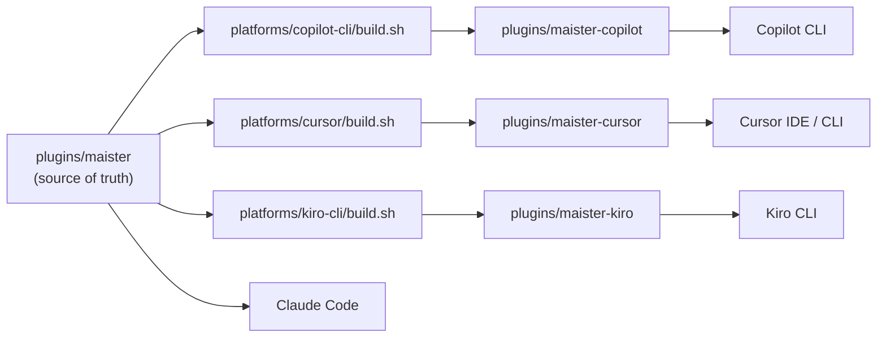

# Analiza: wsparcie Cursor Agent dla Maister

Repozytorium ma sprawdzony wzorzec multi-platformy: **`plugins/maister`** to źródło prawdy (Claude Code), a warianty platformowe są **generowane** przez `platforms/*/build.sh`. Dla Cursor: **`plugins/maister-cursor`** via `platforms/cursor/build.sh`. Dla Kiro CLI: **`plugins/maister-kiro`** via `platforms/kiro-cli/build.sh` — pełny przewodnik: **[Kiro CLI Support](kiro-cli-support.md)**.

> **Status:** analiza techniczna + **podjęte decyzje** (sesja grill, 2026-06). Kiro CLI: **zaimplementowane** (2026-06).

---

## Podjęte decyzje (grill)

| # | Temat | Decyzja |
|---|-------|---------|
| 1 | Architektura | `plugins/maister` = source of truth; `platforms/cursor/build.sh` generuje `maister-cursor` |
| 2 | Repo | **Fork GitHub** SkillPanel/maister (nie nowe repo od zera) |
| 3 | Dystrybucja | **Local** (`~/.cursor/plugins/local/`) + **GitHub**; **bez** publicznego Cursor Marketplace |
| 4 | Artefakty | **Commitować** `plugins/maister-cursor` (jak `maister-copilot`) |
| 5 | Nazewnictwo | Prefix **`maister-foo`** (`/maister-development`, nie `development` jak Copilot) |
| 6 | Instrukcje projektu | **`AGENTS.md`** + krótka reguła **`.cursor/rules/`** przy `init` |
| 7 | Progress tracking | Faza 1 (build) → **Faza 1.5 (TodoWrite)** → E2E; nie blokować MVP buildem TodoWrite |
| 8 | Quick commands | **Przepisać od razu** `quick-plan` + `quick-bugfix` |
| 9 | Planowanie | **Własny flow** (plan w pliku + `AskQuestion`); **bez** `EnterPlanMode` / `SwitchMode('plan')` |
| 10 | Hooks Faza 1 | **`block-destructive-commands`** + **`post-compact-reminder`**; `skill-invocation-reminder` → Faza 2 |
| 11 | Branding | Zachować **`maister`** / **`maister-cursor`** na razie |
| 12 | Explore | `subagent_type="Explore"` → **`maister-explore`** (custom agent, `model: inherit`) — nie wbudowany `explore` |
| 13 | Custom agenci | Prefiks **`maister-*`** w referencjach Task (`maister-gap-analyzer`); pliki `agents/` z `name: gap-analyzer` — zweryfikować match w teście |
| 14 | Branchy | Teraz branch **`cursor`**; po E2E Cursor → **merge do `master` forka** |
| 15 | Przyszłość | **`kiro-cli`** ten sam wzorzec; docelowo **wszystko na `master` forka** |
| 16 | Makefile | Osobne targety (`build-cursor`, `build-kiro`, …) + **`make build` = all** |
| 17 | MCP | **Playwright w bundle** (`mcp.json`, jak core) |

---

## Strategia repo (fork)

Repo SkillPanel nie jest pod naszą kontrolą. Pełna kontrola = **własny fork na GitHubie**.

```
SkillPanel/maister          ← upstream (oryginał)
        │
        │  fork
        ▼
TWOJ-ORG/maister            ← fork (pełna kontrola)
├── master                  ← docelowo: wszystkie platformy
└── cursor                  ← branch roboczy (teraz)
```

**Fork vs nowe repo + kopia:** fork zachowuje historię i ułatwia `git merge upstream/master`. Nowe repo = świeża historia, trudniejszy sync.

**Sync z upstream:**
```bash
git remote add upstream https://github.com/SkillPanel/maister.git
git fetch upstream
git merge upstream/master   # na master forka, potem merge/rebase do cursor
```

**Instalacja pluginu (bez marketplace):**
```bash
git clone git@github.com:mateuszrapacz/maister.git
cd maister

# Instalacja (kopia do ~/.cursor/plugins/local/)
bash platforms/cursor/smoke-install.sh
```
Potem: **Developer: Reload Window** w Cursor (IDE). CLI działa od razu bez `--plugin-dir`.

Licencja upstream: **MIT** — fork i dystrybucja dozwolone (zachować LICENSE).

---

## Docelowy kształt forka (`master`)

```
fork/
├── plugins/
│   ├── maister              ← sync z upstream (nie edytować platform-specific)
│   ├── maister-copilot      ← make build-copilot
│   ├── maister-cursor       ← make build-cursor
│   └── maister-kiro         ← make build-kiro
├── platforms/
│   ├── copilot-cli/build.sh
│   ├── cursor/build.sh
│   └── kiro-cli/build.sh
├── .claude-plugin/marketplace.json
└── .cursor-plugin/marketplace.json
```

**Zasada:** nigdy nie edytować ręcznie `plugins/maister-copilot/`, `plugins/maister-cursor/`, `plugins/maister-kiro/`.

---

## Obecna architektura



### Copilot build (referencja)

`platforms/copilot-cli/build.sh`:

1. `cp -r maister → maister-copilot`
2. `plugin.json` name → `maister-copilot`
3. `maister:foo` → `foo` (strip prefix)
4. `maister:` → `maister-` w referencjach
5. multi-select → sequential
6. `CLAUDE.md` → `.github/copilot-instructions.md`
7. `AskUserQuestion` → `ask_user`
8. Usuwa `hooks/`

### Cursor build (plan)

`platforms/cursor/build.sh` — kopia copilot z innymi transformacjami:

| Krok | Transformacja |
|------|---------------|
| Kopia | `cp -r maister → maister-cursor` |
| Manifest | `.claude-plugin/` → `.cursor-plugin/`, name → `maister-cursor` |
| Nazwy skill/command | `maister:foo` → **`maister-foo`** (nie strip jak Copilot) |
| Referencje | `maister:` → `maister-` |
| Pytania | `AskUserQuestion` → `AskQuestion` |
| Plik projektu | `CLAUDE.md` → **`AGENTS.md`** |
| Explore | `"Explore"` / `explore` → **`maister-explore`**; agent z `platforms/cursor/agents/explore.md` |
| MCP | `.mcp.json` → **`mcp.json`** |
| Plugin doc | `CLAUDE.md` → `rules/maister-workflows.mdc` + README |
| Hooks | Przepisać na format Cursor (nie usuwać) |
| Plan mode | Usunąć `EnterPlanMode`/`ExitPlanMode`; własny flow w quick-plan/bugfix |
| Multi-select | **Bez zmian** (Cursor `AskQuestion` wspiera `allow_multiple`) |

---

## Co trzeba zrobić — podział na obszary

### 1. Pipeline build (infrastruktura)

| Zadanie | Szczegóły |
|---------|-----------|
| `platforms/cursor/build.sh` | Kopia `maister` → `maister-cursor` + transformacje |
| `Makefile` | `build-cursor`, `validate-cursor`, `clean-cursor`; `make build` = all platformy |
| Marketplace | `.cursor-plugin/marketplace.json` na forku (dla GH / team marketplace, nie public submit) |
| Artefakty | Commitować `plugins/maister-cursor` po każdym build |

### 2. Manifest i struktura plików

| Claude Code | Cursor |
|-------------|--------|
| `.claude-plugin/plugin.json` | `.cursor-plugin/plugin.json` |
| `.mcp.json` | `mcp.json` (Playwright — zostaje w bundle) |
| `CLAUDE.md` (plugin doc) | `rules/maister-workflows.mdc` + README |
| `hooks/hooks.json` (PascalCase) | `hooks/hooks.json` (`version: 1`, camelCase) |

### 3. Transformacje nazw

- `name: maister:foo` → `name: maister-foo`
- `maister:gap-analyzer` → `maister-gap-analyzer` (Task tool)
- `/maister:development` → `/maister-development`
- Plugin: `maister-cursor`

### 4. Plik instrukcji projektu (`init`)

- `CLAUDE.md` → **`AGENTS.md`** (template: `agents-md-template.md`)
- Przy `init`: krótka reguła `.cursor/rules/maister-docs.mdc` (`alwaysApply: true`) — „read `.maister/docs/INDEX.md` first”
- Aktualizacja `standards-discover` (docs-extractor prompt)

### 5. Mapowanie narzędzi agenta

| Claude Code | Cursor | Priorytet |
|-------------|--------|-----------|
| `AskUserQuestion` | `AskQuestion` | Faza 1 (sed) |
| `TaskCreate` / `TaskUpdate` | `TodoWrite` | **Faza 1.5** — przepisać semantykę, nie tylko stringi |
| `EnterPlanMode` / `ExitPlanMode` | Własny flow: plan w pliku + `AskQuestion` | Faza 1 (quick-plan, quick-bugfix) |
| `Skill tool` | `Skill tool` | Bez zmian |
| `Task tool` | `Task tool` | Prefiksy `maister-*`; zweryfikować w CLI |
| `subagent_type="Explore"` | `maister-explore` | Zaimplementowane — custom agent zamiast wbudowanego `explore` |
| Custom agents | `maister-gap-analyzer` itd. | Faza 1; test match z `name:` w frontmatter |

**Task tool w CLI:** oficjalnie wspierany (IDE + CLI + Cloud). Przed E2E zweryfikować na swojej wersji Cursor — wcześniej były bugi z brakiem Task tool w CLI.

**Built-in subagenty Cursor:** `explore`, `bash`, `browser` — [dokumentacja](https://cursor.com/docs/subagents). Maister **nie używa** wbudowanego `explore` — patrz sekcja poniżej.

### `maister-explore` (custom explore z dziedziczeniem modelu)

Wbudowany subagent Cursor `explore` domyślnie działa na szybszym modelu z rodziny Composer (`composer-*-fast`), niezależnie od modelu wybranego w głównej sesji CLI/IDE. W CLI nie ma oficjalnego ustawienia w `cli-config.json`, które wymusza regular Composer dla wbudowanego `explore`.

**Decyzja Maister:** własny agent `maister-explore` z `model: inherit` i `readonly: true`, bundlowany tylko w wariancie Cursor.

| Aspekt | Wbudowany `explore` | `maister-explore` |
|--------|---------------------|-------------------|
| Model | Faster Composer (domyślnie) | Dziedziczy model parenta |
| Konfiguracja CLI | Brak w `cli-config.json` | Frontmatter w `agents/explore.md` |
| Scope | Globalny Cursor | Plugin `maister-cursor` |

**Źródło:** `platforms/cursor/agents/explore.md` → po `make build-cursor` → `plugins/maister-cursor/agents/explore.md` (`name: maister-explore`).

**Transformacja w build.sh:** wszystkie `subagent_type` z `Explore` / `explore` zamieniane na `maister-explore` w wygenerowanym `maister-cursor`. Core `plugins/maister` zostaje na `"Explore"` (Claude Code).

**Gdzie używane:**
- `skills/codebase-analyzer` — równoległe agenty eksploracji
- `skills/quick-plan`, `skills/quick-bugfix` — overrides Cursor
- `agents/thermo-nuclear-*` — zbieranie kontekstu diffu

**Walidacja:** `make validate-cursor` wymaga `maister-explore`, `model: inherit` i braku referencji do wbudowanego `explore`.

**Znane ograniczenie:** Cursor ma otwarty bug z routingiem subagentów na fast mode w CLI mimo `inherit`. Jeśli dashboard nadal pokazuje `composer-*-fast`, zgłoś Request ID (`/copy-request-id`) do Cursor support.

### 6. Hooks

| Claude Code | Cursor | Faza |
|-------------|--------|------|
| `PreToolUse` (Bash) | `beforeShellExecution` | **1** — `block-destructive-commands` |
| `SessionStart` (compact) | `preCompact` | **1** — `post-compact-reminder` |
| `SessionStart` (general) | `sessionStart` | **2** — `skill-invocation-reminder` |

Zmiany w skryptach:
- `${CLAUDE_PLUGIN_ROOT}` → `${CURSOR_PLUGIN_ROOT}`
- `$CLAUDE_PROJECT_DIR` → `$CURSOR_PROJECT_DIR`
- JSON odpowiedzi: `{"permission": "allow|deny|ask"}`
- `AskUserQuestion` → `AskQuestion` w treści reminderów

### 7. Quick-plan i quick-bugfix

**Decyzja:** przepisać od razu, **bez** wbudowanego plan mode Cursor.

Własny flow:
1. Discover + read standards z `.maister/docs/`
2. Zapis planu do pliku (artefakt, obowiązkowy)
3. Gate: `AskQuestion` — approve / revise / cancel
4. Implementacja w trybie agent

Dotyczy: `skills/maister-quick-plan/SKILL.md`, `skills/maister-quick-bugfix/SKILL.md`.

### 8. Skill visibility & naming

Cursor loads every `skills/*/SKILL.md` into slash autocomplete. There is no API to hide palette entries; `user-invocable: false` and `disable-model-invocation: true` do not suppress the `/` list.

**Build output (skills-only):**
- Public user-facing skills: `/maister-*` only (one entry per capability)
- Internal engines: `lib/skills/maister-*` (orchestrator-only — docs-manager, codebase-analyzer, implementation-plan-executor, implementation-verifier)
- Reference-only: `lib/orchestrator-framework/` (not a slash skill)

**Naming migration (breaking):** Old plain-kebab names removed from palette. Examples:
- `/problem-classifier` → `/maister-problem-classifier`
- `/grill-me` → `/maister-grill-me`
- `/maister-quick-problem-classifier` → `/maister-problem-classifier` (shorter form per D1)

No `commands/` directory in Cursor build — thin command wrappers merged into skills at build time (`platforms/cursor/build.sh`).

### 9. Plugin documentation

- Kluczowe zasady → `rules/maister-workflows.mdc` (`alwaysApply: true`)
- Sekcja „Platform: Cursor” na końcu (jak copilot variant)
- Usunąć linki do dokumentacji Claude Code

### 10. MCP, agenci, pozostałe

| Element | Decyzja |
|---------|---------|
| Playwright MCP | W bundle (`mcp.json`); README: włącz MCP jeśli używasz `--e2e` |
| 25 custom agents | Pliki w `agents/` (+ `maister-explore`); referencje `maister-*` |
| `docs-operator` + `skills:` frontmatter | Wspierane |
| Product-design server | Bez zmian |
| `.maister/` artifacts | Wspólne między platformami |

---

## Plan implementacji

### Faza 0 — Fork setup

1. Fork `SkillPanel/maister` → `TWOJ-ORG/maister`
2. Branch `cursor`
3. `git remote add upstream ...`

### Faza 1 — MVP mechaniczny (1–2 dni)

1. `platforms/cursor/build.sh` (nazwy, AGENTS.md, AskQuestion, explore, manifest, mcp.json)
2. Przepisanie `quick-plan` + `quick-bugfix` (własny plan flow)
3. Hooks: destructive + compact
4. `make build-cursor`, `validate-cursor`
5. Install local + smoke: `/maister-init`

### Faza 1.5 — Progress tracking (2–3 dni)

1. `TaskCreate`/`TaskUpdate` → `TodoWrite` w orchestratorach + `orchestrator-patterns.md`
2. `CLAUDE.md` plugin doc → rules

### Faza 2 — Hooks + polish (1 dzień)

1. `skill-invocation-reminder` → `sessionStart`
2. Test resume po compaction

### Faza 3 — E2E (2–3 dni)

1. `/maister-init` → `/maister-development` → resume
2. Parallel Task waves, custom agents
3. README: instalacja z GH + local

### Faza 4 — Merge do master forka

1. Merge branch `cursor` → `master` po przejściu E2E
2. Potem: `platforms/kiro-cli/` na tym samym `master`

**Szacunek:** ~1–2 tygodnie pracy skupionej.

**Nie w scope:** publiczny submit na cursor.com/marketplace.

---

## Ryzyka do zweryfikowania testami

1. **`Skill tool`** z nazwą `maister-development`
2. **Custom agents** — `subagent_type: "maister-gap-analyzer"` vs match z `name:` w frontmatter
3. **`maister-explore`** — custom agent z `model: inherit`; build zamienia `Explore`/`explore` → `maister-explore`; zweryfikować w CLI, że nie pada na `composer-*-fast`
4. **Task tool w CLI** — dostępność na Twojej wersji Cursor (krytyczne dla całego Maister)
5. **Parallel Task waves** — development executor, równoległe wywołania
6. **Symlink local install** — na Windows może wymagać `cp -r`

---

## Co NIE wymaga zmian w `plugins/maister`

Core pozostaje nietknięty. Adaptacje idą do:
- `platforms/cursor/build.sh`
- `platforms/cursor/` — szablony (hooks, rules, agents-md-template, **`agents/explore.md`**)

Upstream SkillPanel: opcjonalny PR z `platforms/cursor/` po stabilizacji — nie blokuje pracy na forku.

---

## Rekomendacja implementacyjna

Najkrótsza ścieżka: **skopiować i rozszerzyć `platforms/copilot-cli/build.sh`** → `platforms/cursor/build.sh`. Copilot rozwiązał ~60% (kopia, prefiksy, plik instrukcji). Cursor wymaga dodatkowo: hooks, TodoWrite, własny plan flow, rules, **`maister-explore`** — ~40% unikalnej pracy.
