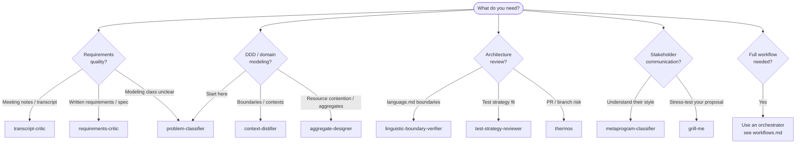
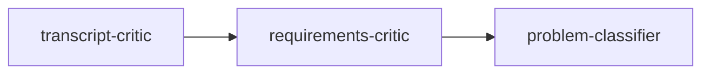
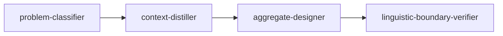
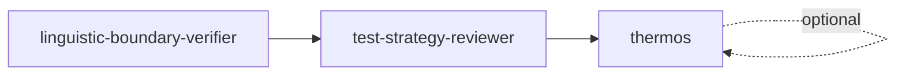
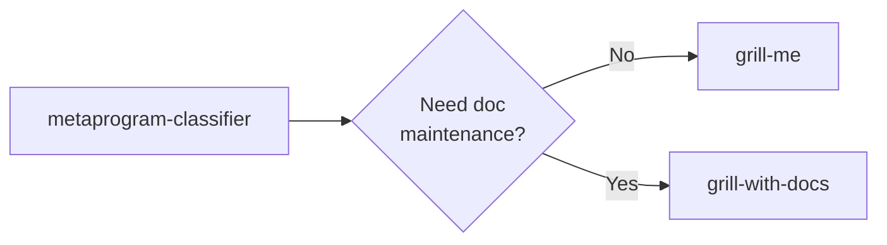

# On-Demand Skills Guide

User-oriented guide to Maister's Wave 1–3 on-demand skills — what they do, when to invoke them, and how they relate to orchestrator workflows.

**Related docs:** [Documentation Hub](README.md) · [Workflows](workflows.md) · [Command Reference](commands.md)

---

## 1. Introduction

### On-demand vs orchestrator workflows

Maister provides **five orchestrator workflows** (`development`, `research`, `performance`, `migration`, `product-design`) that run multi-phase pipelines automatically. Each orchestrator invokes internal skills (codebase-analyzer, specification-creator, implementation-planner, and others) as phases — you do not call those directly.

**On-demand skills** are different. They are **standalone capabilities** you invoke when you need a specific analysis, critique, or modeling session outside — or before — a full orchestrator run. They are **not phases** of `/maister:development` or any other orchestrator.

| Type | Examples | How they run |
|------|----------|--------------|
| **Orchestrator** | `/maister:development`, `/maister:research` | Multi-phase pipeline; phases activate based on task characteristics |
| **On-demand skill** | `context-distiller`, `requirements-critic`, `thermos` | Single focused session; you invoke manually |
| **Internal skill** | `codebase-analyzer`, `implementation-verifier` | Auto-invoked by orchestrators only — see [Workflows § Internal Skills](workflows.md#internal-skills) |

### Manual invocation

On-demand skills require an **explicit request**:

- **Slash command** — for skills with a command wrapper (e.g. `/maister:quick-problem-classifier`)
- **Natural language** — ask the agent directly (e.g. "grill me on this plan" or "run a thermos review on this branch")
- **Cursor hyphen form** — `/maister-quick-problem-classifier` (see §2)

Skills marked **"Explicit request only"** in the agent catalog (`plugins/maister/CLAUDE.md`) will not auto-run during unrelated work. The `disable-model-invocation` frontmatter flag means the model cannot silently attach the skill — you must ask.

### ADR-008: soft suggestions (never auto-invoked)

Two on-demand skills may be **soft-suggested** by orchestrators after specific phases. The orchestrator may mention them; it will **never** invoke them automatically.

| Skill | Orchestrator | When suggested |
|-------|--------------|----------------|
| `requirements-critic` | `development` only | After requirements are drafted in Phase 5 — you may run `/maister:quick-requirements-critic` for interactive quality critique |
| `transcript-critic` | `product-design` only | When meeting transcripts are present — you may run `/maister:quick-transcript-critic` for decision-process audit |

All other on-demand skills: **no orchestrator suggestion, no auto-invocation**.

---

## 2. How to invoke

### Claude Code (primary)

```
/maister:<command-name>
```

Examples: `/maister:quick-requirements-critic`, `/maister:modeling-context-distiller`, `/maister:reviews-test-strategy`

### Cursor Agent

Cursor uses a **hyphen** prefix instead of a colon:

```
/maister-<command-name>
```

Examples: `/maister-quick-requirements-critic`, `/maister-modeling-context-distiller`

### Kiro CLI

Kiro uses a different invocation model. See [Kiro CLI Support](kiro-cli-support.md) for platform-specific details.

### Explicit-request skills (no reliable Claude Code slash)

`grill-me`, `grill-with-docs`, and `thermos` do not have standard command wrappers. Invoke them by **asking explicitly**:

- "Grill me on this design until we agree on the trade-offs"
- "Grill this plan and update language.md"
- "Run a thermos review on my branch before merge"

**Cursor users** can also try: `/maister-grill-me`, `/maister-grill-with-docs`, and `/maister-thermos`

### Trigger phrases (summary)

| Skill | Example trigger phrases |
|-------|------------------------|
| `transcript-critic` | "audit this meeting transcript", "critique these notes for decision problems" |
| `requirements-critic` | "critique these requirements", "run requirements critic" |
| `problem-classifier` | "classify these requirements", "what modeling problem class is this?" |
| `context-distiller` | "distill bounded contexts", "can X be generalized with Y?" |
| `aggregate-designer` | "design aggregates", "modeling resource contention" |
| `linguistic-boundary-verifier` | "check linguistic boundaries", "language.md leakage audit" |
| `test-strategy-reviewer` | "review test strategy", "are these tests output-based or interaction-based?" |
| `metaprogram-classifier` | "what metaprogram is this person using?", "how should I communicate with them?" |
| `grill-me` | "grill me", "stress-test this plan" |
| `grill-with-docs` | "grill with docs", "grill this plan and update language.md", "stress-test and capture domain language" |
| `thermos` | "thermos review", "thermo-nuclear review of this PR" |

For full invocation guards and workflow detail, see each skill's `SKILL.md` (linked in §5).

---

## 3. Which skill should I use?



**Rule of thumb:** If you need end-to-end implementation with spec, plan, and verification — use `/maister:development`. If you need a focused critique or modeling session — pick an on-demand skill (or chain via Bundles A–D below).

---

## 4. Recommended bundles (A–D)

Bundles are **manual chains** — run each skill in sequence yourself. Progress via each skill's "Recommended next steps" section, not orchestrator wiring.

### Bundle A — Requirements quality

Use after meetings or when refining raw notes into implementable requirements.



1. **`transcript-critic`** — Audit meeting transcript for decision-process problems (false consensus, scope drift)
2. **`requirements-critic`** — Interactive 4-check requirements quality critique on refined stories
3. **`problem-classifier`** — When concurrency or resource-contention signals appear, classify into DDD problem classes

### Bundle B — DDD modeling

Use when shaping a new domain or resolving modeling ambiguity.



1. **`problem-classifier`** — Classify requirements into modeling problem classes
2. **`context-distiller`** — When generalization or ambiguity signals appear, distill bounded contexts
3. **`aggregate-designer`** — When Resource Contention (RC) class is detected, design consistency units
4. **`linguistic-boundary-verifier`** — When `language.md` files exist, audit boundary leakage

### Bundle C — Architecture review

Use before merging significant changes or when adopting the `language.md` convention.



1. **`linguistic-boundary-verifier`** — Audit bounded-context language via [`language.md` files](../.maister/docs/standards/global/language-md-convention.md)
2. **`test-strategy-reviewer`** — Compare test strategy (output/state/interaction-based) against production code problem class
3. **`thermos`** *(optional)* — Comprehensive PR audit combining risk + maintainability reviews

### Bundle D — Stakeholder communication

Use before difficult conversations or when adapting your message to someone's style.



1. **`metaprogram-classifier`** — Diagnose NLP metaprogram patterns in their communication
2. **`grill-me`** or **`grill-with-docs`** — Stress-test your proposal before the conversation; use `grill-with-docs` when you want confirmed `language.md` and sparse ADR updates during grilling

---

## 5. Skill catalog

Each entry: 2–4 sentences + when/when-not + invocation + output type + suggested next step. Full behavioral spec: link to `SKILL.md`.

### Wave 1 — Requirements, decisions, branch review

#### transcript-critic

**What it does:** Audits meeting transcripts for decision-process problems — false consensus, marginalized voices, scope drift. Produces a structured non-interactive critique with severity ratings, evidence quotes, and diagnostic questions.

**When to use:** After meetings where requirements were discussed verbally; before converting notes into tickets or specs.

**When not to use:** For written requirements already in structured form (use `requirements-critic` instead); during orchestrator runs (invoke manually before or between phases).

**Command:** `/maister:quick-transcript-critic` (Cursor: `/maister-quick-transcript-critic`)

**Output type:** Report (non-interactive)

**Suggested next:** `requirements-critic` (Bundle A) — see [Bundle A](#bundle-a--requirements-quality)

**Full spec:** [plugins/maister/skills/transcript-critic/SKILL.md](../plugins/maister/skills/transcript-critic/SKILL.md)

---

#### requirements-critic

**What it does:** Interactive requirements critique via four checks: problem vs solution framing, observable behavior, extensible signal map, and rigid quantifier probing.

**When to use:** Before writing a specification; when requirements feel vague or solution-heavy; after `transcript-critic` in Bundle A.

**When not to use:** For meeting transcripts (use `transcript-critic`); as a substitute for `/maister:development` specification phase.

**Command:** `/maister:quick-requirements-critic` (Cursor: `/maister-quick-requirements-critic`)

**Output type:** Interactive session

**Suggested next:** `problem-classifier` when RC signals appear — see [Bundle A](#bundle-a--requirements-quality)

**Full spec:** [plugins/maister/skills/requirements-critic/SKILL.md](../plugins/maister/skills/requirements-critic/SKILL.md)

---

#### problem-classifier

**What it does:** Classifies business requirements into four DDD modeling problem classes: CRUD, Transformation & Presentation, Integration, and Resource Contention. Provides signal scan, clarifying questions, and implementation guidance.

**When to use:** When unsure which modeling approach fits; as the entry point for Bundle B; after requirements quality work in Bundle A.

**When not to use:** For routing tasks to orchestrators (that's the `task-classifier` **agent**, not this skill).

**Command:** `/maister:quick-problem-classifier` (Cursor: `/maister-quick-problem-classifier`)

**Output type:** Interactive session

**Suggested next:** `context-distiller` (generalization signals) or `aggregate-designer` (RC class) — see [Bundle B](#bundle-b--ddd-modeling)

**Full spec:** [plugins/maister/skills/problem-classifier/SKILL.md](../plugins/maister/skills/problem-classifier/SKILL.md)

---

#### grill-me

**What it does:** Relentless interactive interview to stress-test a plan or design until shared understanding. Walks a decision tree one question at a time with recommended answers. Ends with a **convergence gate** — summarizes decisions, assumptions, deferrals, and contradictions; requires explicit user confirmation before closing. **Read-only** — no documentation or code edits during the session. Explicit request only.

**When to use:** Before stakeholder conversations; when a design has unresolved branches; as the second step in Bundle D; when you want stress-testing without maintaining `language.md` or ADRs.

**When not to use:** When you want vocabulary or decisions captured in project docs during grilling (use `grill-with-docs` instead); for automated reports (use review skills); as a replacement for product-design orchestrator.

**Invocation:** Ask explicitly in natural language (e.g. "grill me on this plan"). Cursor: `/maister-grill-me`. Do not rely on a Claude Code slash command.

**Output type:** Interactive session (read-only)

**Suggested next:** Proceed to implementation, stakeholder meeting, or `grill-with-docs` to harden vocabulary — see [Bundle D](#bundle-d--stakeholder-communication)

**Related:** [`grill-with-docs`](#grill-with-docs) — docs-maintaining grilling variant

**Full spec:** [plugins/maister/skills/grill-me/SKILL.md](../plugins/maister/skills/grill-me/SKILL.md)

---

#### grill-with-docs

**What it does:** Same grilling discipline as `grill-me` — one question at a time, facts vs decisions, decision-tree walk, convergence gate — plus user-confirmed updates to `language.md` and sparse ADRs when decisions meet significance criteria. Explicit request only.

**When to use:** When stress-testing a plan or domain topic and you want canonical vocabulary and reversible decisions captured in project documentation as you go; before implementation when `language.md` or ADRs should reflect agreed terms.

**When not to use:** For read-only stress-testing without doc edits (use `grill-me`); for strategic bounded-context discovery (use `context-distiller`); for aggregate/locking design (use `aggregate-designer`); for read-only boundary audits of existing docs (use `linguistic-boundary-verifier`).

**Invocation:** Ask explicitly in natural language (e.g. "grill this plan and update language.md"). Cursor: `/maister-grill-with-docs`. Do not rely on a Claude Code slash command.

**Output type:** Interactive session with confirmed `language.md` and ADR edits

**Suggested next:** `linguistic-boundary-verifier` for read-only boundary audit; `/maister:quick-plan` or `/maister:development` once vocabulary is settled

**Related:** [`grill-me`](#grill-me) — read-only alternative; [`linguistic-boundary-verifier`](#linguistic-boundary-verifier) — post-settlement audit

**Full spec:** [plugins/maister/skills/grill-with-docs/SKILL.md](../plugins/maister/skills/grill-with-docs/SKILL.md)

---

#### Grilling and modeling — when to use which skill

| Skill | Use when… |
|-------|-----------|
| `grill-me` | Stress-testing a plan or design until shared understanding; **no** documentation or code edits |
| `grill-with-docs` | Same grilling discipline, but you want confirmed terms in `language.md` and sparse ADRs as decisions resolve |
| `context-distiller` | Strategic bounded-context discovery — generalization candidates and context-split signals across the domain |
| `aggregate-designer` | Resource Contention consistency units — aggregate boundaries, command locking, optimistic concurrency |
| `linguistic-boundary-verifier` | Read-only audit of existing `language.md` files for cross-module leakage (does not interactively resolve terms) |

---

#### thermos

**What it does:** Launches both `thermo-nuclear-review` and `thermo-nuclear-code-quality-review` in parallel, then synthesizes deduplicated findings. Covers bugs, breaking changes, security, maintainability, and structural simplification ("code judo").

**When to use:** Before merging a significant PR or branch; as optional final step in Bundle C alongside boundary and test-strategy reviews.

**When not to use:** For routine small changes; when you only need linguistic boundaries (use `linguistic-boundary-verifier` alone).

**Invocation:** Ask explicitly (e.g. "run a thermos review on this branch"). Cursor: `/maister-thermos`. Do not rely on a Claude Code slash command.

**Output type:** Report (synthesized from parallel sub-reviews)

**Covers:** `thermo-nuclear-review` + `thermo-nuclear-code-quality-review` (documented here only, not as separate catalog entries)

**Suggested next:** Address findings, then merge — see [Bundle C](#bundle-c--architecture-review)

**Full spec:** [plugins/maister/skills/thermos/SKILL.md](../plugins/maister/skills/thermos/SKILL.md)

---

### Wave 2 — Architecture language, tests, communication

#### linguistic-boundary-verifier

**What it does:** Read-only audit of bounded-context language leakage via `language.md` files. Gracefully degrades when the convention is not adopted.

**When to use:** When modules have `language.md` files; before merging cross-module changes; as entry to Bundle C.

**When not to use:** When `language.md` convention is not in use (skill will note graceful degradation).

**Command:** `/maister:reviews-linguistic-boundaries` (Cursor: `/maister-reviews-linguistic-boundaries`)

**Output type:** Report (read-only)

**Suggested next:** `test-strategy-reviewer` — see [Bundle C](#bundle-c--architecture-review)

**Full spec:** [plugins/maister/skills/linguistic-boundary-verifier/SKILL.md](../plugins/maister/skills/linguistic-boundary-verifier/SKILL.md)

---

#### test-strategy-reviewer

**What it does:** Read-only review that classifies production code by problem class and compares test strategy (output/state/interaction-based) against recommendations.

**When to use:** After `linguistic-boundary-verifier` in Bundle C; when tests feel misaligned with production code structure.

**When not to use:** To write tests (it reviews strategy only); as a substitute for running the test suite.

**Command:** `/maister:reviews-test-strategy` (Cursor: `/maister-reviews-test-strategy`)

**Output type:** Report (read-only)

**Suggested next:** Optional `thermos` for PR-level audit — see [Bundle C](#bundle-c--architecture-review)

**Full spec:** [plugins/maister/skills/test-strategy-reviewer/SKILL.md](../plugins/maister/skills/test-strategy-reviewer/SKILL.md)

---

#### metaprogram-classifier

**What it does:** Diagnoses NLP metaprogram patterns in utterances or described behavior and suggests context-specific communication strategies.

**When to use:** Before difficult stakeholder conversations; when communication style seems mismatched; as entry to Bundle D.

**When not to use:** For technical code review; for requirements quality (use Bundle A skills).

**Command:** `/maister:quick-metaprogram-classifier` (Cursor: `/maister-quick-metaprogram-classifier`)

**Output type:** Interactive session

**Suggested next:** `grill-me` — see [Bundle D](#bundle-d--stakeholder-communication)

**Full spec:** [plugins/maister/skills/metaprogram-classifier/SKILL.md](../plugins/maister/skills/metaprogram-classifier/SKILL.md)

---

### Wave 3 — Strategic DDD

#### context-distiller

**What it does:** Distills bounded contexts via bidirectional linguistic analysis — finds generalization candidates and context-split signals. Produces a strategic design artifact, not implementation code.

**When to use:** When domain concepts might be generalized or split across contexts; after `problem-classifier` in Bundle B when ambiguity signals appear.

**When not to use:** For RC-class problems needing aggregate design (skip to `aggregate-designer`); for implementation planning (use `/maister:development`).

**Command:** `/maister:modeling-context-distiller` (Cursor: `/maister-modeling-context-distiller`)

**Output type:** Strategic design artifact (report)

**Suggested next:** `aggregate-designer` (RC class) or `linguistic-boundary-verifier` — see [Bundle B](#bundle-b--ddd-modeling)

**Full spec:** [plugins/maister/skills/context-distiller/SKILL.md](../plugins/maister/skills/context-distiller/SKILL.md)

---

#### aggregate-designer

**What it does:** Interactive wizard for Resource Contention consistency units — aggregate boundaries, command locking, optimistic concurrency.

**When to use:** When `problem-classifier` detects RC class; when modeling concurrent resource contention.

**When not to use:** For CRUD or integration-class problems; before context boundaries are understood (run `context-distiller` first if ambiguous).

**Command:** `/maister:modeling-aggregate-designer` (Cursor: `/maister-modeling-aggregate-designer`)

**Output type:** Interactive wizard

**Suggested next:** `linguistic-boundary-verifier` when `language.md` exists — see [Bundle B](#bundle-b--ddd-modeling)

**Full spec:** [plugins/maister/skills/aggregate-designer/SKILL.md](../plugins/maister/skills/aggregate-designer/SKILL.md)

---

## 6. Common scenarios

### Post-meeting notes → implementation

1. Run **Bundle A**: `transcript-critic` on raw notes → `requirements-critic` on refined stories → `problem-classifier` if RC signals appear
2. If modeling is complex, continue **Bundle B** before starting `/maister:development`
3. Start `/maister:development` with clean requirements — orchestrator handles spec, plan, and implementation

### Jira ticket before spec

1. Paste ticket text into `/maister:quick-requirements-critic` for interactive critique
2. If solution-heavy or ambiguous, run `/maister:quick-problem-classifier`
3. Proceed to `/maister:development` or `/maister:quick-plan` depending on scope

### New domain with resource contention

1. `/maister:quick-problem-classifier` on requirements — expect RC class
2. `/maister:modeling-context-distiller` if multiple contexts or generalization candidates
3. `/maister:modeling-aggregate-designer` for consistency unit design
4. `/maister:reviews-linguistic-boundaries` once `language.md` files exist
5. `/maister:development` for implementation

### PR review before merge

1. `/maister:reviews-linguistic-boundaries` on changed modules (if `language.md` adopted)
2. `/maister:reviews-test-strategy` on new/changed tests
3. Ask for a **thermos** review on the branch for comprehensive risk + maintainability audit
4. Address findings, then merge

---

## 7. Related docs

| Doc | Purpose |
|-----|---------|
| [Documentation Hub](README.md) | Start here — index of all user docs |
| [Workflows](workflows.md) | Orchestrator phases and internal skills |
| [Command Reference](commands.md) | Slash command syntax for all commands |
| [language.md Convention](../.maister/docs/standards/global/language-md-convention.md) | Bounded-context language files (Bundle C) |
| [Cursor Agent Support](cursor-agent-support.md) | Cursor-specific invocation |
| [Kiro CLI Support](kiro-cli-support.md) | Kiro-specific invocation |

For agent-oriented skill catalog and bundle definitions, see `plugins/maister/CLAUDE.md` (contributors).
